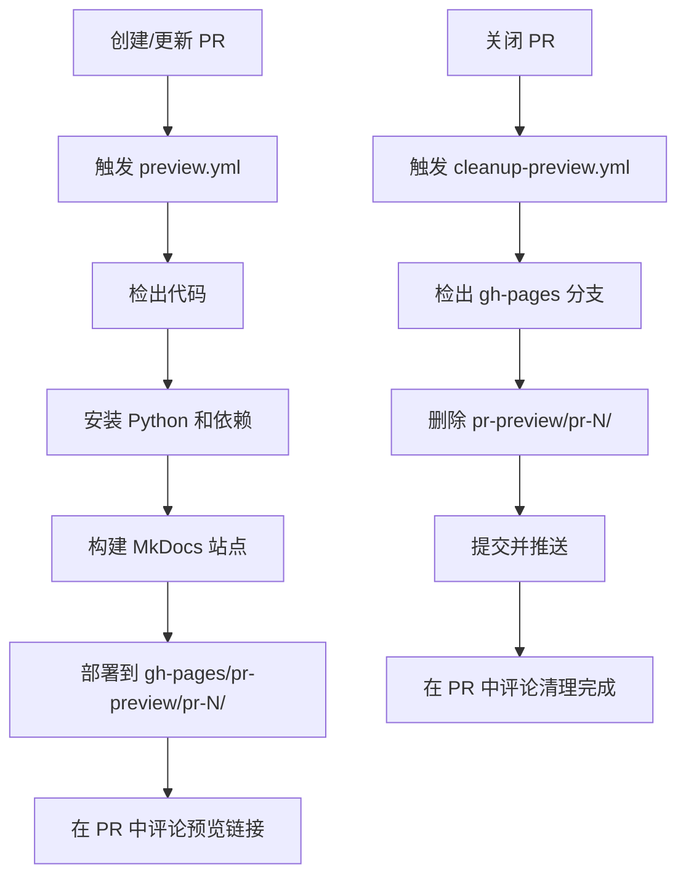

# PR 预览部署系统

## 📋 概述

为了提高开发效率和代码质量，本项目配置了自动化的 PR 预览部署系统。每次创建或更新 Pull Request 时，系统会自动构建并部署一个独立的预览环境，让您可以在合并前查看实际效果。

## 🎯 功能特点

- ✅ **自动部署**：PR 创建或更新时自动触发预览构建
- 🔗 **独立链接**：每个 PR 都有独立的预览 URL
- 💬 **自动通知**：构建完成后自动在 PR 中评论预览链接
- 🔄 **实时更新**：推送新提交时自动更新预览
- 🧹 **自动清理**：PR 关闭后自动清理预览部署

## 🚀 使用方法

### 1. 创建 Pull Request

当您创建一个新的 Pull Request 时：

```bash
git checkout -b feature/your-feature
# 进行您的更改
git add .
git commit -m "Your changes"
git push origin feature/your-feature
# 在 GitHub 上创建 PR
```

### 2. 等待预览构建

- 创建 PR 后，GitHub Actions 会自动开始构建预览
- 通常需要 2-3 分钟完成
- 您可以在 PR 的 "Checks" 标签页查看构建进度

### 3. 查看预览

构建完成后，机器人会在 PR 中自动评论预览链接：

```markdown
## 🚀 Preview Deployment

Your changes have been deployed to a preview environment!

**Preview URL:** https://ktyhub.github.io/thinking-in-code/pr-preview/pr-123/

<details>
<summary>📝 Deployment Details</summary>

- **PR Number:** #123
- **Commit:** abc1234
- **Branch:** feature/your-feature
- **Deployed At:** 2024-01-01 12:00:00

</details>

> 💡 **Tip:** This preview will be updated automatically when you push new commits to this PR.
```

### 4. 更新预览

当您推送新的提交到 PR 分支时：

```bash
# 继续修改
git add .
git commit -m "Update changes"
git push origin feature/your-feature
```

- 预览会自动重新构建和部署
- 预览 URL 保持不变
- 评论会更新为最新的部署信息

### 5. 预览清理

当 PR 被关闭（合并或关闭）时：

- 系统自动删除预览部署
- 释放 GitHub Pages 存储空间
- 在 PR 中评论清理完成信息

## 📊 预览 URL 格式

预览 URL 遵循以下格式：

```
https://ktyhub.github.io/thinking-in-code/pr-preview/pr-{PR编号}/
```

**示例：**
- PR #1: `https://ktyhub.github.io/thinking-in-code/pr-preview/pr-1/`
- PR #42: `https://ktyhub.github.io/thinking-in-code/pr-preview/pr-42/`
- PR #999: `https://ktyhub.github.io/thinking-in-code/pr-preview/pr-999/`

## 🔧 本地预览

在提交 PR 之前，建议先在本地测试您的更改：

### 安装依赖

```bash
pip install mkdocs-material \
  pymdown-extensions \
  mkdocs-minify-plugin \
  mkdocs-git-revision-date-localized-plugin \
  mkdocs-redirects \
  mkdocs-awesome-pages-plugin \
  mkdocs-git-authors-plugin \
  mkdocs-macros-plugin \
  mkdocs-glightbox \
  mkdocs-table-reader-plugin \
  mkdocs-rss-plugin \
  mkdocs-include-markdown-plugin
```

### 启动本地服务器

```bash
# 开发模式（实时重载）
mkdocs serve

# 指定端口
mkdocs serve --dev-addr=127.0.0.1:8001
```

访问 `http://127.0.0.1:8000` 查看本地预览。

### 构建静态文件

```bash
# 构建到 site/ 目录
mkdocs build

# 严格模式（遇到警告时失败）
mkdocs build --strict
```

## 🐛 故障排查

### 预览构建失败

**检查步骤：**

1. 查看 GitHub Actions 日志
   - 进入 PR 页面
   - 点击 "Checks" 标签
   - 查看 "Deploy PR Preview" 工作流
   - 展开失败的步骤查看详细错误

2. 常见错误及解决方案：

   **依赖安装失败：**
   ```
   ERROR: Could not find a version that satisfies the requirement...
   ```
   解决：检查是否有新的依赖需要添加到工作流中

   **Markdown 语法错误：**
   ```
   ERROR: Error reading page...
   ```
   解决：在本地运行 `mkdocs build --strict` 复现并修复错误

   **配置文件错误：**
   ```
   ERROR: Config value 'theme': Unrecognised theme...
   ```
   解决：检查 `mkdocs.yml` 配置是否正确

3. 本地调试

   ```bash
   # 清理缓存
   rm -rf site/ .cache/
   
   # 重新构建
   mkdocs build --strict
   
   # 检查输出
   ls -la site/
   ```

### 预览链接无法访问

**可能原因：**

1. **GitHub Pages 未启用**
   - 前往仓库 Settings → Pages
   - 确保 Source 设置为 `gh-pages` 分支

2. **预览尚未部署完成**
   - 等待 2-3 分钟让部署完成
   - 刷新页面重试

3. **URL 拼写错误**
   - 确保 URL 中的 PR 编号正确
   - 检查是否有额外的斜杠或字符

4. **gh-pages 分支问题**
   ```bash
   # 检查 gh-pages 分支
   git fetch origin gh-pages
   git checkout gh-pages
   ls -la pr-preview/
   ```

### 预览未自动更新

**解决方法：**

1. 检查工作流是否触发
   - 查看 PR 的 "Checks" 标签
   - 确认 "Deploy PR Preview" 正在运行

2. 手动触发重新构建
   - 在 Actions 页面找到工作流
   - 点击 "Re-run all jobs"

3. 清除浏览器缓存
   - 使用 Ctrl+F5 (Windows) 或 Cmd+Shift+R (Mac) 强制刷新
   - 或在隐私/无痕模式下打开预览链接

## 💡 最佳实践

### 1. 提交前本地测试

```bash
# 始终先在本地验证
mkdocs serve
```

在浏览器中检查：
- ✅ 页面正确渲染
- ✅ 导航链接工作正常
- ✅ 图片和资源加载正常
- ✅ 无控制台错误

### 2. 保持 PR 专注和小型

- 每个 PR 应该解决一个特定问题
- 小的 PR 更容易审查和测试
- 预览构建也会更快

### 3. 及时查看预览

- 创建 PR 后立即检查预览
- 验证所有更改都正确显示
- 在请求代码审查前确认效果

### 4. 提供清晰的 PR 描述

在 PR 描述中包含：
- 📝 更改的内容和原因
- 🎯 需要重点检查的部分
- 📸 关键更改的截图
- 🔗 相关的 Issue 链接

### 5. 响应构建错误

如果预览构建失败：
- 🔍 立即查看错误日志
- 🔧 在本地复现并修复
- 📤 推送修复并等待重新构建

## 🎓 技术细节

### 工作流程架构



### 目录结构

```
ktyhub.github.io/thinking-in-code/
├── index.html                    # 主站点（来自 main 分支）
├── assets/                       # 主站点资源
├── ...                          # 其他主站点文件
└── pr-preview/                  # PR 预览目录
    ├── pr-1/                    # PR #1 的预览
    │   ├── index.html
    │   ├── assets/
    │   └── ...
    ├── pr-2/                    # PR #2 的预览
    │   ├── index.html
    │   ├── assets/
    │   └── ...
    └── ...
```

### 使用的 GitHub Actions

1. **peaceiris/actions-gh-pages@v3**
   - 用于部署到 GitHub Pages
   - 支持部署到子目录
   - 自动处理 gh-pages 分支

2. **actions/github-script@v7**
   - 用于在 PR 中评论
   - 提供 GitHub API 访问
   - 支持复杂的脚本逻辑

3. **actions/checkout@v4**
   - 检出代码仓库
   - 支持指定分支
   - 用于访问不同分支

## 📚 相关资源

- [GitHub Actions 文档](https://docs.github.com/actions)
- [GitHub Pages 文档](https://docs.github.com/pages)
- [MkDocs 文档](https://www.mkdocs.org/)
- [MkDocs Material 主题](https://squidfunk.github.io/mkdocs-material/)

## 🤝 获取帮助

如果遇到问题：

1. 📖 阅读本文档的故障排查部分
2. 🔍 搜索类似的 Issues
3. 💬 在 PR 中提问
4. 📧 联系维护团队

## 🎉 开始使用

现在您已经了解了 PR 预览系统，可以开始创建您的第一个 PR 了！

```bash
# 创建新分支
git checkout -b feature/amazing-feature

# 进行更改
# ... 编辑文件 ...

# 提交更改
git add .
git commit -m "Add amazing feature"

# 推送到 GitHub
git push origin feature/amazing-feature

# 在 GitHub 上创建 PR，然后等待预览部署！
```

祝您开发愉快！ 🚀✨
