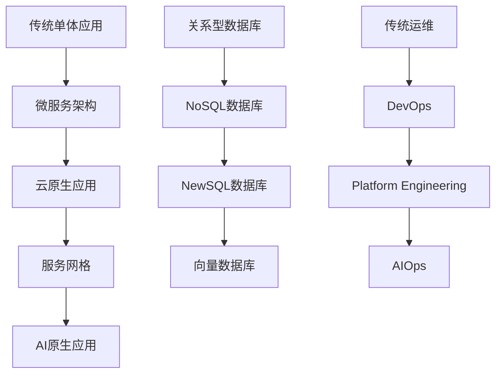

### 4. 生态系统扩展策略

#### 🎯 技术栈完整解决方案
```yaml
# 企业级技术栈推荐
full_stack_recommendation:
  frontend:
    framework: "React/Vue + TypeScript"
    state_management: "Redux Toolkit/Pinia"
    ui_library: "Ant Design/Element Plus"
    build_tool: "Vite"
    
  backend:
    framework: "Spring Boot 3.x"
    database: "MySQL 8.0 + Redis"
    message_queue: "Kafka"
    search_engine: "Elasticsearch"
    
  infrastructure:
    container: "Docker + Kubernetes"
    service_mesh: "Istio"
    monitoring: "Prometheus + Grafana"
    logging: "ELK Stack"
    
  devops:
    ci_cd: "Jenkins/GitHub Actions"
    gitops: "ArgoCD"
    security: "SonarQube + Aqua"
    
  ai_integration:
    framework: "Spring AI"
    vector_db: "Milvus/Pinecone"
    llm_gateway: "LangChain4j"
```

### 5. 技术社区生态建设

#### 📚 知识库扩展
- **技术词汇表**：专业术语中英对照
- **架构模式库**：可复用的设计模式
- **代码示例库**：生产级代码样例
- **故障案例库**：真实故障排查过程

#### 🤝 社区互动机制
- **技术问答**：Stack Overflow式Q&A
- **代码审查**：社区代码互审
- **技术辩论**：不同技术方案讨论
- **项目孵化**：开源项目孵化平台

### 6. 商业化扩展路径

#### 💼 企业级服务
- **技术咨询**：架构设计咨询服务
- **培训认证**：专业技术培训课程
- **技术评估**：第三方技术评估报告
- **定制开发**：企业定制解决方案

#### 📈 数据产品
- **技术趋势报告**：年度/季度技术趋势
- **薪资调研报告**：技术岗位薪资分析
- **企业技术栈调研**：行业技术采用现状
- **开源项目评估**：开源软件风险评估

## 实施路线图

### Phase 1: 基础平台优化 (1-2个月)
- ✅ 重新设计主页，强化品牌定位
- ✅ 实现个性化推荐引擎
- ✅ 建立技术热度追踪系统
- ✅ 开发智能搜索功能

### Phase 2: 内容生态建设 (2-3个月)
- 🔄 创建垂直技术频道
- 🔄 建立技术对比数据库
- 🔄 开发交互式学习路径
- 🔄 实现用户个性化仪表板

### Phase 3: 社区功能扩展 (3-4个月)
- ⏳ 开发技术问答平台
- ⏳ 建立代码审查系统
- ⏳ 创建项目孵化平台
- ⏳ 实现实时技术讨论

### Phase 4: 商业化探索 (4-6个月)
- ⏳ 推出企业级咨询服务
- ⏳ 开发培训认证系统
- ⏳ 建立技术评估服务
- ⏳ 创建数据产品线

## 成功指标

### 用户参与度指标
- 月活跃用户增长 > 30%
- 用户会话时长增长 > 50%
- 内容分享率增长 > 40%
- 用户留存率 > 80%

### 内容质量指标
- 技术预测准确率 > 85%
- 用户满意度评分 > 4.5/5
- 专家认可度 > 90%
- 媒体引用次数增长 > 60%

### 商业价值指标
- 品牌知名度增长 > 200%
- 企业客户获取 > 50家
- 付费用户转化率 > 15%
- 年收入增长 > 300%
# 技术生态系统扩展策略

## 基于分化定律：创建细分技术领域的专业频道

### 1. 垂直技术频道矩阵

#### 🔥 AI与机器学习频道
- **Spring AI深度解析**
  - 从RAG到Agent：Spring AI的企业级应用
  - Vector数据库集成最佳实践
  - 大模型微调与部署指南

#### ☁️ 云原生架构频道  
- **Kubernetes生态深度**
  - Service Mesh演进：从Istio到Ambient Mesh
  - GitOps实战：ArgoCD vs Flux对比
  - 云原生安全：Falco + OPA最佳实践

#### 🚀 微服务治理频道
- **分布式系统精讲**
  - Dubbo 3.0 vs Spring Cloud Gateway性能对比
  - 分布式事务：Seata vs Saga模式选择
  - 服务网格监控：Jaeger + Prometheus实战

#### 🏗️ 架构设计频道
- **企业级架构实战**
  - DDD领域驱动设计落地指南
  - 事件驱动架构：Kafka + EventStore实践
  - 高并发系统设计：从单体到微服务演进

#### 📊 数据工程频道
- **大数据技术栈**
  - 实时计算：Flink vs Spark Streaming对比
  - 数据湖架构：Delta Lake + Iceberg实战
  - OLAP引擎：ClickHouse vs Doris性能测试

### 2. 技术演进路径图



### 3. 技术决策框架

#### 技术选型决策矩阵
| 技术领域 | 成熟稳定 | 创新前沿 | 企业采用率 | 学习成本 | 推荐指数 |
|---------|----------|----------|-----------|----------|----------|
| **Web框架** | Spring Boot ⭐⭐⭐⭐⭐ | Quarkus ⭐⭐⭐ | 85% | 低 | 🔥 |
| **消息队列** | Kafka ⭐⭐⭐⭐⭐ | Pulsar ⭐⭐⭐ | 70% | 中 | 🔥 |
| **容器编排** | Kubernetes ⭐⭐⭐⭐⭐ | Nomad ⭐⭐ | 90% | 高 | 🔥 |
| **AI框架** | TensorFlow ⭐⭐⭐⭐ | Spring AI ⭐⭐⭐⭐ | 40% | 中 | 🔥 |

## 基于延伸定律：扩展到相关技术生态
