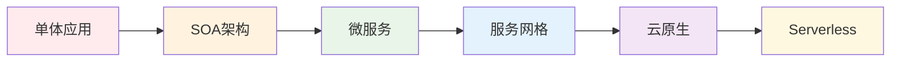
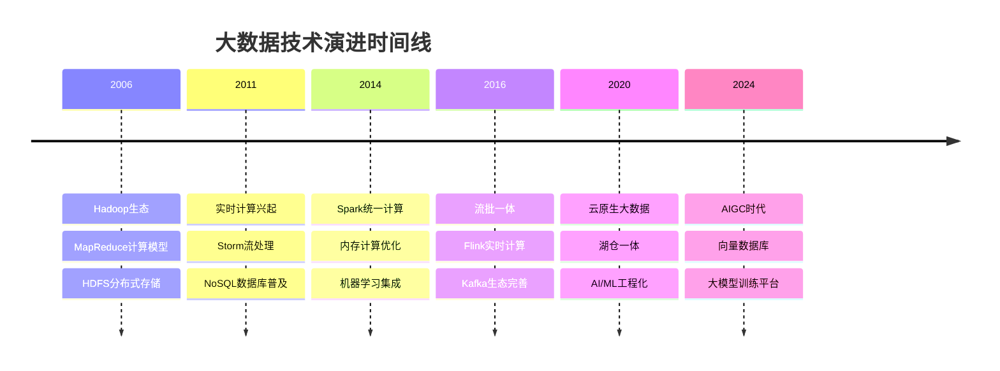
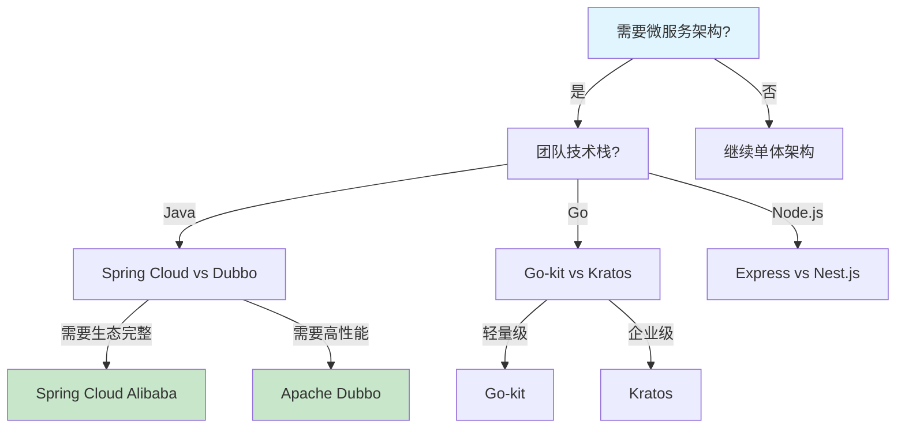
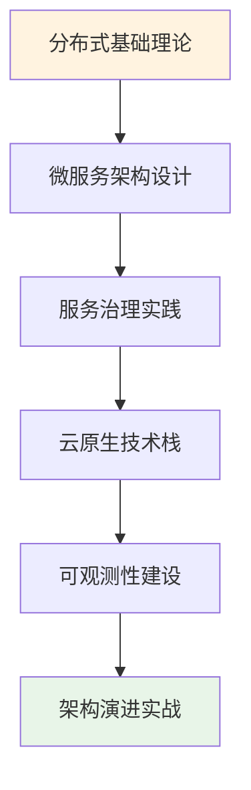
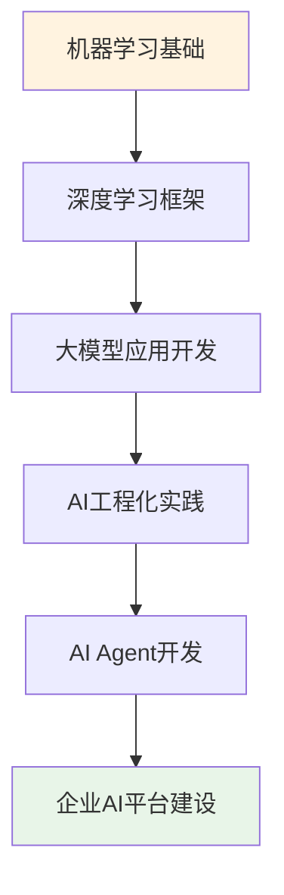

# 📊 技术架构演进图谱

## 🎯 技术演进全景图

> 基于深度源码分析和行业趋势研究，为您呈现技术栈的历史演进轨迹和未来发展方向

  

    

      <h3>🕰️ 技术演进史</h3>
      
回顾关键技术的发展历程

    

    

      <h3>🎯 当前技术栈</h3>
      
主流技术的现状分析

    

    

      <h3>🚀 未来趋势</h3>
      
基于洞察的技术预测

    

  

## 🔄 分布式系统演进

### 微服务架构演进路径

### 关键技术节点
- **2010-2014**: SOA服务化改造期
- **2014-2018**: 微服务架构普及期  
- **2018-2022**: 云原生技术成熟期
- **2022-至今**: AI驱动的智能化运维期

## 🌊 数据处理技术演进

### 大数据技术栈发展

## 🤖 AI技术集成演进

### 从传统ML到生成式AI

  

    <h4>🔢 传统机器学习 (2010-2017)</h4>
    <ul>
      <li>sklearn、TensorFlow 1.x</li>
      <li>特征工程为主</li>
      <li>模型训练复杂</li>
    </ul>
  

  
  

    <h4>🧠 深度学习普及 (2017-2020)</h4>
    <ul>
      <li>TensorFlow 2.x、PyTorch</li>
      <li>预训练模型</li>
      <li>云端训练服务</li>
    </ul>
  

  
  

    <h4>🤖 大模型时代 (2020-2023)</h4>
    <ul>
      <li>Transformer架构</li>
      <li>GPT系列模型</li>
      <li>Few-shot学习</li>
    </ul>
  

  
  

    <h4>✨ 生成式AI (2023-至今)</h4>
    <ul>
      <li>ChatGPT、Claude等</li>
      <li>多模态大模型</li>
      <li>AI Agent应用</li>
    </ul>
  

## 🔮 技术趋势预测

### 未来3年技术发展方向

#### 1. 🌐 云原生进一步演进
- **Serverless计算**将成为主流
- **边缘计算**与云端深度融合
- **多云管理**工具标准化

#### 2. 🤖 AI原生应用架构
- **AI Agent**成为应用核心组件
- **向量数据库**成为基础设施
- **LLMOps**运维体系成熟

#### 3. 🔒 隐私计算与安全
- **联邦学习**在企业间普及
- **同态加密**技术商用化
- **零信任架构**全面落地

#### 4. 🌊 实时数据处理
- **流批一体**架构标准化
- **事件驱动架构**成为默认选择
- **实时OLAP**性能大幅提升

## 📈 技术选型决策树

### 微服务框架选型

## 💡 架构决策模板

### 技术选型评估矩阵

| 评估维度 | 权重 | Spring Boot | Quarkus | Micronaut |
|---------|------|-------------|---------|-----------|
| 🚀 启动速度 | 20% | ⭐⭐⭐ | ⭐⭐⭐⭐⭐ | ⭐⭐⭐⭐ |
| 💾 内存占用 | 25% | ⭐⭐ | ⭐⭐⭐⭐⭐ | ⭐⭐⭐⭐ |
| 🏗️ 生态完整性 | 30% | ⭐⭐⭐⭐⭐ | ⭐⭐⭐ | ⭐⭐⭐ |
| 📚 学习成本 | 15% | ⭐⭐⭐⭐⭐ | ⭐⭐⭐ | ⭐⭐⭐ |
| 🔧 开发效率 | 10% | ⭐⭐⭐⭐⭐ | ⭐⭐⭐⭐ | ⭐⭐⭐⭐ |

## 🎯 推荐学习路径

### 1. 分布式系统精通路径

### 2. AI技术集成路径

## 📊 技术成熟度曲线

基于我们的技术洞察分析，当前各技术领域的成熟度：

- **🟢 生产就绪**: Kubernetes、Spring Cloud、Redis、MySQL
- **🟡 快速发展**: LLM应用、向量数据库、边缘计算
- **🟠 实验阶段**: 量子计算、脑机接口、6G通信
- **🔴 概念验证**: AGI、量子互联网、数字孪生

---

## 🔗 相关资源

- [🎯 技术趋势雷达](/zh/tech_radar/) - 实时技术趋势分析
- [📚 深度技术解析](/zh/chapter_preface/) - 源码级技术洞察
- [🔍 技术调研报告](/zh/chapter_post/site) - 最新技术评测

> 💡 **持续更新**: 本图谱基于最新的技术趋势和源码分析持续更新，为您的技术决策提供可靠依据。
