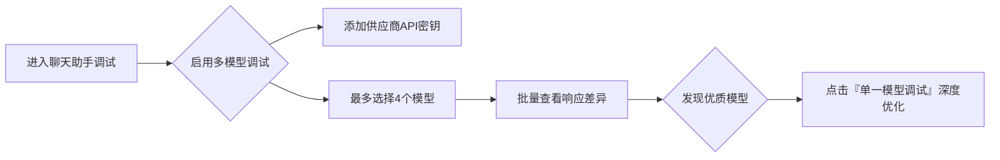
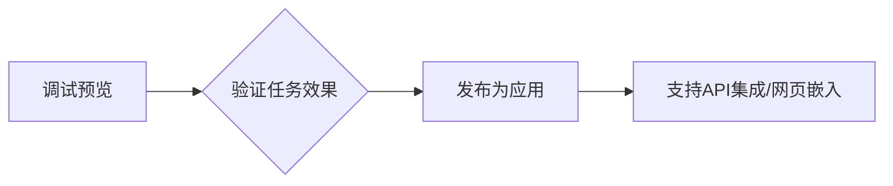
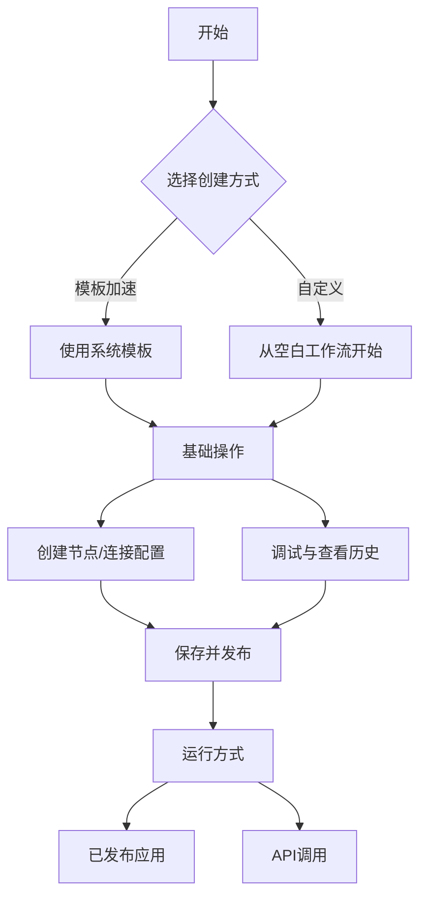
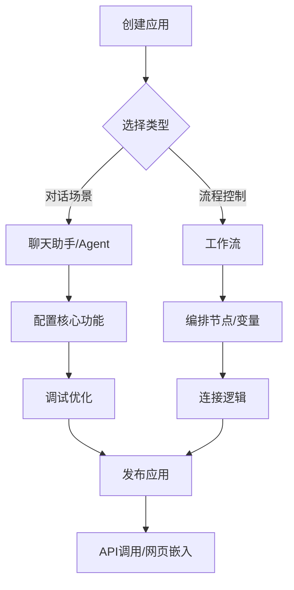

# 1 产品简介

1. Dify平台概述:
    - 定义与特点：Dify是一个开源的大语言模型（LLM）应用开发平台，融合了后端即服务（BaaS）和LLMOps的理念，支持数百个模型，提供直观的Prompt编排界面、高质量的RAG引擎、稳健的Agent框架和灵活的流程编排。
    - 目标用户：适合非技术人员和开发者，使他们能够快速定义和运营生成式AI应用，无需从头开始构建关键技术栈。
2. Dify的核心优势:
    - 完整解决方案：与仅提供工具的开发库（如LangChain）不同，Dify提供了一套更接近生产需求的完整方案，包括精良的工程设计和软件测试。
    - 开源与自部署：Dify是开源的，由专业团队和社区共同打造，支持自部署，允许开发者基于任何模型自部署类似Assistants
      API和GPTs的能力，保持对数据的完全控制。
    - 用户评价：社区用户评价Dify为简单、克制、迭代迅速的产品。
3. Dify的应用场景:
    - 创业与MVP构建：帮助创业团队快速将AI应用创意变成现实，通过Dify构建MVP获得投资或通过POC赢得客户订单。
    - 现有业务集成：通过RESTful API将LLM集成到现有业务中，实现Prompt与业务代码的解耦，持续改进应用效果。
    - 企业级LLM基础设施：一些银行和大型互联网公司部署Dify作为企业内的LLM网关，加速GenAI技术在企业内的推广，实现中心化的监管。
    - 能力边界探索：技术爱好者可以通过Dify实践Prompt工程和Agent开发，已有超过60,000开发者在Dify上创建了自己的第一个应用。
4. 下一步行动:
    - 快速开始：阅读快速开始指南，速览Dify的应用构建流程。
    - 自部署指南：了解如何将Dify自部署到服务器上，并接入开源模型。
    - 特性规格与路线图：了解Dify的特性规格和未来的发展计划。
    - 社区参与：在GitHub上为Dify点亮一颗星，阅读贡献指南，参与社区建设。

# 2 特性

1. Dify平台概述:
    - 平台定位：Dify是一个为技术人士设计的LLM应用平台，提供透明化的产品特性和技术规格政策。
    - 团队与用户：拥有超过15名全职员工，用户数量超过800人（截止2025 Q2）。
    - 技术栈：使用Python/Flask/PostgreSQL进行开发，自v0.4版本起移除了LangChain。
2. 模型接入与支持:
    - 模型供应商：支持超过10家模型供应商，包括OpenAI和Anthropic。
    - 接入速度：新的主流模型通常在48小时内完成接入。
    - 模型规格：支持GPT-4o规格的富文本模型。
3. 运行时环境与工具:
    - 运行时支持：提供本地模型推理运行时，推荐使用Xoribits。
    - 工具支持：支持40+款工具，可直接加载OpenAPI Specification的API。
4. 流程编排与节点支持:
    - 可视化编排界面：提供行业领先的可视化流程编排界面，支持所见即所得的节点调试。
    - 节点类型：包括LLM、知识库检索、问题分类、条件分支、代码执行、模板转换、HTTP请求等。
5. 知识库管理:
    - 可视化界面：首创的可视化知识库管理界面，支持分段预览和召回效果测试。
    - 数据清洗：支持对TXT、Markdown、PDF、HTML、DOC、CSV等格式文件进行自动清洗。
    - 同步支持：支持同步来自Notion的文档和网页为知识库。
6. 向量数据库支持:
    - 支持的数据库：包括Qdrant、Weaviate、Zilliz/Milvus、Pgvector、Pgvector-rs等。
7. 工作空间与多成员管理:
    - RESTful API：支持RESTful API，已覆盖大部分功能。
    - 部署方式：支持Docker和Helm部署。
8. 其他特性:
    - Prompt编排：提供广受好评的可视化Prompt编排界面，可在同一个界面中修改Prompt并预览效果。
    - Assistant模式编排：支持Prompt变量类型，文件类型支持即将在Q3推出。
    - ETL服务：内置的Unstructured服务开启后可获得最大化支持。

# 3 Docker Compose 部署

1. 安装前提条件:
    - 硬件要求：CPU至少2核心，RAM至少4 GiB。
    - 操作系统支持：macOS 10.14或更高版本，Linux平台（需安装Docker 19.03或更高版本和Docker Compose
      1.28或更高版本），Windows系统需启用WSL 2。
    - Docker配置：macOS和Windows需安装Docker
      Desktop，macOS系统为Docker虚拟机至少分配2个虚拟CPU和8GB初始内存，Windows系统建议将源代码和其他数据存储在Linux文件系统中。
2. 克隆Dify代码仓库:
   -
   使用Git命令将Dify源代码克隆到本地环境，假设当前最新版本为0.15.3，命令为：
   `git clone https://github.com/langgenius/dify.git --branch 0.15.3`
3. 启动Dify:
    - 进入Docker文件夹：进入Dify源代码的Docker文件夹。
    - 复制环境配置文件：复制`.env.example`文件为`.env`文件。
    - 启动Docker容器：根据Docker Compose版本选择合适的命令启动容器，Docker Compose V2使用`docker compose up -d`
      ，V1使用`docker-compose up -d`。
    - 检查容器状态：使用`docker compose ps`命令检查所有容器是否正常运行。
4. 同步环境变量配置:
    - 如果`.env.example`文件有更新，需要同步修改本地的`.env`文件，检查并确保所有配置项与实际运行环境相匹配。
5. 访问Dify:
    - 管理员初始化页面：本地环境访问`http://localhost/install`，服务器环境访问`http://your_server_ip/install`。
    - Dify主页面：本地环境访问`http://localhost`，服务器环境访问`http://your_server_ip`。
6. 自定义配置:
    - 编辑`.env`文件中的环境变量值，然后重新启动Dify，使用命令`docker compose down`停止容器，再使用`docker compose up -d`
      重新启动。
7. 更多帮助:
    - 如有疑问，可前往常见问题帮助页面或提交问题。

# 4 构建应用

1. Dify平台AI应用概述:
    - 应用定义：Dify中的应用是指基于GPT等大语言模型构建的实际场景应用，用于将智能AI技术应用于特定需求。
    - 应用交付物：包括封装友好的API、开箱即用的WebApp、提示词工程、上下文管理、日志分析和标注的易用界面。
2. 应用类型:
    - 聊天助手：基于LLM构建的对话式交互助手，支持多轮对话和流式结果返回，具有上下文保存功能。
    - 文本生成应用：面向文本生成类任务的助手，如撰写故事、文本分类、翻译等，支持一问一答的交互方式。
    - Agent：能够分解任务、推理思考、调用工具的对话式智能助手，适用于复杂任务处理。
    - 对话流：适用于定义复杂流程的多轮对话场景，具有记忆功能的应用编排方式。
    - 工作流：适用于自动化、批处理等单轮生成类任务的场景的应用编排方式。
3. 文本生成应用与聊天助手的区别:
    - WebApp界面：文本生成应用为表单+结果式，聊天助手为聊天式。
    - WebAPI端点：文本生成应用使用completion-messages，聊天助手使用chat-messages。
    - 交互方式：文本生成应用为一问一答，聊天助手为多轮对话。
    - 流式结果返回：两者均支持流式结果返回。
    - 上下文保存：文本生成应用保存当次上下文，聊天助手持续保存上下文。
    - 用户输入表单：两者均支持用户输入表单。
    - 知识库与插件：两者均支持知识库与插件集成。
    - AI开场白：文本生成应用不支持AI开场白，聊天助手支持。
4. 应用开发支持:
    - API调用：提供封装友好的API，可由后端或前端应用直接调用，通过Token鉴权。
    - WebApp开发：提供美观且托管的WebApp，支持模板二次开发。
    - 提示词工程：包含提示词工程、上下文管理、日志分析和标注的易用界面。

# 5-创建应用

1. 三种创建方式：
   • 模板创建（新手推荐）：使用预设模板快速搭建应用，适合初学者

   • 空白创建：从零开始自定义构建应用

   • DSL文件导入：通过YML格式的工程文件导入应用配置

2. 详细操作指南：
   • 模板创建：在工作室选择模板 → 添加至工作区

   • 空白创建：需完成：

   ◦ 命名应用

   ◦ 设置图标（上传图片或选择预设）

   ◦ 填写应用描述

   ◦ 选择应用类型（5种）

   • DSL导入：支持本地文件或URL导入配置

3. 关键特性：
   • 支持5种应用类型：聊天助手/文本生成/Agent/Chatflow/Workflow

   • DSL标准文件涵盖：应用描述、模型参数、编排配置

   • 可视化操作界面（工作区管理）

4. 用户指引：
   • 明确标注操作路径（工作室 → 创建选项）

   • 提供选择建议（新手优先模板）

   • 强调应用描述的重要性

5. 补充说明：
   • 文档提供反馈入口（有帮助/无帮助）

   • 支持用户协作编辑文档

   • 显示当前页面归属（构建应用 → 创建应用章节）

## 聊天助手应用

---

**聊天助手功能概述**

1. 核心能力  
   • 采用连续对话模式（一问一答），适用于客服、教育、医疗、金融等场景。

   • 支持功能：

   ✅ 提示词约束AI行为  
   ✅ 变量插入（如 `{{name}}`）  
   ✅ 上下文集成（知识库限定对话范围）  
   ✅ 自定义开场白 & 问题建议  
   ✅ 多模态文件上传（需模型支持，如Claude 3.5/Gemini 1.5）

2. 应用编排流程
   • 创建应用：选择“聊天助手”类型。

   • 编写提示词：

   ◦ 使用提示生成器优化专业性（例：面试官角色设定）。

   ◦ 插入动态变量（如 `你好，{{name}}，我是面试官Bob`）。

   • 添加上下文：引用知识库约束对话范围（如企业客服话术）。

   • 文件处理：开启“文档”功能，LLM自动解析文件内容。

   • 调试：实时测试不同模型效果，优化回答质量。

   • 发布：生成公开URL或API，支持二次开发/嵌入网站。

3. 与其他功能的区别
   • 不支持第三方工具：需用“Agent类型”实现工具集成。

   • 元数据筛选：在知识库中通过元数据过滤文档（见“集成知识库”章节）。

4. 常见问题
   • 多模型调试：对比不同模型对同一问题的响应。

   • 文件支持限制：依赖LLM原生能力（需查阅模型官网）。

   • 知识库筛选：通过元数据精准控制对话参考内容。

---

**关键操作指引**
| 步骤 | 操作要点 |
|---------------|--------------------------------------------------------------------------|
| 提示词优化 | 使用变量动态化内容，结合提示生成器提升专业性。 |
| 开场白设置 | 添加引导性问题（例：“你准备好了吗？”）提升用户体验。 |
| 文件上传 | 选择支持多模态的LLM → 开启“文档”功能 → 无需配置即可识别文件。 |
| 调试技巧 | 右侧沙盒实时测试，切换模型对比效果，调整提示词优化回答。 |

---

附：核心资源链接  
• [多模型调试](https://docs.dify.ai/getting-started/readme#multi-model-debugging)

• [元数据筛选文档](https://docs.dify.ai/advanced/workflow/retrieval-augmented-generation#metadata-filtering)

• [发布应用指南](https://docs.dify.ai/advanced/app/publishing)

## 多模型调试

---

**多模型调试功能**

1. 核心用途  
   • 支持在聊天助手应用中同时对比不同模型对同一问题的回答效果

   • 最大支持 4 个模型并行调试，帮助选择最佳响应模型

2. 操作流程
   • 进入方式：在聊天助手应用的调试界面启用该功能

   • 模型切换：

   ◦ 发现优质模型时，点击 "单一模型进行调试" 可深度优化特定模型

   ◦ 需先通过 "增加新供应商" 添加更多模型的API密钥

3. 常见问题解决方案
   | 问题现象 | 解决方法 |
   |---|---|
   | 添加模型时无显示 | 前往 "增加新供应商" 手动配置API密钥 |
   | 退出多模型模式 | 选择任意模型 → 点击 "单一模型进行调试" |

4. 功能定位
   • 衔接在 聊天助手 和 Agent应用 功能之间

   • 适用于需要对比不同LLM响应质量的场景

---

**操作示意图**

> 提示：该功能特别适用于：
> - 新模型效果验证
> - 不同供应商模型横向对比
> - 敏感场景下的响应稳定性测试

# 6 智能助手（Agent）

**1. 核心定义**  
• 利用大语言模型的推理能力，自主完成复杂任务（如目标规划、任务拆解、工具调用、迭代执行）。

**2. 使用流程**  
| 步骤 | 关键操作 |  
|------|----------|  
| 创建方式 | 从模板导入或从零编排（支持财务报表分析/Logo设计/旅程规划等场景） |  
| 模型选择 | 必须选择强推理模型（如GPT-4系列），确保任务稳定性 |  
| 指令编写 | 在提示词中定义： ✅ 任务目标 ✅ 工作流程 ✅ 资源与限制 |

**3. 能力扩展**  
• 知识库工具：在“上下文”添加外部知识源

• 工具集成：

• 类型：第一方工具（Dify内置）或自定义API（支持OpenAPI/Swagger/OpenAI Plugin）

• 功能：联网搜索/科学计算/图像生成等外部能力

• 调用方式：对话中提及工具名即自动触发

**4. 关键配置**  
• 推理模式：

• `Function calling`（GPT-3.5/4等已支持模型）

• `ReAct`（适配无Function calling的模型）

• 迭代限制：控制任务最大执行步骤数

• 对话引导：配置开场白+问题示例（引导用户需求）

• 文件处理：

• 多模态模型原生支持（如Claude 3.5/Gemini 1.5）

• 开启“文档”功能即生效（无需配置）

**5. 发布流程**

> ⚠️ 注意：与基础“聊天助手”的核心差异在于 自主任务分解能力 + 外部工具集成深度。
>
>

# 7 工作流

## 7.1 工作流介绍

**工作流功能总结**  
**1. 核心价值**  
• 任务拆解：将复杂任务分解为小步骤（节点），降低复杂度

• 性能提升：减少对提示词技术和模型推理的依赖，提高稳定性与容错性

• 场景适配：提供两种工作流类型：

• Chatflow：对话场景（客服/语义搜索）

    ✅ 支持多步逻辑构建  
    ✅ 特有功能：问题理解节点、对话历史、标注回复  

• Workflow：自动化场景（翻译/数据分析/邮件处理）

    ✅ 提供逻辑节点（代码/IF-ELSE/迭代）  
    ✅ 未来支持定时/事件触发  

**2. 典型应用场景**  
| 领域 | 功能实现 |  
|----------|--------------|  
| 客户服务 | 自动化回答高频问题，实时理解查询意图 |  
| 内容生成 | 根据主题生成博客/产品描述/营销文案 |  
| 任务管理 | 集成Trello/Slack，自动创建任务/更新状态 |  
| 数据分析 | 分析知识库生成趋势报告，提取数据洞察 |  
| 邮件处理 | 自动起草结构化邮件及社交媒体内容 |

**3. 操作指引**

核心操作要点：

1. 通过画布直观配置节点关系
2. 调试阶段可实时查看运行历史
3. 发布后支持API集成或应用内嵌

> 提示：工作流特别适合需要严格流程控制或多系统集成的业务场景，与基础Chatbot形成能力互补。
>
>

# 7.2 关键概念

**一、核心功能模块**

1. 聊天助手（Chat Assistant）  
   • 定位：一问一答的持续对话应用

   • 核心能力：

   ✅ 提示词约束AI行为  
   ✅ 变量动态插入（如 `{{name}}`）  
   ✅ 上下文集成（知识库限定）  
   ✅ 文件上传（需模型支持，如Claude 3.5）  
   • 局限：不支持第三方工具集成

2. 智能助手（Agent）  
   • 定位：自主处理复杂任务（规划/拆解/工具调用）

   • 核心能力：

   ✅ 强推理模型依赖（必须选GPT-4等）  
   ✅ 工具集成（内置工具+自定义API）  
   ✅ 双推理模式：  
   ◦ `Function calling`（GPT系列）

       ◦ `ReAct`（适配其他模型）  

   ✅ 迭代次数限制配置

3. 工作流（Workflow）  
   • 两种类型：

   | 类型       | 场景                  | 核心特性                          |  
                    |------------|-----------------------|-----------------------------------|  
   | Chatflow | 对话交互（客服/搜索） | ✅ 多轮对话记忆 ✅ 中间结果流式输出（Answer节点） |  
   | Workflow | 批处理（翻译/数据分析） | ✅ 逻辑节点（代码/IF-ELSE/迭代） ✅ 无对话记忆 |  

---

**二、高级能力对比**  
| 功能 | 聊天助手 | Agent | Chatflow | Workflow |  
|------------------|----------|-------|----------|----------|  
| 多模型调试 | ✅ | ❌ | ❌ | ❌ |  
| 文件上传 | ✅ | ✅ | ✅ | ✅ |  
| 工具/API集成 | ❌ | ✅ | ✅ | ✅ |  
| 多轮对话记忆 | ✅ | ✅ | ✅ | ❌ |  
| 自动化批处理 | ❌ | ❌ | ❌ | ✅ |

---

**三、关键操作流程**

核心操作要点：

1. 变量串联：工作流中用变量传递节点数据（系统/环境/会话变量）
2. 节点差异：  
   • Chatflow：需用`Answer`节点输出对话内容

   • Workflow：只能用`End`节点结束流程

3. 内置变量：  
   • Chatflow：`sys.query`（用户输入）、`sys.conversation_id`

   • Workflow：仅`sys.files`、`sys.user_id`

---

**四、场景化选择指南**  
| 需求场景 | 推荐模块 | 原因 |  
|--------------------|--------------------|-----------------------------------|  
| 简单客服问答 | 聊天助手 | 轻量级对话，无需复杂拆解 |  
| 财务报表分析 | Agent | 需工具调用+任务拆解能力 |  
| 多轮对话产品咨询 | Chatflow工作流 | 需记忆历史+动态调整输出 |  
| 批量翻译文档 | Workflow工作流 | 自动化处理，无需交互 |  
| 模型效果对比测试 | 多模型调试 | 横向评估4个模型响应质量 |

> 提示：
> - 文件处理：需确认LLM原生支持（如Claude 3.5/Gemini 1.5）
> - 知识库筛选：通过元数据精准控制检索范围（见知识库文档）

## 7.3 变量

---

**变量概述**  
变量是动态数据容器，用于存储和传递节点间的不固定内容，实现信息灵活通信。  
• 适用场景：Workflow（线性任务）和 Chatflow（多轮对话）应用。

• 关键作用：不同节点的输入/输出信息不一致时，通过变量引用实现数据传递。

---

**变量类型**

1. 系统变量  
   • 前缀：以 `sys` 开头，全局可读。

   • Workflow 特有变量：

   ◦ `sys.files`：存储用户上传的文件（需开启图片上传功能）。

   ◦ `sys.user_id`：用户唯一标识符。

   ◦ `sys.app_id`/`workflow_id`/`workflow_run_id`：应用/工作流/运行记录的唯一标识。

   • Chatflow 特有变量：

   ◦ `sys.query`：用户初始输入的文本。

   ◦ `sys.dialogue_count`：对话轮次计数（用于分支逻辑）。

   ◦ `sys.conversation_id`：会话唯一标识（区分不同主题的对话）。

2. 环境变量  
   • 用途：保护敏感信息（如 API 密钥、密码）。

   • 数据类型：字符串（String）、数字（Number）、密钥（Secret）。

   • 特性：全局可引用、命名不可重复、只读（不可写入）。

3. 会话变量  
   • 适用场景：仅限 Chatflow 多轮对话。

   • 用途：临时存储上下文信息（如用户偏好、上传文件）。

   • 数据类型：字符串、数值、对象，及其数组类型。

   • 特性：

   ◦ 全局可引用、命名不可重复。

   ◦ 可读写（需通过变量赋值节点修改）。

---

**注意事项**

1. 命名规范：节点名称不可重复，避免变量名冲突。
2. 输出变量：节点输出的变量一般为固定值，不可编辑。
3. 数据隔离：Service API 与 WebApp 的对话历史不共享（即使 `user_id` 相同）。

---

**扩展说明**  
• 变量赋值节点：会话变量需通过该节点写入（文档中提及但未展开）。

• 功能开启：文件上传需在应用编排页手动启用。

## 7.4 节点

### 7.4.1 开始

---

**开始节点概述**
• 定位：工作流应用（Chatflow/Workflow）的必备预设节点，提供初始信息（用户输入内容、上传文件等）。

• 作用：为后续节点流转提供基础数据支持。

---

**配置项详解**
**1. 输入字段（开发者配置）**
用户在使用应用前需补充的信息，支持六种类型（均可设为必填）：
| 类型 | 说明 | 限制/特性 |
|----------|----------|---------------|
| 文本 | 短文本输入 | 最大长度 256 字符 |
| 段落 | 长文本输入 | 无严格长度限制 |
| 下拉选项 | 选择预设选项 | 用户不可自定义内容 |
| 数字 | 仅允许数字输入 | - |
| 单文件 | 上传单个文件 | 支持文档/图片/音频/视频，支持本地上传或 URL 粘贴 |
| 文件列表 | 批量上传文件 | 同单文件类型，可传多个文件 |

注意：
• 文件上传功能需在应用编排页右上角 “功能” 处手动开启

• 内置文档提取器仅支持部分格式，处理图片/音频/视频需借助外部工具

**2. 系统变量（全局可读）**
| 变量类型 | Workflow 特有变量 | Chatflow 特有变量 | 通用变量 |
|--------------|------------------------|------------------------|--------------|
| 文件相关 | `sys.files` (用户上传文件) | `sys.files` (用户上传文件) | - |
| 用户标识 | `sys.user_id` (用户ID) | `sys.user_id` (用户ID) | `sys.app_id` (应用ID) `sys.workflow_id` (工作流ID) 
`sys.workflow_run_id` (运行记录ID) |
| 对话特性 | - | `sys.query` (用户输入内容) `sys.dialogue_count` (对话轮数) `sys.conversation_id` (会话ID) | - |

关键特性：
• `sys.dialogue_count`：多轮对话计数，可与 if-else 节点配合实现分支逻辑

• `sys.conversation_id`：确保同一主题的对话上下文连贯性

• Service API 与 WebApp 的对话历史相互隔离

---

**应用场景**

1. 信息预收集  
   • 例：周报生成应用中，预先收集用户姓名、工作日期区间等

2. 多轮对话管理  
   • 通过 `sys.dialogue_count` 实现对话阶段控制

3. 文件预处理  
   • 上传文件作为后续知识检索/文档提取的输入源

4. 行为追踪  
   • 利用 `sys.workflow_run_id` 等变量记录应用运行日志

---

**注意事项**

1. 文件上传功能需手动开启
2. 敏感信息（如 API 密钥）应通过环境变量传递
3. 非文档类文件处理需依赖外部工具
4. 节点输出变量为固定值，不可编辑

> 提示：系统变量主要面向进阶开发场景（如对话轮次控制、用户行为分析等）。

### 7.4.2 LLM 节点

**核心定义**  
• LLM 节点是工作流的核心组件，用于调用大语言模型（如 GPT、Claude、Gemini 等）处理用户输入（文本/文件/图片），生成有效回应。

• 功能：支持对话生成、意图识别、内容分类、代码生成、RAG（知识库问答）、图像理解等多场景任务。

---

**配置步骤**

1. 选择模型  
   • 需在「系统设置→模型供应商」中预先配置模型（如 GPT-4、Claude 3.5）。

   • 根据任务需求选择模型（推理能力/成本/响应速度）。

2. 配置模型参数  
   • 关键参数：温度（随机性）、Top P（多样性）、存在惩罚（减少重复）、频率惩罚（降低高频词）。

   • 预设模板：提供「创意」「平衡」「精确」三种参数预设，简化配置。

3. 编写提示词  
   • 支持 聊天模型（SYSTEM/USER/ASSISTANT）或 补全模型（单一提示词）。

   • 插入变量：通过 `/` 呼出菜单，插入上游节点变量或特殊变量（如知识库内容）。

   • 提示生成器：AI 辅助生成业务场景提示词。

4. 高级设置  
   • 记忆功能：开启后携带聊天历史（可设记忆窗口大小）。

   • Vision 支持：启用多模态模型分析图像（需模型支持）。

   • Jinja2 模板：支持复杂逻辑的数据转换。

   • 错误重试：自动重试机制（最大 10 次，间隔 ≤5000ms）。

---

**特殊变量说明**  
• 上下文变量：传递背景信息（如知识检索结果），用于 RAG 场景。

• 文件变量：直接输入文件内容（需模型支持文件类型，如 Claude 3.5）。

• 会话历史：仅文本补全模型使用，插入对话历史记录。

---

**关键应用场景**

1. 知识库问答（RAG）  
   • 步骤：上游添加「知识检索」节点 → 输出变量填入 LLM 上下文 → 提示词中引用结果。

   • 效果：回答基于知识库内容，支持来源追溯。

2. 文件处理（如 ChatPDF）  
   • 步骤：「开始」节点上传文件 →「文档提取器」解析文本 → LLM 处理文本变量。

3. 异常处理  
   • 配置异常分支应对错误（如 Token 超限），避免流程中断。

4. 结构化输出  
   • 使用 JSON Schema 编辑器 确保稳定数据格式（如客户信息采集表单）。

---

**高级功能**  
• 对话角色名：自定义角色前缀（如 Human/AI），适配不同模型指令。

• 异常策略：

• 抛出错误信息（不中断流程）。

• 启用备用路径继续任务。

• 引用与归属：显示知识库内容来源，增强可信度。

---

**注意事项**  
• 文件支持：使用文件前需确认模型支持的文件类型（参考模型官网）。

• 参数优化：优先使用预设模板，避免手动调整导致输出不稳定。

• 错误重试：适用于网络波动或瞬时错误，非逻辑性错误。

> 文档链接：[LLM 节点说明](https://docs.dify.ai/learn/workflow/nodes/LLM)  
> 视频案例：结构化输出功能演示（客户信息采集表单）。
>

### 7.4.3

### 7.4.4

### 7.4.5

### 7.4.6

### 7.4.

### 7.4.

### 7.4.

### 7.4.
