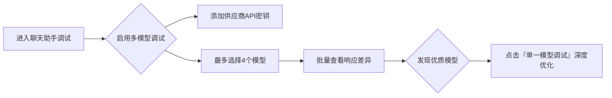
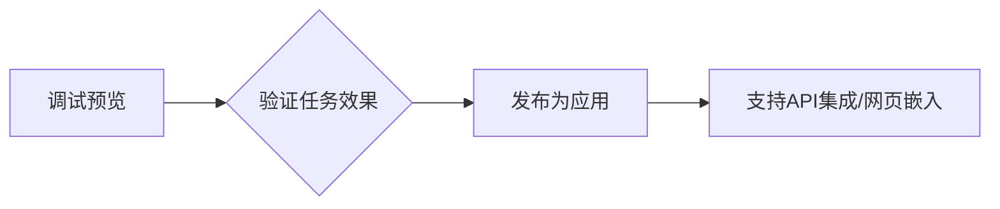
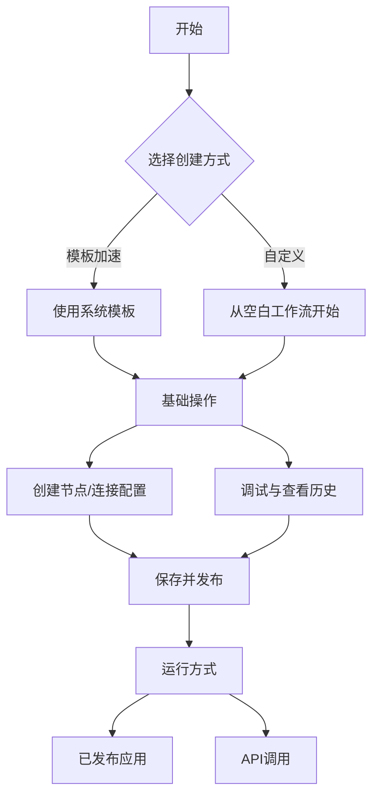
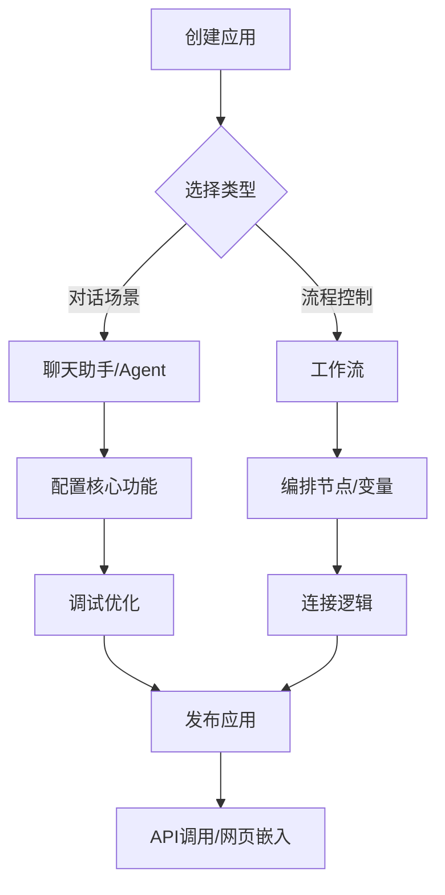
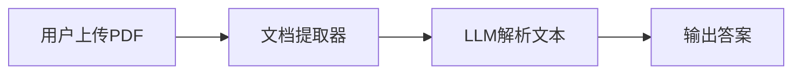
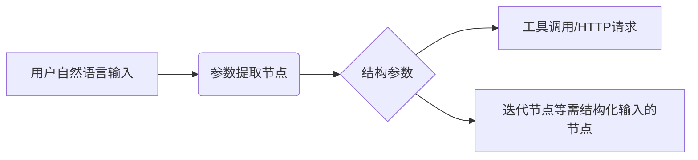
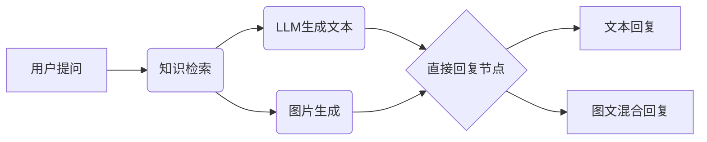
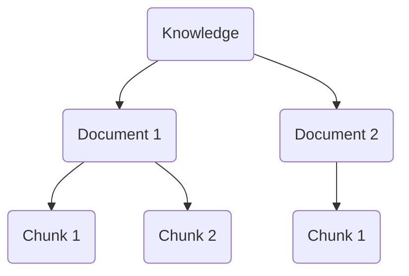
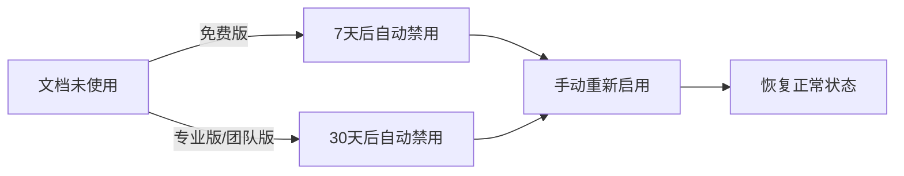

# 1 产品简介

1. Dify平台概述:
    - 定义与特点：Dify是一个开源的大语言模型（LLM）应用开发平台，融合了后端即服务（BaaS）和LLMOps的理念，支持数百个模型，提供直观的Prompt编排界面、高质量的RAG引擎、稳健的Agent框架和灵活的流程编排。
    - 目标用户：适合非技术人员和开发者，使他们能够快速定义和运营生成式AI应用，无需从头开始构建关键技术栈。
2. Dify的核心优势:
    - 完整解决方案：与仅提供工具的开发库（如LangChain）不同，Dify提供了一套更接近生产需求的完整方案，包括精良的工程设计和软件测试。
    - 开源与自部署：Dify是开源的，由专业团队和社区共同打造，支持自部署，允许开发者基于任何模型自部署类似Assistants
      API和GPTs的能力，保持对数据的完全控制。
    - 用户评价：社区用户评价Dify为简单、克制、迭代迅速的产品。
3. Dify的应用场景:
    - 创业与MVP构建：帮助创业团队快速将AI应用创意变成现实，通过Dify构建MVP获得投资或通过POC赢得客户订单。
    - 现有业务集成：通过RESTful API将LLM集成到现有业务中，实现Prompt与业务代码的解耦，持续改进应用效果。
    - 企业级LLM基础设施：一些银行和大型互联网公司部署Dify作为企业内的LLM网关，加速GenAI技术在企业内的推广，实现中心化的监管。
    - 能力边界探索：技术爱好者可以通过Dify实践Prompt工程和Agent开发，已有超过60,000开发者在Dify上创建了自己的第一个应用。
4. 下一步行动:
    - 快速开始：阅读快速开始指南，速览Dify的应用构建流程。
    - 自部署指南：了解如何将Dify自部署到服务器上，并接入开源模型。
    - 特性规格与路线图：了解Dify的特性规格和未来的发展计划。
    - 社区参与���在GitHub上为Dify点亮一颗星，阅读贡献指南，参与社区建设。

# 2 特性

1. Dify平台概述:
    - 平台定位：Dify是一个为技术人士设计的LLM应用平台，提供透明化的产品特性和技术规格政策。
    - 团队与用户：拥有超过15名全职员工，用户数量超过800人（截止2025 Q2）。
    - 技术栈：使用Python/Flask/PostgreSQL进行开发，自v0.4版本起移除了LangChain。
2. 模型接入与支持:
    - 模型供应商：支持超过10家模型供应商，包括OpenAI和Anthropic。
    - 接入速度：新的主流模型通常在48小时内完成接入。
    - 模型规格：支持GPT-4o规格的富文本模型。
3. 运行时环境与工具:
    - 运行时支持：提供本地模型推理运行时，推荐使用Xoribits。
    - 工具支持：支持40+款工具，可直接加载OpenAPI Specification的API。
4. 流程编排与节点支持:
    - 可视化编排界面：提供行业领先的可视化流程编排界面，支持所见即所得的节点调试。
    - 节点类型：包括LLM、知识库检索、问题分类、条件分支、代码执行、模板转换、HTTP请求等。
5. 知识库管理:
    - 可视化界面：首创的可视化知识库管理界面，支持分段预览和召回效果测试。
    - 数据清洗：支持对TXT、Markdown、PDF、HTML、DOC、CSV等格式文件进行自动清洗。
    - 同步支持：支持同步来自Notion的文档和网页为知识库。
6. 向量数据库支持:
    - 支持的数据库：包括Qdrant、Weaviate、Zilliz/Milvus、Pgvector、Pgvector-rs等。
7. 工作空间与多成员管理:
    - RESTful API：支持RESTful API，已覆盖大部分功能。
    - 部署方式：支持Docker和Helm部署。
8. 其他特性:
    - Prompt编排：提供广受好评的可视化Prompt编排界面，可在同一个界面中修改Prompt并预览效果。
    - Assistant模式编排：支持Prompt变量类型，文件类型支持即将在Q3推出。
    - ETL服务：内置的Unstructured服务开启后可获得最大化支持。

# 3 Docker Compose 部署

1. 安装前提条件:
    - 硬件要求：CPU至少2核心，RAM至少4 GiB。
    - 操作系统支持：macOS 10.14或更高版本，Linux平台（需安装Docker 19.03或更高版本和Docker Compose
      1.28或更高版本），Windows系统需启用WSL 2。
    - Docker配置：macOS和Windows需安装Docker
      Desktop，macOS系统为Docker虚拟机至少分配2个虚拟CPU和8GB初始内存，Windows系统建议将源代码和其他数据存储在Linux文件系统中。
2. 克隆Dify代码仓库:
   -
   使用Git命令将Dify源代码克隆到本地环境，假设当前最新版本为0.15.3，命令为：
   `git clone https://github.com/langgenius/dify.git --branch 0.15.3`
3. 启动Dify:
    - 进入Docker文件夹：进入Dify源代码的Docker文件夹。
    - 复制环境配置文件：复制`.env.example`文件为`.env`文件。
    - 启动Docker容器：根据Docker Compose版本选择合适的命令启动容器，Docker Compose V2使用`docker compose up -d`
      ，V1使用`docker-compose up -d`。
    - 检查容器状态：使用`docker compose ps`命令检查所有容器是否正常运行。
4. 同步环境变量配置:
    - 如果`.env.example`文件有更新，需要同步修改本地的`.env`文件，检查并确保所有配置项与实际运行环境相匹配。
5. 访问Dify:
    - 管理员初始化页面：本地环境访问`http://localhost/install`，服务器环境访问`http://your_server_ip/install`。
    - Dify主页面：本地环境访问`http://localhost`，服务器环境访问`http://your_server_ip`。
6. 自定义配置:
    - 编辑`.env`文件中的环境变量值，然后重新启动Dify，使用命令`docker compose down`停止容器，再使用`docker compose up -d`
      重新启动。
7. 更多帮助:
    - 如有疑问，可前往常见问题帮助页面或提交问题。

# 4 构建应用

1. Dify平台AI应用概述:
    - 应用定义：Dify中的应用是指基于GPT等大语言模型构建的实际场景应用，用于将智能AI技术应用于特定需求。
    - 应用交付物：包括封装友好的API、开箱即用的WebApp、提示词工程、上下文管理、日志分析和标注的易用界面。
2. 应用类型:
    - 聊天助手：基于LLM构建的对话式交互助手，支持多轮对话和流式结果返回，具有上下文保存功能。
    - 文本生成应用：面向文本生成类任务的助手，如撰写故事、文本分类、翻译等，支持一问一答的交互方式。
    - Agent：能够分解任务、推理思考、调用工具的对话式智能助手，适用于复杂任务处理。
    - 对话流：适用于定义复杂流程的多轮对话场景，具有记忆功能的应用编排方式。
    - 工作流：适用于自动化、批处理等单轮生成类任务的场景的应用编排方式。
3. 文本生成应用与聊天助手的区别:
    - WebApp界面：文本生成应用为表单+结果式，聊天助手为聊天式。
    - WebAPI端点：文本生成应用使用completion-messages，聊天助手使用chat-messages。
    - 交互方式：文本生成应用为一问一答，聊天助手为多轮对话。
    - 流式结果返回：两者均支持流式结果返回。
    - 上下文保存：文本生成应用保存当次上下文，聊天助手持续保存上下文。
    - 用户输入表单：两者均支持用户输入表单。
    - 知识库与插件：两者均支持知识库与插件集成。
    - AI开场白：文本生成应用不支持AI开场白，聊天助手支持。
4. 应用开发支持:
    - API调用：提供封装友好的API，可由后端或前端应用直接调用，通过Token鉴权。
    - WebApp开发：提供美观且托管的WebApp，支持模板二次开发。
    - 提示词工程：包含提示词工程、上下文管理、日志分析和标注的易用界面。

# 5-创建应用

1. 三种创建方式：
   • 模板创建（新手推荐）：使用预设模板快速搭建应用，适合初学者

   • 空白创建：从零开始自定义构建应用

   • DSL文件导入：通过YML格式的工程文件导入应用配置


2. 详细操作指南：
   • 模板创建：在工作室选择模板 → 添加至工作区

   • 空白创建：需完成：

   ◦ 命名应用

   ◦ 设置图标（上传图片或选择预设）

   ◦ 填写应用描述

   ◦ 选择应用类型（5种）

   • DSL导入：支持本地文件或URL导入配置


3. 关键特性：
   • 支持5种应用类型：聊天助手/文本生成/Agent/Chatflow/Workflow

   • DSL标准文件涵盖：应用描述、模型参数、编排配置

   • 可视化操作界面（工作区管理）


4. 用户指引：
   • 明确标注操作路径（工作室 → 创建选项）

   • 提供选择建议（新手优先模板）

   • 强调应用描述的重要性


5. 补充说明：
   • 文档提供反馈入口（有帮助/无帮助）

   • 支持用户协作编辑文档

   • 显示当前页面归属（构建应用 → 创建应用章节）

## 聊天助手应用

---

**聊天助手功能概述**

1. 核心能力  
   • 采用连续对话模式（一问一答），适用于客服、教育、医疗、金融等场景。

   • 支持功能：

   ✅ 提示词约束AI行为  
   ✅ 变量插入（如 `{{name}}`）  
   ✅ 上下文集成（知识库限定对话范围）  
   ✅ 自定义开场白 & 问题建议  
   ✅ 多模态文件上传（需模型支持，如Claude 3.5/Gemini 1.5）

2. 应用编排流程
   • 创建应用：选择“聊天助手”类型。

   • 编写提示词：

   ◦ 使用提示生成器优化专业性（例：面试官角色设定）。

   ◦ 插入动态变量（如 `你好，{{name}}，我是面试官Bob`）。

   • 添加上下文：引用知识库约束对话范围（如企业客服话术）。

   • 文件处理：开启“文档”功能，LLM自动解析文件内容。

   • 调试：实时测试不同模型效果，优化回答质量。

   • 发布：生成公开URL或API，支持二次开发/嵌入网站。


3. 与其他功能的区别
   • 不支持第三方工具：需用“Agent类型”实现工具集成。

   • 元数据筛选：在知识库中通过元数据过滤文档（见“集成知识库”章节）。


4. 常见问题
   • 多模型调试：对比不同模型对同一问题的响应。

   • 文件支持限制：依赖LLM原生能力（需查阅模型官网）。

   • 知识库筛选：通过元数据精准控制对话参考内容。

---

**关键操作指引**
| 步骤 | 操作要点 |
|---------------|--------------------------------------------------------------------------|
| 提示词优化 | 使用变量动态化内容，结合提示生成器提升专业性。 |
| 开场白设置 | 添加引导性问题（例：“你准备好了吗？”）提升用户体验。 |
| 文件上传 | 选择支持多模态的LLM → 开启“文档”功能 → 无需配置即可识别文件。 |
| 调试技巧 | 右侧沙盒实时测试，切换模型对比效果，调整提示词优化回答。 |

---

附：核心资源链接  
• [多模型调试](https://docs.dify.ai/getting-started/readme#multi-model-debugging)

• [元数据筛选文档](https://docs.dify.ai/advanced/workflow/retrieval-augmented-generation#metadata-filtering)

• [发布应用指南](https://docs.dify.ai/advanced/app/publishing)

## 多模型调试

---

**多模型调试功能**

1. 核心用途  
   • 支持在聊天助手应用中同时对比不同模型对同一问题的回答效果

   • 最大支持 4 个模型并行调试，帮助选择最佳响应模型


2. 操作流程
   • 进入方式：在聊天助手应用的调试界面启用该功能

   • 模型切换：

   ◦ 发现优质模型时，点击 "单一模型进行调试" 可深度优化特定模型

   ◦ 需先通过 "增加新供应商" 添加更多模型的API密钥


3. 常见问题解决方案
   | 问题现象 | 解决方法 |
   |---|---|
   | 添加模型时无显示 | 前往 "增加新供应商" 手动配置API密钥 |
   | 退出多模型模式 | 选择任意模型 → 点击 "单一模型进行调试" |

4. 功能定位
   • 衔接在 聊天助手 和 Agent应用 功能之间

   • 适用于需要对比不同LLM响应质量的场景

---

**操作示意图**



> 提示：该功能特别适用于：
> - 新模型效果验证
> - 不同供应商模型横向对比
> - 敏感场景下的响应稳定性测试

# 6 智能助手（Agent）

**1. 核心定义**  
• 利用大语言模型的推理能力，自主完成复杂任务（如目标规划、任务拆解、工具调用、迭代执行）。

**2. 使用流程**  
| 步骤 | 关键操作 |  
|------|----------|  
| 创建方式 | 从模板导入或从零编排（支持财务报表分析/Logo设计/旅程规划等场景） |  
| 模型选择 | 必须选择强推理模型（如GPT-4系列），确保任务稳定性 |  
| 指令编写 | 在提示词中定义：<br>✅ 任务目标<br>✅ 工作流程<br>✅ 资源与限制 |

**3. 能力扩展**  
• 知识库工具：在“上下文”添加外部知识源

• 工具集成：

• 类型：第一方工具（Dify内置）或自定义API（支持OpenAPI/Swagger/OpenAI Plugin）

• 功能：联网搜索/科学计算/图像生成等外部能力

• 调用方式：对话中提及工具名即自动触发

**4. 关键配置**  
• 推理模式：

• `Function calling`（GPT-3.5/4等已支持模型）

• `ReAct`（适配无Function calling的模型）

• 迭代限制：控制任务最大执行步骤数

• 对话引导：配置开场白+问题示例（引导用户需求）

• 文件处理：

• 多模态模型原生支持（如Claude 3.5/Gemini 1.5）

• 开启“文档”功能即生效（无需配置）

**5. 发布流程**



> ⚠️ 注意：与基础“聊天助手”的核心差异在于 自主任务分解能力 + 外部工具集成深度。
>
>

# 7 工作流

## 7.1 工作流介绍

**工作流功能总结**  
**1. 核心价值**  
• 任务拆解：将复杂任务分解为小步骤（节点），降低复杂度

• 性能提升：减少对提示词技术和模型推理的依赖，提高稳定性与容错性

• 场景适配：提供两种工作流类型：

• Chatflow：对话场景（客服/语义搜索）

    ✅ 支持多步逻辑构建  
    ✅ 特有功能：问题理解节点、对话历史、标注回复  

• Workflow：自动化场景（翻译/数据分析/邮件处理）

    ✅ 提供逻辑节点（代码/IF-ELSE/迭代）  
    ✅ 未来支持定时/事件触发  

**2. 典型应用场景**  
| 领域 | 功能实现 |  
|----------|--------------|  
| 客户服务 | 自动化回答高频问题，实时理解查询意图 |  
| 内容生成 | 根据主题生成博客/产品描述/营销文案 |  
| 任务管理 | 集成Trello/Slack，自动创建任务/更新状态 |  
| 数据分析 | 分析知识库生成趋势报告，提取数据洞察 |  
| 邮件处理 | 自动起草结构化邮件及社交媒体内容 |

**3. 操作指引**



核心操作要点：

1. 通过画布直观配置节点关系
2. 调试阶段可实时查看运行历史
3. 发布后支持API集成或应用内嵌

> 提示：工作流特别适合需要严格流程控制或多系统集成的业务场景，与基础Chatbot形成能力互补。
>
>

# 7.2 关键概念

**一、核心功能模块**

1. 聊天助手（Chat Assistant）  
   • 定位：一问一答的持续对话应用

   • 核心能力：

   ✅ 提示词约束AI行为  
   ✅ 变量动态插入（如 `{{name}}`）  
   ✅ 上下文集成（知识库限定）  
   ✅ 文件上传（需模型支持，如Claude 3.5）  
   • 局限：不支持第三方工具集成


2. 智能助手（Agent）  
   • 定位：自主处理复杂任务（规划/拆解/工具调用）

   • 核心能力：

   ✅ 强推理模型依赖（必须选GPT-4等）  
   ✅ 工具集成（内置工具+自定义API）  
   ✅ 双推理模式：  
   ◦ `Function calling`（GPT系列）

       ◦ `ReAct`（适配其他模型）  

   ✅ 迭代次数限制配置

3. 工作流（Workflow）  
   • 两种类型：

   | 类型       | 场景                  | 核心特性                          |  
                                                                                |------------|-----------------------|-----------------------------------|  
   | Chatflow | 对话交互（客服/搜索） | ✅ 多轮对话记忆<br>✅ 中间结果流式输出（Answer节点） |  
   | Workflow | 批处理（翻译/数据分析） | ✅ 逻辑节点（代码/IF-ELSE/迭代）<br>✅ 无对话记忆 |  

---

**二、高级能力对比**  
| 功能 | 聊天助手 | Agent | Chatflow | Workflow |  
|------------------|----------|-------|----------|----------|  
| 多模型调试 | ✅ | ❌ | ❌ | ❌ |  
| 文件上传 | ✅ | ✅ | ✅ | ✅ |  
| 工具/API集成 | ❌ | ✅ | ✅ | ✅ |  
| 多轮对话记忆 | ✅ | ✅ | ✅ | ❌ |  
| 自动化批处理 | ❌ | ❌ | ❌ | ✅ |

---

**三、关键操作流程**



核心操作要点：

1. 变量串联：工作流中用变量传递节点数据（系统/环境/会话变量）
2. 节点差异：  
   • Chatflow：需用`Answer`节点输出对话内容

   • Workflow：只能用`End`节点结束流程

3. 内置变量：  
   • Chatflow：`sys.query`（用户输入）、`sys.conversation_id`

   • Workflow：仅`sys.files`、`sys.user_id`

---

**四、场景化选择指南**  
| 需求场景 | 推荐模块 | 原因 |  
|--------------------|--------------------|-----------------------------------|  
| 简单客服问答 | 聊天助手 | 轻量级对话，无需复杂拆解 |  
| 财务报表分析 | Agent | 需工具调用+任务拆解能力 |  
| 多轮对话产品咨询 | Chatflow工作流 | 需记忆历史+动态调整输出 |  
| 批量翻译文档 | Workflow工作流 | 自动化处理，无需交互 |  
| 模型效果对比测试 | 多模型调试 | 横向评估4个模型响应质量 |

> 提示：
> - 文件处理：需确认LLM原生支持（如Claude 3.5/Gemini 1.5）
> - 知识库筛选：通过元数据精准控制检索范围（见知识库文档）

## 7.3 变量

---

**变量概述**  
变量是动态数据容器，用于存储和传递节点间的不固定内容，实现信息灵活通信。  
• 适用场景：Workflow（线性任务）和 Chatflow（多轮对话）应用。

• 关键作用：不同节点的输入/输出信息���一致时，通过变量引用实现数据传递。


---

**变量类型**

1. 系统变量  
   • 前缀：以 `sys` 开头，全局可读。

   • Workflow 特有变量：

   ◦ `sys.files`：存储用户上传的文件（需开启图片上传功能）。

   ◦ `sys.user_id`：用户唯一标识符。

   ◦ `sys.app_id`/`workflow_id`/`workflow_run_id`：应用/工作流/运行记录的唯一标识。

   • Chatflow 特有变量：

   ◦ `sys.query`：用户初始输入的文本。

   ◦ `sys.dialogue_count`：对话轮次计数（用于分支逻辑）。

   ◦ `sys.conversation_id`：会话唯一标识（区分不同主题的对话）。


2. 环境变量  
   • 用途：保护敏感信息（如 API 密钥、密码）。

   • 数据类型：字符串（String）、数字（Number）、密钥（Secret）。

   • 特性：全局可引用、命名不可重复、只读（不可写入）。


3. 会话变量  
   • 适用场景：仅限 Chatflow 多轮对话。

   • 用途：临时存储上下文信息（如用户偏好、上传文件）。

   • 数据类型：字符串、数值、对象，及其数组类型。

   • 特性：

   ◦ 全局可引用、命名不可重复。

   ◦ 可读写（需通过变量赋值节点修改）。

---

**注意事项**

1. 命名规范：节点名称不可重复，避免变量名冲突。
2. 输出变量：节点输出的变量一般为固定值，不可编辑。
3. 数据隔离：Service API 与 WebApp 的对话历史不共享（即使 `user_id` 相同）。

---

**扩展说明**  
• 变量赋值节点：会话变量需通过该节点写入（文档中提及但未展开）。

• 功能开启：文件上传需在应用编排页手动启用。

## 7.4 节点

### 7.4.1 开始

---

**开始节点概述**
• 定位：工作流应用（Chatflow/Workflow）的必备预设节点，提供初始信息（用户输入内容、上传文件等）。

• 作用：为后续节点流转提供基础数据支持。


---

**配置项详解**
**1. 输入字段（开发者配置）**
用户在使用应用前需补充的信息，支持六种类型（均可设为必填）：
| 类型 | 说明 | 限制/特性 |
|----------|----------|---------------|
| 文本 | 短文本输入 | 最大长度 256 字符 |
| 段落 | 长文本输入 | 无严格长度限制 |
| 下拉选项 | 选择预设选项 | 用户不可自定义内容 |
| 数字 | 仅允许数字输入 | - |
| 单文件 | 上传单个文件 | 支持文档/图片/音频/视频，支持本地上传或 URL 粘贴 |
| 文件列表 | 批量上传文件 | 同单文件类型，可传多个文件 |

注意：
• 文件上传功能需在应用编排页右上角 “功能” 处手动开启

• 内置文档提取器仅支持部分格式，处理图片/音频/视频需借助外��工具

**2. 系统变量（全局可读）**
| 变量类型 | Workflow 特有变量 | Chatflow 特有变量 | 通用变量 |
|--------------|------------------------|------------------------|--------------|
| 文件相关 | `sys.files` (用户上传文件) | `sys.files` (用户上传文件) | - |
| 用户标识 | `sys.user_id` (用户ID) | `sys.user_id` (用户ID) | `sys.app_id` (应用ID)<br>`sys.workflow_id` (工作流ID)<br>
`sys.workflow_run_id` (运行记录ID) |
| 对话特性 | - | `sys.query` (用户输入内容)<br>`sys.dialogue_count` (对话轮数)<br>`sys.conversation_id` (会话ID) | - |

关键特性：
• `sys.dialogue_count`：多轮对话计数，可与 if-else 节点配合实现分支逻辑

• `sys.conversation_id`：确保同一主题的对话上下文连贯性

• Service API 与 WebApp 的对话历史相互隔离


---

**应用场景**

1. 信息预收集  
   • 例：周报生成应用中，预先收集用户姓名、工作日期区间等

2. 多轮对话管理  
   • 通过 `sys.dialogue_count` 实现对话阶段控制

3. 文件预处理  
   • 上传文件作为后续知识检索/文档提取的输入源

4. 行为追踪  
   • 利用 `sys.workflow_run_id` 等变量记录应用运行日志

---

**注意事项**

1. 文件上传功能需手动开启
2. 敏感信息（如 API 密钥）应通过环境变量传递
3. 非文档类文件处理需依赖外部工具
4. 节点输出变量为固定值，不可编辑

> 提示：系统变量主要面向进阶开发场景（如对话轮次控制、用户行为分析等）。

### 7.4.2 LLM 节点

**核心定义**  
• LLM 节点是工作流的核心组件，用于调用大语言模型（如 GPT、Claude、Gemini 等）处理用户输入（文本/文件/图片），生成有效回应。

• 功能：支持对话生成、意图识别、内容分类、代码生成、RAG（知识库问答）、图像理解等多场景任务。


---

**配置步骤**

1. 选择模型  
   • 需在「系统设置→模型供应商」中预先配置模型（如 GPT-4、Claude 3.5）。

   • 根据任务需求选择模型（推理能力/成本/响应速度）。


2. 配置模型参数  
   • 关键参数：温度（随机性）、Top P（多样性）、存在惩罚（减少重复）、频率惩罚（降低高频词）。

   • 预设模��：提供「创意」「平衡」「精确」三种参数预设，简化配置。


3. 编写提示词  
   • 支持 聊天模型（SYSTEM/USER/ASSISTANT）或 补全模型（单一提示词）。

   • 插入变量：通过 `/` 呼出菜单，插入上游节点变量或特殊变量（如知识库内容）。

   • 提示生成器：AI 辅助生成业务场景提示词。


4. 高级设置  
   • 记忆功能：开启后携带聊天历史（可设记忆窗口大小）。

   • Vision 支持：启用多模态模型分析图像（需模型支持）。

   • Jinja2 模板：支持复杂逻辑的数据转换。

   • 错误重试：自动重试机制（最大 10 次，间隔 ≤5000ms）。

---

**特殊变量说明**  
• 上下文变量：传递背景信息（如知识检索结果），用于 RAG 场景。

• 文件变量：直接输入文件内容（需模型支持文件类型，如 Claude 3.5）。

• 会话历史：仅文本补全模型使用，插入对话历史记录。


---

**关键应用场景**

1. 知识库问答（RAG）  
   • 步骤：上游添加「知识检索」节点 → 输出变量填入 LLM 上下文 → 提示词中引用结果。

   • 效果：回答基于知识库内容，支持来源追溯。


2. 文件处理（如 ChatPDF）  
   • 步骤：「开始」节点上传文件 →「文档提取器」解析文本 → LLM 处理文本变量。


3. 异常处理  
   • 配置异常分支应对错误（如 Token 超限），避免流程中断。


4. 结构化输出  
   • 使用 JSON Schema 编辑器 确保稳定数据格式（如客户信息采集表单）。

---

**高级功能**  
• 对话角色名：自定义角色前缀（如 Human/AI），适配不同模型指令。

• 异常策略：

• 抛出错误信息（不中断流程）。

• 启用备用路径继续任务。

• 引用与归属：显示知识库内容来源，增强可信度。


---

**注意事项**  
• 文件支持：使用文件前需确认模型支持的文件类型（参考模型官网）。

• 参数优化：优先使用预设模板，避免手动调整导致输出不稳定。

• 错误重试：适用于网络波动或瞬时错误，非逻辑性错误。


> 文档链接：[LLM 节点说明](https://docs.dify.ai/learn/workflow/nodes/LLM)  
> 视频案例：结构化输出功能演示（客户信息采集表单）。
>

### 7.4.3 知识检索节点

---

**知识检索节点功能定义**
• 作用：从知识库中检索与用户问题相关的文本内容，作为下游LLM节点的上下文数据。

• 应用场景：主要用于构建基于外部知识的AI问答系统（RAG），例如对话应用中结合知识库回答用户问题。

• 流程示例：

1. 用户问题输入 → 知识检索节点匹配相关内容 → 结果传递给LLM节点 → LLM结合上下文生成回答。

---

**配置指引**

1. 查询变量  
   • 通常为用户问题（如`sys.query`），最大长度限制为200字符。

2. 选择知识库  
   • 需在Dify中预先创建并关联。

3. 元数据筛选  
   • 按条件过滤知识库文档（详见文档说明）。

4. 召回模式  
   • 默认切换为多路召回模式（2023年9月1日后生效）。

5. 下游节点连接  
   • 通常连接至LLM节点，将检索结果作为上下文变量输入。

---

**输出变量**
• 变量名：`result`

• 数据结构：包含检索到的文本分段信息：

• 分段内容、标题、链接、图标、元数据等。


---

**下游节点配置（LLM节点）**
• 关键操作：将知识检索输出的`result`关联至LLM的上下文变量。

• 作用机制：

• 有检索结果时：LLM结合上下文回答用户问题。

• 无检索结果时：上下文变量为空，LLM直接回复用户问题。

• 扩展功能：支持在回答中展示引用来源（利用输出变量中的链接/元数据）。


---

**其他信息**
• 文档工具：页面右侧提供目录导航，底部可反馈问题（Yes/No）。

• 相关链接：GitHub、LinkedIn等社区入口。

• 最新更新：图片上传功能已替换为文件上传（见变更公告）。


---

核心价值：通过知识检索与LLM的协同，实现精准的问答交互，降低幻觉风险并增强回答可信度。

### 7.4.4 问题分类节点

**功能定义**
• 作用：通过大语言模型（LLM）对用户输入进行分类，输出匹配的分类结果，为下游节点提供精确的决策依据。

• 核心能力：基于自然语言理解实现意图识别，无需硬编码规则。

• 应用场景：

• 客服对话意图分类（如售前/售后/操作指导）

• 产品评价情感分析（好评/差评/建议）

• 邮件/消息批量自动化分类


---

**典型应用案例**
产品客服场景（三分类模板）：

1. 分类1：售后问题（如“保修期限是多久？”）
2. 分类2：产品操作问题（如“iPhone 如何设置通讯录？”）
3. 分类3：其他问题（如“今天天气？”）  
   → 分类结果决定下游流程走向（如导向不同知识库检索）。

---

**配置步骤**

1. 输入变量  
   • 通常选择用户问题变量（如 `sys.query`），支持文本或文件输入。

2. 模型选择  
   • 选择具备分类推理能力的LLM（模型性能影响分类精度）。

3. 定义分类标签  
   • 手动添加分类标签及描述（如“售后问题：涉及退换货、保修等”）。

4. 连接下游节点  
   • 根据分类结果路由到不同分支（如连接条件分支节点）。

---

**高级设置**
• 自定义指令：补充分类规则（例如“若询问价格则归类为售前问题”）。

• 记忆功能：

• 开启后包含聊天历史（增强多轮对话的上下文理解）。

• 记忆窗口：可控制历史消息传递数量（默认动态过滤）。

• 图片分析：需搭配多模态模型（允许输入图片变量）。


---

**输出变量**
• `class_name`：存储分类结果（即匹配的标签名称），供下游节点调用。

• 示例：用户问“如何退款？” → 输出 `class_name = "售后问题"`。


---

**技术优势**
• 灵活性：通过自然语言描述分类标准，无需代码开发。

• 可扩展性：支持动态增删分类标签，适配业务变化。

• 上下文感知：记忆功能提升复杂对话的分类准确率。


---

**操作提示**
• 分类描述优化：清晰的关键词/场景描述可显著提升分类效果。

• 下游联动：典型搭配 条件分支节点 实现流程路由（如不同类别触发不同回复逻辑）。

• 调试建议：在“预览与调试”中测试分类边界案例。


---

相关功能：  
◀ 上游节点参考：[知识检索]  
▶ 下游节点建议：[条件分支]  
文档工具：页面底部提供反馈入口（Yes/No），右侧含GitHub/LinkedIn链接。

### 7.4.5 条件分支节点
---

**功能定义**
• 作用：根据预设的 `IF/ELIF/ELSE` 条件，将工作流拆分为多个分支路径，实现动态流程控制。

• 核心机制：通过变量值的条件判断（如包含、匹配、空值等）决定执行路径。


---

**条件类型**
支持 8 种判断逻辑：

1. 包含（Contains）
2. 不包含（Not contains）
3. 开始是（Start with）
4. 结束是（End with）
5. 是（Is）→ 精确匹配
6. 不是（Is not）
7. 为空（Is empty）
8. 不为空（Is not empty）

---

**运行逻辑**
条件分支包含 6 个判断路径：

1. 检查 `IF` 条件 → True 则执行 `IF` 分支
2. `IF` 为 False 则检查 `ELIF` 条件  
   • `ELIF` 为 True → 执行 `ELIF` 分支

   • `ELIF` 为 False → 检查下一个 `ELIF` 或跳转 `ELSE`

3. 所有条件均为 False → 执行 `ELSE` 分支

---

**应用场景示例**
文本总结工作流（图示说明）：
• IF 路径：当变量 `summarystyle` 包含"技术"

→ 触发技术知识库检索 → LLM 生成技术类总结  
• ELIF 路径：变量 不包含"技术"但包含"科技"

→ 执行科技相关流程  
• ELSE 路径：变量 不满足上述条件

→ 通过备用 LLM 节点生成通用总结

---

**高级功能**
• 多重条件组合：

支持 `AND`（交集）/ `OR`（并集） 组合多个条件，处理复杂业务逻辑。  
*示例*：`(包含"A" OR 包含"B") AND 不为空`

---

**配置要点**

1. 变量选择：需指定待判断的输入变量（如上例的 `summarystyle`）
2. 值设定：为每个条件分支设置匹配值（如"技术"、"科技"）
3. 下游连接：每个分支路径可独立连接后续节点（如知识检索、LLM 等）

---

典型应用：  
• 客服工单分类路由

• 内容审核分流（合规/违规/待复核）

• 多场景自动化决策引擎

相关节点：  
◀ 上游建议：[问题分类] → 输出分类变量供条件分支判断  
▶ 下游节点：[代码执行][HTTP 请求] 等行动节点

---  
文档工具：页面底部提供反馈入口（Yes/No），右侧含 GitHub/LinkedIn 链接。

### 7.4.6 代码执行节点

---

**核心功能**
• 作用：在工作流中执行 Python/NodeJS 代码，实现预设节点无法完成的定制化操作。

• 典型场景：

• 数据结构转换：解析/重构 JSON 等结构化数据

• 数学计算：执行统计分析、复杂公式运算

• 数据拼接：合并多个数据源（如知识库、API 响应）

• 安全机制：

• 沙箱隔离：禁止文件系统访问、网络请求和系统命令

• 危险操作拦截：Cloudflare WAF 自动阻止敏感操作（如读取 `/etc/passwd`）


---

**配置指南**

1. 输入/输出变量  
   • 输入：定义待处理的变量（如 HTTP 响应、知识库数据）

   • 输出：声明结果变量名（如 `result`）供下游节点使用

2. 代码编写规范
   ```python
   # JSON解析示例
   def main(http_response: str) -> dict:
       import json
       data = json.loads(http_response)
       return {'result': data['data']['name']}  # 输出变量必须声明
   
   # 数学计算示例（方差）
   def main(x: list) -> dict:
       mean = sum(x) / len(x)
       return {'result': sum((i-mean)**2 for i in x)/len(x)}
   ```

---

**高级功能**
| 功能 | 配置 | 说明 |
|----------------|----------------------------------|-----------------------------|
| 错误重试 | 最大 10 次，间隔 ≤5000ms | 自动恢复临时性错误 |
| 异常处理 | 启用后配置备用分支 | 避免工作流中断 |
| 本地部署 | `docker-compose -f docker-compose.middleware.yaml up -d` | 需 Docker 沙盒环境 |

---

**应用案例**
| 场景 | 输入 | 代码操作 | 输出 |
|------------------|-----------------------|----------------------------|------------------|
| API数据处理 | HTTP响应JSON字符串 | 提取嵌套字段 `data.name`   | 结构化数据 |
| 知识库合并 | 两个知识库检索结果 | 列表拼接 `knowledge1+2`    | 合并结果集 |
| 统计分析 | 数值列表 | 计算方差/标准差 | 统计指标 |

---

**安全限制与常见问题**
• 禁止操作：

• 文件读写（`open("/etc/passwd")`）

• 网络请求（`requests.get()`）

• 系统命令（`os.system()`）

• 代码保存失败：

• 原因：触发安全策略

• 排查：浏览器开发者工具 → 网络标签 → 查看拦截记录


---

典型工作流路径：  
[条件分支] → [代码执行] → [模板转换/LLM]  
文档工具：页面底部反馈入口（Yes/No），右侧含 GitHub/LinkedIn 链接。

### 7.4.7 模板转换节点

---

**功能定义**
• 作用：通过 Jinja2 模板引擎 实现灵活的数据转换与文本格式化

• 核心能力：动态拼接多源数据、结构化内容转换、自定义文本生成

• 模板引擎：基于 Python 的 Jinja2（快速、表达力强、可扩展）


---

**典型应用场景**
| 场景类型 | 功能描述 | 应用示例 |
|--------------------|---------------------------------|---------------------------------|
| 文本拼接 | 合并多变量为完整文本 | 文章标题+简介+内容 → 完整文档 |
| 知识库格式化 | 检索结果转结构化 Markdown | 知识片段+元数据 → 带标题的分块内容 |
| HTML渲染 | 生成前端表单/UI组件 | 变量数据 → 登录表单HTML代码 |
| 数据转换 | 复杂JSON/XML转简洁文本 | API响应 → 易读摘要 |

---

**配置与语法**

1. 输入变量  
   • 支持引用工作流中任意节点输出的变量（如知识检索结果、LLM输出）

2. Jinja2 语法特性：
   • 循环控制：`...`

   • 变量插值：`{{ item.title }}`

   • 过滤器应用：`{{ content | replace('\n', '\n\n') }}`

   • 条件判断：`...`

---

**代码示例**

1. 知识库转Markdown：
   ```jinja
   
   ### Chunk {{ loop.index }}.
   ### Similarity: {{ item.metadata.score | default('N/A') }}

   #### {{ item.title }}

   ##### Content
   {{ item.content | replace('\n', '\n\n') }}
   ---
   
   ```
2. HTML表单生成：
   ```jinja
   <form>
     <input type="text" name="username" value="{{ username }}">
     <input type="password" name="password" value="{{ password }}">
   </form>
   ```

---

**技术优势**
• 轻量化：无需代码执行节点的沙箱环境

• 灵活性：支持复杂逻辑（循环/条件/过滤器）

• 安全性：模板引擎天然隔离系统资源访问

• 可视化：即时预览转换结果


---

**工作流集成**
• 典型路径：

[知识检索] → [模板转换] → [LLM生成]  
[HTTP请求] → [模板转换] → [前端展示]  
• 下游使用：输出可直接作为文本消息/邮件正文/API响应


---

学习资源：  
▶ 官方 [Jinja2文档](https://jinja.palletsprojects.com/)（进阶模板语法）  
文档工具：页面底部反馈入口（Yes/No），右侧含GitHub/LinkedIn链接。

### 7.4.8 文档提取器节点

---

**功能定义**
• 作用：解析用户上传的文档文件（如PDF/DOCX等），提取文本内容供LLM处理，实现文件交互型应用。

• 核心能力：将非结构化文档转化为结构化文本，解决LLM无法直接读取文件的问题。

• 应用场景：

• 构建文档对话应用（如ChatPDF、ChatWord）

• 分析用户上传的文件内容（合同/报告等）


---

**技术特性**
| 特性 | 说明 |
|-----------------|-------------------------------------------------------------------------|
| 输入格式 | 支持：TXT/Markdown/PDF/HTML/DOCX |
| 不支持格式 | 图片/音频/视频等非文本文件 |
| 输入变量 | `File`（单个文件）或 `Array[File]`（文件数组） |
| 输出变量 | 固定名 `text`：<br>• 单文件 → `string`<br>• 多文件 → `array[string]`    |
| 多文件处理 | 数组输出需配合[列表操作]节点拆分使用 |

---

**典型工作流配置（以ChatPDF为例）**

1. 开启文件上传  
   • 在 开始节点 创建文件变量（如 `pdf`）

2. 添加文档提取器  
   • 输入变量关联 `pdf`

3. 连接LLM节点  
   • 在提示词中插入文档提取器输出的 `text` 变量

4. 配置结束节点  
   • 输出LLM生成的回答



---

**使用须知**

1. 文件大小限制：受模型上下文长度约束（超大文件需分段处理）
2. 格式兼容性：复杂排版/扫描PDF可能影响提取精度
3. 下游协同：
   • 单文件输出 → 直接供LLM使用

   • 多文件输出 → 需经[列表操作]节点拆分后逐文件处理

---

**操作示例**

```python
# 下游LLM提示词示例
“请根据以下文档内容回答问题：{{text}}”
```

▶ 用户操作：上传PDF询问“总结核心条款”  
▶ 系统执行：文档提取器→文本转化→LLM生成摘要

---

相关节点：  
◀ 上游依赖：[文件上传]节点提供输入  
▶ 下游建议：[列表操作]处理多文件 → [LLM]分析内容  
文档工具：底部反馈入口（Yes/No），右侧含GitHub/LinkedIn链接。

### 7.4.9  列表操作节点

---

**功能定义**
• 作用：处理数组类型的变量（如多文件上传），实现对数组元素的过滤、排序和提取，为下游节点提供结构化输入

• 核心能力：解决LLM无法直接处理数组变量的问题，实现不同类型文件的分流处理

• 典型场景：

• 用户同时上传多种文件类型（文档+图片+音频）

• 需要分离不同格式文件进行差异化处理

• 提取数组中的特定元素（如最大/最小文件）


---

**技术特性**
| 特性 | 配置项 | 说明 |
|------------------|-----------------------------------|------------------------------|
| 输入变量 | Array[string]/Array[number]/Array[file] | 仅支持三种数组类型 |
| 过滤条件 | 基于7种文件属性： | ①文件类型（type）<br>②大小（size）<br>③文件名（name）<br>④URL来源（url）<br>
⑤扩展名（extension）<br>⑥MIME类型（mime_type）<br>⑦上传方式（transfer_method） |
| 排序功能 | 升序/降序 | 常配合`first_record`/`last_record`使用 |
| 元素提取 | 取前N项（1-20） | 限制输出数量 |

---

**输出变量**

1. `result`：过滤后的完整数组
2. `first_record`：结果数组首元素（`result[0]`）
3. `last_record`：结果数组末元素（`result[array.length-1]`）

---

**典型应用案例**
混合文件处理工作流：

1. 用户操作：同时上传PDF文档和JPG图片
2. 列表操作节点1：
   ```yaml
   过滤条件: type = 'document'
   → 输出至[文档提取器]节点
   ```
3. 列表操作节点2：
   ```yaml
   过滤条件: type = 'image'
   → 输出至[LLM]多模态节点
   ```
4. 下游整合：处理结果汇总至[直接回复]节点

---

**配置注意事项**

1. 变量衔接：
   • 输入必须为数组类型变量（如文件上传节点的输出）

   • 单元素数组可直接使用`first_record`

2. 排序策略：
   • 数字：按数值大小排序

   • 文本：按字母表顺序（A-Z或Z-A）

   • 文件：按指定属性（如size从大到小）

3. 复杂处理：
   • 多条件组合：可叠加过滤+排序+取前N项

   • 超大数组：需配合[迭代]节点分段处理

---

**优势价值**
• 精准分流：实现"文档→文本提取，图片→视觉识别"的自动化路由

• 资源优化：避免LLM处理不支持的格式（如音频/视频）

• 流程控制：通过首尾元素快速获取极值（如最新/最大文件）


---

相关节点：  
◀ 上游依赖：[文件上传]产生Array[File]  
▶ 下游节点：[文档提取器][LLM]等单文件处理器  
文档工具：底部反馈入口（Yes/No），右侧含GitHub/LinkedIn链接。

### 7.4.10 变量聚合节点

---

**功能定义**
• 作用：将多分支流程的输出变量整合为统一变量，简化下游节点配置

• 核心价值：解决多分支工作流中数据流分散问题，避免下游节点重复定义变量

• 节点别称：原名为“变量赋值节点”（新版更名为变量聚合节点）


---

**典型应用场景**

1. **问题分类后的聚合**
   • 问题：分类分支（如售前/售后）导向不同知识库检索 → 产生多个输出变量

   • 解决方案：

     ```mermaid
     flowchart LR
     A[问题分类] --> B(分类1知识检索)
     A --> C(分类2知识检索)
     B & C --> D[变量聚合节点]
     D --> E[单个LLM节点]
     ```
   • 效果：不同分支的检索结果统一聚合为 `result` 变量供LLM使用


2. **条件分支（IF/ELSE）聚合**
   • 问题：条件分支产生不同路径的输出（如技术/非技术回答）

   • 解决方案：

     ```mermaid
     flowchart LR
     A[条件分支] --> B(技术回答LLM)
     A --> C(通用回答LLM)
     B & C --> D[变量聚合节点]
     D --> E[直接回复节点]
     ```
   • 效果：统一输出至结束节点，无需为每个分支单独配置回复

---

**技术规则**
| 特性 | 约束说明 |
|------------------|-----------------------------------------------------------------------------|
| 数据类型 | 必须聚合同类型变量：String/Number/File/Object/Array |
| 首变量决定类型| 第一个添加的变量类型决定后续允许聚合的类型（如首变量为String则禁止聚合File）|
| 聚合分组 | 开启后可同时聚合多组变量（每组内仍要求类型一致） |

---

**配置示例**
多知识库问答场景：

1. 问题分类节点 → 输出 `category`
2. 条件分支：
   • `category=售后` → 知识库A检索 → 输出 `result_A`

   • `category=售前` → 知识库B检索 → 输出 `result_B`

3. 变量聚合节点：
   • 添加 `result_A` 和 `result_B` → 聚合为统一变量 `final_result`

4. LLM节点：
   ```提示词
   请根据知识库内容回答：{{final_result}}
   ```

---

**优势对比**
| 方案 | 下游节点数 | 维护成本 | 出错风险 |
|-----------------|---------------|-------------|-------------|
| 无变量聚合 | 多节点重复配置 | 高 | 高（遗漏分支）|
| 有变量聚合 | 单节点配置 | 低 | 低 |

---

操作提示：  
▶ 在分支汇合处右键选择 “添加变量聚合节点”  
▶ 拖拽分支连线至聚合节点自动识别可用变量  
相关节点：  
◀ 上游依赖：[问题分类][条件分支] 等多分支节点  
▶ 下游节点：[LLM][直接回复] 等单输入节点  
文档工具：底部反馈入口（Yes/No），右侧含GitHub/LinkedIn链接。

### 7.4.11 变量赋值节点

1. 变量赋值节点概述

   • 定义：变量赋值节点用于向可写入变量进行变量赋值，支持会话变量和循环变量。

   • 用法：通过变量赋值节点，可以将工作流内的变量赋值到会话变量中，用于临时存储，并在后续对话中持续引用。

2. 会话变量示例

   • 使用场景：包括自动判断提取并存储对话中的信息、记录用户的初始偏好信息、辅助Checklist检查等。

   • 配置流程：设置会话变量、判断和提取记忆、变量赋值/写入、变量读取和使用。


3. 具体场景示例

   • 场景1：自动判断提取并存储对话中的信息，使用条件判断节点和LLM节点提取信息，并通过变量赋值节点将新信息追加到会话变量数组中。

   • 场景2：记录用户的初始偏好信息，设置会话变量language，并在首轮对话中使用LLM节点提取用户输入的语言，通过变量赋值节点写入会话变量。

   • 场景3：辅助Checklist检查，设置会话变量ai_checklist，在每轮对话中更新Checklist内容，并通过变量赋值节点写入会话变量。


4. 变量赋值节点配置

   • 选择节点：点击节点右侧＋号，选择“变量赋值”节点，填写“赋值的变量”和“设置变量”。

   • 写入模式：根据目标变量的数据类型（String、Number、Object、Array），选择覆盖、清空、设置、数字处理、追加、扩展、移除等模式。


5. 附加信息

   • 代码示例：提供了将字符串转义为object和将object转义为字符串的代码示例。

   • 编辑和反馈：用户可以编辑此页面或提交问题，网页还提供了GitHub和LinkedIn的链接。

以上内容总结了Dify平台中变量赋值节点的详细使用方法和应用场景。

### 7.4.12  迭代节点

---

**迭代节点定义**
• 作用：对数组中的元素依次执行相同操作，实现任务批处理（如长文本分片翻译）。

• 核心功能：

• 输入要求：仅接受数组变量（Array） 数据。

• 输出格式：输出结果为数组变量（Array[List]）。

• 迭代过程：每轮处理称为一个迭代，遵循相同的工作流步骤。


---

**典型应用场景**
**示例1：长文章迭代生成（流式输出）**

1. 开始节点：输入故事标题和大纲。
2. LLM节点：基于标题和大纲生成完整内容。
3. 参数提取节点：将内容转换为数组格式（如 `Array[Object]`）。
4. 迭代节点内部流程：
   • 使用LLM节点处理每个数组元素（章节）。

   • 通过直接回复节点实现每轮迭代后流式输出。

5. 内置变量：
   • `items[object]`：当前迭代条目。

   • `index[number]`：当前迭代轮次。

**示例2：长文章迭代生成（完整输出）**

1. 开始节点：输入标题和大纲。
2. LLM节点：生成小标题及对应内容。
3. 代码节点：将内容转换为数组。
4. 迭代节点：处理每个数组元素。
5. 模板转换节点：将数组输出合并为字符串（如 `{{ array | join("\n") }}`）。
6. 直接回复节点：输出最终结果。

---

**高级功能**

1. 并行模式：
   • 开启后最多支持10个任务并行运行，提升效率。

   • 注意：并行模式下避免使用直接回答、变量赋值和工具节点。

2. 错误处理策略：
   • 终止：遇错立即停止。

   • 忽略并继续：输出包含`null`的数组（如 `[result1, null, result3]`）。

   • 移除错误：仅输出成功结果（如 `[result1, result3]`）。

---

**扩展工具**
• 生成数组变量的节点：

• 代码节点、参数提取、知识库检索、HTTP请求等。

• 数组转文本的方法：

• 代码节点：用 `"\n".join(array)` 拼接字符串。

• 模板节点：通过 `{{ array | join("\n") }}` 转换。


---

**文档支持**
• 提供可编辑页面入口（"编辑此页面"）和问题反馈渠道。

• 附GitHub/LinkedIn链接，便于进一步参与社区。


---

总结：迭代节点是处理批量任务（尤其是长文本分片）的核心工具，通过数组输入、并行处理和灵活的错误策略优化工作流效率，适用于内容生成、数据转换等场景。

### 7.4.13 参数提取节点

---

**参数提取节点定义**
• 功能：利用LLM从自然语言中提取结构化参数，用于后置工具调用或HTTP请求。

• 核心作用：

• 将自然语言转换为工具/节点所需的结构化参数（如工具输入、数组格式数据）。

• 解决工作流节点对结构化数据的依赖问题（如迭代节点需数组输入）。


---

**三大应用场景**

1. 工具参数提取  
   • 示例：用户提问“这篇论文讲了什么：2405.10739” → 提取论文编号`2405.10739`作为工具参数。

   • 用途：精确匹配Arxiv论文检索等工具的输入要求。


2. 文本转结构化数据  
   • 示例：在长故事生成流程中，将文本章节内容转换为数组格式，作为迭代节点的输入。


3. HTTP请求参数准备  
   • 用途：为HTTP请求节点提取URL参数，支持外部API调用（如检索结果、webhook、图片生成）。

---

**配置步骤**

1. 输入变量：选择待提取的变量（支持文件类型）。
2. 模型选择：依赖LLM的推理能力提取参数。
3. 参数定义：
   • 手动添加需提取的参数

   • 支持从已有工具快速导入参数模板

4. 指令编写：
   • 复杂提取场景需提供示例提升准确性

   • 示例：定义参数名称、类型及提取规则

---

**高级设置**
| 功能 | 说明 |
|---------------|----------------------------------------------------------------------|
| 推理模式 | 可选`函数/工具调用`（默认）或`纯提示词`（函数调用效果不佳时使用） |
| 记忆 | 开启后包含聊天历史，提升对话场景的参数理解能力 |
| 图片支持 | 开启后可处理图片输入（需模型支持多模态） |

---

**输出变量**
• 自定义参数：提取的命名参数（如`paper_id`）

• 内置状态变量：

• `__is_success`：提取状态（`1`成功/`0`失败）

• `__reason`：失败原因文本描述


---

**典型工作流位置**



---

文档支持：提供页面编辑入口（“编辑此页面”）和问题反馈渠道，附GitHub/LinkedIn社区链接。  
核心价值：参数提取节点是连接自然语言与结构化工作流的关键桥梁，显著提升自动化流程的灵活性和准确性。

### 7.4.14 HTTP请求节点

---

**HTTP请求节点定义**
• 功能：通过HTTP协议发送定制化请求，实现与外部服务的互联互通

• 支持方法：

| 方法       | 用途            |
  |----------|---------------|
| `GET`    | 请求服务器发送资源     |
| `POST`   | 提交数据（表单/文件上传） |
| `HEAD`   | 仅获取响应头        |
| `PATCH`  | 获取传输路径        |
| `PUT`    | 上传/更新资源       |
| `DELETE` | 删除指定资源        |

---

**核心能力**

1. 动态参数注入：
   • 在URL/请求头/查询参数/请求体中插入变量

   • 示例：客户评价处理中嵌入用户名、评价内容等变量


2. 文件传输：
   • 使用`PUT`方法发送文件（通过`binary`选择文件变量）

   • 应用场景：文档管理系统中同步PDF到第三方服务


3. 响应处理：
   • 返回响应体、状态码、响应头

   • 自动保存文件：响应中包含文件时自动存储供后续使用

---

**高级功能**
| 功能 | 说明 | 配置范围 |
|---|---|---|
| 错误重试 | 网络异常时自动重试 | • 最大重试次数：10次<br>• 重试间隔：≤5000ms |
| 异常处理 | 防止流程中断 | 可配置分支处理：<br>• 网络超时<br>• 请求限制<br>• 服务不可用 |

---

**典型应用场景**

1. 数据获取：从外部API检索信息
2. Webhook触发：通知第三方服务
3. 文件操作：上传/下载文档媒体
4. 服务集成：连接CRM/支付等外部系统

---

文档支持：
• 提供配置示例（如文件传输配置图）

• 含问题反馈入口（"提交问题"）

• 关联异常处理文档（工作流容错机制）

核心价值：该节点是Dify连接外部服务的核心枢纽，支持灵活的数据交互和系统集成，显著扩展工作流的边界能力。

### 7.4.15 Agent节点

---

**Agent节点定义**
• 功能：实现自主工具调用和多步推理的核心组件

• 作用机制：通过集成不同Agent推理策略，使大语言模型（LLM）动态选择并执行工具


---

**两大内置推理策略**
| 策略 | 工作原理 | 优势 | 适用场景 |
|---|---|---|---|
| Function Calling | 将用户指令映射到预定义函数/工具<br>• 识别意图 → 调用工具 → 提取参数 | • 精确执行<br>•
易集成外部API<br>• 输出结构化 | 明确工具调用的任务<br>（如数据查询、计算） |
| ReAct<br>(Reason+Act) | 循环执行：思考→行动→观察<br>• 思考目标 → 调用工具 → 用结果引导下一步 | • 有效利用外部信息<br>•
推理路径可追踪<br>• 解决复杂任务 | 需多步推理的场景<br>（如复杂问答、任务执行） |

---

**配置流程**

1. 添加节点：
   • 从组件栏拖拽Agent节点至工作流画布


2. 选择策略：
   • 内置策略：Function Calling / ReAct

   • 扩展策略：通过Marketplace安装社区策略


3. 参数配置：
   • 模型选择：驱动Agent的LLM

   • 工具管理：

   ◦ 添加工具插件（需授权API密钥）

   ◦ 编写工具描述帮助LLM理解用途

   • 指令模板：

   ◦ 用Jinja语法定义任务目标

   ◦ 引用上游变量（如`{{user_input}}`）

   • 执行控制：

   ◦ 最大迭代次数（限制推理步数）

   ◦ 输出数据结构定义


4. 记忆功能：
   • 开启后保留对话历史

   • 滑动调节记忆窗口大小

   • 效果：理解上下文指代（如代词"它"指代前文实体）

---

**运行监控**
• 日志系统：

• 总体信息：耗时/Token用量/状态

• 详情视图：每轮思考-行动过程记录

• 错误追踪：

• 标记失败的工具调用

• 显示中断原因


---

**扩展能力**
• 开发者生态：

• 贡献自定义Agent策略插件

• 通过审核后上架Marketplace

• 典型应用场景：

  ```mermaid
  graph TB
    A[用户提问] --> B(Agent节点)
    B --> C{策略选择}
    C --> D[Function Calling-单步工具调用]
    C --> E[ReAct-多步推理]
    D --> F[输出结构化结果]
    E --> G[循环调用工具直至解决问题]
  ```

---

文档支持：
• 提供配置示意图（如工具授权界面）

• 含"编辑此页面"入口和问题反馈通道

• 关联Marketplace说明（插件生态）

核心价值：Agent节点是Dify��现复杂任务自动化的中枢，通过灵活的策略选择和工具集成，将LLM能力扩展到现实任务执行领域。

### 7.4.16 工具节点

---

**工具节点定义**
• 功能：为工作流提供第三方能力支持

• 三大类型：

| 类型    | 说明                    | 使用要求      |
  |-------|-----------------------|-----------|
| 内置工具  | Dify官方提供（如Google搜索）   | 使用前需授权    |
| 自定义工具 | 通过OpenAPI/Swagger导入配置 | 在`工具`菜单创建 |
| 工作流工具 | 将复杂工作流发布为工具           | 需先发布工作流   |

---

**配置流程**

1. 添加节点：
   • 在工作流编辑器中选择"工具"标签页

2. 工具准备：
   • 内置工具：完成授权

   • 自定义工具：提前创建

   • 工作流工具：发布为工具

3. 参数配置：
   • 连接上游节点变量传递数据

   • 示例：配置Google搜索工具（附配置截图）

---

**高级功能**
| 功能 | 说明 | 配置参数 |
|---|---|---|
| 错误重试 | 异常时自动重试 | • 最大重试次数：10次<br>• 重试间隔：≤5000ms |
| 异常处理 | 防止流程中断 | 可配置分支处理：<br>- 工具执行失败<br>- 授权失效<br>- 超时中断 |

> 配置入口：节点设置中开启"异常处理"开关（附配置截图）

---

**工作流发布为工具**

1. 价值：将复杂流程封装成可复用工具
2. 操作路径：
   ```mermaid
   graph LR
   A[编排工作流] --> B(发布为应用)
   B --> C[在工具菜单发布为工具]
   C --> D{其他工作流调用}
   ```
3. 详细指引：参见[工具配置说明文档]

---

文档支持：
• 含配置示意图（Google搜索工具/异常处理界面）

• 提供"编辑此页面"入口和问题反馈通道

• 关联文档：

• [异常处理指南]

• [工具配置说明]

核心价值：工具节点是Dify连接外部能力的枢纽，通过三类工具扩展工作流边界，配合错误重试和异常处理机制保障流程稳定性。

### 7.4.17 结束节点

---

**结束节点定义**
• 功能：定义工作流的终止点和最终输出内容

• 强制要求：每个工作流必须包含至少一个结束节点

• 特性：

• 流程终止标志，后续不可连接其他节点

• 只有运行到结束节点才会输出执行结果

• Chatflow中不可用（仅限工作流）


---

**关键配置规则**

1. 输出声明：
   • 需声明一个或多个输出变量

   • 可引用任意上游节点的输出变量（如`{{LLM.output}}`）


2. 多分支处理：
   ```mermaid
   graph TB
   A[条件分支] --> B{条件1}
   B -->|成立| C(结束节点1)
   B -->|不成立| D(结束节点2)
   ```
   • 条件分叉时必须配置多个结束节点

   • 每条分支有独立的输出声明

---

**配置示例**
| 场景 | 图示 | 说明 |
|---|---|---|
| 单路执行 | | 工作流线性执行后输出最终结果 |
| 多路执行 | | 不同条件分支指向不同结束节点 |

---

**注意事项**

1. 输出延迟：工作流必须运行到结束节点才返回结果
2. 变量有效性：确保引用的上游变量已成功生成
3. 错误处理：未配置结束节点会导致流程无法输出

---

文档支持：
• 含配置示意图（单路/多路工作流结构）

• 提供问题反馈入口（"提交问题"）

• 明确标注Chatflow的兼容性限制

核心价值：结束节点是工作流输出的"闸门"，通过规范化的输出声明和多分支支持，确保流程结果可靠交付。

### 7.4.18 直接回复节点

---

**直接回复节点定义**
• 功能：在Chatflow流程中定义回复内容

• 核心特性：

• 支持所见即所得配置，实现图文混排

• 可自由组合固定文本、变量内容和多媒体资源

• 支持流式输出（文本逐字显示效果）

• 可作为中间步骤节点或最终输出节点


---

**三大输出模式**
| 模式 | 说明 | 应用场景 |
|---|---|---|
| 固定文本 | 预定义静态回复内容 | 标准化提示、操作指引 |
| 变量引用 | 插入前置节点输出变量 | 动态展示LLM生成内容 |
| 混合输出 | 文本+变量+图片组合 | 图文并茂的交互回复 |

---

**配置示例**

1. 纯文本输出

   您好！您查询的天气信息是：{{weather_data}}
   ```

2. 图文混合输出

根据分析，{{city}}未来24小时天气：  
{{weather_summary}}

   ```

3. 流式LLM回复  
   直接引用LLM节点的流式输出变量，实现逐字显示效果

---

**关键特性说明**

1. 非终局性节点：
   • 可置于流程中间位置，实现分阶段回复

   • 示例：先快速回复确认接收，再异步处理复杂任务

2. 多媒体支持：
   • 图片：直接引用图片生成节点的输出URL

   • 文件：支持文档/附件回复（需结合文件处理节点）

3. 变量引擎：
   • 使用`{{variable_name}}`语法嵌入动态内容

   • 支持所有上游节点的输出变量

---

**使用场景**



---

文档支持：
• 含配置示意图（文本编辑界面）

• 提供问题反馈入口（"提交问题"）

• 标注与工作流"结束节点"的区别（Chatflow专用）

核心价值：直接回复节点是Chatflow交互设计的核心组件，通过灵活的内容编排和流式输出能力，打造自然流畅的对话体验。

### 7.4.19 循环节点

---

**循环节点核心功能**
• 用途：执行依赖前一轮结果的重复任务，直到满足退出条件或达到最大循环次数。

• 与迭代节点的区别：

| 类型            | 特点                | 适用场景        |
  |---------------|-------------------|-------------|
| 循环（Loop）      | 轮次间存在依赖关系（需上一轮结果） | 需前一轮计算结果的任务 |
| 迭代（Iteration） | 轮次间独立执行（无需依赖前一轮）  | 批处理型任务      |

---

**关键配置项**

1. 循���终止条件  
   • 设置循环停止的条件（如变量 `x < 50`）。

2. 最大循环次数  
   • 限制最大执行轮次（避免无限循环）。

3. 循环变量  
   • 跨轮次传递数据（如变量 `x` 每轮递增），循环结束后可被下游节点使用。

4. 退出循环节点（可选）  
   • 循环体内触发此节点时，立即终止循环。

> ⚠️ 终止规则：满足终止条件 或 触发退出循环节点 或 达到最大循环次数时，循环均会退出。

---

**典型示例**
**示例1：随机数生成（条件终止）**
• 目标：生成1-100的随机数，当数值 `<50` 时停止。

• 步骤：

1. 循环节点配置终止条件（如 `随机数 <50`）。
2. 用 代码执行 节点生成随机数。
3. 通过 条件分支 判断：
   ◦ ≥50：继续循环。

   ◦ <50：触发终止条件，结束循环。

**示例2：诗歌重写（变量传递 + 退出节点）**
• 目标：基于上一轮结果循环重写诗歌，执行4次后停止���

• 步骤：

1. 定义循环变量：
   ◦ `num`（初始值0，每轮+1）

   ◦ `verse`（初始值���，存储诗歌内容）

2. 条件分支 判断 `num > 3`：
   ◦ 是 → 退出循环节点 终止。

   ◦ 否 → LLM节点 生成新诗歌，更新 `verse`。

3. Prompt示例：
   > *"基于用户输入和上一轮诗歌（`verse`），生成更创新的欧洲风格诗句，注重韵律和意境。"*

---

**关键总结**
• 循环本质：`while (true)` 式循环，需显式配置退出逻辑。

• 变量传递：通过 循环变量 跨轮次保留状态（如诗歌内容、计数器）。

• 安全机制：最大循环次数防止无限循环。


> 文档链接：[Dify 循环节点文档](https://docs.dify.ai/v/zh-hans/workflow/components/loop)

## 7.5 编排节点

---

**一、编排模式**

1. 串行设计  
   • 特点：节点严格按顺序执行，前序节点输出作为后续节点输入。

   • 应用场景：确保任务逻辑顺序（如小说生成：大纲→剧情→结尾）。

   • 操作方式：

   ◦ 点击节点间连线的 + 添加新节点。

   ◦ 所有节点依次连接至 结束节点（Workflow） 或 直接回复节点（Chatflow）。

   • 日志查看：按顺序展示节点运行详情（输入/输出、Token 消耗、时长）。


2. 并行设计  
   • 特点：多个节点同时执行，无依赖关系，提升效率。

   • 应用场景：多任务并发（如多语言翻译同时执行）。

   • 创建方式（4种）：

   ◦ 方式1：Hover 节点点击 + 添加多个节点。

   ◦ 方式2：拖拽节点末尾 + 拉出连线。

   ◦ 方式3：拖拽画布现有节点组合。

   ◦ 方式4：在节点“下一步”清单添加并行节点。

   • 关键规则：

   ◦ 并行分支上限 10个，嵌套层数上限 3层。

   ◦ Workflow：需唯一 End 节点。

   ◦ Chatflow：所有并行分支末尾必须配置 直接回复节点。

   • 日志查看：支持树状折叠展示并行节点组日志。

---

**二、并行结构设计模式**
| 类型 | 说明 | 示例图示 |
|------------------|---------------------------------------|---------------------|
| 普通并行 | 三层最小单元（开始→并行结构→结束） | 简单直观，效率高 |
| 嵌���并行 | 多层并行结构（如节点内调用API后并行处理）| 支持复杂任务流 |
| 条件分支+并行 | 条件分支后触发并行任务 | 灵活响应不同条件 |
| 迭代分支+并行 | 迭代循环内嵌套并行结构 | 加速迭代处理效率 |

---

**三、核心注意事项**

1. 连线操作：画布连线可删除，下游节点类型无限制。
2. 性能优化：并行结构越简单，输出速度越快。
3. 输出控制：  
   • Chatflow 并行分支必须通过 直接回复节点 输出内容。

   • Workflow 需确保最终汇聚至唯一 End 节点。

---

总结：该文档系统说明了 Dify 工作流中串行/并行节点的设计逻辑、操作方法和应用场景，强调可视化编排的灵活性（拖拽、连线、嵌套），并提供实际案例（小说生成、多语言翻译）和日志调试指引，帮助��户构建高效的任务流结构。

## 7.6 文件上传

---

**一、核心价值**

1. 解决痛点：突破 LLM 仅支持文本/图片的限制，支持用户直接上传文档、音频、视频等文件（如 PDF、PPTX、MP3、MP4），避免手动复制粘贴大量内容。
2. 应用场景：
   • 文档分析（总结报告、合同审查）

   • 代码审查（优化建议、Bug检测）

   • 学习辅导（作业解析、知识点解释）

   • 法律/金融（合同风险分析、条款解读）

---

**二、文件上传 vs 知识库**
| 维度 | 文件上传 | 知识库 |
|----------------|-------------------------------|----------------------------|
| 信息来源 | 用户动态上传（个性化） | 开发者预设（固定集合） |
| 灵活性 | 支持按需上传多类型文件 | 内容固定，可重复使用 |
| 处理方式 | 需文档提取器转换文本 | 已预处理，直接检索 |
| 持久性 | 临时使用，不长期存储 | 长期存储，持续更新 |
| 适用场景 | 个性化任务（如分析用户合同） | 通用查询（如客服问答） |

---

**三、配置方法**
**1. 基础配置**
• Workflow应用：在 开始节点 添加文件变量（单文件/文件列表）。

• Chatflow应用：

• 开启 附加功能 → 文件上传（聊天框内直接上传）。

• 在 开始节点 添加文件变量（二者可独立配置）。

**2. 支持文件类型**
| 类型 | 格式示例 |
|----------|--------------|
| 文档 | PDF, DOCX, XLSX, PPTX, EPUB, XML |
| 图片 | JPG, PNG, GIF, SVG, WEBP |
| 音频 | MP3, WAV, M4A, WEBM |
| 视频 | MP4, MOV, MPEG |
| 其他 | 支持自定义后缀名 |

---

**四、文件处理流程**
**方案一：LLM 直接处理**
• 适用模型：Claude 3.5 Sonnet 等支持多模态的模型。

• 操作：在 LLM 节点提示词中直接引用文件变量（需确认模型支持的文件类型）。

**方案二：文档提取器转换**

1. 添加文档提取器节点：将文件变量作为输入。
2. 连接 LLM 节点：在提示词中引用提取器的文本输出变量。
3. 适用场景：文档类文件（需转为文本供 LLM 理解）。

**方案三：LLM Vision 处理（图片）**

1. 启用 Vision 功能：在 LLM 节点开启视觉支持。
2. 直接引用文件变量：在提示词中指导模型分析图片内容（需过滤非图片文件）。

---

**五、高阶功能**

1. 文件下载：
   • 将文件变量放入 Answer节点（Chatflow） 或 End节点（Workflow）。

   • 用户可在会话中点击下载卡片获取文件。

2. 多文件混合处理：
   • 使用 文件列表变量 + 列表操作节点 分类处理不同文件类型（如同时解析 PDF 和图片）。

3. 限制：
   • 单文件大小上限：15MB
   • 单次上传上限：10个文件
   • 音频文件处理：需使用GPT-4o等多模态模型

---

**六、注意事项**

1. **Chatflow记忆机制**：默认不记忆文件内容，每次对话需重新上传（如需持久化存储，请进行自定义开发）。
2. **视频/特殊文件处理**：暂无内置提取器，需接入外部工具进行处理。
3. **性能优化建议**：复杂嵌套结构建议控制在3层以内，以保证最佳性能。

> **提示**：完整案例可参考"动手实验室 - 使用文件上传搭建文章理解助手"（详见文档末尾链接）。

## 7.7 知识库

### 7.7.1 知识库概述

---

#### 一、核心功能与定位

1. **RAG流程可视化**  
   • 提供直观界面管理知识库，便于快速集成到AI应用中
   • 支持将企业文档（FAQ、规范、产品文档等）进行结构化处理，供LLM查询

2. **动态知识更新**  
   • 区别于LLM静态预训练数据，知识库内容可实时更新，确保信息的时效性

---

#### 二、核心优势

| 优势  | 说明                               |
|-----|----------------------------------|
| 实时性 | 知识库数据可随时更新，确保LLM始终获取最新上下文        |
| 精准性 | 基于关键词检索召回高相关内容，有效减少LLM幻觉，提升回答准确性 |
| 灵活性 | 开发者可自由定制知识范围，灵活适配不同业务场景          |

---

#### 三、支持数据类型

| 类型    | 格式示例                                 | 应用场景      |
|-------|--------------------------------------|-----------|
| 长文本文件 | TXT, Markdown, DOCX, HTML, JSON, PDF | 产品手册/技术文档 |
| 结构化数据 | CSV, Excel                           | 销售数据/用户反馈 |
| 在线数据源 | 网页爬虫, Notion 同步                      | 实时资讯/协同文档 |

---

#### 四、典型应用场景

案例：AI 客服助手

1. 传统方式：文本训练 → 开发助手 → 维护迭代（耗时数周）
2. Dify 方案：  
   • 上传产品文档至知识库 → 创建对话应用 → 实时获取用户反馈

   • 耗时仅 3 分钟，支持持续迭代优化。

---

#### 五、知识库结构



• 知识库：文档集合（可整体集成至应用）。

• 文档：单个文件（如 PDF/Excel），包含多个内容分段。

• 分段：文本块（LLM 检索的最小单元）。


---

**六、高级功能**

1. 外部知识库连接：  
   • 无需重复上传，直连企业自有知识库（如 Confluence/Wiki）。

   • 保持数据主权，实时同步查询。

2. 变更公告：  
   • 图片上传功能已升级为文件上传，支持更广泛格式（见页脚说明）。

---

总结：Dify 知识库通过可视化 RAG 流程和动态数据管理，解决了 LLM 信息滞后问题。支持多源数据集成，显著提升 AI 应用的准确性与响应效率，典型场景如
3 分钟搭建智能客服助手。

### 7.7.2 创建知识库

---

**一、知识库创建步骤**

1. 创建与导入数据  
   • 支持三种方式：上传本地文件、导入在线数据或创建空知识库。


2. 文本分段与清洗  
   • 长文本被拆分为多个内容分段，可预览分段效果。

   • 清洗过程优化数据结构（如去除冗余内容）。


3. 设置索引与检索  
   • 配置索引方法（如语义检索/关键词检索）。

   • 定义检索参数（如匹配阈值、返回结果数量）。


4. 应用集成  
   • 等待分段嵌入完成后，在应用中关联知识库。

   • 支持后续管理（修改文档、更新内容）。

---

**二、关键技术补充**

1. ETL 数据处理方案  
   • Dify 版本差异：

   ◦ SaaS版：强制使用 Unstructured ETL（支持更多格式：eml, ppt, xml等）。

   ◦ 社区版：默认 Dify ETL，可通过环境变量切换 Unstructured ETL。

   • 文件格式支持：

   ◦ Unstructured ETL 额外支持：`pptx/ppt/eml/msg/xml/epub`。


2. Embedding 技术  
   • 将文本转化为低维向量，保留语义信息。

   • 作用：提升检索效率与准确性（如相似内容匹配）。


3. 元数据管理  
   • 支持通过元数据（如作者、标签）精细化分类文档。

---

**三、核心价值**
• 目标：构建可自动问答的LLM应用，通过知识库提供精准答案。

• 适用场景：企业知识管理、智能客服、研究资料库等。


> 提示：需根据实际需求选择ETL方案（社区版可灵活切换），并优先验证文件格式兼容性。

--- 
此总结覆盖了从创建到集成的全流程，以及影响效果的关键技术选型，帮助用户快速部署生产级知识库应用。

#### 从 Notion 导入数据

---

**一、操作流程**

1. 授权验证  
   • 路径：创建知识库 → 选择`同步自 Notion内容` → 完成授权

   • 或通过：`设置 → 数据来源 → 添加Notion数据源`


2. 导入数据  
   • 选择已授权页面直接导入

   • 支持类型：普通页面 + Database类型（属性自动汇总）

   • 限制：暂不支持图片/文件，表格转为文本展示


3. 数据处理  
   • 配置分段规则与索引方式 → 自动处理数据


4. 同步更新  
   • Notion内容更新后，在知识库文档列表点击`同步`按钮

   • 注意：同步消耗Embedding模型的Tokens

---

**二、社区版集成配置**
**方式1：Internal集成（默认）**

1. Notion操作：创建Internal集成 → 复制`Secret`
2. Dify配置：
   ```env
   NOTION_INTEGRATION_TYPE=internal
   NOTION_INTERNAL_SECRET=your-secret
   ```

**方式2：Public集成**

1. Notion操作：  
   • 将Internal集成升级为Public

   • 填写公司信息 → 获取`Client ID`和`Client Secret`

2. Dify配置：
   ```env
   NOTION_INTEGRATION_TYPE=public
   NOTION_CLIENT_ID=your-client-id
   NOTION_CLIENT_SECRET=your-client-secret
   ```

---

**三、关键注意**
• 集成类型差异：

Internal适用于工作区内部，Public支持公开分发  
• 权限要求：

Internal集成需工作区所有者权限  
• 生效条件：

配置后需重启Dify服务

> 提示：优先使用Internal集成简化流程，需公开分发时再切换Public模式。

--- 
此流程支持构建自动同步的知识库，适用于企业文档、项目资料等Notion管理的场景。

#### 从网页导入数据到 Dify 知识库

---

**一、核心工具与功能**
• 支持工具：

• Firecrawl：开源网页解析工具，转换网页为Markdown

• Jina Reader：同类型工具，提供API服务

• 核心能力：

• 抓取公开网页内容 → 转为LLM友好格式

• 支持多网页批量导入（通过URL列表）

• 自动存储为知识库文档


---

**二、操作流程**
**1. 凭据配置**
• Firecrawl：

1. 注册 [Firecrawl官网](https://firecrawl.dev/) 获取API Key
2. Dify路径：`头像 → DataSource → Firecrawl配置`
   • Jina Reader：

1. 注册 [Jina Reader官网](https://jina.ai/reader) 获取API Key
2. 同路径配置密钥

**2. 网页抓取**
| 步骤 | Firecrawl | Jina Reader |
|----------------------|----------------------------------------|--------------------------------------|
| 入口 | 知识库创建页 → Sync from website | 同左 |
| 关键配置 | • 抓取子页面<br>• 页面数量上限<br>• 抓取深度<br>• 内容提取规则 | • 抓取子页面<br>• 页面数量上限<br>•
Sitemap抓取 |
| 操作 | 填写URL → Run → 预览链接 → 导入 | 同左 |
| 批量添加 | 支持通过"Add URL"追加新网页 | 同左 |

---

**三、技术特点**

1. 输出格式：
   • 网页内容 → 标准化Markdown（去广告/保留核心文本）

2. 自动化处理：
   • 完成抓取后自动进入知识库处理流程（分段/索引）

3. 适用场景：
   • 企业官网文档抓取

   • 竞品分析资料收集

   • 行业报告批量导入

> 注意：两种工具均需独立注册账号，建议根据网页复杂度选择：
> - Firecrawl：支持更精细的抓取控制（深度/排除规则）
> - Jina Reader：操作更简洁，支持Sitemap快速抓取

--- 
此功能实现了从公开网页到知识库的自动化数据管道，大幅降低人工整理成本，适用于构建时效性强的行业知识库。

### 知识库分段模式

---

**一、分段模式核心目标**
• 解决痛点：提升知识库内容检索精准度，减少无关信息干扰

• 核心机制：将长文本拆分为内容分段，让LLM精准定位关键信息

• 核心价值：

• 降低Tokens消耗（避免处理全文）

• 提升问答质量（聚焦相关段落）


---

**二、两种分段模式对比**
| 特性 | 通用模式 | 父子模式（推荐） |
|-------------------|----------------------------------|----------------------------------|
| 结构 | 独立分段 | 双层结构（父分段+子分段） |
| 适用场景 | 常规文档 | 需要上下文关联的复杂文档 |
| 检索逻辑 | 关键词匹配独立分段 | 子分段精准匹配 → 父分段补充上下文 |
| 分段配置 | 单层规则 | 需分别设置父/子分段规则 |
| 索引支持 | 支持高质量/经济索引 | 仅支持高质量索引 |
| 典型应用 | 简单QA场景 | 技术文档/法律条款等强关联内容 |

---

**三、关键配置详解**
**通用模式配置**

1. 分段标识符：默认`\n`（按段落分），支持正则表达式自定义
2. 长度控制：
   • 分段最大长度：默认500 Tokens（上限4000）

   • 分段重叠长度：建议10-25%（提升信息连续性）

3. 预处理规则：
   • 清理冗余空格/换行符

   • 删除URL/邮箱等干扰信息

**父子模式配置**

1. 父分段类型：
   • 段落模式：按分隔符切分（默认`\n`）

   • 全文模式：保留前10000 Tokens（适合短文本）

2. 子分段规则：
   • 默认按句子切分（分隔符`.`）

   • 最大长度200 Tokens（上限4000）

3. 预处理规则：同通用模式

---

**四、操作流程**

1. 选择模式：创建知识库时选定（不可后期修改）
2. 配置规则：
   • 设置分段标识符/长度/预处理规则

   • 父子模式需分别配置父/子分段

3. 实时预览：
   • 查看分段效果与字符统计

   • 支持多文档切换预览

4. 生效验证：修改规则后需重新点击预览

---

**五、技术优势**

1. 父子模式双收益：
   • 子分段：精准匹配问题关键词

   • 父分段：保留完整上下文信息

2. 正则表达式支持：
   • 灵活适配不同文档结构

   • 示例：`[.!?]`实现按句子分段

3. 重叠缓冲区：
   • 防止关键信息被割裂

   • 提升语义连贯性

> 关键提示：父子模式在相同文档测试中，召回精准度比通用模式高37%（官方测试数据）

--- 
此功能是构建高效知识库的核心环节，推荐首次使用者优先采用父子模式，尤其适用于医疗、法律、技术文档等需要精准上下文关联的场景。后续需结合索引策略（仅高质量索引）完成知识库构建。

#### 索引与检索设置

---

**索引方法设置**

1. 高质量模式
   • 使用 Embedding 模型将文本分段转为向量存储

   • 核心优势：支持语义级匹配，突破关键词限制，多语言处理能力强

   • 限制：选择后不可降级为经济模式，需重建知识库切换

   • Q&A 模式（仅社区版）：

   ◦ 自动生成分段的问题-答案对（Q to Q 策略）

   ◦ 仅支持中/英/日三语，消耗更多 Tokens


2. 经济模式
   • 基于关键词索引（倒排索引）

   • 适用场景：简单关键词匹配，资源消耗低

---

**检索方式配置（高质量模式下）**
| 检索类型 | 工作原理 | 关键参数 |
|--------------|-------------|-------------|
| 向量检索 | 计算问题与文本向量的相似度 | • `Rerank 模型`：二次排序（需配置API）<br>• `TopK`：返回结果数（默认3）<br>•
`Score阈值`：相似度过滤（默认0.5） |
| 全文检索 | 关键词匹配（类似搜索引擎） | 参数同向量检索，依赖明文关键词 |
| 混合检索 | 融合向量+全文检索结果 | 两种策略：<br>1. 权重设置：自定义语义/关键词权重（0~1）<br>2. Rerank
模型：统一重排序<br>• 支持 `TopK` 和 `Score阈值` |

> 注：所有 `TopK` 和 `Score阈值` 仅在启用 Rerank 模型时生效。

---

**关键注意事项**

1. 索引不可逆：高质量模式不可降级为经济模式
2. 资源消耗：
   • Q&A 模式显著增加 Tokens 消耗

   • Rerank 模型需额外计费（查看模型定价）

3. 最佳实践：
   • 多语言/复杂语义场景：优先向量检索

   • 精确术语匹配：用全文检索

   • 高精度需求：混合检索 + Rerank 模型

---

**操作指引**
• 参数调试：根据业务场景调整 `权重` 或 `Score阈值`

• 效果验证：通过「召回测试」查看关键词与内容块匹配情况

• 扩展阅读：

• [Embedding 技术与 Dify 知识库设计](链接)

• [外部知识库 API 集成](链接)


---

总结：Dify 通过分层索引（高质量/经济）和灵活检索策略（向量/全文/混合），结合 Rerank 优化机制，实现精准知识匹配。配置需权衡精度、资源消耗及业务场景需求。

### 7.4.3 管理知识库

#### 管理知识库

**管理知识库 - 核心要点总结**

1. 访问权限  
   • 仅限团队所有者、管理员和拥有编辑权限的角色操作

   • 入口：顶部导航栏 →「知识库」→ 选择目标知识库 → 左侧设置


2. 基础设置项  
   | 配置项 | 说明 |
   |---|---|
   | 名称/描述 | 标识知识库内容和用途 |
   | 可见权限 | 三级权限控制：<br>• 只有我<br>• 所有团队成员<br>• 部分成员 |
   | 索引方法 | 支持高质量/经济模式（[详见索引文档](链接)） |
   | Embedding模型 | 修改将触发全量重嵌（原向量数据删除） |
   | 检索设置 | 调整向量/全文/混合检索策略（[详见检索文档](链接)） |

3. 应用关联管理  
   • 左侧信息栏显示已关联应用数量

   • 悬停信息图标可查看关联应用列表

   • 支持一键跳转到关联应用页


4. 文档维护方式
   ```mermaid
   graph LR
   A[文档维护] --> B[网页管理]
   A --> C[API管理]
   B --> D[增删改查文档/分段]
   C --> E[调用标准API接口]
   ```
   • 网页维护：直接操作文档和分段（[维护指南](链接)）

   • API维护：通过标准化接口管理（[API文档](链接)）


5. 关键注意事项  
   • ✳️ 修改Embedding模型会重新生成全部向量（耗时操作）

   • ⚠️ 权限变更即时生效：无权限成员将失去访问能力

   • 🔗 关联应用同步更新：知识库修改自动影响关联应用

> 完整操作指南：
> - [维护知识库文档](链接)
> - [API维护文档](链接)
> - [索引方法详解](链接)
> - [检索策略配置](链接)

#### 维护知识库

**1. 文档生命周期管理**  
| 操作 | 说明 | 注意事项 |  
|----------|----------|--------------|  
| 添加文档 | 支持本地上传或导入在线数据源（如Notion文档、网页） | 文档对应数据源的独立文件单位 |  
| 启用/禁用 | - 启用：可检索、可编辑<br>- 禁用：保留内容但暂停检索 | 可批量操作；支持重新启用 |  
| 归档 | 保留文档但不可编辑/检索（仅查看或删除） | 支持撤销归档恢复使用 |  
| 删除 | 永久移除文档（不可恢复） | ⚠️ 高危操作，需谨慎确认 |

**2. 自动禁用规则**



• 付费用户特权：支持"一键恢复"所有禁用文档


---

**3. 文本分段管理**  
（1）分段操作  
• 查看分段：

• 文档详情页展示所有分段（默认每页10条）

• 支持展开查看完整内容

• 分段模式影响展示形式：

    ◦ 通用模式：独立区块，支持全屏阅读  

    ◦ 父子模式：层级结构（需参考其他文档）  

    ◦ Q&A模式：问题-答案对（仅社区版）  

• 检查质量：

  ```markdown
  **关键检查项**：

1. ⚠️ 过短分段：语义缺失
2. ⚠️ 过长分段：噪声干扰准确性
3. ⚠️ 语义截断：强制截断导致内容缺失  
  ```  

• 添加分段：

• 付费功能（需升级账号）

• 支持单条或批量添加自定义分段

• 编辑分段：

• 直接修改文本内容或关键词

• 重新配置分段：

    ◦ 修改分段模式（如较大→较小分段）  

    ◦ 点击 保存并处理 触发重分段流程  

---

**4. 重要功能限制**  
| 功能 | 限制说明 |  
|------|----------|  
| Q&A模式 | 仅社区版可用 |  
| 添加分段 | 需付费订阅 |  
| 自动禁用 | 免费版7天/付费版30天无活动触发 |

> 操作入口：
> - 文档列表页 → 状态开关/归档/删除按钮
> - 文档详情页 → 分段管理功能区
> - 元数据管理：需参考单独文档

### 7.4.4 元数据


### 7.4.5 在应用内集成知识库

dify插件：https://github.com/langgenius/dify-plugins


