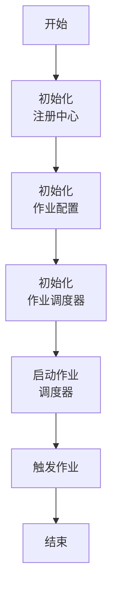

#   **分布式弹性调度系统的简介**

# 简介

Elastic-Job是由当当网基于Quartz 二次开发之后的分布式调度解决方案，是一个分布式调度解决方案，由 2 个相互独立的子项目 ElasticJob-Lite 和 ElasticJob-Cloud 组成。

- **ElasticJob-Lite：** 定位为轻量级无中心化解决方案，使用jar的形式提供分布式任务的协调服务。
- **ElasticJob-Cloud：** 使用 Mesos 的解决方案，额外提供资源治理、应用分发以及进程隔离等服务。

Elastic-Job 的各个产品使用统一的作业 API，开发者仅需要一次开发，即可随意部署。

Elastic-Job开发在**停滞数年后**，2020年，Elastic-Job 携首个 **Apache** 版本 3.0.0-alpha 回归！2020年6月，经过**Apache ShardingSphere社区**投票，接纳Elastic-Job为其子项目。

目前ElasticJob的四个子项目已经正式迁入Apache仓库。并更名为Shardingsphere-Elasticjob。

对于功能强大的分布式调度系统Elastic-Job很多优秀的分布式设计思想值得学习，接下来本系列文章会针对Elastic-Job版本2.1.5的核心源码与原理进行分析讲解。

## **分布式弹性调度系统特征**


**（1） 弹性调度**

- 支持任务在分布式场景下的分片和高可用。
- 能够水平扩展任务的吞吐量和执行效率。
- 任务处理能力随资源配备弹性伸缩。

**（2）资源分配**

- 在适合的时间将适合的资源分配给任务并使其生效。
- 相同任务聚合至相同的执行器统一处理。
- 动态调配追加资源至新分配的任务 。

**（3）作业治理**

- 失效转移执行。
- 错过执行作业重新触发。
- 自诊断并修复分布式不稳定造成的问题。
- 支持并行调度。
- 作业调度。
- 幂等执行。

**（4）作业依赖（2.x 目前未实现功能TODO，迁移后的项目后期会实现）**

- 基于有向无环图（DAG）的作业间依赖。
- 基于有向无环图（DAG）的作业分片间依赖。

**（5）作业开放生态**

- 可扩展的作业类型统一接口。
- 丰富的作业类型库，如数据流、脚本、HTTP、文件、大数据等
- 易于对接业务作业，能够与 Spring 依赖注入无缝整合。

**（6）可视化管控端**

- 作业管控端。
- 作业执行历史数据追踪。
- 注册中心管理。
- 作业编排管理。

 

## 使用Java代码创建第一个调度例子

### 导入Maven包

```xml
<dependency>
  <groupId>com.dangdang</groupId>
 <artifactId>elastic-job-lite-core</artifactId>
 <version>2.1.5</version>
</dependency>
```

### 手动启动一个简单的调度例子

-  实现作业接口，重写作业执行方法，编写作业执行业务逻辑。
- Zookeeper注册中心的配置与初始化。
- 作业属性的配置初始化。
- 作业调度器对象的创建与初始化。
- 触发作业。

具体流程如下图所示：


图2.1 ElasticJob作业初始化过程


### **示例代码**

- 实现一个简单定时任务

```Java
public class JavaSimpleJob implements SimpleJob {

 @Override
 public void execute(final ShardingContext shardingContext) {
  System.out.println("Hello Job”);
 }
}
```

- 初始化一个定时任务

```Java
public class JobDemo {
    public static void main(String[] args) {
        //注册中心地址
        String serverList = "127.0.0.1:2181";
        //调度作业注册中心命名空间名字
        String namespace = "elastic-job-lite-demo";
        //作业执行的cron表达式
        String cron = "* * * * * ?";
        //作业进行分片执行的分片总数
        int shardingTotalCount = 3;
        //分片项参数
        String shardingItemParameters = "0=Beijing,1=Shanghai,2=Guangzhou";

        //Zookeeper初始化
        //创建zookeeper配置对象
        ZookeeperConfiguration zookeeperConfiguration = new ZookeeperConfiguration(serverList, namespace);
        //创建协调注册中心对象
        CoordinatorRegistryCenter zookeeperRegistryCenter = new ZookeeperRegistryCenter(zookeeperConfiguration);
        //初始化注册中心
        zookeeperRegistryCenter.init();

        //作业初始化
        //这里是定义JOB的名字
        String jobName = "JavaSimpleJob";
        //创建作业核心配置的建造者builder类型
        JobCoreConfiguration.Builder javaCoreConfigurationBuilder =
                JobCoreConfiguration.newBuilder(jobName, cron, shardingTotalCount);
        //根据builder构建核心配置
        JobCoreConfiguration jobCoreConfiguration = javaCoreConfigurationBuilder.shardingItemParameters(shardingItemParameters).build();

        //getCanonicalName 返回包名+类名字，这里是作业执行类的信息
        String canonicalName = JavaSimpleJob.class.getCanonicalName();
        //根据核心配置和作业执行类创建作业类型配置
        JobTypeConfiguration jobTypeConfiguration = new SimpleJobConfiguration(jobCoreConfiguration, canonicalName);

        //根据作业类型配置初始化轻量级作业配置
        LiteJobConfiguration liteJobConfiguration = LiteJobConfiguration.newBuilder(jobTypeConfiguration).build();

        //作业调度器初始化
        JobScheduler jobScheduler = new JobScheduler(zookeeperRegistryCenter, liteJobConfiguration);
        jobScheduler.init();
    }
}
```

首先确保zookeeper服务已经启动，然后直接运行main方法即可。

## **使用Spring配置一个作业**

### **导入Maven包**

```xml
<dependency>
 <groupId>com.dangdang</groupId>
 <artifactId>elastic-job-lite-spring</artifactId>
 <version>2.1.5</version>
</dependency>
```

### **配置Spring文件**

- 配置注册中心对象

```xml
<reg:zookeeper id="regCenter" 
               server-lists="${serverLists}" 
               namespace="${namespace}" 
               base-sleep-time-milliseconds="${baseSleepTimeMilliseconds}"             
               max-sleep-time-milliseconds="${maxSleepTimeMilliseconds}" 
               max-retries="${maxRetries}"/>
```

- 配置作业对象

```xml
<job:simple id="${simple.id}" 
            class="${simple.class}" 
            registry-center-ref="regCenter"
            sharding-total-count="${simple.shardingTotalCount}"
            cron="${simple.cron}"  
            sharding-item-parameters="${simple.shardingItemParameters}"
            monitor-execution="${simple.monitorExecution}" 
            monitor-port="${simple.monitorPort}"
            failover="${simple.failover}"
            description="${simple.description}" 
            disabled="${simple.disabled}"
            overwrite="${simple.overwrite}" />
```

本实例只展示来我们配置Spring时候需要铁添加的配置，如果想要完整跑一个项目可以参考官方源码的elastic-job-example示例文件。


参考网站：

- 版本2.1.5源码：
  - [https://gitee.com/elasticjob/elastic-job/tree/2.1.5/](https://gitee.com/elasticjob/elastic-job/tree/2.1.5/)
  
- 例子源码地址：
  - [https://gitee.com/elasticjob/elastic-job/tree/2.1.5/elastic-job-example](https://gitee.com/elasticjob/elastic-job/tree/2.1.5/elastic-job-example)

- 最新版本源码：
  - [https://github.com/apache/shardingsphere-elasticjob](https://github.com/apache/shardingsphere-elasticjob)

- 官方网站：
  - [http://shardingsphere.apache.org/elasticjob/](http://shardingsphere.apache.org/elasticjob)


 