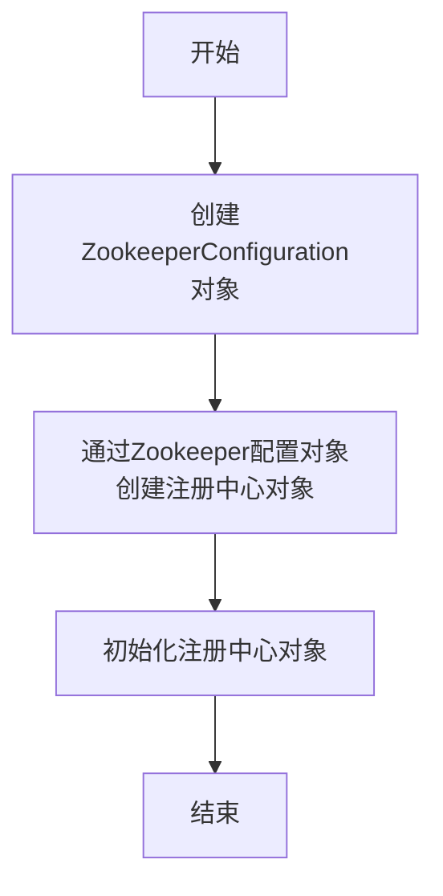
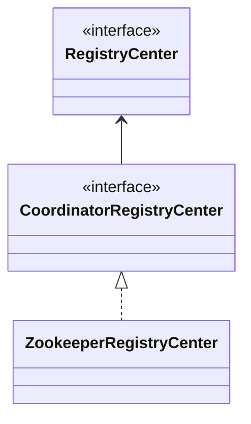
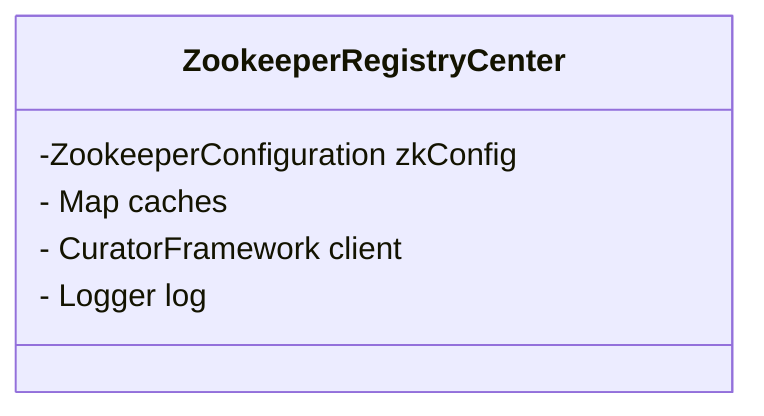

#  **注册中心的设计原理**

## **调度系统使用Zookeeper做什么**

ZooKeeper 是 Apache 软件基金会的一个软件项目，它是一个针对大型分布式系统的可靠协调系统，为大型分布式计算提供开源的分布式配置服务、同步服务和命名注册。

调度系统使用Zookeeper进行分布式环境下作业 **配置信息注册** ，**监听更新** ，使用Zookeeper实现 **分布式锁进行主节点选举** ，使用临时节点实现作业实例 **上下线** 等操作。

##  **调度系统注册中心设计**

在上篇文章中通过Java启动作业调度的Demo我们可以看到Zookeeper初始化过程有如下操作：

```Java
  //1-创建zookeeper配置对象
  ZookeeperConfiguration zookeeperConfiguration = new ZookeeperConfiguration(serverList, namespace);
  //2-通过Zookeeper配置对象创建注册中心对象
  CoordinatorRegistryCenter zookeeperRegistryCenter = new ZookeeperRegistryCenter(zookeeperConfiguration);
  //3-初始化注册中心
  zookeeperRegistryCenter.init();
```

完成Zookeeper的初始化连接主要流程如下：


图3.1 注册流程

在调度系统中完成Zookeeper的初始化流程主要分为3步:

- 先创建一个用来封装Zookeeper配置信息的ZookeeperConfiguration类型;
- 然后再根据配置信息创建Zookeeper注册中心对象
- 最后初始化注册中心。

接下来我们先整体看一下注册中心这一块的类型包含来哪些：


图3.2 注册中心包和类结构

- **注册中心接口层：** 最顶层的设计就是注册中心接口RegistryCenter 未来各种类型的注册中心都要继承或实现此接口，然后就是往下的用于协调分布式服务的注册中心的CoordinatorRegistryCenter接口，用于封装一些协调式分布式服务的注册中心共同行为。然后独立提供了一个用于注册中心选举候选人用的选举接口ElectionCandidate。

- **注册中心实现层：** 这里目前提供了用于协调式分布式服务典型的注册中心组件Zookeeper的封装，基于Zookeeper封装的注册中心类ZookeeperRegistryCenter。包含了配置实体类ZookeeperConfiguration，另外还提供了ZookeeperElectionService选举服务类。

- **异常类型：**  这里提供了一个自定义异常类型RegException来表示注册中心相关的异常，RegExceptionHandler注册中心异常处理类处理注册中心相关的异常信息。

## **Zookeeper配置详解**

Zookeepeer客户端配置信息主要使用ZookeeperConfiguration类型封装主要配置信息如下：

| 属性名                    | 属性类型 | 属性描述                                                 |
| ----------------------------- | ------------ | ------------------------------------------------------------ |
| serverLists                   | String       | 连接Zookeeper服务器的列表， 包括IP地址和端口号. 多个地址用逗号分隔. 如: host1:2181,host2:2181 |
| namespace                     | String       | 调度节点的命名空间                                           |
| baseSleepTimeMilliseconds     | int          | 等待重试的间隔时间的初始值.单位毫秒.                         |
| maxSleepTimeMilliseconds      | int          | 等待重试的间隔时间的最大值. 单位毫秒.                        |
| maxRetries                    | int          | 最大重试次数.                                                |
| sessionTimeoutMilliseconds    | int          | 会话超时时间. 单位毫秒.                                      |
| connectionTimeoutMilliseconds | int          | 连接超时时间. 单位毫秒.                                      |
| digest                        | String       | 连接Zookeeper的权限令牌. 缺省为不需要权限验证.               |

## **ZookeeperRegistryCenter原理解析**

ZookeeperRegistryCenter是实现了协调注册中心的实现类用于和Zookeeper分布式协调组件进行交互的建模,接下来我们先看下他的类继承关系：


图3.3 注册中心类结构

可以看到协调注册中心类型ZookeeperRegistryCenter是针对协调注册中心类型的实现。

再来看下主要的成员变量：


图3.4 ZookeeperRegistryCenter类成员变量

主要的成员变量我们来看下：

- **ZookeeperConfiguration类型的zkConfig变量：** 
  - 这个ZookeeperConfiguration类型用来封装了Zookeeper的相关配置信息，具体配置信息可以参考3.3章节中我们描述的配置信息表格。
- **Map<String, TreeCache>类型的caches对象：**
  - 用来保存Zookeeper路径下节点数据的缓存对象,用来实现对Zookeeper节点的监听操作。
- **CuratorFramework类型的client：** 
  - Curator是Netflix公司开发的强大的Zookeeper客户端工具,CuratorFramework框架是ZooKeeper Client更高的抽象API，这里可以了解下ZooKeeperRegistryCenter底层的实现原理,针对Zookeeper的操作主要是基于CuratorFramework来实现对Zookeeper的操作的，CuratorFramework具有哪些特征呢：更清晰的API: 简化了ZooKeeper原生的方法, 事件等, 提供流式fluent的接口，提供Recipes实现 : 选举，共享锁， 路径cache， 分布式队列，分布式优先队列等。
- **slf4j包下的Logger类型的log对象：** 
  - 主要用来标准化打印日志。

## **注册中心常用操作方法**

注册中心设计中相关的父接口一共有两个类型：

- RegistryCenter
- CoordinatorRegistryCenter

在这里协调注册中心类型继承RegistryCenter注册中心类型，未来注册中心类型还可以扩展为其他注册中心类型，我们看一下设计中主要的提供的操作方法：


可以看到注册中心客户端对于注册中心的操作主要是 **连接** ，**关闭** 方法和常见的**增加** ，**修改** ，**删除** ，**查询** 节点等类型的基本操作。后面我们主要使用作业节点操作类型JobNodeStorage类型来调用注册中心接口为我们开放的操作方法。


 