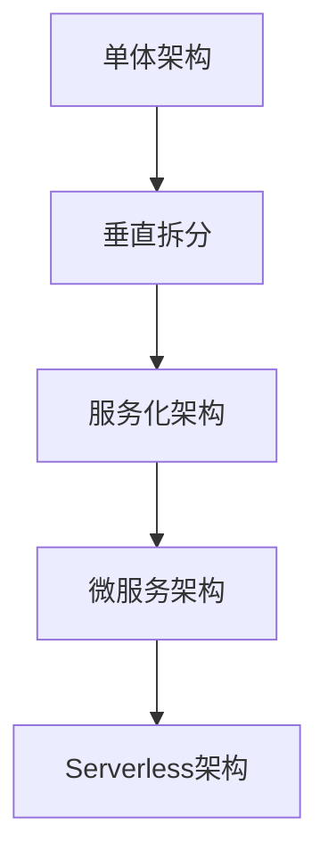
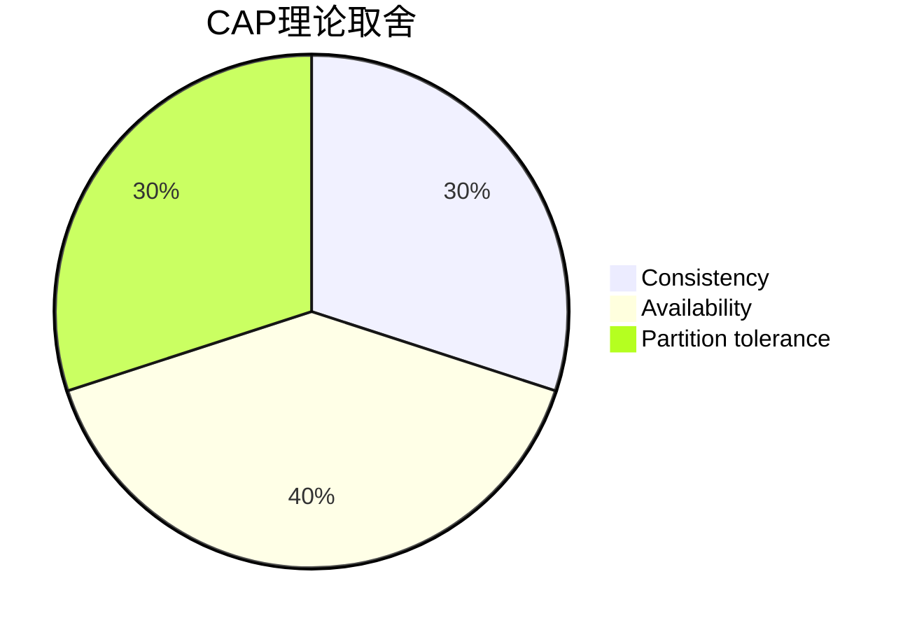
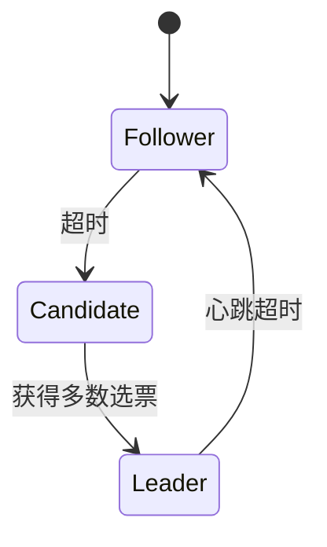
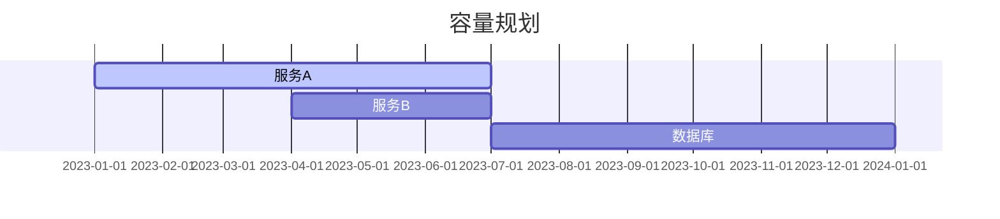
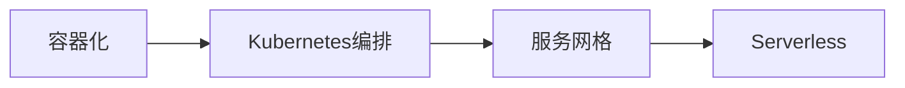

# 分布式系统架构核心原理与实战

## 一、分布式系统架构概述
### 1.1 定义与核心目标
分布式系统是由多台独立计算机组成的集合，这些计算机通过网络协同工作，对用户而言像单一系统。其核心目标是：
- **高可用性**：避免单点故障
- **可扩展性**：通过横向扩展提升性能
- **容错性**：容忍部分节点失效
- **高性能**：降低响应延迟

### 1.2 架构演进历程


## 二、核心组件与原理

### 2.1 服务治理

#### 2.1.1 服务注册中心

```java
// Eureka服务注册示例
@SpringBootApplication
@EnableEurekaClient
public class ServiceApplication {
    public static void main(String[] args) {
        SpringApplication.run(ServiceApplication.class, args);
    }
}
```

#### 2.1.2 负载均衡

```java
// Ribbon负载均衡配置
@Configuration
public class RibbonConfig {
    @Bean
    public IRule ribbonRule() {
        // 使用加权轮询算法
        return new WeightedResponseTimeRule();
    }
}
```

### 2.2 分布式通信

#### 2.2.1 RPC框架

```java
// Dubbo服务接口定义
@DubboService(version = "1.0.0")
public interface UserService {
    User getUserById(Long id); // 远程调用方法
}

// 客户端调用
@DubboReference(version = "1.0.0")
private UserService userService;
```

#### 2.2.2 消息队列

```java
// RabbitMQ消息生产者
@Bean
public RabbitTemplate rabbitTemplate(ConnectionFactory connectionFactory) {
    RabbitTemplate template = new RabbitTemplate(connectionFactory);
    template.setExchange("order_exchange");
    return template;
}

// 发送消息
rabbitTemplate.convertAndSend("order_queue", order);
```

### 2.3 数据存储

#### 2.3.1 分布式数据库

```java
// ShardingSphere分库分表示例
@Configuration
public class ShardingConfig {
    @Bean
    public DataSource dataSource() {
        ShardingRuleConfiguration shardingRuleConfig = new ShardingRuleConfiguration();
        shardingRuleConfig.getTableRuleConfigs().add(getOrderTableRuleConfig());
        return ShardingDataSourceFactory.createDataSource(shardingRuleConfig);
    }
}
```

#### 2.3.2 缓存体系

```java
// Redis集群配置
@Configuration
public class RedisConfig {
    @Bean
    public RedisClusterConfiguration clusterConfig() {
        RedisClusterConfiguration config = new RedisClusterConfiguration();
        config.setClusterNodes(Arrays.asList(
            new RedisNode("192.168.1.1", 6379),
            new RedisNode("192.168.1.2", 6379)
        ));
        return config;
    }
}
```

## 三、关键设计原则

### 3.1 CAP理论



### 3.2 BASE理论

- **基本可用**：允许部分功能失效
- **软状态**：允许短暂数据不一致
- **最终一致性**：最终达到数据一致

## 四、经典案例解析

### 4.1 Google File System (GFS)

#### 4.1.1 架构特点

- 单一Master节点
- Chunk Server存储数据块
- 数据块冗余复制

#### 4.1.2 关键机制

```python
# 简化版数据写入流程
def write_data(chunk_id, data):
    # 1. 向Master请求chunk位置
    locations = master.get_chunk_locations(chunk_id)
    # 2. 采用链式写入
    for location in locations:
        write_to_chunk_server(location, data)
```

### 4.2 Raft一致性算法

#### 4.2.1 角色选举



#### 4.2.2 日志复制

```java
// 简化版日志追加
public void appendEntries(int prevLogIndex, int prevLogTerm, List<Entry> entries) {
    if (log.get(prevLogIndex).getTerm() != prevLogTerm) {
        return false; // 日志不一致
    }
    log.addAll(entries);
    return true;
}
```

## 五、工程实践指南

### 5.1 容量规划



### 5.2 性能优化方案

```yaml
# JVM调优参数
-XX:MetaspaceSize=256m
-XX:MaxMetaspaceSize=512m
-XX:+UseG1GC
-XX:MaxGCPauseMillis=200
```

## 六、未来演进趋势

### 6.1 云原生架构



### 6.2 边缘计算

```java
// 边缘节点数据处理
public class EdgeNode {
    public void processData(Data data) {
        if (networkAvailable()) {
            sendDataToCloud(data);
        } else {
            cacheDataLocally(data);
        }
    }
}
```

## 七、知识体系脑图

```mermaid
graph TD
    A[分布式系统] --> B[架构设计]
    A --> C[核心技术]
    A --> D[工程实践]
    B --> E[服务治理]
    B --> F[通信协议]
    C --> G[一致性算法]
    C --> H[存储模型]
    D -->
```