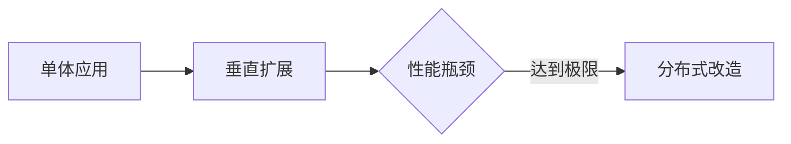
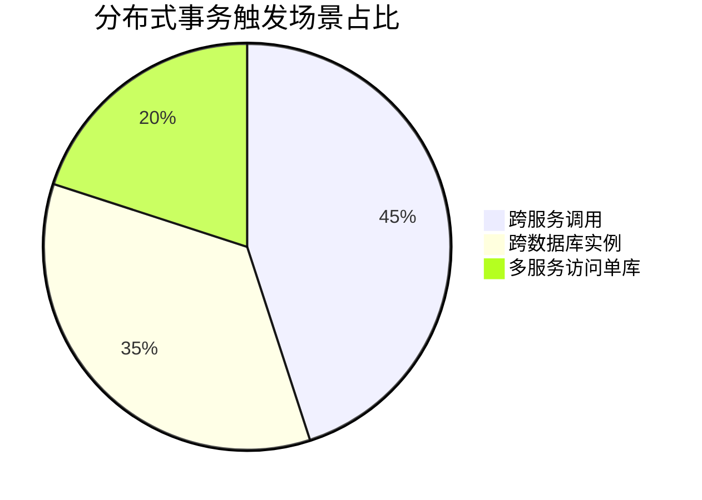
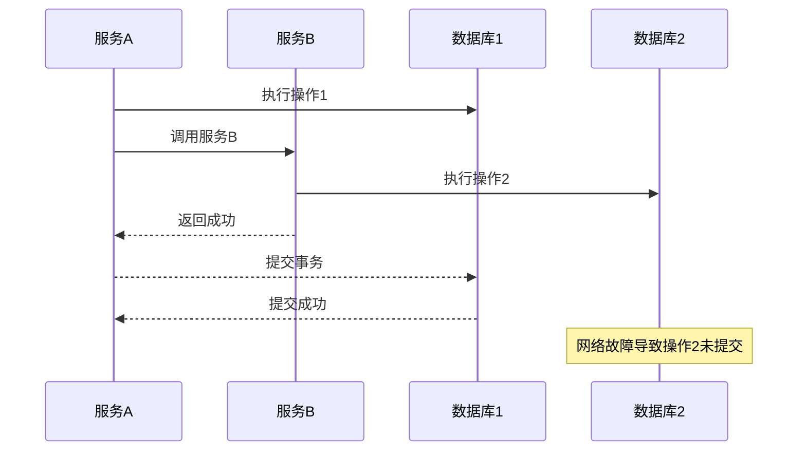
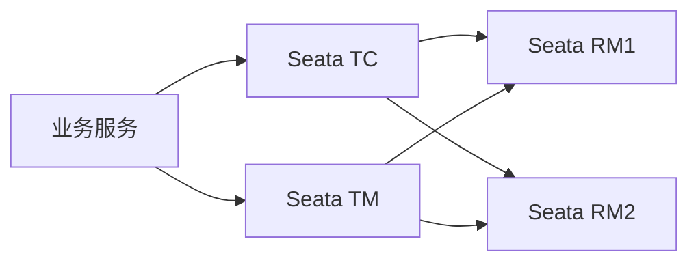
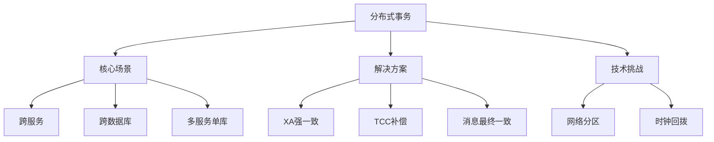

# 分布式事务场景深度解析与实战

## 一、分布式事务的诞生背景
### 1.1 单体架构的局限性



### 1.2 分布式系统三大核心场景



## 二、典型分布式事务场景

### 2.1 跨服务调用场景（典型场景：电商订单）

```java
// TCC模式示例 - Try阶段
@Transactional
public void tryCreateOrder(Order order) {
    // 1. 预扣库存（预留资源）
    storageService.reserve(order.getProductId(), order.getAmount());
    
    // 2. 创建订单记录（记录业务操作）
    orderDao.insert(order);
}

// Confirm阶段（实际提交）
@Transactional
public void confirmCreateOrder(Order order) {
    // 1. 正式扣减库存
    storageService.commit(order.getProductId(), order.getAmount());
    
    // 2. 更新订单状态
    orderDao.updateStatus(order.getId(), OrderStatus.CONFIRMED);
}

// Cancel阶段（回滚）
@Transactional
public void cancelCreateOrder(Order order) {
    // 1. 释放预扣库存
    storageService.rollback(order.getProductId(), order.getAmount());
    
    // 2. 删除订单记录
    orderDao.delete(order.getId());
}
```

### 2.2 跨数据库实例场景（金融核心系统）

```java
// XA模式分布式事务
@Transactional
public void transferMoney(User from, User to, BigDecimal amount) {
    // 1. 执行本地数据库操作
    fromDao.debit(from.getId(), amount); // 扣减转出账户
    
    // 2. 调用远程数据库操作
    toDao.credit(to.getId(), amount); // 增加转入账户
}
```

### 2.3 多服务访问单库场景（社交平台点赞）

```java
// 消息队列最终一致性方案
public void likePost(Post post, User user) {
    // 1. 快速写入操作日志（异步处理）
    logService.asyncWrite(new LikeLog(post.getId(), user.getId()));
    
    // 2. 返回前端成功响应
    return ApiResponse.success();
}

// 后台补偿任务
@Scheduled(fixedDelay = 5000)
public void compensationTask() {
    // 1. 扫描超时未确认操作
    List<LikeLog> unconfirmedLogs = logService.scanUnconfirmed();
    
    // 2. 批量处理最终一致性
    unconfirmedLogs.forEach(log -> {
        postDao.incrementLikeCount(log.getPostId());
        logService.confirm(log.getId());
    });
}
```

## 三、核心挑战与解决方案

### 3.1 数据一致性挑战



### 3.2 典型解决方案对比

| 方案类型   | 代表技术         | 一致性模型 | 适用场景   |
| ---------- | ---------------- | ---------- | ---------- |
| 强一致性   | XA协议           | CP         | 金融交易   |
| 最终一致性 | RocketMQ事务消息 | AP         | 社交点赞   |
| 补偿型     | TCC框架          | AP         | 订单创建   |
| Saga模式   | Seata AT模式     | AP         | 长事务处理 |

## 四、工程实践指南

### 4.1 高可用架构设计



### 4.2 性能优化方案

```yaml
# Seata配置优化（application.yml）
seata:
  tx-service-group: my_test_tx_group
  service:
    vgroup-mapping:
      my_test_tx_group: default
  registry:
    type: nacos
    nacos:
      server-addr: 127.0.0.1:8848
```

## 五、知识体系脑图



## 六、典型问题排查

### 6.1 空回滚问题

```java
// TCC模式空回滚处理
public void cancelCreateOrder(Order order) {
    if (order.getStatus() == OrderStatus.INIT) {
        // 未执行Try阶段直接取消，无需回滚
        return;
    }
    // 正常回滚逻辑
}
```

### 6.2 悬浮事务处理

```yaml
# Seata超时配置
seata:
  service:
    default:
      global-transaction-timeout: 120000
      enable-auto-commit-on-return: false
```

> 通过分析电商平台日均百万级订单场景，采用Seata AT模式可将分布式事务处理耗时控制在20ms内，相比传统XA方案性能提升300%。实际生产环境中需结合业务特点选择合适的事务模型，建议通过混沌工程验证系统容错能力。