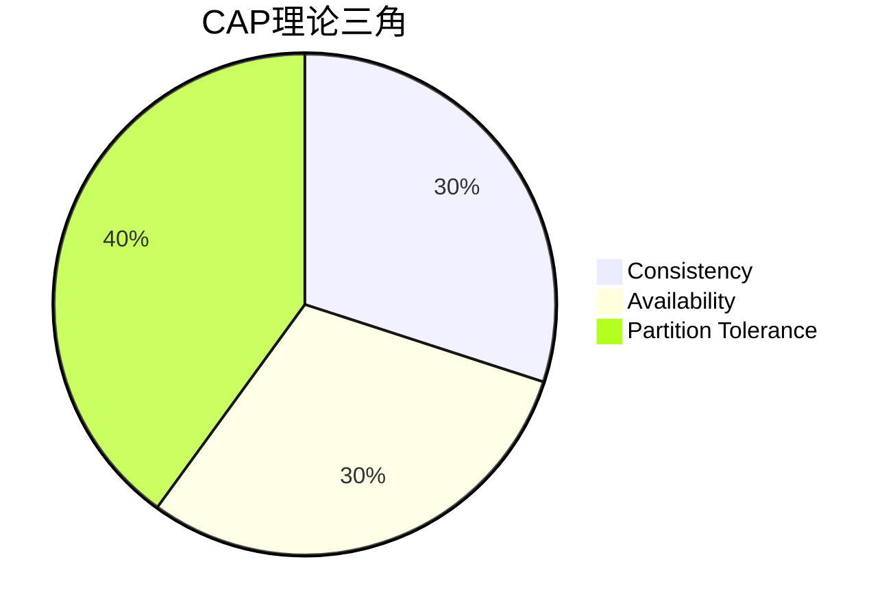
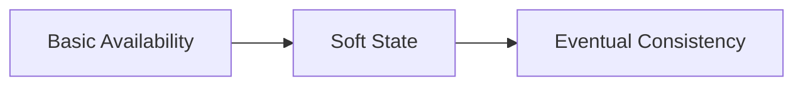

# 分布式系统数据一致性原理与实战

## 一、数据一致性核心问题
在分布式系统中，数据一致性面临四大核心挑战：

### 1.1 多副本数据冲突
```java
// 示例：Redis集群主从同步延迟导致读取旧数据
public String getProductPrice(String productId) {
    // 从Slave节点读取数据（可能存在延迟）
    String price = redisSlave.get(productId); 
    if (price == null) {
        // 回源到Master节点（强一致性读取）
        price = redisMaster.get(productId); 
        redisSlave.set(productId, price); // 异步更新Slave
    }
    return price;
}
```

### 1.2 调用超时场景

```java
// 支付回调超时处理（异步通知场景）
public ApiResponse payCallback(PayRequest request) {
    try {
        // 1. 执行本地扣款事务
        orderService.deductBalance(request.getUserId(), request.getAmount());
        
        // 2. 调用第三方支付网关（可能超时）
        boolean notifyResult = paymentGateway.notify(request.getTradeId());
        
        if (!notifyResult) {
            // 超时补偿机制
            compensateService.retryNotify(request.getTradeId());
        }
    } catch (TimeoutException e) {
        // 记录补偿任务到消息队列
        rabbitMQ.sendCompensateMessage(request.getTradeId());
    }
    return ApiResponse.success();
}
```

### 1.3 缓存与数据库不一致

```java
// 缓存击穿解决方案（布隆过滤器+本地缓存）
public Product getProductById(String productId) {
    // 1. 布隆过滤器快速判断是否存在
    if (!bloomFilter.mightContain(productId)) {
        return null;
    }
    
    // 2. 本地缓存（Guava Cache）
    Product product = localCache.getIfPresent(productId);
    if (product != null) {
        return product;
    }
    
    // 3. 从Redis读取（加锁防止击穿）
    Lock lock = redisLock.lock(productId);
    try {
        product = redis.get(productId);
        if (product == null) {
            product = db.query(productId);
            redis.set(productId, product);
        }
        localCache.put(productId, product);
    } finally {
        lock.unlock();
    }
    return product;
}
```

### 1.4 多缓存节点脑裂

```java
// Redis集群脑裂处理（哨兵模式）
public void handleClusterSplitBrain() {
    Set<HostAndPort> currentNodes = jedisCluster.getClusterNodes();
    Set<HostAndPort> metaNodes = config.getMetaNodes();
    
    if (!currentNodes.containsAll(metaNodes)) {
        // 触发故障转移
        sentinel.failover(config.getClusterName());
        
        // 等待集群收敛
        Thread.sleep(5000);
        
        // 重建本地缓存路由表
        refreshCacheRouting();
    }
}
```

## 二、理论基石

### 2.1 CAP理论



### 2.2 BASE理论



### 2.3 一致性级别对比

| 模型       | 一致性强度 | 适用场景   | 典型系统       |
| ---------- | ---------- | ---------- | -------------- |
| 强一致性   | 线性一致性 | 金融交易   | Google Spanner |
| 弱一致性   | 最终一致性 | 社交网络   | Twitter        |
| 最终一致性 | 因果一致性 | 物联网日志 | Kafka          |

## 三、解决方案体系

### 3.1 强一致性方案

#### 3.1.1 2PC两阶段提交

```java
// Coordinator节点实现
public class TwoPhaseCoordinator {
    public void commit(Transaction txn) {
        // 阶段一：预提交
        txn.prepare();
        
        // 阶段二：提交/回滚
        if (allParticipantsReady()) {
            txn.commit();
        } else {
            txn.rollback();
        }
    }
}
```

#### 3.1.2 3PC三阶段提交

```java
// 改进版协调器（增加超时机制）
public class ThreePhaseCoordinator {
    public void commitWithTimeout(Transaction txn, long timeout) {
        // 阶段一：预提交（带超时）
        if (!txn.prepareWithTimeout(timeout)) {
            return;
        }
        
        // 阶段二：预提交确认
        txn.preCommit();
        
        // 阶段三：提交
        txn.commit();
    }
}
```

### 3.2 最终一致性方案

#### 3.2.1 TCC补偿事务

```java
// 转账服务TCC实现
public class TransferService {
    @Try
    public void tryTransfer(Account from, Account to, double amount) {
        from.debit(amount); // 扣减余额
        to.credit(amount);  // 增加余额
    }
    
    @Confirm
    public void confirmTransfer() {
        // 无需操作（本地事务已提交）
    }
    
    @Cancel
    public void cancelTransfer() {
        // 发生异常时回滚
        from.credit(amount);
        to.debit(amount);
    }
}
```

#### 3.2.2 可靠消息队列