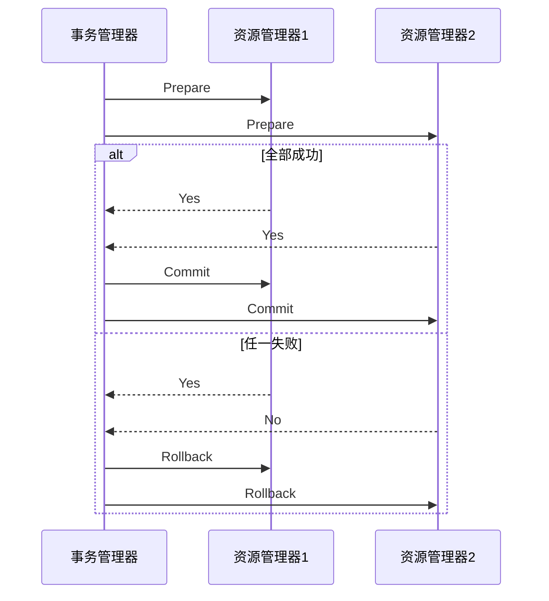
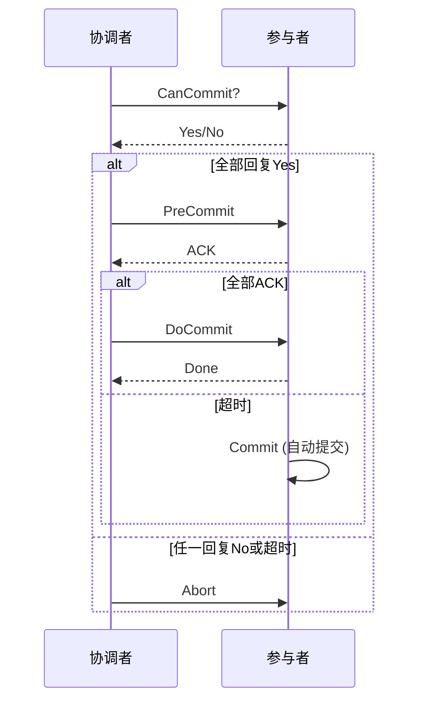

# CAP理论与强一致性分布式事务解决方案

## 一、核心概念与理论基础

### 1.1 分布式事务定义

分布式事务指跨越多个数据库或服务的事务操作，需满足ACID特性：
- **Atomicity（原子性）**：所有操作要么全部成功，要么全部失败
- **Consistency（一致性）**：事务前后数据保持有效状态
- **Isolation（隔离性）**：并发操作互不干扰
- **Durability（持久性）**：提交后操作永久保存

### 1.2 CAP理论与强一致性

根据CAP理论：
- **C（一致性）**：所有节点访问同一份最新数据
- **A（可用性）**：每个请求都能收到非错响应
- **P（分区容错性）**：容忍网络分区

强一致性事务优先保证C特性，通过同步协调机制实现数据实时一致。

## 二、DTP分布式事务模型

### 2.1 模型组成

```mermaid
graph TD
    A[应用程序(AP)] --> B[事务管理器(TM)]
    A --> C[资源管理器(RM)]
    B --> C
    C --> D[数据库/消息队列]
```

**组件作用**:
- **AP**: 发起/控制全局事务的应用程序
- **TM**: 协调全局事务的提交与回滚
- **RM**: 管理具体资源的执行单元
- **XA接口**: TM与RM之间的标准化通信协议

### 2.2 执行流程

1. **全局事务注册**：AP向TM注册全局事务
2. **分支事务创建**：TM为每个RM创建分支事务
3. **事务提交/回滚**：TM根据执行结果协调最终状态

## 三、2PC两阶段提交协议

### 3.1 执行流程



### 3.2 实现机制

- **第一阶段（准备阶段）**：
  - TM向所有RM发送prepare请求
  - RM执行事务但不提交，写入redo/undo日志
  - RM回复准备结果（成功/失败）

- **第二阶段（提交阶段）**：
  - 全部准备成功时，TM发送commit请求
  - 任一准备��败时，TM发送rollback请求
  - RM根据指令完成最终提交或回滚

### 3.3 优缺点分析

**优点**：
- 强一致性保证，满足ACID特性
- 实现相对简单，被广泛支持

**缺点**：
- 性能开销大（两轮网络通信）
- 资源长时间锁定
- 协调者单点问题
- 阻塞风险（参与者等待协调者决定）

## 四、3PC三阶段提交协议

### 4.1 解决的问题

3PC通过增加超时机制和CanCommit阶段，解决2PC中的阻塞问题。

### 4.2 执行流程



### 4.3 优缺点分析

**优点**：
- 降低阻塞风险
- 引入超时机制提高可用性

**缺点**：
- 通信开销更大
- 一致性保证弱于2PC
- 网络分区时可能导致数据不一致

## 五、企业级解决方案对比

| 方案名称 | 一致性 | 可用性 | 性能 | 侵入性 | 应用场景 |
|---------|-------|-------|-----|-------|---------|
| MySQL XA | 强一致 | 中 | 较低 | 低 | 单体应用多数据源 |
| Seata AT | 强一致 | 高 | 中 | 低 | 微服务架构 |
| 分布式数据库 | 强一致 | 高 | 高 | 低 | 云原生应用 |

## 总结

强一致性分布式事务方案通过牺牲一定性能和可用性，��现了数据的严格一致。2PC和3PC是实现强一致性的基础理论，而在实际应用中需要根据业务场景选择合适的解决方案，在CAP三者之间找到平衡点。
