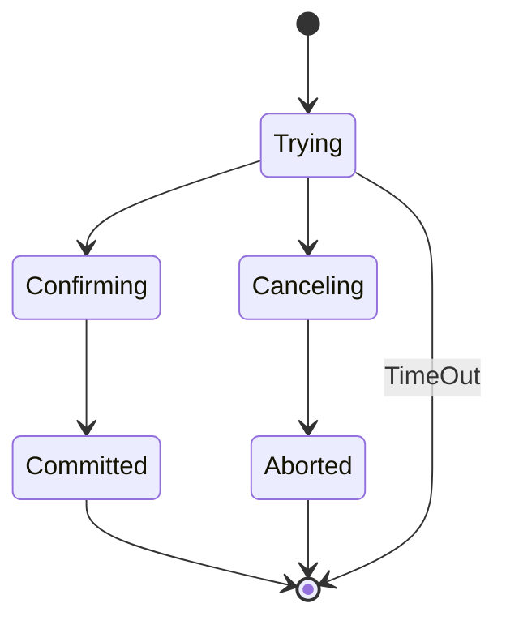

# 最终一致性分布式事务深度解析与实战

## 一、核心原理与设计哲学
### 1.1 最终一致性核心要素
- **​异步化处理​**​：允许短暂不一致窗口期（通常秒级）
- **​补偿机制​**​：通过反向操作达成最终一致
- **​中间状态容忍​**​：允许事务执行过程中存在中间态
- **​去中心化协调​**​：摒弃传统事务管理器，采用事件驱动架构

### 1.2 分布式事务状态机

二、典型服务模式实现
2.1 可查询操作模式
// 业务服务接口定义
public interface QueryableService {
    // 通过业务ID查询操作状态（必须保证幂等性）
    @GetMapping("/status/{bizId}")
    TransactionStatus queryStatus(@PathVariable String bizId);
}

// 实现类需保证查询接口幂等性
@Service
public class OrderQueryServiceImpl implements QueryableService {
    @Autowired
    private OrderStatusDao statusDao;

    @Override
    public TransactionStatus queryStatus(String bizId) {
        // 从数据库查询最新状态（使用乐观锁防止并发冲突）
        return statusDao.findLatestStatusWithVersion(bizId);
    }
}

2.2 幂等操作模式
// 支付服务幂等性校验（基于Redis实现）
@Component
public class PaymentIdempotentService {
    private final RedisTemplate<String, Boolean> redisTemplate;

    public boolean makePayment(PaymentRequest request) {
        String key = "payment:req:" + request.getRequestId();
        // SETNX操作实现原子性去重
        return redisTemplate.opsForValue().setIfAbsent(key, true, 24, TimeUnit.HOURS);
    }
}

2.3 TCC操作模式
// TCC事务框架核心接口
public interface TccTransaction<T> {
    // 尝试执行阶段（预留资源）
    boolean tryOperation(T context);
    
    // 确认执行阶段（实际执行）
    void confirmOperation(T context);
    
    // 取消执行阶段（资源回滚）
    void cancelOperation(T context);
}

// 库存服务TCC实现
@Service
public class InventoryTccService implements TccTransaction<InventoryContext> {
    @Override
    public boolean tryOperation(InventoryContext context) {
        // 预占库存（不扣减，仅标记）
        return inventoryDao.reserve(context.getProductId(), context.getAmount());
    }

    @Override
    public void confirmOperation(InventoryContext context) {
        // 实际扣减库存
        inventoryDao.deduct(context.getProductId(), context.getAmount());
    }
    
    @Override
    public void cancelOperation(InventoryContext context) {
        // 释放预占库存
        inventoryDao.release(context.getProductId(), context.getAmount());
    }
}

2.4 可补偿操作模式
// 补偿事务管理器
public class CompensationManager {
    private final Map<String, CompensationHandler> handlerMap = new ConcurrentHashMap<>();

    public void registerHandler(String opType, CompensationHandler handler) {
        handlerMap.put(opType, handler);
    }
    
    public void executeCompensation(String opType, String bizId) {
        CompensationHandler handler = handlerMap.get(opType);
        if (handler != null) {
            handler.compensate(bizId);
        }
    }
}

// 订单服务补偿实现
@Component
public class OrderCancelCompensation implements CompensationHandler {
    @Autowired
    private OrderService orderService;

    @Override
    public void compensate(String orderId) {
        // 执行订单取消逻辑（包含幂等性校验）
        orderService.cancelWithCheck(orderId);
    }
}

三、可靠消息解决方案
3.1 本地消息表方案
-- 消息记录表结构（支持事务回滚）
CREATE TABLE local_message (
    message_id VARCHAR(64) PRIMARY KEY,
    biz_id VARCHAR(64) NOT NULL,
    content TEXT,
    status VARCHAR(20) CHECK(status IN ('PENDING', 'DELIVERED', 'CONFIRMED')),
    created_time DATETIME,
    updated_time DATETIME,
    FOREIGN KEY (biz_id) REFERENCES business_order(order_id) ON DELETE CASCADE
) ENGINE=InnoDB;

3.2 消息队列中间件方案
// 消息生产者实现（使用RocketMQ事务消息）
@Component
public class OrderProducer {
    @Autowired
    private RocketMQTemplate rocketMQTemplate;

    @Transactional
    public void sendOrderMessage(Order order) {
        // 1. 发送半消息
        Message msg = MessageBuilder.withPayload(order).build();
        SendResult sendResult = rocketMQTemplate.sendMessageInTransaction(
            "order_topic", msg, order);
    
        // 2. 记录本地消息
        if (sendResult.getLocalTransactionState() == LocalTransactionState.COMMIT_MESSAGE) {
            localMessageDao.insert(order.getId(), order.toJson());
        }
    }
}

// 消息消费者实现（支持消息重试）
@Component
public class OrderConsumer {
    @Autowired
    private OrderService orderService;
    
    @RocketMQMessageListener(topic = "order_topic", consumerGroup = "order_group")
    public void handleOrderMessage(MessageExt message) {
        try {
            // 1. 执行业务操作
            Order order = JSON.parseObject(new String(message.getBody()), Order.class);
            orderService.processOrder(order);
            
            // 2. 提交消息消费
            RocketMQTemplate.sendMessage("ack_topic", "ACK:" + message.getMessageId());
        } catch (Exception e) {
            // 3. 消息重试机制
            throw new RuntimeException("处理失败", e);
        }
    }
}

四、核心原理分析
4.1 CAP理论与最终一致性
• ​​C (Consistency)​​：强一致性要求所有节点实时同步
• ​​A (Availability)​​：最终一致性允许短暂不一致
• ​​P (Partition tolerance)​​：分布式系统必须容忍网络分区
4.2 BASE理论详解
• ​​基本可用​​：允许损失部分可用性（如部分功能降级）
• ​​柔性状态​​：允许系统存在中间状态（如支付中状态）
• ​​最终一致性​​：系统在

