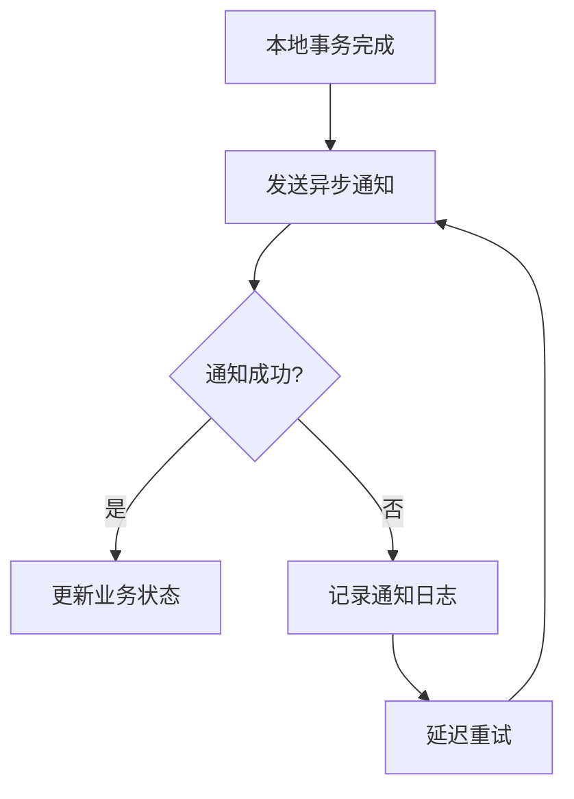

# 最大努力通知型分布式事务解决方案

## 一、方案原理与核心要素

最大努力通知型方案通过​**​异步消息通知​**​实现最终一致性，核心思想是：

1. ​**​服务提供方​**​完成本地事务后立即发送通知

2. ​**​服务消费方​**​通过轮询/回调等方式确认处理结果

3. ​**​失败重试机制​**​保障消息最终送达

4. ​**​补偿机制​**​处理极端异常场景




二、关键实现组件

1. 消息生产者（NotifyProducer）

```java

// 使用RocketMQ实现消息发送
@Component
public class NotifyProducer {

    @Autowired
    private RocketMQTemplate rocketMQTemplate;

    // 发送支付成功通知
    @Transactional
    public void sendPaymentNotify(PaymentEvent event) {
        // 消息序列化
        String messageBody = JSON.toJSONString(event);

        // 设置消息重试策略（最多3次）
        Message msg = MessageBuilder
                .withPayload(messageBody)
                .setHeader(RocketMQHeaders.RETRY_TIMES, 3)
                .build();

        // 发送同步消息并获取结果
        SendResult sendResult = rocketMQTemplate.syncSend(
                "PAYMENT_NOTIFY_TOPIC",
                msg,
                5000L // 5秒超时
        );

        // 记录发送状态
        if (sendResult.getSendStatus() != SendStatus.SEND_OK) {
            throw new NotifyException("消息发送失败");
        }
    }
}

```

2. 消息消费者（NotifyConsumer）

```java
// 消费支付通知消息
@RocketMQMessageListener(
        topic = "PAYMENT_NOTIFY_TOPIC",
        consumerGroup = "ORDER_GROUP"
)
@Component
public class NotifyConsumer implements RocketMQListener<PaymentEvent> {

    @Autowired
    private OrderService orderService;

    @Override
    public void onMessage(PaymentEvent event) {
        try {
            // 业务处理（幂等性校验）
            if (orderService.isProcessed(event.getOrderId())) {
                return;
            }

            // 执行业务逻辑
            orderService.updateOrderStatus(event.getOrderId(), "PAID");

            // 更新通知状态
            notifyLogService.updateStatus(
                    event.getLogId(),
                    NotifyStatus.SUCCESS
            );
        } catch (Exception e) {
            // 记录异常日志
            notifyLogService.updateStatus(
                    event.getLogId(),
                    NotifyStatus.FAILURE
            );

            // 触发补偿机制
            compensateService.handleCompensation(event);
        }
    }
}

```

三、实现要点详解

1. 消息可靠性保障
   • ​​消息持久化​​：存储到Broker磁盘（RocketMQ默认）
   • ​​ACK确认机制​​：消费者显式确认消息处理
   • ​​重试策略​​：指数退避重试（初始间隔1s→2s→4s）
2. 幂等性设计

-- 业务表增加唯一索引

```
CREATE UNIQUE INDEX idx_biz_id ON order_table(biz_id);

```

-- 幂等表结构

```
CREATE TABLE notify_log (
    id BIGINT PRIMARY KEY AUTO_INCREMENT,
    biz_id VARCHAR(64) NOT NULL UNIQUE, -- 业务唯一标识
    status VARCHAR(20) NOT NULL,
    created_time DATETIME
);

```

3. 补偿机制实现

```
@Service
public class CompensateService {
    
    // 最大重试次数
    private static final int MAX_RETRY = 3;
    
    @Transactional
    public void handleCompensation(PaymentEvent event) {
        int retryCount = 0;
        boolean success = false;
        
        while (retryCount < MAX_RETRY) {
            try {
                // 重新执行业务逻辑
                orderService.updateOrderStatus(event.getOrderId(), "PAID");
                success = true;
                break;
            } catch (Exception e) {
                retryCount++;
                log.error("补偿重试失败, 第{}次", retryCount, e);
            }
        }
        
        if (!success) {
            // 触发人工干预
            alarmService.sendAlert("支付通知补偿失败");
        }
    }
}

```

四、方案对比与适用场景
特性最大努力通知型TCC型可靠消息型
​​一致性保障​​最终一致性强一致性最终一致性
​​实时性​​低（异步处理）高（同步处理）中（消息延迟）
​​实现复杂度​​低高中
​​适用场景​​支付回调、状态通知金融交易、库存扣减异步任务处理
五、典型应用场景

1. ​​支付系统回调​​：支付宝/微信支付结果通知
2. ​​订单状态更新​​：物流状态同步
3. ​​系统间异步解耦​​：核心系统与外围系统交互
   通过引入消息中间件和补偿机制，最大努力通知型方案在保证基础一致性的同时，显著提升了系统吞吐量和容错能力，是高并发场景下的理想选择。