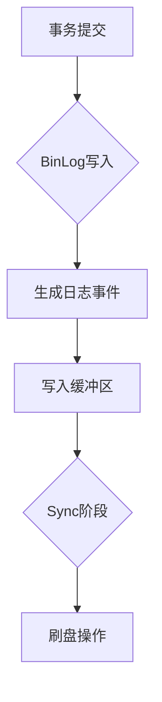
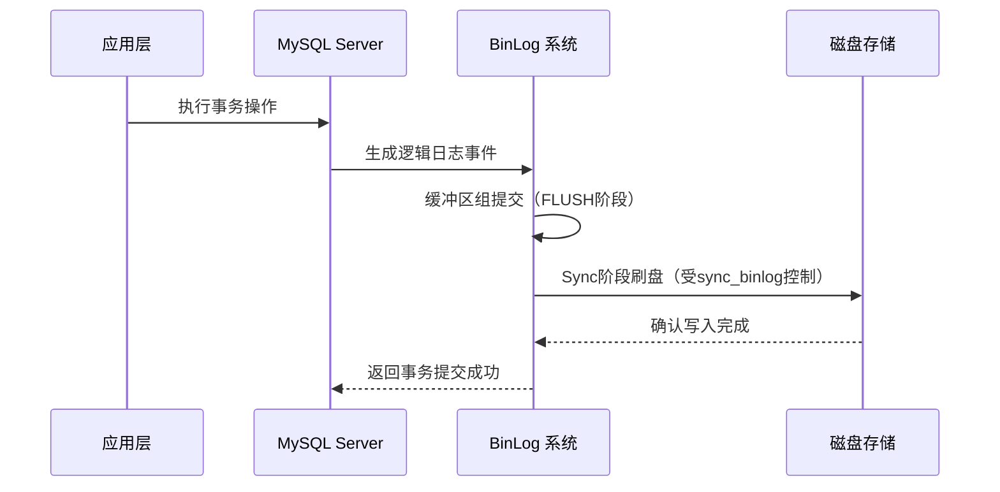
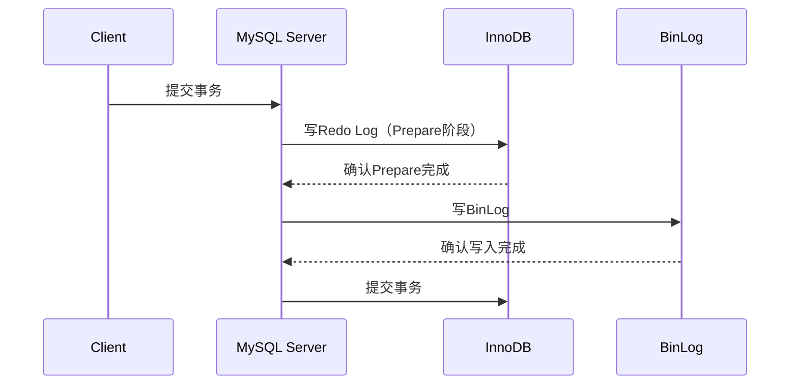

# 深入理解MySQL BinLog：原理、机制与实战

## 一、BinLog核心概念
BinLog（Binary Log）是MySQL数据库的核心日志系统，用于记录所有改变数据库结构的DDL操作（如CREATE TABLE）和数据变更的DML操作（如INSERT/UPDATE/DELETE）。其核心特性包括：

1. **日志格式**：以二进制形式存储，包含事件头（Event Header）和事件体（Event Body）

2. **记录范围**：不记录SELECT/SHOW等查询操作，仅记录数据变更操作

3. **追加写入**：采用追加模式写入日志文件，不会覆盖已有数据

4. **事务完整性**：每个事务的BinLog在提交时一次性完整写入




## 二、BinLog记录模式详解

MySQL支持三种BinLog记录模式，每种模式适用于不同场景：

### 日志事件分类

| 事件类型    | 作用                                 | 示例场景            |
| ----------- | ------------------------------------ | ------------------- |
| Query Event | 记录 SQL 语句                        | `CREATE TABLE` 操作 |
| Row Event   | 记录行级变更（INSERT/UPDATE/DELETE） | 用户数据修改        |
| Xid Event   | 标记事务提交                         | 事务结束标记        |

### BinLog 写入机制深度解析



### 1. Row模式（行级记录）


```sql
-- 配置示例
SET binlog_format = 'ROW';
// Java中解析Row模式BinLog示例
public class RowEventParser {
    public void parseRowEvent(BinaryLogClient client) {
        client.registerEventListener(event -> {
            if (event instanceof WriteRowsEventData) {
                WriteRowsEventData data = (WriteRowsEventData) event;
                System.out.println("新增数据: " + data.getRows());
            } else if (event instanceof UpdateRowsEventData) {
                UpdateRowsEventData data = (UpdateRowsEventData) event;
                System.out.println("更新数据: " + data.getRows());
            }
        });
    }
}
```

**特点**：

- 记录每行数据的变更细节
- 主从复制最安全，但日志体积较大
- 适合数据一致性要求高的场景

### 2. Statement模式（语句级记录）

```sql
-- 配置示例
SET binlog_format = 'STATEMENT';
// 模拟Statement模式操作
public class StatementSimulator {
    public static void main(String[] args) {
        String sql = "UPDATE users SET balance = balance - 100 WHERE id = 1";
        executeStatement(sql);
    }
    
    private static void executeStatement(String sql) {
        // 执行SQL并记录到BinLog
    }
}
```

**特点**：

- 记录原始SQL语句
- 日志体积小，但可能引发主从不一致
- 遇到非确定性函数（如NOW()）时需谨慎

### 3. Mixed模式（混合模式）

```sql
-- 自动切换模式
SET binlog_format = 'MIXED';
// 混合模式处理示例
public class MixedModeHandler {
    public void handleEvent(BinLogEvent event) {
        if (event.requiresRowBasedLogging()) {
            // 处理行级事件
        } else {
            // 处理语句级事件
        }
    }
}
```

**特点**：

- 自动选择最优记录模式
- 兼顾性能与数据一致性
- 需要MySQL 5.1+版本支持

## 三、BinLog写入机制深度解析

### 1. 两阶段提交流程



### 2. 组提交优化

```java
// 模拟组提交机制
public class GroupCommitSimulator {
    private List<Transaction> buffer = new ArrayList<>();
    
    public void addTransaction(Transaction tx) {
        buffer.add(tx);
        if (buffer.size() >= config.getSyncBinlog()) {
            flushToDisk();
        }
    }
    
    private void flushToDisk() {
        // 批量刷盘操作
        buffer.clear();
    }
}
```

**关键参数**：

- `sync_binlog=1`：每次提交都刷盘（最安全但性能最低）
- `sync_binlog=100`：累积100次提交后刷盘（推荐生产环境值）

## 四、BinLog与Redo Log对比

| 特性         | BinLog           | Redo Log         |
| ------------ | ---------------- | ---------------- |
| **所属组件** | MySQL Server层   | InnoDB存储引擎   |
| **记录内容** | 逻辑操作日志     | 物理页修改记录   |
| **恢复能力** | 支持时间点恢复   | 支持崩溃恢复     |
| **复制用途** | 主从复制核心机制 | 无直接关联       |
| **写入顺序** | 先于Redo Log写入 | 在事务提交前写入 |

## 五、关键参数配置指南

```sql
-- 查看BinLog配置
SHOW VARIABLES LIKE 'log_bin%';
SHOW VARIABLES LIKE 'binlog%';
```

| 参数名              | 默认值 | 作用说明             |
| ------------------- | ------ | -------------------- |
| `log_bin`           | OFF    | 启用BinLog           |
| `max_binlog_size`   | 1G     | 单个BinLog文件最大值 |
| `sync_binlog`       | 1      | 刷盘策略控制         |
| `binlog_cache_size` | 32K    | 事务缓存大小         |
| `expire_logs_days`  | 10     | 自动清理过期日志天数 |

## 六、实战案例：主从复制配置

### 1. 主库配置（my.cnf）

```ini
[mysqld]
log_bin = mysql-bin
server-id = 1
binlog-do-db = ecommerce
binlog-ignore-db = mysql
```