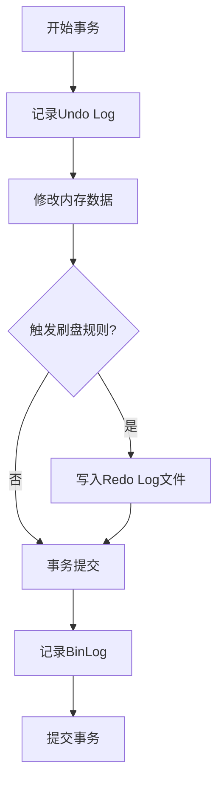
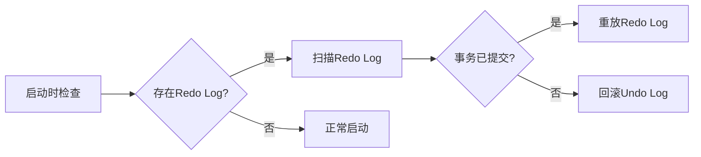
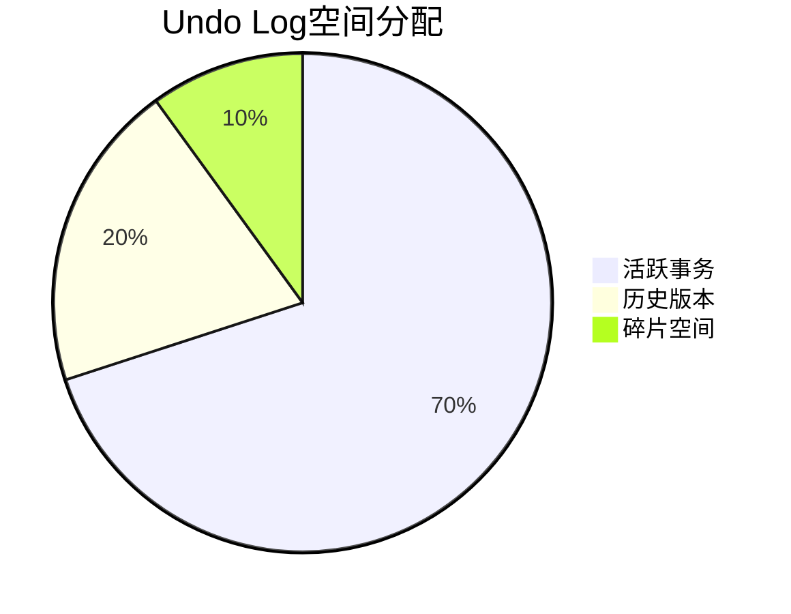
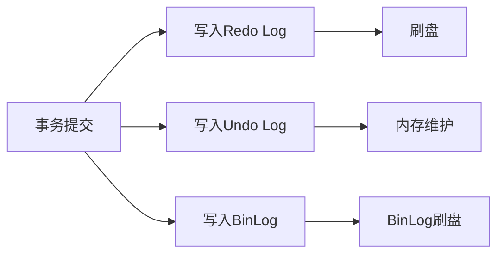

# MySQL事务流程深度解析：从执行到恢复的全链路原理与实战

## 一、事务执行流程详解
### 1.1 核心原理
MySQL事务通过**Redo Log**和**Undo Log**实现ACID特性：
- **Redo Log**：保证事务持久性，记录数据页修改操作
- **Undo Log**：支持事务回滚，维护数据一致性
- **BinLog**：用于主从复制，记录逻辑操作日志

### 1.2 执行流程图解


### 1.3 关键代码实现（Java）

```java
// JDBC事务管理示例
Connection conn = DriverManager.getConnection(url, user, password);
try {
    // 1. 开启事务（禁用自动提交）
    conn.setAutoCommit(false); // 🔑 核心步骤：开启事务边界
    
    // 2. 执行业务操作
    Statement stmt = conn.createStatement();
    stmt.executeUpdate("UPDATE account SET balance = balance - 100 WHERE id=1"); // 转出操作
    stmt.executeUpdate("UPDATE account SET balance = balance + 100 WHERE id=2"); // 转入操作
    
    // 3. 生成并写入Redo Log
    // InnoDB引擎自动完成，对应Undo Log记录原始数据
    
    // 4. 事务提交
    conn.commit(); // 🔒 提交时触发Redo Log刷盘
} catch (SQLException e) {
    // 5. 事务回滚
    conn.rollback(); // 🔄 通过Undo Log恢复数据
} finally {
    conn.close();
}
```

## 二、事务恢复流程原理

### 2.1 崩溃恢复机制



### 2.2 恢复流程代码模拟

```java
// 模拟崩溃恢复逻辑
public void recover() {
    if (existsRedoLog()) {
        List<RedoLogEntry> logs = scanRedoLog();
        for (RedoLogEntry log : logs) {
            if (isCommitted(log)) {
                redo(log); // 重放已提交事务
            } else {
                undo(log); // 回滚未提交事务
            }
        }
    }
}
```

## 三、核心组件深度解析

### 3.1 Redo Log刷盘策略

| 参数                             | 默认值 | 作用           |
| -------------------------------- | ------ | -------------- |
| `innodb_flush_log_at_trx_commit` | 1      | 控制刷盘时机   |
| `innodb_log_buffer_size`         | 16M    | 日志缓冲区大小 |

### 3.2 Undo Log管理机制



## 四、生产环境优化实践

### 4.1 关键参数配置

```ini
# my.cnf优化示例
[mysqld]
innodb_log_file_size = 2G    # 增大Redo Log文件大小
innodb_flush_log_at_trx_commit = 2  # 提升写入性能
sync_binlog = 1000           # 组提交优化
binlog_format = ROW          # 支持行级复制
```

### 4.2 XA事务高级用法

```java
// 分布式XA事务示例
Xid xid = new MysqlXid("globalTxId".getBytes(), 1, 1);
try {
    conn.start(xid, XAResource.TMNOFLAGS);
    // 执行分支事务
    conn.commit(xid, false); // 两阶段提交
} catch (XAException e) {
    conn.rollback(xid); // 回滚全局事务
}
```

## 五、原理对比总结

| 特性             | Redo Log       | Undo Log           | BinLog             |
| ---------------- | -------------- | ------------------ | ------------------ |
| **写入时机**     | 事务提交时刷盘 | 随事务修改实时记录 | 事务提交时异步写入 |
| **作用对象**     | 物理数据页     | 逻辑操作记录       | 逻辑操作记录       |
| **故障恢复用途** | 恢复已提交事务 | 回滚未提交事务     | 主从数据同步       |
| **存储引擎依赖** | InnoDB         | InnoDB             | MySQL Server层     |

