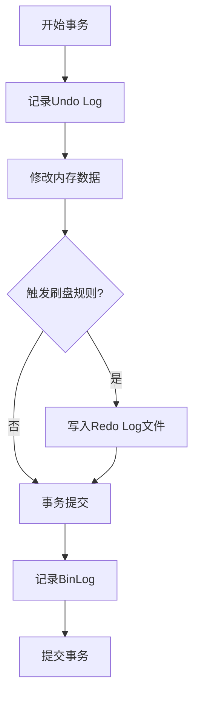

# MySQL事务流程深度解析：从执行到恢复的全链路原理与实战

## 一、事务执行流程详解

### 1.1 核心原理

MySQL事务通过**Redo Log**和**Undo Log**实现ACID特性：
- **Redo Log**：保证事务持久性，记录数据页修改操作
- **Undo Log**：支持事务回滚，维护数据一致性
- **BinLog**：用于主从复制，记录逻辑操作日志

### 1.2 执行流程图解



### 1.3 关键代码实现

```java
// JDBC事务管理示例
Connection conn = DriverManager.getConnection(url, user, password);
try {
    // 1. 开启事务（禁用自动提交）
    conn.setAutoCommit(false); // 🔑 核心步骤：开启事务边界
    
    // 2. 执行业务操作
    Statement stmt = conn.createStatement();
    stmt.executeUpdate("UPDATE account SET balance = balance - 100 WHERE id=1"); // 转出操作
    stmt.executeUpdate("UPDATE account SET balance = balance + 100 WHERE id=2"); // 转入操作
    
    // 3. 生成并写入Redo Log
    // InnoDB引擎自动完成，对应Undo Log记录原始数据
    
    // 4. 事务提交
    conn.commit(); // 🔒 提交时触发Redo Log刷盘
} catch (SQLException e) {
    // 5. 事务回滚
    conn.rollback(); // 🔄 通过Undo Log恢复数据
} finally {
    conn.close();
}
```

## 二、事务恢复流程原理

### 2.1 恢复过程

1. **崩溃恢复触发**：MySQL实例重启时自动检测未完成事务
2. **Redo Log重放**：按LSN顺序应用已持久化的Redo Log
3. **Undo Log回滚**：回滚未完成事务的修改操作
4. **BinLog截断**：清理未完成事务的BinLog记录

### 2.2 事务恢复的核心步骤

- **检查点恢复**：从最近的检查点开始重放Redo Log
- **前滚（Roll-forward）**：应用所有持久化的Redo Log修改
- **回滚（Roll-back）**：撤销未完成事务的所有修改

## 三、日志协调与一致性保证

### 3.1 两阶段提交（2PC）

MySQL通过两阶段提交协议保证BinLog与Redo Log一致性：

1. **准备阶段**：持久化Redo Log，获取LSN位置
2. **提交阶段**：写入BinLog，更新提交标记

### 3.2 组提交（Group Commit）

为优化性能，MySQL通过组提交机制批量处理事务：

- **多个事务**组合在一次IO操作中刷盘
- **提升吞吐量**，降低磁盘IO开销
- **避免随机IO**，优化写入性能

## 四、事务并发控制与隔离级别实现

### 4.1 隔离级别与锁策略

- **读未提交（Read Uncommitted）**：无锁，直接读取最新值
- **读已提交（Read Committed）**：基于行锁，每次查询创建快照
- **可重复读（Repeatable Read）**：基于MVCC，事务开始时创建快照
- **串行化（Serializable）**：使用共享锁和排他锁，完全隔离

### 4.2 行锁实现

InnoDB行锁基于索引实现，通过记录锁、间隙锁和Next-Key锁组合保证事务隔离。

## 总结

MySQL事务通过精心设计的多层日志机制和锁策略，平衡了一致性保证和高性能目标。Redo Log、Undo Log和BinLog各司其职，共同构建了强大的事务处理框架。通过两阶段提交和组提交优化，MySQL在保证ACID特性的同时，实现了高效的事务处理能力。
