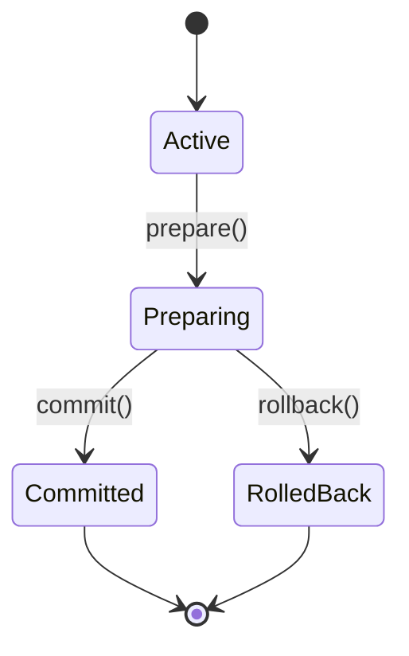

# MySQL XA事务深度解析与实战

## 一、XA事务核心原理

### 1.1 分布式事务背景
在单体架构向分布式演进过程中，传统本地事务无法满足跨数据库/服务的原子性需求。XA协议通过两阶段提交（2PC）实现分布式事务的强一致性。

### 1.2 XA事务架构模型
```mermaid
graph TD
    A[应用程序] --> B[事务管理器(TM)]
    B --> C[资源管理器1(RM1)]
    B --> D[资源管理器2(RM2)]
    C --> E[数据库实例1]
    D --> F[数据库实例2]
```

### 1.3 关键组件详解

| 组件 | 职责                         |
| ---- | ---------------------------- |
| TM   | 协调全局事务的提交与回滚     |
| RM   | 管理本地事务资源（如数据库） |
| XID  | 全局唯一事务标识符           |

## 二、MySQL XA实现原理

### 2.1 事务生命周期



### 2.2 两阶段提交流程

1. **准备阶段**：各RM执行SQL并记录Undo/Redo日志
2. **提交阶段**：TM根据准备结果下发最终指令

```java
// XA事务管理示例
public class MysqlXaTransactionDemo {
    // 加载MySQL JDBC驱动
    Class.forName("com.mysql.cj.jdbc.Driver"); // 加载驱动类
    
    // 建立XA数据源连接
    MysqlXADataSource xaDs = new MysqlXADataSource();
    xaDs.setUrl("jdbc:mysql://localhost:3306/test");
    xaDs.setUser("root");
    xaDs.setPassword("123456");
    
    // 获取XA连接
    XAConnection xaConn = xaDs.getXAConnection(); // 创建XA连接
    XAResource xaRes = xaConn.getXAResource();     // 获取资源管理器
    
    // 开启全局事务
    Xid xid = new MysqlXid("branch1".getBytes(), 1, 1); // 生成全局事务ID
    xaRes.start(xid, XAResource.TMNOFLAGS);          // 启动分支事务
    
    // 执行本地事务
    Connection conn = xaConn.getConnection();
    Statement stmt = conn.createStatement();
    stmt.executeUpdate("UPDATE account SET balance=balance-100 WHERE id=1"); // 扣款操作
    stmt.executeUpdate("UPDATE account SET balance=balance+100 WHERE id=2"); // 入账操作
    
    // 预提交阶段
    xaRes.end(xid, XAResource.TMSUCCESS);            // 标记事务结束
    int prepareResult = xaRes.prepare(xid);          // 向TM发送预提交请求
    
    if (prepareResult == XAResource.XA_OK) {
        xaRes.commit(xid, false);                    // 全局提交
    } else {
        xaRes.rollback(xid);                         // 全局回滚
    }
    
    // 资源释放
    stmt.close();
    conn.close();
    xaConn.close();
}
```

## 三、高级特性与优化

### 3.1 事务超时机制

```java
// 设置事务超时时间为10秒
xaRes.setTransactionTimeout(10); 
```

### 3.2 恢复机制

```sql
-- 查看未完成事务
SELECT * FROM INFORMATION_SCHEMA.INNODB_TRX;

-- 手动提交未完成事务
XA COMMIT 'xid-value';
```

### 3.3 性能优化策略

1. **降低日志粒度**：调整innodb_log_file_size参数
2. **减少锁竞争**：优化SQL执行计划
3. **异步提交**：启用innodb_support_xa=ON

## 四、生产环境实践要点

### 4.1 最佳实践规范

- 事务粒度控制在2-5秒内
- 避免跨库join操作
- 使用唯一索引减少锁冲突

### 4.2 监控指标体系

| 指标            | 监控意义       |
| --------------- | -------------- |
| xa_transactions | 全局事务数量   |
| xa_prepared     | 预提交事务数量 |
| xa_commit_time  | 平均提交耗时   |

### 4.3 典型故障处理

**场景：协调节点宕机导致事务悬挂**

```sql
-- 查找未完成事务
SELECT * FROM performance_schema.data_locks;

-- 强制回滚残留事务
XA ROLLBACK 'xid-value';
```

## 五、对比分析

| 特性       | XA事务             | TCC事务          |
| ---------- | ------------------ | ---------------- |
| 一致性模型 | 强一致性           | 最终一致性       |
| 适用场景   | 核心金融交易       | 电商订单系统     |
| 实现复杂度 | 高（需事务管理器） | 中（需业务补偿） |
| 性能损耗   | 高（2PC同步阻塞）  | 低（异步化设计） |

## 六、架构演进方向

### 6.1 Seata框架集成

```yaml
# seata配置示例
seata:
  enabled: true
  application-id: order-service
  tx-service-group: my_test_tx_group
```

### 6.2 云原生适配

- 支持Kubernetes事务管理
- 集成CloudEvents通知机制
- 实现事务补偿的幂等性设计

> 通过深入理解XA事务的底层原理，开发者可以更好地在分布式系统中平衡一致性、可用性和性能。实际应用中建议结合监控系统（如Prometheus+Grafana）建立完善的事务治理体系。