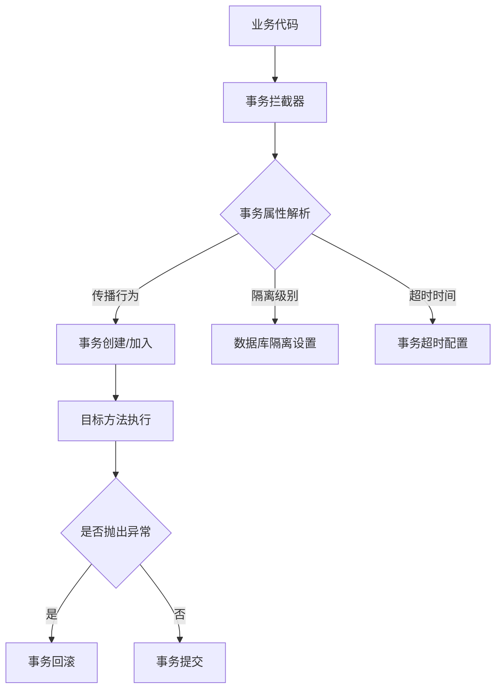
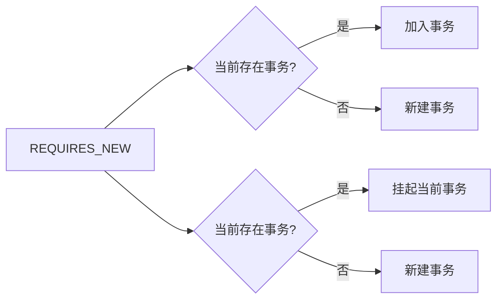
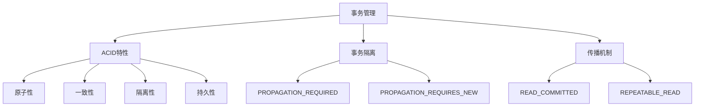

# Spring事务管理核心原理与实战

## 一、事务管理架构总览


## 二、核心实现原理详解

### 1. 事务传播机制

```java
// REQUIRED：如果存在事务则加入，否则新建
@Transactional(propagation = Propagation.REQUIRED)
public void methodA() {
    methodB(); // 同一事务
}

// REQUIRES_NEW：总是新建事务，挂起当前事务
@Transactional(propagation = Propagation.REQUIRES_NEW)
public void methodB() {
    // 新事务操作
}
```

#### 传播级别决策树



### 2. 事务隔离级别

```java
// 设置SERIALIZABLE隔离级别
@Transactional(isolation = Isolation.SERIALIZABLE)
public void transfer() {
    // 串行化操作
}
```

#### 隔离级别对比表

| 隔离级别         | 脏读 | 不可重复读 | 幻读 |
| ---------------- | ---- | ---------- | ---- |
| READ_UNCOMMITTED | ✔    | ✔          | ✔    |
| READ_COMMITTED   | ❌    | ✔          | ✔    |
| REPEATABLE_READ  | ❌    | ❌          | ✔    |
| SERIALIZABLE     | ❌    | ❌          | ❌    |

### 3. 事务失效场景

```java
// 失效场景1：非public方法
@Transactional
private void invalidMethod() {
    // 事务不生效
}

// 失效场景2：同类内部调用
public void methodA() {
    methodB(); // B方法事务失效
}

@Transactional
public void methodB() {
    // 事务不生效
}
```

## 三、底层实现原理

### 1. AOP代理机制

```java
// 事务拦截器核心逻辑
public Object invoke(MethodInvocation invocation) throws Throwable {
    TransactionInfo txInfo = createTransactionIfNecessary(invocation.getMethod());
    try {
        return invocation.proceed();
    } catch (Throwable ex) {
        completeTransactionAfterThrowing(txInfo, ex);
        throw ex;
    } finally {
        cleanupTransactionInfo(txInfo);
    }
}
```

### 2. 事务状态管理

```java
// DefaultTransactionStatus核心属性
public class DefaultTransactionStatus implements TransactionStatus {
    private final boolean isNewTransaction; // 是否新事务
    private final boolean isRollbackOnly;   // 是否仅回滚
    private int timeout;                    // 超时时间
    private boolean readOnly;               // 只读标志
}
```

## 四、工程实践指南

### 1. 最佳实践原则

```java
// 服务层统一异常处理
@Service
public class UserService {
    
    @Transactional(rollbackFor = Exception.class)
    public void createUser(User user) {
        try {
            userDao.insert(user);
            profileDao.insert(user.getProfile());
        } catch (Exception e) {
            // 统一异常处理
            throw new ServiceException("创建用户失败", e);
        }
    }
}
```

### 2. 性能优化方案

```yaml
# 数据库连接池配置（Druid示例）
spring.datasource.druid.initial-size=5
spring.datasource.druid.max-active=20
spring.datasource.druid.min-idle=5
spring.datasource.druid.max-wait=60000
```

## 五、分布式事务扩展

```java
// TCC事务框架使用示例
@Compensable(confirmMethod = "confirmTransfer", cancelMethod = "cancelTransfer")
public void transfer() {
    accountDao.debit(100);
    accountDao.credit(100);
}

// 确认方法
public void confirmTransfer() {
    // 业务确认逻辑
}

// 取消方法
public void cancelTransfer() {
    // 业务回滚逻辑
}
```

## 六、知识体系脑图




> 通过Spring事务管理，开发者可以专注于业务逻辑实现，而无需手动处理复杂的事务控制。合理选择事务传播行为和隔离级别，能有效平衡系统性能与数据一致性要求。