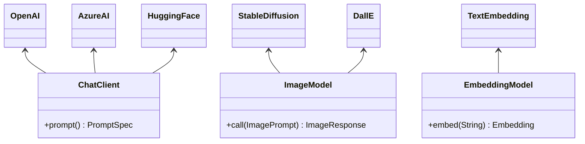
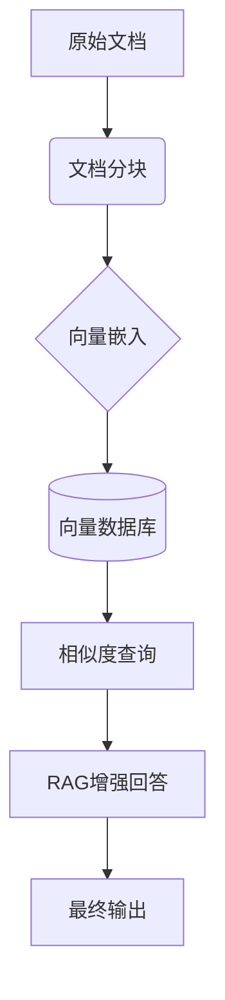
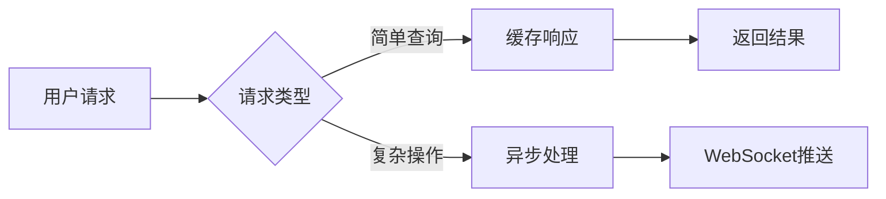
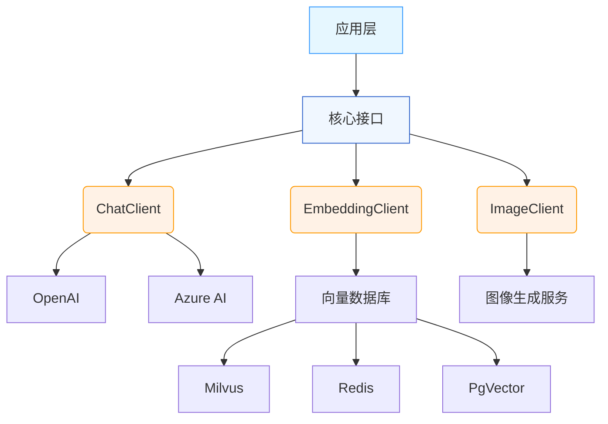
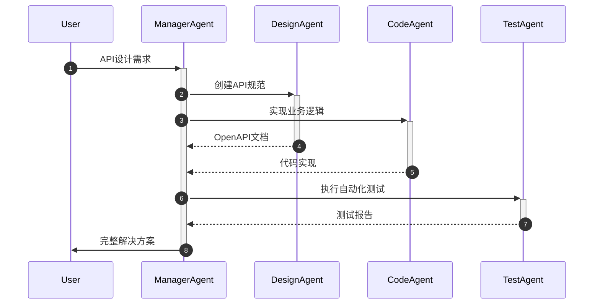

# 深入Spring AI：Java开发者构建智能应用的全栈指南


> Spring AI为Java生态带来的AI革命，让开发者无需切换技术栈即可构建企业级智能应用

## 一、Spring AI核心架构解析

### 1. 多模型标准化接口设计
Spring AI通过抽象层统一对接主流AI服务，**屏蔽底层差异** ，实现 **无缝切换** 不同AI提供商：



**多模型配置示例**：


```java
@Configuration
public class AIConfig {
    
    @Bean
    public ChatClient chatClient(
        @Value("${ai.openai.key}") String openAiKey,
        @Value("${ai.azure.key}") String azureKey) {
        
        return ChatClient.builder()
            .withOpenAi(openAiKey)
            .withAzure(azureKey)
            .build();
    }
    
    @Bean
    public ImageModel imageModel() {
        return new OpenAiImageModel(apiKey);
    }
}
```

### 2. 高级提示词工程

**动态模板系统** 支持 **多角色对话** 和 **上下文感知** ：


```java
String medicalTemplate = """
    [系统角色]
    你是一位{{specialty}}专家，正在分析患者病历
    
    [病历摘要]
    {{medicalRecord}}
    
    [用户问题]
    {{question}}
    
    [输出要求]
    格式：{{format}}
    语言：{{language}}
    """;

PromptTemplate template = new PromptTemplate(medicalTemplate);
Prompt prompt = template.create(Map.of(
    "specialty", "神经内科",
    "medicalRecord", "患者男性，58岁，主诉头痛...",
    "question", "可能的诊断是什么？",
    "format", "JSON",
    "language", "中文"
));
```

### 3. 向量数据库集成

**RAG（检索增强生成）实现流程**：




<svg class="t-loading__gradient t-icon-loading" viewBox="0 0 12 12" version="1.1" width="1em" height="1em" xmlns="http://www.w3.org/2000/svg"><foreignObject x="0" y="0" width="12" height="12"><div class="t-loading__gradient-conic"></div></foreignObject></svg>


**向量存储实现代码**：


```java
// 文档处理流水线
TextSplitter splitter = new TokenTextSplitter(1000, 200);
List<Document> chunks = splitter.split(pdfLoader.load("medical-data.pdf"));

// 生成嵌入向量
EmbeddingModel embeddingModel = new OpenAiEmbeddingModel(apiKey);
List<Embedding> vectors = embeddingModel.embed(chunks);

// 存储到Milvus向量库
VectorStore vectorStore = new MilvusVectorStore(
    "jdbc:milvus://localhost:19530",
    "medical_vectors"
);
vectorStore.add(vectors, chunks);
```

## 二、全栈AI应用开发实战

### 1. 多模态交互系统

**支持文本、图像、语音的融合处理** ：


```java
@RestController
public class MultiModalController {
    
    // 初始化多模型客户端
    private final ChatClient chatClient;
    private final ImageModel imageModel;
    private final TranscriptionModel transcriptionModel;
    
    public MultiModalController(ChatClient.Builder builder, 
                               ImageModel imageModel,
                               TranscriptionModel transcriptionModel) {
        this.chatClient = builder
            .defaultSystem("多模态AI助手")
            .defaultAdvisors(new ContextMemoryAdvisor())
            .build();
        // 其他模型初始化
    }
    
    // 增强型对话接口
    @PostMapping("/chat")
    public String enhancedChat(@RequestBody ChatRequest request) {
        return chatClient.prompt()
            .user(request.getQuestion())
            .system(request.getContext())
            .call()
            .content();
    }
    
    // 文生图服务
    @PostMapping("/generate-image")
    public ResponseEntity<byte[]> generateImage(@RequestBody ImageRequest request) {
        ImageOptions options = ImageOptions.builder()
            .width(request.getWidth())
            .height(request.getHeight())
            .style(request.getStyle())
            .build();
        
        ImageResponse response = imageModel.call(
            new ImagePrompt(request.getPrompt(), options));
        
        return ResponseEntity.ok()
            .contentType(MediaType.IMAGE_PNG)
            .body(downloadImage(response.getImageUrl()));
    }
}
```

### 2. RAG知识增强系统

**实现企业知识库智能问答**：


```java
@Service
public class KnowledgeService {
    
    @Autowired
    private VectorStore vectorStore;
    
    @Autowired
    private EmbeddingModel embeddingModel;
    
    @Retryable(maxAttempts = 3, backoff = @Backoff(delay = 1000))
    public String queryWithContext(String question) {
        // 1. 生成问题向量
        Embedding queryEmbedding = embeddingModel.embed(question);
        
        // 2. 相似度检索
        List<Document> docs = vectorStore.similaritySearch(
            SearchRequest.query(queryEmbedding)
                .withTopK(3)
                .withScoreThreshold(0.75)
        );
        
        // 3. 构建增强提示
        String context = docs.stream()
            .map(Document::getContent)
            .collect(Collectors.joining("\n---\n"));
        
        return chatClient.prompt()
            .system("基于以下上下文回答问题：\n" + context)
            .user(question)
            .call()
            .content();
    }
}
```

### 3. 函数调用实战

**扩展AI能力边界**：


```java
// 定义股票查询工具
@FunctionDescription(
    name = "getStockPrice", 
    description = "获取指定股票实时价格",
    parameters = @Parameters({
        @Parameter(name = "symbol", description = "股票代码", required = true)
    })
)
public String getStockPrice(String symbol) {
    return stockService.getRealTimePrice(symbol);
}

// 函数调用处理
@Bean
public FunctionCallingCallback functionCallback() {
    return FunctionCallingCallback.builder()
        .withFunction("getStockPrice", this::getStockPrice)
        .build();
}

// 启用函数调用的金融问答
public String handleFinanceQuery(String question) {
    return chatClient.prompt()
        .user(question)
        .options(ChatOptions.builder()
            .withFunctionCallbacks(List.of(functionCallback()))
            .withTemperature(0.2)
            .build())
        .call()
        .content();
}
```

## 三、高级特性与优化策略

### 1. 性能优化技巧




<svg class="t-loading__gradient t-icon-loading" viewBox="0 0 12 12" version="1.1" width="1em" height="1em" xmlns="http://www.w3.org/2000/svg"><foreignObject x="0" y="0" width="12" height="12"><div class="t-loading__gradient-conic"></div></foreignObject></svg>


**具体实现**：

```java
// 嵌入向量缓存
@Cacheable(value = "embeddings", key = "#text")
public Embedding getCachedEmbedding(String text) {
    return embeddingModel.embed(text);
}

// 异步批处理
@Async
public CompletableFuture<List<Embedding>> batchEmbed(List<String> texts) {
    return CompletableFuture.supplyAsync(() -> 
        embeddingModel.embed(texts)
    );
}
```

### 2. 可观测性增强

java

复制

```java
// 监控AI调用指标
@Bean
public MeterRegistryCustomizer<MeterRegistry> aiMetrics() {
    return registry -> {
        Timer.builder("ai.api.calls")
            .description("AI API调用耗时")
            .register(registry);
        
        Counter.builder("ai.errors")
            .description("AI调用错误计数")
            .register(registry);
    };
}

// 异常处理切面
@Aspect
@Component
public class AIExceptionAspect {
    
    @Around("execution(* com.example.ai..*.*(..))")
    public Object logAIExceptions(ProceedingJoinPoint pjp) throws Throwable {
        try {
            return pjp.proceed();
        } catch (AIServiceException e) {
            metrics.counter("ai.errors").increment();
            // 重试或降级逻辑
        }
    }
}
```

## 四、Spring AI架构全景




<svg class="t-loading__gradient t-icon-loading" viewBox="0 0 12 12" version="1.1" width="1em" height="1em" xmlns="http://www.w3.org/2000/svg"><foreignObject x="0" y="0" width="12" height="12"><div class="t-loading__gradient-conic"></div></foreignObject></svg>


## 五、未来演进方向

### 1. Agent工作流引擎

java

复制

```java
Agent agent = Agent.builder()
    .withName("技术支持Agent")
    .withGoal("解决用户技术问题")
    .withTools(
        new APITool(), 
        new DatabaseTool(), 
        new DocumentationTool()
    )
    .withMemory(new RedisChatMemory())
    .withPlanningStrategy(new ChainOfThought())
    .build();

agent.execute("如何优化Spring Boot启动时间？");
```

### 2. 多Agent协同系统




<svg class="t-loading__gradient t-icon-loading" viewBox="0 0 12 12" version="1.1" width="1em" height="1em" xmlns="http://www.w3.org/2000/svg"><foreignObject x="0" y="0" width="12" height="12"><div class="t-loading__gradient-conic"></div></foreignObject></svg>


## 六、最佳实践指南

1. **安全防护**

   - 使用`@PreAuthorize`控制AI接口访问
   - 敏感数据脱敏处理

  

   ```java
   @PreAuthorize("hasRole('AI_USER')")
   @PostMapping("/ask")
   public Response askQuestion(@RequestBody QuestionDTO dto) {
       // 数据脱敏
       String safeInput = sanitizer.sanitize(dto.getQuestion());
       return aiService.ask(safeInput);
   }
   ```

2. **成本控制**

   - 启用API调用配额管理
   - 大模型与小模型混合使用

3. **持续集成**

   - AI测试用例验证关键路径
   - 提示词版本化管理

## 结语

Spring AI正在重塑Java开发者的生产力边界。通过本文介绍的核心架构模式和实践方案，开发者可以：

1. 快速集成多模态AI能力
2. 构建企业级知识增强系统
3. 实现复杂业务流程自动化
4. 创建智能Agent工作流

随着Spring AI 1.0正式版的发布，Java生态系统迎来了AI原生应用开发的新时代。现在正是探索Spring AI无限可能的最佳时机！