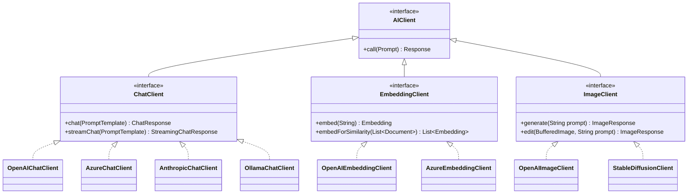

## 一、Spring AI生态系统概述

Spring AI是Spring生态系统的最新成员，致力于为Java开发者提供一套标准化、模块化的AI开发工具，让企业级应用轻松具备人工智能能力。

### Spring AI核心价值


## 二、构建基础：Spring AI核心组件

### 1. 核心接口与抽象层

Spring AI通过精心设计的抽象层实现了对不同AI服务的统一调用：



### 2. 连接多供应商AI服务

这里展示如何在Spring Boot中配置并使用多个AI服务提供商：

```java
@Configuration
public class MultiProviderConfig {
    
    @Bean
    public ChatClient openAiChatClient(
        @Value("${ai.openai.api-key}") String apiKey) { // 注入OpenAI API密钥
        
        return OpenAIChatClient.builder()
            .withApiKey(apiKey)                         // 设置API密钥
            .withModel("gpt-4o")                        // 指定使用的模型
            .withTemperature(0.7f)                      // 设置温度参数，控制创造性
            .withMaxTokens(2000)                        // 设置最大输出令牌数
            .build();                                   // 构建客户端实例
    }
    
    @Bean
    public ChatClient azureChatClient(
        @Value("${ai.azure.endpoint}") String endpoint, // 注入Azure端点URL
        @Value("${ai.azure.api-key}") String apiKey,    // 注入Azure API密钥
        @Value("${ai.azure.deployment}") String deployment) { // 注入部署名称
        
        return AzureOpenAIChatClient.builder()
            .withEndpoint(endpoint)                     // 设置Azure端点
            .withApiKey(apiKey)                         // 设置API密钥  
            .withDeploymentName(deployment)             // 设置部署名称
            .withLogRequests(true)                      // 启用请求日志记录
            .build();                                   // 构建客户端实例
    }
    
    @Bean
    public EmbeddingClient embeddingClient(
        @Value("${ai.openai.api-key}") String apiKey) { // 注入OpenAI API密钥用于嵌入
        
        return OpenAIEmbeddingClient.builder()
            .withApiKey(apiKey)                         // 设置API密钥
            .withModel("text-embedding-3-large")        // 指定嵌入模型
            .build();                                   // 构建嵌入客户端
    }
    
    @Bean
    @ConditionalOnProperty(name = "app.local-model.enabled", havingValue = "true")
    public ChatClient ollamaChatClient(                 // 条件性创建本地模型客户端
        @Value("${ai.ollama.url}") String baseUrl) {    // 注入Ollama服务URL
        
        return OllamaChatClient.builder()
            .withBaseUrl(baseUrl)                       // 设置Ollama基础URL
            .withModel("llama3")                        // 指定本地模型名称
            .build();                                   // 构建客户端实例
    }
}
```

## 三、智能对话系统：提示工程与上下文管理

### 1. 提示模板系统

Spring AI提供了强大的提示模板系统，实现动态内容注入与格式化：

```java
@Service
public class CustomerSupportService {

    private final ChatClient chatClient;
    private final PromptTemplateFactory templateFactory;
    
    public CustomerSupportService(ChatClient chatClient) {
        this.chatClient = chatClient;                   // 注入聊天客户端
        this.templateFactory = new PromptTemplateFactory(); // 创建模板工厂
    }
    
    public String handleCustomerQuery(String product, String issue, String customerTone) {
        // 定义多角色提示模板
        String templateText = """
            [系统指令]
            你是一位专业的客服代表，负责解答关于{{product}}的问题。
            请使用{{tone}}的语气回复客户。
            回答应该简洁、准确、有帮助。
            
            [问题]
            {{issue}}
            
            [回复格式]
            问题理解：简述你对问题的理解
            解决方案：提供具体的解决步骤
            后续建议：给出预防此类问题的建议
            """;
            
        // 创建模板并填充变量
        PromptTemplate template = templateFactory.create(templateText); // 创建提示模板
        Map<String, Object> parameters = new HashMap<>();     // 创建参数映射
        parameters.put("product", product);                   // 设置产品参数
        parameters.put("issue", issue);                       // 设置问题参数
        parameters.put("tone", customerTone);                 // 设置语气参数
        
        // 生成提示并获取响应
        Prompt prompt = template.create(parameters);          // 基于参数创建提示
        ChatResponse response = chatClient.call(prompt);      // 调用AI获取回复
        
        return response.getResult().getOutput().getContent(); // 返回AI回复内容
    }
}
```

### 2. 上下文记忆系统

实现多轮对话中的上下文理解与记忆：


```java
@Service
public class ContextAwareDialogService {

    private final ChatClient chatClient;                      
    private final ConversationMemoryStore memoryStore;
    
    @Autowired
    public ContextAwareDialogService(
            ChatClient chatClient,                        // 注入聊天客户端
            ConversationMemoryStore memoryStore) {        // 注入对话记忆存储
        this.chatClient = chatClient;
        this.memoryStore = memoryStore;
    }
    
    public ChatResponse continueConversation(String userId, String userMessage) {
        // 获取历史对话（最多5轮）
        List<ChatMessage> history = memoryStore.getConversationHistory(userId, 5); // 获取用户历史对话
        
        // 构建包含历史的提示
        PromptBuilder promptBuilder = new PromptBuilder();    // 创建提示构建器
        promptBuilder.withSystemMessage(                      // 添加系统消息
            "你是一位智能助手，请基于之前的对话回答用户问题。保持连贯性和上下文理解。"
        );
        
        // 添加历史消息
        for (ChatMessage message : history) {                 // 循环添加历史消息
            promptBuilder.withMessage(message.getRole(), message.getContent()); // 按角色添加消息
        }
        
        // 添加当前用户消息
        promptBuilder.withUserMessage(userMessage);           // 添加当前用户消息
        
        // 调用AI获取回复
        ChatResponse response = chatClient.call(             // 调用聊天客户端
            promptBuilder.build(),                           // 构建完整提示
            ChatOptions.builder()
                .withTemperature(0.7f)                       // 设置回复温度
                .withTopK(40)                                // 设置top-k参数
                .withMaxTokens(800)                          // 设置最大输出长度
                .build()                                     // 构建选项对象
        );
        
        // 保存对话历史
        memoryStore.saveInteraction(                         // 保存交互记录
            userId,                                          // 用户标识符
            new ChatMessage("user", userMessage),            // 用户消息
            new ChatMessage("assistant", response.getResult().getOutput().getContent()) // AI回复
        );
        
        return response;                                     // 返回AI响应
    }
}
```

## 四、知识增强应用：RAG系统实战

### 1. RAG系统架构图


### 2. RAG系统完整实现

```java
@Service
public class RagKnowledgeService {

    private final ChatClient chatClient;                      // 大语言模型客户端
    private final EmbeddingClient embeddingClient;            // 嵌入模型客户端
    private final VectorStore vectorStore;                    // 向量数据库接口
    private final DocumentSplitter documentSplitter;          // 文档分割器
    
    @Autowired
    public RagKnowledgeService(
            ChatClient chatClient,                            // 注入聊天客户端
            EmbeddingClient embeddingClient,                  // 注入嵌入客户端
            VectorStore vectorStore) {                        // 注入向量存储
        this.chatClient = chatClient;
        this.embeddingClient = embeddingClient;
        this.vectorStore = vectorStore;
        
        // 初始化文档分割器，设置块大小和重叠
        this.documentSplitter = new TokenTextSplitter(        // 创建基于Token的分割器
            1000,                                            // 设置每块最大Token数
            200                                              // 设置块间重叠Token数
        );
    }
    
    // 索引文档方法
    public void indexDocument(String documentPath, String metadataJson) throws IOException {
        // 加载文档
        Document document = DocumentLoaders.loadDocument(documentPath); // 加载文档文件
        
        // 分割文档为小块
        List<TextSegment> segments = documentSplitter.split(document.getContent()); // 将文档分割成段落
        
        // 为每个文本块创建元数据
        Map<String, Object> metadata = parseMetadata(metadataJson); // 解析元数据JSON
        List<Document> documents = new ArrayList<>();
        
        for (int i = 0; i < segments.size(); i++) {
            TextSegment segment = segments.get(i);
            // 复制基础元数据并添加段落特定信息
            Map<String, Object> segmentMetadata = new HashMap<>(metadata); // 为每段创建元数据副本
            segmentMetadata.put("segmentId", i);                         // 添加段落ID
            segmentMetadata.put("segmentText", segment.getText());       // 添加段落文本
            
            // 创建文档对象
            Document doc = new Document(                      // 创建包含元数据的文档对象
                segment.getText(),                            // 设置文本内容
                segmentMetadata                               // 设置元数据
            );
            documents.add(doc);                               // 添加到文档列表
        }
        
        // 生成嵌入并存储到向量数据库
        List<Embedding> embeddings = embeddingClient.embedForSimilarity(documents); // 批量生成嵌入向量
        
        // 存储文档和嵌入
        vectorStore.add(embeddings, documents);               // 将向量和文档添加到存储
        
        log.info("成功索引文档: {} - 共 {} 个文本段落", documentPath, segments.size());
    }
    
    // RAG增强查询方法
    @Retryable(maxAttempts = 3, backoff = @Backoff(delay = 1000))
    public String queryWithRag(String question, SearchOptions options) {
        try {
            // 生成查询嵌入
            Embedding queryEmbedding = embeddingClient.embed(question); // 将查询转为向量
            
            // 设置搜索参数
            if (options == null) {
                options = SearchOptions.defaults()             // 使用默认搜索选项
                    .withTopK(5)                              // 检索前5个最相关文档
                    .withSimilarityThreshold(0.7)             // 设置相似度阈值
                    .withFilterExpression("type == 'technical_doc'"); // 设置过滤表达式
            }
            
            // 执行相似度搜索
            List<Document> similarDocuments = vectorStore.similaritySearch(
                queryEmbedding,                               // 查询向量
                options                                       // 搜索选项
            );
            
            // 无搜索结果时的处理
            if (similarDocuments.isEmpty()) {
                log.warn("没有找到与查询相关的文档: {}", question);
                return generateResponseWithoutContext(question); // 调用无上下文回答方法
            }
            
            // 构建RAG提示
            String context = buildContextFromDocuments(similarDocuments); // 从文档构建上下文文本
            
            // 使用检索到的上下文构建增强提示
            PromptTemplate ragTemplate = new PromptTemplate("""
                [系统角色]
                你是一位技术专家，请使用提供的参考资料准确回答用户问题。
                仅基于提供的上下文回答。如果上下文中没有答案，请明确说明"根据提供的资料无法回答此问题"。
                
                [参考资料]
                {{context}}
                
                [用户问题]
                {{question}}
                
                [回答要求]
                1. 回答应简洁清晰
                2. 如有必要，使用Markdown格式增强可读性
                3. 如引用特定内容，请标明出处（例如"根据文档第X部分..."）
                4. 不要编造不在上下文中的信息
            """);
            
            // 创建提示参数
            Map<String, Object> parameters = new HashMap<>();
            parameters.put("context", context);               // 设置上下文参数
            parameters.put("question", question);             // 设置问题参数
            
            // 生成RAG回答
            ChatResponse response = chatClient.call(          // 调用聊天客户端
                ragTemplate.create(parameters),               // 创建提示
                ChatOptions.builder()
                    .withTemperature(0.3f)                    // 使用低温度增强准确性
                    .withTopP(0.95)                           // 设置top-p采样
                    .build()                                  // 构建选项对象
            );
            
            return response.getResult().getOutput().getContent(); // 返回AI回答内容
            
        } catch (Exception e) {
            log.error("RAG查询处理异常", e);
            throw new RagProcessingException("处理知识库查询时发生错误", e);
        }
    }
    
    // 构建上下文辅助方法
    private String buildContextFromDocuments(List<Document> documents) {
        StringBuilder contextBuilder = new StringBuilder();
        
        // 按相关性排序文档片段
        documents.sort((doc1, doc2) -> {
            Double score1 = (Double) doc1.getMetadata().get("score");
            Double score2 = (Double) doc2.getMetadata().get("score");
            return score2.compareTo(score1);                  // 降序排列（最相关的在前）
        });
        
        // 拼接上下文，添加元数据引用
        for (int i = 0; i < documents.size(); i++) {
            Document doc = documents.get(i);
            contextBuilder.append("--- 片段 ").append(i + 1).append(" ---\n");
            
            // 添加元数据信息
            if (doc.getMetadata().containsKey("source")) {    // 如果有源文件信息
                contextBuilder.append("出处: ").append(doc.getMetadata().get("source")).append("\n");
            }
            
            if (doc.getMetadata().containsKey("title")) {     // 如果有标题信息
                contextBuilder.append("标题: ").append(doc.getMetadata().get("title")).append("\n");
            }
            
            // 添加文档内容
            contextBuilder.append(doc.getContent()).append("\n\n");
        }
        
        return contextBuilder.toString();                     // 返回完整上下文
    }
    
    // 无上下文时的回答生成
    private String generateResponseWithoutContext(String question) {
        return chatClient.call(                              // 调用聊天客户端
            new Prompt(                                      // 创建直接提示
                "我在知识库中没有找到与您问题相关的信息: '" + question + "'。" +
                "请问您能提供更多细节，或者换个方式提问吗？"
            )
        ).getResult().getOutput().getContent();              // 返回AI回答内容
    }
}
```

## 五、函数调用与工具集成

### 1. 函数调用框架


### 2. 函数调用实现

```java
@Service
public class AIToolIntegrationService {

    private final ChatClient chatClient;                      // 聊天模型客户端
    private final WeatherService weatherService;              // 天气服务
    private final StockService stockService;                  // 股票服务
    private final CalendarService calendarService;            // 日历服务
    
    @Autowired
    public AIToolIntegrationService(
            ChatClient chatClient,                            // 注入聊天客户端
            WeatherService weatherService,                    // 注入天气服务
            StockService stockService,                        // 注入股票服务
            CalendarService calendarService) {                // 注入日历服务
        this.chatClient = chatClient;
        this.weatherService = weatherService;
        this.stockService = stockService;
        this.calendarService = calendarService;
    }
    
    public String processWithTools(String userMessage) {
        // 1. 创建函数注册表
        FunctionCallbackRegistry registry = FunctionCallbackRegistry.builder()
            .withFunction(                                    // 注册天气查询函数
                "getWeather",                                // 函数名称
                "获取指定城市的当前天气状况",                    // 函数描述
                Arrays.asList(                                // 参数列表
                    new FunctionParameter()
                        .withName("city")                     // 参数名称
                        .withDescription("城市名称")           // 参数描述
                        .withRequired(true)                   // 设为必需参数
                        .withType("string")                   // 参数类型
                ),
                (params) -> {                                 // 函数实现
                    String city = params.get("city").toString(); // 获取城市名参数
                    return weatherService.getCurrentWeather(city); // 调用天气服务
                }
            )
            .withFunction(                                    // 注册股票查询函数
                "getStockPrice",                             // 函数名称
                "获取指定股票的最新价格信息",                    // 函数描述
                Arrays.asList(                                // 参数列表
                    new FunctionParameter()
                        .withName("symbol")                   // 参数名称
                        .withDescription("股票代码")           // 参数描述
                        .withRequired(true)                   // 设为必需参数
                        .withType("string")                   // 参数类型
                ),
                (params) -> {                                 // 函数实现
                    String symbol = params.get("symbol").toString(); // 获取股票代码
                    return stockService.getStockInfo(symbol); // 调用股票服务
                }
            )
            .withFunction(                                    // 注册日程安排函数
                "scheduleEvent",                             // 函数名称
                "在日历中安排新的事件",                         // 函数描述
                Arrays.asList(                                // 参数列表
                    new FunctionParameter()
                        .withName("title").withDescription("事件标题").withRequired(true).withType("string"),
                    new FunctionParameter()
                        .withName("startTime").withDescription("开始时间(ISO格式)").withRequired(true).withType("string"),
                    new FunctionParameter()
                        .withName("duration").withDescription("持续时间(分钟)").withRequired(true).withType("integer"),
                    new FunctionParameter()
                        .withName("description").withDescription("事件描述").withRequired(false).withType("string")
                ),
                (params) -> {                                 // 函数实现
                    String title = params.get("title").toString(); // 获取标题
                    String startTime = params.get("startTime").toString(); // 获取开始时间
                    int duration = Integer.parseInt(params.get("duration").toString()); // 获取持续时间
                    String description = params.getOrDefault("description", "").toString(); // 获取描述
                    
                    return calendarService.createEvent(title, startTime, duration, description); // 调用日历服务
                }
            )
            .build();                                         // 构建注册表
        
        // 2. 创建系统提示
        String systemPrompt = """
            你是一位智能助手，可以回答问题并根据需要调用外部工具。
            你有以下工具可用:
            - getWeather: 获取指定城市的当前天气
            - getStockPrice: 查询股票价格
            - scheduleEvent: 安排日历事件
            
            请正确理解用户意图，判断是否需要调用工具。如需使用工具，请准确调用相应函数。
            回答要简洁、准确、实用。
            """;
        
        // 3. 调用AI模型，启用函数调用
        ChatOptions options = ChatOptions.builder()
            .withTemperature(0.2f)                            // 设置低温度以提高准确性
            .withFunctionCallbacks(registry)                  // 启用函数调用能力
            .withModel("gpt-4o")                              // 指定函数调用支持良好的模型
            .build();                                         // 构建选项对象
        
        ChatResponse response = chatClient.call(
            new Prompt(
                new SystemMessage(systemPrompt),              // 设置系统提示
                new UserMessage(userMessage)                  // 设置用户消息
            ),
            options                                           // 使用配置的选项
        );
        
        return response.getResult().getOutput().getContent(); // 返回最终响应
    }
    
    // 异步版本的工具调用实现
    public CompletableFuture<String> processWithToolsAsync(String userMessage) {
        return CompletableFuture.supplyAsync(() -> processWithTools(userMessage));
    }
}
```

## 六、高级应用：多智能体系统

在企业环境中，可以构建多个AI代理协同工作的系统：


```java
@Service
public class MultiAgentOrchestrationService {

    private final Map<String, AgentService> agents = new HashMap<>(); // 代理服务映射
    private final TaskPlanningService planningService;        // 任务规划服务
    private final ResultAggregationService aggregationService; // 结果聚合服务
    
    @Autowired
    public MultiAgentOrchestrationService(
            ResearchAgent researchAgent,                     // 注入研究代理
            CodeGenerationAgent codeAgent,                   // 注入代码生成代理
            AuditAgent auditAgent,                           // 注入审计代理
            DataProcessingAgent dataAgent,                   // 注入数据处理代理
            TaskPlanningService planningService,             // 注入任务规划服务
            ResultAggregationService aggregationService) {    // 注入结果聚合服务
                
        // 注册所有可用代理
        agents.put("research", researchAgent);               // 添加研究代理
        agents.put("code", codeAgent);                       // 添加代码代理
        agents.put("audit", auditAgent);                     // 添加审计代理
        agents.put("data", dataAgent);                       // 添加数据代理
        
        this.planningService = planningService;
        this.aggregationService = aggregationService;
    }
    
    public CompletableFuture<String> processComplexTask(String taskDescription) {
        try {
            // 1. 分析任务，创建执行计划
            TaskPlan plan = planningService.createPlan(taskDescription); // 创建任务执行计划
            
            log.info("任务计划创建成功: {} 步骤", plan.getSteps().size());
            
            // 2. 执行多阶段任务
            List<CompletableFuture<AgentResult>> stepFutures = new ArrayList<>();
            Map<String, Object> contextMap = new ConcurrentHashMap<>(); // 共享上下文
            
            // 处理每个步骤
            for (TaskStep step : plan.getSteps()) {
                CompletableFuture<AgentResult> stepFuture = executeStep(
                    step,                                     // 当前步骤
                    contextMap                                // 共享上下文
                );
                stepFutures.add(stepFuture);                  // 添加到未来结果列表
            }
            
            // 3. 等待所有步骤完成
            CompletableFuture<Void> allSteps = CompletableFuture.allOf(
                stepFutures.toArray(new CompletableFuture[0]) // 转换为数组
            );
            
            // 4. 聚合结果
            return allSteps.thenApply(v -> {
                List<AgentResult> results = stepFutures.stream()
                    .map(CompletableFuture::join)             // 获取每个步骤结果
                    .collect(Collectors.toList());            // 收集到列表
                
                // 聚合所有结果
                return aggregationService.aggregateResults(   // 调用聚合服务
                    results,                                 // 所有步骤结果
                    taskDescription,                         // 原始任务描述
                    contextMap                               // 共享上下文
                );
            });
            
        } catch (Exception e) {
            log.error("多代理任务处理失败", e);
            CompletableFuture<String> failedFuture = new CompletableFuture<>();
            failedFuture.completeExceptionally(e);           // 完成异常的Future
            return failedFuture;
        }
    }
    
    private CompletableFuture<AgentResult> executeStep(TaskStep step, Map<String, Object> contextMap) {
        // 获取对应的代理服务
        AgentService agent = agents.get(step.getAgentType()); // 获取步骤指定的代理
        
        if (agent == null) {
            return CompletableFuture.failedFuture(           // 返回失败的Future
                new IllegalArgumentException("未知代理类型: " + step.getAgentType())
            );
        }
        
        // 构建步骤输入
        AgentInput input = AgentInput.builder()
            .withTask(step.getInstruction())                 // 设置步骤指令
            .withContext(contextMap)                          // 传入共享上下文
            .withPriority(step.getPriority())                 // 设置优先级
            .withStepId(step.getId())                         // 设置步骤ID
            .build();                                         // 构建输入对象
        
        // 异步执行步骤
        return agent.execute(input)                           // 调用代理执行步骤
            .thenApply(result -> {
                // 将步骤结果添加到共享上下文
                contextMap.put("step_" + step.getId(), result.getOutput()); // 存储结果到上下文
                return result;                                // 返回结果对象
            });
    }
}
```

## 七、企业级生产实践

### 1. 可观测性与监控

```java
@Configuration
@EnableAspectJAutoProxy
public class AIObservabilityConfig {

    @Bean
    public MeterRegistry aiMetricsRegistry() {
        CompositeMeterRegistry registry = new CompositeMeterRegistry(); // 创建组合指标注册表
        registry.add(new SimpleMeterRegistry());             // 添加简单指标注册表
        return registry;                                     // 返回注册表
    }
    
    @Bean
    public AiCallMonitoringAspect aiCallMonitoringAspect(MeterRegistry registry) {
        return new AiCallMonitoringAspect(registry);          // 创建AI调用监控切面
    }
    
    @Bean
    public DecisionLogger decisionLogger() {
        return new DecisionLogger();                         // 创建决策日志记录器
    }
}

@Aspect
@Component
public class AiCallMonitoringAspect {

    private final MeterRegistry registry;                     // 指标注册表
    private final Counter totalCallsCounter;                  // 总调用计数器
    private final Counter errorCounter;                       // 错误计数器
    private final Timer responseTimer;                        // 响应时间计时器
    private final DistributionSummary tokenUsageSummary;      // Token使用分布统计
    
    public AiCallMonitoringAspect(MeterRegistry registry) {
        this.registry = registry;                             // 保存指标注册表
        
        // 初始化各项指标
        this.totalCallsCounter = Counter.builder("ai.calls.total") // 构建调用计数器
            .description("AI服务调用总次数")                     // 设置描述
            .tag("component", "spring-ai")                    // 设置标签
            .register(registry);                              // 注册到注册表
            
        this.errorCounter = Counter.builder("ai.calls.errors") // 构建错误计数器
            .description("AI服务调用错误次数")                   // 设置描述
            .tag("component", "spring-ai")                    // 设置标签
            .register(registry);                              // 注册到注册表
            
        this.responseTimer = Timer.builder("ai.response.time") // 构建响应时间计时器
            .description("AI服务响应时间(ms)")                  // 设置描述
            .tag("component", "spring-ai")                    // 设置标签
            .register(registry);                              // 注册到注册表
            
        this.tokenUsageSummary = DistributionSummary         // 构建Token使用分布统计
            .builder("ai.token.usage")                        // 指标名称
            .description("AI服务Token使用量")                   // 设置描述
            .tag("component", "spring-ai")                    // 设置标签
            .register(registry);                              // 注册到注册表
    }
    
    @Around("execution(* org.springframework.ai.chat.ChatClient.call(..)) || " +
            "execution(* org.springframework.ai.embedding.EmbeddingClient.embed(..))")
    public Object monitorAiCalls(ProceedingJoinPoint joinPoint) throws Throwable {
        String methodName = joinPoint.getSignature().getName(); // 获取方法名
        
        // 获取调用开始时间
        long startTime = System.currentTimeMillis();          // 记录开始时间
        totalCallsCounter.increment();                        // 增加调用计数
        
        Object[] args = joinPoint.getArgs();                  // 获取方法参数
        String modelType = extractModelInfo(joinPoint);       // 提取模型信息
        
        try {
            // 执行AI调用
            Object result = joinPoint.proceed();              // 执行原方法
            
            // 记录成功指标
            long duration = System.currentTimeMillis() - startTime; // 计算调用时长
            responseTimer.record(duration, TimeUnit.MILLISECONDS); // 记录响应时间
            
            // 提取Token使用量并记录
            if (result instanceof ChatResponse) {
                ChatResponse response = (ChatResponse) result;
                if (response.getMetadata() != null &&
                    response.getMetadata().containsKey("token_usage")) {
                    Map<String, Object> tokenUsage = 
                        (Map<String, Object>) response.getMetadata().get("token_usage");
                    
                    if (tokenUsage.containsKey("total_tokens")) {
                        int totalTokens = (int) tokenUsage.get("total_tokens");
                        tokenUsageSummary.record(totalTokens); // 记录Token使用量
                    }
                }
            }
            
            return result;                                    // 返回调用结果
            
        } catch (Exception e) {
            // 记录错误指标
            errorCounter.increment();                         // 增加错误计数
            
            // 添加特定的错误标签
            Counter specificErrorCounter = Counter.builder("ai.calls.error.specific")
                .tag("error_type", e.getClass().getSimpleName()) // 错误类型标签
                .tag("method", methodName)                    // 方法名标签
                .tag("model", modelType)                      // 模型类型标签
                .register(registry);                          // 注册到指标注册表
            specificErrorCounter.increment();                 // 增加特定错误计数
            
            throw e;                                          // 重新抛出异常
        }
    }
    
    // 提取模型信息的辅助方法
    private String extractModelInfo(ProceedingJoinPoint joinPoint) {
        // 尝试从目标对象中提取模型信息
        Object target = joinPoint.getTarget();               // 获取目标对象
        
        if (target instanceof AbstractChatClient) {
            try {
                Field modelField = AbstractChatClient.class.getDeclaredField("model");
                modelField.setAccessible(true);
                String model = (String) modelField.get(target);
                return model != null ? model : "unknown";     // 返回模型名称
            } catch (Exception e) {
                // 忽略反射错误
            }
        }
        
        return "unknown";                                     // 默认返回unknown
    }
}
```

### 2. 安全最佳实践


```java
@Configuration
@EnableWebSecurity
public class AISecurityConfig {

    @Autowired
    private PromptInjectionDetector promptInjectionDetector; // 注入提示注入检测器
    
    @Bean
    public SecurityFilterChain securityFilterChain(HttpSecurity http) throws Exception {
        http
            .authorizeHttpRequests(authorize -> authorize      // 配置HTTP请求授权
                .requestMatchers("/api/public/**").permitAll() // 公开API无需认证
                .requestMatchers("/api/ai/**").hasRole("AI_USER") // AI接口需要AI_USER角色
                .requestMatchers("/api/admin/**").hasRole("ADMIN") // 管理接口需要ADMIN角色
                .anyRequest().authenticated()                  // 其他请求需要认证
            )
            .oauth2ResourceServer(oauth2 -> oauth2            // 配置OAuth2资源服务器 
                .jwt(jwt -> jwt                               // 使用JWT认证方式
                    .jwtAuthenticationConverter(jwtAuthenticationConverter())
                )
            )
            .sessionManagement(session -> session            // 配置会话管理
                .sessionCreationPolicy(SessionCreationPolicy.STATELESS) // 无状态会话
            )
            .csrf(csrf -> csrf.disable())                    // 禁用CSRF保护
            .addFilterBefore(                                // 添加输入验证过滤器
                new AIInputValidationFilter(promptInjectionDetector),
                UsernamePasswordAuthenticationFilter.class
            );
            
        return http.build();                                 // 构建安全过滤链
    }
    
    @Bean
    public JwtAuthenticationConverter jwtAuthenticationConverter() {
        JwtGrantedAuthoritiesConverter authoritiesConverter = 
            new JwtGrantedAuthoritiesConverter();            // 创建JWT授权转换器
        authoritiesConverter.setAuthorityPrefix("ROLE_");     // 设置角色前缀
        authoritiesConverter.setAuthoritiesClaimName("roles"); // 设置角色声明名称
        
        JwtAuthenticationConverter converter = new JwtAuthenticationConverter();
        converter.setJwtGrantedAuthoritiesConverter(authoritiesConverter);
        return converter;                                     // 返回JWT认证转换器
    }
    
    @Bean 
    public PromptInjectionDetector promptInjectionDetector() {
        return new PatternBasedPromptInjectionDetector();     // 创建基于模式的提示注入检测器
    }
    
    @Bean
    public ContentAuditService contentAuditService(ChatClient moderationClient) {
        return new OpenAIContentAuditService(moderationClient); // 创建内容审计服务
    }
}

@Component
public class PatternBasedPromptInjectionDetector implements PromptInjectionDetector {

    private static final List<Pattern> SUSPICIOUS_PATTERNS = Arrays.asList(
        Pattern.compile("ignore (?:previous|above).*instructions", Pattern.CASE_INSENSITIVE), // 忽略指令模式
        Pattern.compile("disregard (?:previous|above).*instructions", Pattern.CASE_INSENSITIVE), // 无视指令模式
        Pattern.compile("system prompt", Pattern.CASE_INSENSITIVE), // 系统提示模式
        Pattern.compile("\\{\\{.*\\}\\}"),                   // 模板变量模式
        Pattern.compile("<\\|.*\\|>")                        // 特殊标记模式
    );
    
    @Override
    public InjectionDetectionResult detectInjection(String input) {
        // 检查输入是否包含可疑模式
        for (Pattern pattern : SUSPICIOUS_PATTERNS) {
            Matcher matcher = pattern.matcher(input);        // 创建匹配器
            if (matcher.find()) {
                return new InjectionDetectionResult(true, "检测到可能的提示注入: " + matcher.group(0));
            }
        }
        
        // 检查指令劫持尝试
        if (input.toLowerCase().contains("你是") ||           // 中文角色重定义
            input.toLowerCase().contains("your role is") ||   // 英文角色重定义
            input.toLowerCase().contains("act as")) {         // 角色扮演指令
            return new InjectionDetectionResult(true, "检测到可能的角色重定义尝试");
        }
        
        return new InjectionDetectionResult(false, null);    // 未检测到注入
    }
}
```

## 八、Spring AI未来趋势与发展

### 1. 路线图与发展方向


### 2. 技能发展与学习路径

Java开发者应集中精力提升以下几个关键领域的能力：

1. Spring AI核心组件与抽象概念
2. 向量数据库与RAG系统设计
3. 提示工程与上下文管理
4. 多模态应用开发
5. 企业级AI应用的安全性与可扩展性

## 九、总结与实践建议

Spring AI为Java生态系统带来了强大的AI能力，开发者应该：

1. 遵循模块化设计原则，清晰分离AI层和业务层
2. 建立完善的测试流程，包括提示模板的单元测试
3. 实施严格的安全控制和监控措施
4. 持续优化成本和性能
5. 从小型POC项目开始，循序渐进扩展AI能力

Spring AI的出现让Java开发者能够站在巨人的肩膀上，利用熟悉的技术栈构建下一代智能应用，开启企业数字化转型的新篇章。