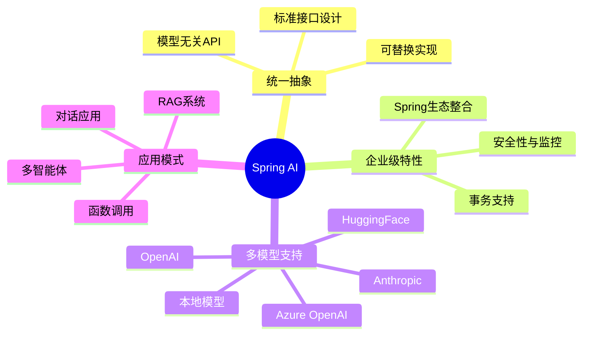
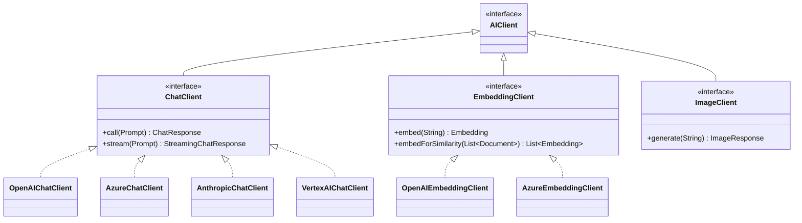
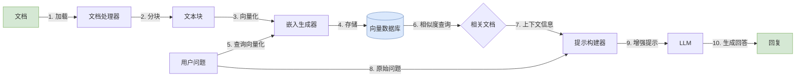
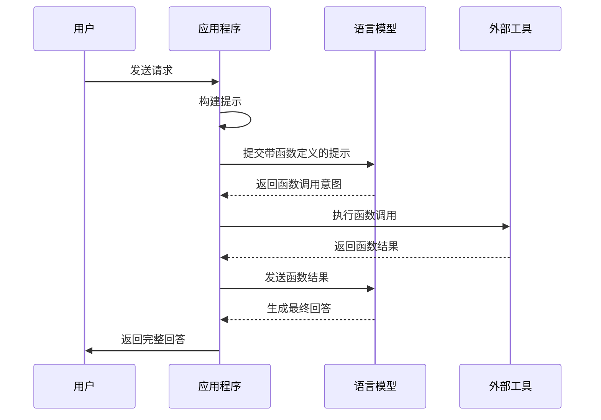
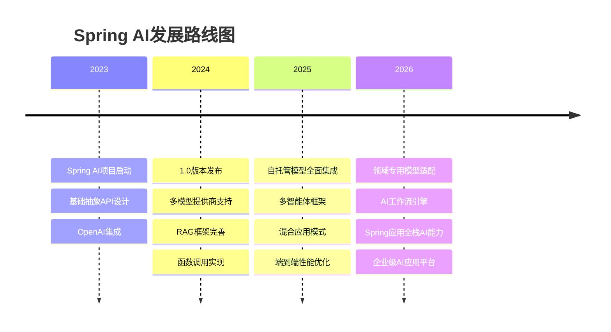

# Spring AI全面指南：从入门到精通

> Spring AI是Spring Framework生态的最新成员，旨在为企业级Java应用提供简单、统一的AI集成方案。本文将全面解析Spring AI的核心概念、实现机制及实战应用，帮助开发者快速构建智能应用。

## 一、Spring AI生态全景

Spring AI提供了统一的抽象层，让开发者能够轻松集成多种AI服务和模型，而无需关注底层实现细节。

### 核心价值与设计理念



## 二、Spring AI核心组件解析

Spring AI的架构设计遵循Spring一贯的设计原则，通过抽象接口和实现分离的方式提供强大的扩展性。

### 核心接口与实现类层级



### 开发环境配置

首先，在Spring Boot项目中添加必要依赖：

```xml
<!-- Spring AI核心依赖 -->
<dependency>
    <groupId>org.springframework.ai</groupId>
    <artifactId>spring-ai-spring-boot-starter</artifactId>
    <version>0.8.0</version>
</dependency>

<!-- 选择需要的模型提供商 -->
<dependency>
    <groupId>org.springframework.ai</groupId>
    <artifactId>spring-ai-openai-spring-boot-starter</artifactId>
    <version>0.8.0</version>
</dependency>
```

在`application.properties`中配置API密钥：

```properties
# OpenAI配置
spring.ai.openai.api-key=${OPENAI_API_KEY}
spring.ai.openai.chat.model=gpt-4
spring.ai.openai.chat.temperature=0.7
spring.ai.openai.chat.max-tokens=2000

# 日志配置
logging.level.org.springframework.ai=DEBUG
```

## 三、基础应用：聊天模型交互

### 简单对话实现

以下是一个基础的Spring AI控制器示例：

```java
@RestController
@RequestMapping("/api/chat")
public class ChatController {

    // 注入Spring AI提供的ChatClient接口
    private final ChatClient chatClient;
    
    // 使用构造函数注入依赖
    @Autowired
    public ChatController(ChatClient chatClient) {
        this.chatClient = chatClient;
    }
    
    // 创建REST端点处理聊天请求
    @PostMapping
    public Map<String, String> chat(@RequestBody Map<String, String> request) {
        // 从请求体中获取用户消息
        String userMessage = request.get("message");
        
        // 创建提示对象，包含用户消息
        Prompt prompt = new Prompt(userMessage);
        
        // 调用AI模型获取响应
        ChatResponse response = chatClient.call(prompt);
        
        // 从响应中提取AI生成的内容
        String aiResponse = response.getResult().getOutput().getContent();
        
        // 构建并返回结果Map
        Map<String, String> result = new HashMap<>();
        result.put("response", aiResponse);
        
        return result;
    }
}
```

### 提示模板系统

Spring AI提供了强大的提示模板系统，支持变量替换、格式控制：

```java
@Service
public class CustomerSupportService {

    // 注入聊天客户端
    private final ChatClient chatClient;
    
    // 使用构造器注入
    @Autowired
    public CustomerSupportService(ChatClient chatClient) {
        this.chatClient = chatClient;
    }
    
    // 处理客户询问的方法
    public String getProductRecommendation(String customerName, String category, int budget) {
        // 定义提示模板文本，包含变量占位符
        String template = """
            你是一位专业的产品顾问。
            请为客户{customerName}推荐3个{category}类别的产品，预算在{budget}元以内。
            
            对于每个推荐产品，请提供：
            1. 产品名称
            2. 价格区间
            3. 主要特点
            4. 适合人群
            
            使用清晰的列表格式回答。
            """;
        
        // 创建模板引擎
        TemplateEngine templateEngine = new StringTemplateEngine();
        
        // 准备模板变量
        Map<String, Object> variables = new HashMap<>();
        variables.put("customerName", customerName);
        variables.put("category", category);
        variables.put("budget", budget);
        
        // 渲染模板生成最终提示
        String promptText = templateEngine.render(template, variables);
        
        // 创建提示对象
        Prompt prompt = new Prompt(promptText);
        
        // 调用AI获取回复
        ChatResponse response = chatClient.call(prompt);
        
        // 返回生成的内容
        return response.getResult().getOutput().getContent();
    }
}
```

### 多轮对话与上下文管理

实现记忆历史对话的对话服务：

```java
@Service
public class ConversationService {

    // 注入聊天客户端
    private final ChatClient chatClient;
    
    // 会话存储，使用用户ID映射到消息历史
    private final Map<String, List<Message>> sessionStore = new ConcurrentHashMap<>();
    
    // 构造函数注入
    @Autowired
    public ConversationService(ChatClient chatClient) {
        this.chatClient = chatClient;
    }
    
    // 处理用户消息并维护会话上下文
    public String chat(String userId, String userMessage) {
        // 获取或创建用户会话历史
        List<Message> messageHistory = sessionStore.computeIfAbsent(
            userId, 
            k -> new ArrayList<>()
        );
        
        // 创建系统消息，设置AI助手角色
        Message systemMessage = new SystemMessage(
            "你是一位友好、专业的助手，根据对话历史回答用户问题。"
        );
        
        // 将用户新消息添加到历史中
        UserMessage newUserMessage = new UserMessage(userMessage);
        messageHistory.add(newUserMessage);
        
        // 构建完整对话列表，包含系统消息和历史消息
        List<Message> fullConversation = new ArrayList<>();
        fullConversation.add(systemMessage);
        fullConversation.addAll(messageHistory);
        
        // 创建包含对话历史的提示
        Prompt prompt = new Prompt(fullConversation);
        
        // 调用AI获取回复
        ChatResponse response = chatClient.call(prompt);
        String aiResponse = response.getResult().getOutput().getContent();
        
        // 将AI回复添加到会话历史中
        messageHistory.add(new AssistantMessage(aiResponse));
        
        // 如果历史消息过多，清理旧消息以节省内存
        if (messageHistory.size() > 20) {
            messageHistory = messageHistory.subList(
                messageHistory.size() - 10, 
                messageHistory.size()
            );
            sessionStore.put(userId, messageHistory);
        }
        
        return aiResponse;
    }
}
```

## 四、高级应用：RAG系统实现

RAG（检索增强生成）模式是企业应用中的核心模式，可以让AI基于企业数据生成回答。

### RAG架构与流程



### 完整RAG实现

```java
@Service
@RequiredArgsConstructor
public class DocumentAIService {

    // 注入所需依赖
    private final ChatClient chatClient;
    private final EmbeddingClient embeddingClient;
    private final VectorStore vectorStore;
    
    // 文本分割器常量
    private static final int CHUNK_SIZE = 1000;
    private static final int CHUNK_OVERLAP = 200;
    
    /**
     * 索引文档到向量数据库
     * @param content 文档内容
     * @param metadata 文档元数据
     */
    public void indexDocument(String content, Map<String, String> metadata) {
        // 创建文本分割器，设置块大小和重叠
        DocumentSplitter splitter = new TokenTextSplitter(
            CHUNK_SIZE, 
            CHUNK_OVERLAP
        );
        
        // 将文档分割为较小的文本块
        List<TextSegment> textSegments = splitter.split(content);
        
        // 创建文档列表，每个块创建一个文档
        List<Document> documents = new ArrayList<>();
        for (int i = 0; i < textSegments.size(); i++) {
            // 获取当前文本段
            TextSegment segment = textSegments.get(i);
            
            // 为每个文本段创建元数据副本
            Map<String, Object> chunkMetadata = new HashMap<>(metadata);
            
            // 添加额外的块信息到元数据
            chunkMetadata.put("chunkIndex", i);
            chunkMetadata.put("chunkTotal", textSegments.size());
            
            // 创建Document对象并添加到列表
            documents.add(new Document(
                segment.getText(),
                chunkMetadata
            ));
        }
        
        // 将文档添加到向量存储
        vectorStore.add(documents);
        
        log.info("成功索引文档，共{}个文本块", textSegments.size());
    }
    
    /**
     * 使用RAG模式回答问题
     * @param question 用户问题
     * @return 基于检索内容的回答
     */
    public String answerWithRAG(String question) {
        // 设置搜索参数
        SearchOptions options = SearchOptions.builder()
            .withTopK(3)  // 返回前3个相关文档
            .withSimilarityThreshold(0.6)  // 相似度阈值
            .build();
        
        // 执行相似度搜索
        List<Document> relevantDocs = vectorStore.similaritySearch(
            question, 
            options
        );
        
        // 如果没有找到相关文档，返回默认回答
        if (relevantDocs.isEmpty()) {
            return "我没有找到足够的信息来回答这个问题。";
        }
        
        // 构建上下文
        StringBuilder contextBuilder = new StringBuilder();
        for (int i = 0; i < relevantDocs.size(); i++) {
            // 获取当前文档
            Document doc = relevantDocs.get(i);
            
            // 添加文档分隔符
            contextBuilder.append("--- 文档 ").append(i + 1).append(" ---\n");
            
            // 添加文档内容
            contextBuilder.append(doc.getContent()).append("\n\n");
        }
        
        // 构建RAG提示
        String promptTemplate = """
            使用以下参考文档回答用户的问题。
            如果无法从参考文档中找到答案，请直接回答"我无法从提供的信息中找到这个问题的答案"。
            
            参考文档:
            %s
            
            用户问题: %s
        """.formatted(contextBuilder.toString(), question);
        
        // 调用AI模型
        ChatResponse response = chatClient.call(new Prompt(promptTemplate));
        
        // 返回生成的回答
        return response.getResult().getOutput().getContent();
    }
}
```

## 五、函数调用与工具集成

Spring AI支持函数调用功能，可以让模型调用外部工具和API。

### 函数调用工作流



### 工具调用实现

```java
@Service
@RequiredArgsConstructor
public class ToolEnabledAssistantService {

    // 注入聊天客户端
    private final ChatClient chatClient;
    
    // 注入业务服务
    private final WeatherService weatherService;
    private final CalendarService calendarService;
    private final StockService stockService;
    
    /**
     * 处理用户请求，支持工具调用
     * @param userInput 用户输入
     * @return AI回复
     */
    public String processWithTools(String userInput) {
        // 创建函数注册表
        FunctionCallbackRegistry registry = FunctionCallbackRegistry.builder()
            // 注册天气查询函数
            .withFunction(
                "getWeather",  // 函数名称
                "获取指定城市的天气信息",  // 函数描述
                Arrays.asList(  // 参数列表
                    new FunctionParameter()
                        .withName("city")
                        .withDescription("城市名称")
                        .withType("string")
                        .withRequired(true)
                ),
                params -> {  // 函数实现
                    // 获取城市参数值
                    String city = params.get("city").toString();
                    
                    // 调用天气服务获取天气信息
                    return weatherService.getWeather(city);
                }
            )
            // 注册日历事件创建函数
            .withFunction(
                "createEvent",  // 函数名称
                "在日历中创建新事件",  // 函数描述
                Arrays.asList(  // 参数列表
                    new FunctionParameter()
                        .withName("title")
                        .withDescription("事件标题")
                        .withType("string")
                        .withRequired(true),
                    new FunctionParameter()
                        .withName("startTime")
                        .withDescription("开始时间，ISO格式")
                        .withType("string")
                        .withRequired(true),
                    new FunctionParameter()
                        .withName("duration")
                        .withDescription("持续时间（分钟）")
                        .withType("integer")
                        .withRequired(true)
                ),
                params -> {  // 函数实现
                    // 提取参数值
                    String title = params.get("title").toString();
                    String startTime = params.get("startTime").toString();
                    int duration = ((Number) params.get("duration")).intValue();
                    
                    // 调用日历服务创建事件
                    return calendarService.createEvent(title, startTime, duration);
                }
            )
            // 注册股票查询函数
            .withFunction(
                "getStockPrice",  // 函数名称
                "获取股票当前价格",  // 函数描述
                Arrays.asList(  // 参数列表
                    new FunctionParameter()
                        .withName("symbol")
                        .withDescription("股票代码")
                        .withType("string")
                        .withRequired(true)
                ),
                params -> {  // 函数实现
                    // 获取股票代码
                    String symbol = params.get("symbol").toString();
                    
                    // 调用股票服务获取价格
                    return stockService.getStockPrice(symbol);
                }
            )
            .build();  // 构建函数回调注册表
        
        // 创建系统提示，指导模型如何使用工具
        String systemPrompt = """
            你是一位智能助手，可以回答问题并使用工具。
            分析用户请求，判断是否需要使用工具：
            1. 若用户询问天气，使用getWeather函数
            2. 若用户要安排日程，使用createEvent函数
            3. 若用户查询股票，使用getStockPrice函数
            4. 若能直接回答，不使用工具
            
            回答要简洁、友好。使用工具时，将工具返回的结果整合到回答中。
            """;
        
        // 创建包含系统消息和用户消息的提示
        Prompt prompt = new Prompt(
            new SystemMessage(systemPrompt),
            new UserMessage(userInput)
        );
        
        // 创建调用选项，启用函数回调
        ChatOptions options = ChatOptions.builder()
            .withFunctionCallbacks(registry)  // 启用函数调用
            .build();  // 构建选项
        
        // 调用AI模型，传入提示和选项
        ChatResponse response = chatClient.call(prompt, options);
        
        // 返回最终回答
        return response.getResult().getOutput().getContent();
    }
}
```

## 六、多模型策略与负载管理

在生产环境中，通常需要同时接入多个模型提供商，实现备份、负载均衡和成本控制。

### 多模型配置

```java
@Configuration
public class MultiModelConfig {

    /**
     * 配置主要的GPT-4模型客户端
     */
    @Bean
    @Qualifier("primary")
    public ChatClient openaiGpt4Client(
            @Value("${spring.ai.openai.api-key}") String apiKey) {
        // 创建OpenAI GPT-4客户端
        return OpenAIChatClient.builder()
            .withApiKey(apiKey)  // 设置API密钥
            .withModel("gpt-4o")  // 使用GPT-4o模型
            .withMaxTokens(4000)  // 设置最大令牌数
            .withTemperature(0.7f)  // 设置温度参数
            .withLogRequestsAndResponses(true)  // 启用请求日志
            .build();  // 构建客户端
    }
    
    /**
     * 配置备用的GPT-3.5模型客户端
     */
    @Bean
    @Qualifier("fallback")
    public ChatClient openaiGpt35Client(
            @Value("${spring.ai.openai.api-key}") String apiKey) {
        // 创建OpenAI GPT-3.5客户端
        return OpenAIChatClient.builder()
            .withApiKey(apiKey)  // 设置API密钥
            .withModel("gpt-3.5-turbo")  // 使用GPT-3.5模型
            .withMaxTokens(2000)  // 设置最大令牌数
            .withTemperature(0.8f)  // 设置温度参数
            .build();  // 构建客户端
    }
    
    /**
     * 配置Claude模型客户端
     */
    @Bean
    @Qualifier("claude")
    public ChatClient anthropicClaudeClient(
            @Value("${spring.ai.anthropic.api-key}") String apiKey) {
        // 创建Anthropic Claude客户端
        return AnthropicChatClient.builder()
            .withApiKey(apiKey)  // 设置API密钥
            .withModel("claude-3-sonnet-20240229")  // 指定Claude模型
            .withMaxTokens(3000)  // 设置最大令牌数
            .build();  // 构建客户端
    }
    
    /**
     * 配置本地自托管模型客户端
     */
    @Bean
    @Qualifier("local")
    public ChatClient ollamaChatClient(
            @Value("${spring.ai.ollama.base-url}") String baseUrl) {
        // 创建Ollama本地模型客户端
        return OllamaChatClient.builder()
            .withBaseUrl(baseUrl)  // 设置API基础URL
            .withModel("llama3")  // 指定模型
            .build();  // 构建客户端
    }
    
    /**
     * 构建智能路由客户端
     */
    @Bean
    @Primary
    public ChatClient routingChatClient(
            @Qualifier("primary") ChatClient primaryClient,
            @Qualifier("fallback") ChatClient fallbackClient,
            @Qualifier("claude") ChatClient claudeClient,
            @Qualifier("local") ChatClient localClient) {
        // 创建路由映射
        Map<String, ChatClient> routingMap = Map.of(
            "gpt4", primaryClient,
            "gpt3", fallbackClient,
            "claude", claudeClient,
            "local", localClient
        );
        
        // 创建返回自定义路由客户端
        return new SmartRoutingChatClient(routingMap);
    }
}
```

## 七、企业应用最佳实践

### 安全性与可观测性

```java
@Configuration
@EnableAspectJAutoProxy
public class AIOpsConfig {

    /**
     * 创建指标注册表
     */
    @Bean
    public MeterRegistry meterRegistry() {
        // 创建复合指标注册表
        CompositeMeterRegistry registry = new CompositeMeterRegistry();
        
        // 添加简单指标注册表作为默认实现
        registry.add(new SimpleMeterRegistry());
        
        return registry;  // 返回注册表
    }
    
    /**
     * 创建AI调用监控切面
     */
    @Bean
    public AICallsMonitoringAspect aiCallsMonitoringAspect(MeterRegistry registry) {
        // 创建并返回监控切面
        return new AICallsMonitoringAspect(registry);
    }
    
    /**
     * 创建内容过滤服务
     */
    @Bean
    public ContentFilterService contentFilterService() {
        // 创建基本内容过滤服务
        return new BasicContentFilterService();
    }
}

/**
 * AI调用监控切面
 * 使用AOP监控所有AI调用
 */
@Aspect
@Component
@RequiredArgsConstructor
public class AICallsMonitoringAspect {

    // 注入指标注册表
    private final MeterRegistry meterRegistry;
    
    // 创建计数器和计时器
    private final Counter totalCallsCounter;
    private final Counter errorCounter;
    private final Timer responseTimer;
    
    /**
     * 构造函数，初始化指标
     */
    public AICallsMonitoringAspect(MeterRegistry meterRegistry) {
        this.meterRegistry = meterRegistry;
        
        // 创建总调用计数器
        this.totalCallsCounter = Counter.builder("ai.calls.total")
            .description("AI服务调用总次数")
            .register(meterRegistry);
        
        // 创建错误计数器
        this.errorCounter = Counter.builder("ai.calls.errors")
            .description("AI服务调用错误次数")
            .register(meterRegistry);
        
        // 创建响应时间计时器
        this.responseTimer = Timer.builder("ai.response.time")
            .description("AI调用响应时间(ms)")
            .register(meterRegistry);
    }
    
    /**
     * 环绕通知，拦截所有ChatClient.call方法调用
     */
    @Around("execution(* org.springframework.ai.chat.ChatClient.call(..))")
    public Object monitorChatClientCalls(ProceedingJoinPoint joinPoint) throws Throwable {
        // 获取方法调用开始时间
        long startTime = System.currentTimeMillis();
        
        // 增加调用计数
        totalCallsCounter.increment();
        
        try {
            // 执行目标方法
            Object result = joinPoint.proceed();
            
            // 记录响应时间
            responseTimer.record(
                System.currentTimeMillis() - startTime,
                TimeUnit.MILLISECONDS
            );
            
            // 提取模型类型添加标签
            String model = extractModelInfo(joinPoint);
            
            // 记录令牌使用情况
            if (result instanceof ChatResponse) {
                recordTokenUsage((ChatResponse) result, model);
            }
            
            return result;  // 返回原始结果
        } 
        catch (Exception e) {
            // 增加错误计数
            errorCounter.increment();
            
            // 记录错误日志
            log.error("AI调用失败: {}", e.getMessage(), e);
            
            // 重新抛出异常
            throw e;
        }
    }
    
    /**
     * 提取模型信息的辅助方法
     */
    private String extractModelInfo(ProceedingJoinPoint joinPoint) {
        try {
            // 获取目标对象
            Object target = joinPoint.getTarget();
            
            // 判断是否是OpenAI客户端
            if (target instanceof OpenAIChatClient) {
                return "openai";
            } 
            else if (target instanceof AnthropicChatClient) {
                return "anthropic";
            } 
            else {
                return target.getClass().getSimpleName();
            }
        } 
        catch (Exception e) {
            return "unknown";  // 发生异常时返回默认值
        }
    }
    
    /**
     * 记录令牌使用情况
     */
    private void recordTokenUsage(ChatResponse response, String model) {
        try {
            // 获取响应元数据
            Map<String, Object> metadata = response.getMetadata();
            
            // 如果存在使用量信息
            if (metadata != null && metadata.containsKey("usage")) {
                Map<String, Integer> usage = (Map<String, Integer>) metadata.get("usage");
                
                // 记录输入令牌数
                meterRegistry.gauge(
                    "ai.tokens.input",
                    Tags.of("model", model),
                    usage.get("promptTokens")
                );
                
                // 记录输出令牌数
                meterRegistry.gauge(
                    "ai.tokens.output",
                    Tags.of("model", model),
                    usage.get("completionTokens")
                );
            }
        } 
        catch (Exception e) {
            log.warn("无法记录令牌使用量: {}", e.getMessage());
        }
    }
}
```

### 性能优化建议

1. **缓存策略**：针对相同或相似查询实施缓存机制
2. **模型分级**：根据任务复杂度分配不同规格的模型
3. **批量处理**：合并嵌入请求减少API调用
4. **异步处理**：使用Spring的异步功能处理非实时请求

```java
@Service
public class OptimizedAIService {

    // 注入依赖
    private final ChatClient chatClient;
    private final Cache<String, String> responseCache;
    
    // 创建异步执行器
    private final ExecutorService executorService = 
        Executors.newFixedThreadPool(10);
    
    /**
     * 初始化服务和缓存
     */
    @Autowired
    public OptimizedAIService(ChatClient chatClient) {
        this.chatClient = chatClient;
        
        // 创建缓存，设置大小和过期时间
        this.responseCache = Caffeine.newBuilder()
            .maximumSize(1000)  // 最大缓存项数
            .expireAfterWrite(30, TimeUnit.MINUTES)  // 写入后过期时间
            .build();  // 构建缓存
    }
    
    /**
     * 处理用户查询，带缓存支持
     */
    public String processQuery(String query) {
        // 生成缓存键
        String cacheKey = generateCacheKey(query);
        
        // 尝试从缓存获取
        String cachedResponse = responseCache.getIfPresent(cacheKey);
        
        // 如果有缓存命中，直接返回
        if (cachedResponse != null) {
            log.info("缓存命中: {}", cacheKey);
            return cachedResponse;
        }
        
        // 缓存未命中，调用AI模型
        ChatResponse response = chatClient.call(new Prompt(query));
        String result = response.getResult().getOutput().getContent();
        
        // 存入缓存
        responseCache.put(cacheKey, result);
        
        return result;  // 返回结果
    }
    
    /**
     * 异步处理查询
     */
    public CompletableFuture<String> processQueryAsync(String query) {
        return CompletableFuture.supplyAsync(() -> {
            return processQuery(query);  // 调用同步方法
        }, executorService);  // 使用自定义执行器
    }
    
    /**
     * 批量处理多个查询
     */
    public List<String> batchProcess(List<String> queries) {
        // 使用并行流并发处理多个查询
        return queries.parallelStream()
            .map(this::processQuery)
            .collect(Collectors.toList());
    }
    
    /**
     * 生成缓存键
     */
    private String generateCacheKey(String query) {
        // 简单实现，实际可能需要更复杂的键生成策略
        return DigestUtils.md5DigestAsHex(query.getBytes());
    }
    
    /**
     * 关闭服务时清理资源
     */
    @PreDestroy
    public void shutdown() {
        executorService.shutdown();  // 关闭执行器
    }
}
```

## 八、Spring AI未来发展与趋势

Spring AI作为一个年轻但快速发展的框架，未来发展方向包括：



## 九、总结与实践建议

Spring AI为Java开发者提供了进入AI领域的便捷方式，通过熟悉的Spring编程模型构建企业级AI应用。核心优势包括：

1. **统一抽象**：屏蔽底层实现差异
2. **Spring集成**：与已有Spring应用无缝衔接
3. **企业级特性**：安全、监控、事务支持
4. **灵活扩展**：可以轻松接入新的模型提供商

企业落地建议：

1. 从小规模POC项目开始，验证AI能力对业务的提升
2. 建立完善的评估指标，量化AI应用的效果
3. 注重数据安全与隐私保护
4. 实施A/B测试验证不同模型和提示策略的效果
5. 持续优化成本与性能的平衡

Spring AI正在快速演进，开发者应保持对最新特性和最佳实践的关注，通过社区分享和学习加速企业AI应用落地。

> 本文内容基于Spring AI 0.8.0版本，随着框架的发展，部分API可能会有变化，请参考最新的官方文档。