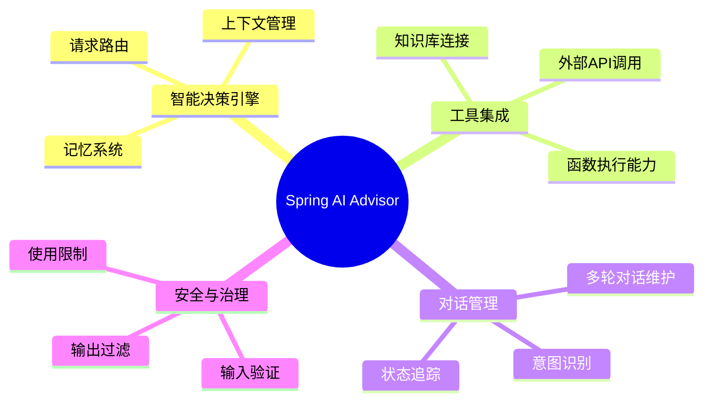
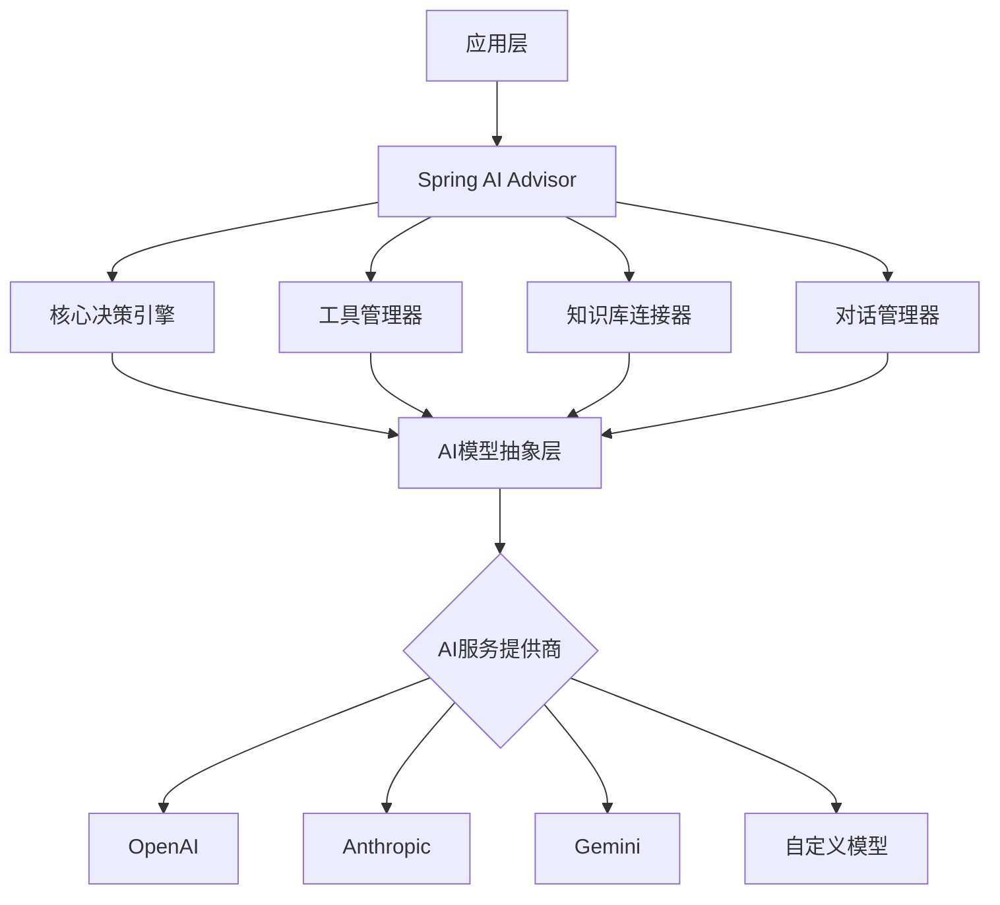

# Spring AI Advisor：智能决策辅助引擎全面指南

## 一、Spring AI Advisor概述

Spring AI Advisor是Spring AI框架中的核心组件，专注于为应用程序提供智能决策支持能力。它通过整合大语言模型(LLMs)的能力，并结合专业领域知识和上下文信息，为开发者提供了构建智能助手和决策支持系统的完整解决方案。

作为Spring生态系统的新成员，Spring AI Advisor融合了Spring框架的优雅设计理念和现代AI技术，让Java开发者能够轻松地在应用中集成智能决策功能。



## 二、Advisor核心架构

Spring AI Advisor采用了模块化的架构设计，由多个协作组件构成，共同实现智能决策流程。

### 2.1 架构层次



### 2.2 核心组件

Advisor由以下关键组件构成：

1. **决策引擎**：协调各组件并执行决策流程
2. **工具管理器**：处理工具注册和调用
3. **知识库连接器**：管理外部知识源集成
4. **对话管理器**：维护多轮对话状态
5. **模型抽象层**：提供统一的模型访问接口

## 三、Advisor配置与初始化

在Spring应用中配置和初始化Advisor非常简单，遵循典型的Spring配置方式。

### 3.1 基本配置

```java
// 导入Spring框架相关注解
import org.springframework.context.annotation.Bean;
import org.springframework.context.annotation.Configuration;
import org.springframework.ai.advisor.Advisor;
import org.springframework.ai.advisor.AdvisorBuilder;
import org.springframework.ai.chat.ChatClient;

// 声明这是一个Spring配置类
@Configuration
public class AdvisorConfig {
    
    // 创建Advisor Bean实例
    @Bean
    public Advisor advisor(ChatClient chatClient) {
        // 使用构建器模式创建Advisor实例
        return AdvisorBuilder.builder()
            // 设置使用的聊天客户端
            .chatClient(chatClient)
            // 配置系统提示，定义Advisor的行为和角色
            .systemPrompt("你是一个专业的Java开发助手，擅长Spring框架相关问题")
            // 设置最大历史记录数量
            .maxHistoryTokens(2000)
            // 开启流式响应支持
            .streamingEnabled(true)
            // 构建Advisor实例
            .build();
    }
}
```

### 3.2 自动配置

通过Spring Boot的自动配置机制，只需添加必要的依赖和配置属性即可快速启用Advisor。

```yaml
spring:
  ai:
    advisor:
      enabled: true
      model: gpt-4
      system-prompt: |
        你是一个专业的Java开发助手，擅长回答Spring框架相关问题。
        请提供准确、简洁且易于理解的回答。
      max-tokens: 4096
      temperature: 0.7
```

## 四、工具集成与扩展

Advisor最强大的功能之一是能够集成各种工具，扩展其能力范围。

### 4.1 工具定义与注册

```java
// 导入工具注解和接口
import org.springframework.ai.advisor.tool.Tool;
import org.springframework.stereotype.Component;

// 使用Component注解标记为Spring组件
@Component
// 使用Tool注解定义一个工具
@Tool("database-query")
public class DatabaseQueryTool {
    
    // 注入数据库操作组件
    private final JdbcTemplate jdbcTemplate;
    
    // 构造函数用于依赖注入
    public DatabaseQueryTool(JdbcTemplate jdbcTemplate) {
        this.jdbcTemplate = jdbcTemplate;
    }
    
    // 执行SQL查询的工具方法
    public List<Map<String, Object>> executeQuery(String sql, Map<String, Object> params) {
        // 参数验证，确保SQL语句不为空
        if (sql == null || sql.isEmpty()) {
            // 返回错误信息
            throw new IllegalArgumentException("SQL语句不能为空");
        }
        
        // 使用JdbcTemplate执行查询
        return jdbcTemplate.queryForList(sql, params);
    }
    
    // 获取数据库表结构的工具方法
    public List<String> getTableStructure(String tableName) {
        // 创建描述表结构的SQL查询
        String sql = "DESCRIBE " + tableName;
        
        // 执行查询并处理结果
        return jdbcTemplate.queryForList(sql).stream()
            .map(row -> row.toString())
            .collect(Collectors.toList());
    }
}
```

### 4.2 工具自动发现

```java
// 导入所需的类和注解
import org.springframework.ai.advisor.Advisor;
import org.springframework.ai.advisor.AdvisorBuilder;
import org.springframework.ai.advisor.tool.ToolRegistry;
import org.springframework.context.annotation.Bean;

// 创建配置类
@Configuration
public class AdvisorToolConfig {
    
    // 创建带有工具的Advisor
    @Bean
    public Advisor toolEnabledAdvisor(ChatClient chatClient, List<Object> tools) {
        // 创建工具注册表
        ToolRegistry toolRegistry = ToolRegistry.builder()
            // 注册所有提供的工具
            .registerAll(tools)
            // 构建工具注册表
            .build();
        
        // 使用构建器创建Advisor
        return AdvisorBuilder.builder()
            // 设置聊天客户端
            .chatClient(chatClient)
            // 注册工具
            .toolRegistry(toolRegistry)
            // 设置系统提示信息
            .systemPrompt("你是一个拥有多种工具的助手，可以帮助用户解决问题")
            // 构建Advisor实例
            .build();
    }
}
```

## 五、记忆与上下文管理

Advisor提供强大的记忆和上下文管理能力，使其能够在多轮对话中保持连贯性。

### 5.1 会话管理

```java
// 导入相关类
import org.springframework.ai.advisor.Advisor;
import org.springframework.ai.advisor.memory.Memory;
import org.springframework.ai.chat.messages.Message;
import org.springframework.ai.chat.messages.UserMessage;

// 创建会话管理类
public class ConversationManager {
    
    // 声明Advisor实例
    private final Advisor advisor;
    
    // 声