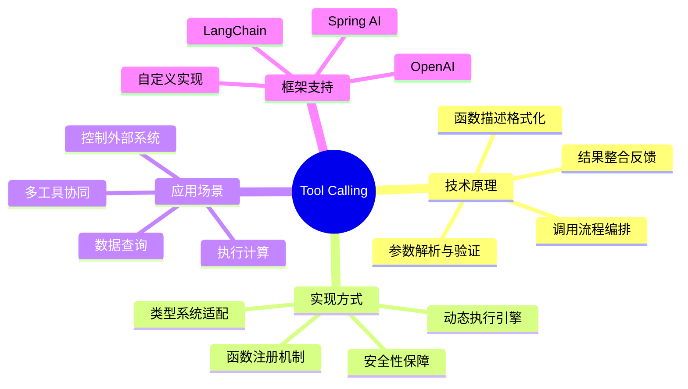
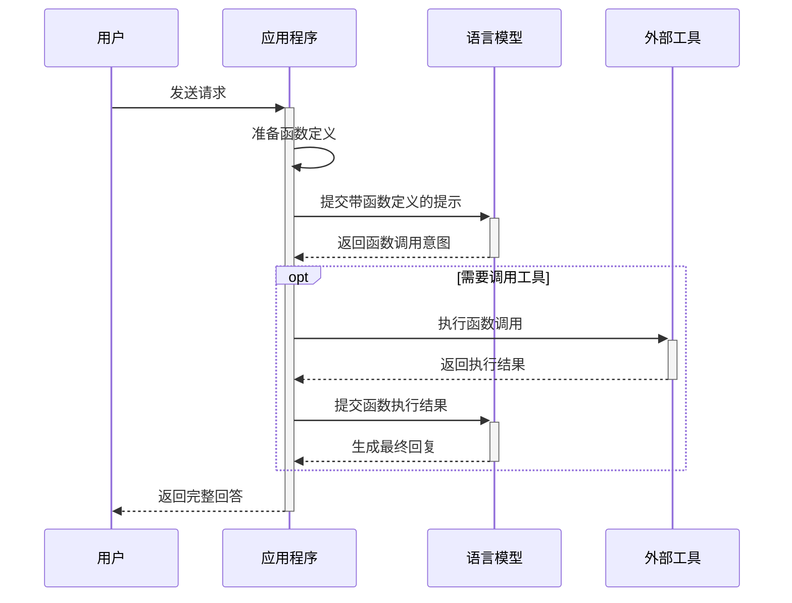
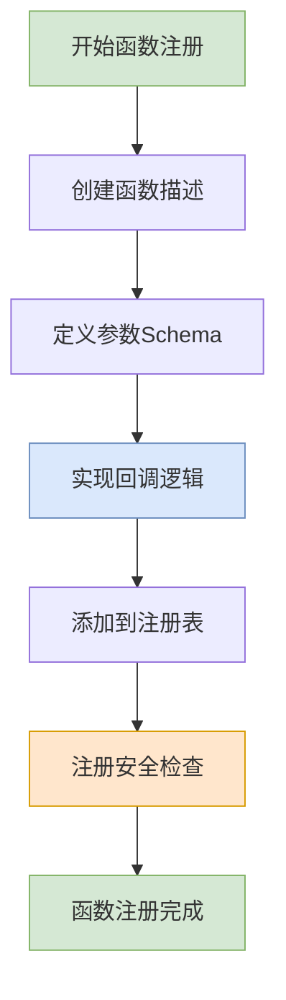
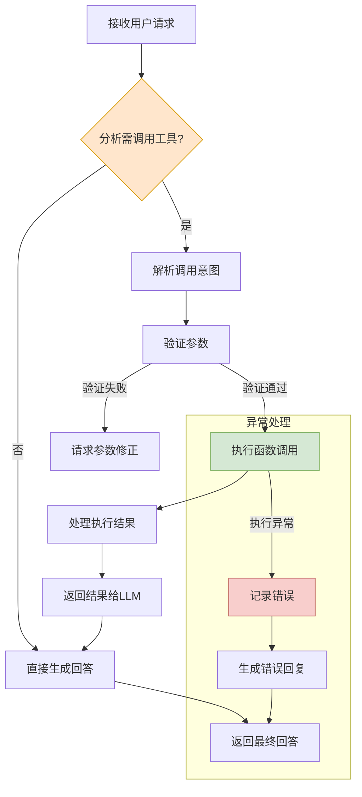
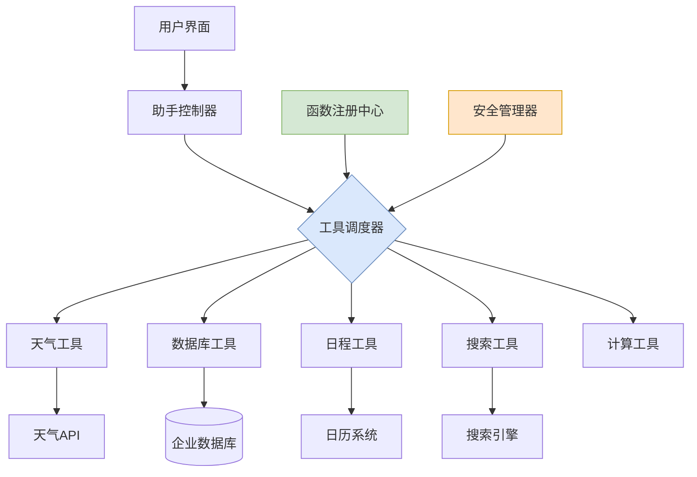
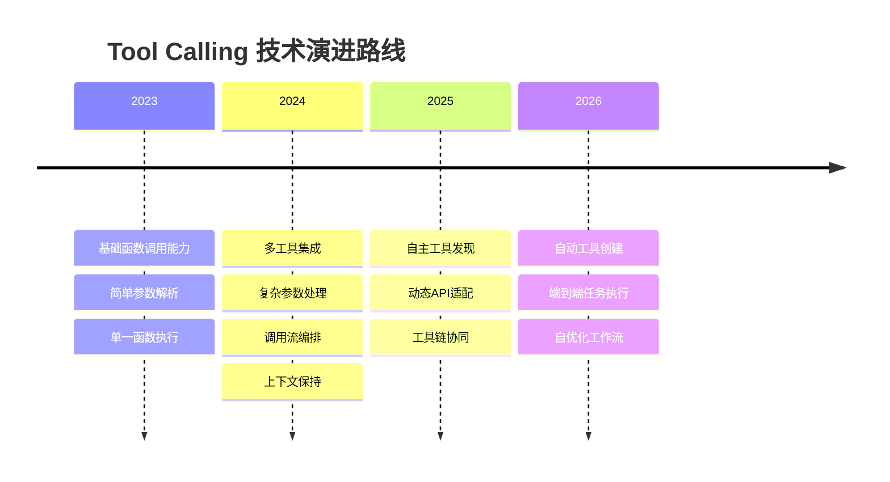

# Tool Calling函数注册与动态执行原理详解

> 本文深入剖析大语言模型Tool Calling的工作原理、函数注册机制和动态执行流程，系统阐述如何在企业级应用中实现AI模型与外部工具的有机融合。通过丰富的示例代码和可视化图表，帮助开发者全面掌握这一关键技术。

## 一、Tool Calling技术概述

### 1.1 什么是Tool Calling

Tool Calling（工具调用）是大语言模型（LLM）的重要能力扩展，允许AI模型根据上下文需要动态调用外部函数、API或服务，从而克服模型本身的局限性，实现与外部系统的交互。



### 1.2 核心工作流程



## 二、函数注册机制深度解析

### 2.1 函数描述与Schema定义

Tool Calling的核心在于向模型提供清晰的函数定义，包括函数名称、描述、参数及其类型。

```java
// 导入所需的Spring AI相关类和接口
import org.springframework.ai.chat.model.ChatResponse;
// 导入函数回调注册相关类
import org.springframework.ai.chat.function.FunctionCallbackRegistry;
// 导入参数定义相关类
import org.springframework.ai.chat.function.FunctionParameter;
// 导入Spring框架相关注解
import org.springframework.stereotype.Service;
// 导入Java工具类
import java.util.Arrays;
import java.util.List;
import java.util.Map;

// 定义工具调用服务类
@Service
public class ToolCallingRegistrationService {

    // 创建函数注册表，存储所有可用工具函数
    public FunctionCallbackRegistry createRegistry() {
        // 使用构建器模式创建函数注册表
        return FunctionCallbackRegistry.builder()
            // 注册第一个工具函数：天气查询
            .withFunction(
                // 函数名称，模型将使用此名称进行调用
                "getWeatherForecast",
                // 函数的详细描述，帮助模型理解何时该使用此函数
                "获取指定城市的实时天气信息，包括温度、湿度和天气状况",
                // 定义函数参数列表
                Arrays.asList(
                    // 第一个参数：城市名
                    new FunctionParameter("city", 
                                         "string", 
                                         "要查询天气的城市名称，如：北京、上海", 
                                         true),
                    // 第二个参数：单位选择（可选）
                    new FunctionParameter("unit", 
                                         "string", 
                                         "温度单位，可选值：celsius（摄氏度）或fahrenheit（华氏度）", 
                                         false)
                ),
                // 实现函数调用逻辑
                params -> {
                    // 从参数中获取城市名
                    String city = params.get("city").toString();
                    // 从参数中获取单位（如果未提供则默认为摄氏度）
                    String unit = params.containsKey("unit") ? params.get("unit").toString() : "celsius";
                    // 调用外部天气服务（实际实现略）
                    return getWeatherData(city, unit);
                }
            )
            // 注册第二个工具函数：数据库查询
            .withFunction(
                // 函数名称
                "queryDatabase",
                // 函数描述
                "查询产品数据库获取商品信息",
                // 参数列表
                Arrays.asList(
                    // 产品类别参数
                    new FunctionParameter("category", 
                                         "string", 
                                         "产品类别，如：电子产品、服装、图书", 
                                         true),
                    // 价格范围参数
                    new FunctionParameter("priceRange", 
                                         "string", 
                                         "价格范围，格式：最低价格-最高价格，如：100-500", 
                                         false)
                ),
                // 实现函数逻辑
                params -> {
                    // 解析参数
                    String category = params.get("category").toString();
                    String priceRange = params.getOrDefault("priceRange", "0-10000").toString();
                    // 调用数据库查询服务（实际实现略）
                    return queryProductDatabase(category, priceRange);
                }
            )
            // 构建函数注册表
            .build();
    }
    
    // 模拟天气数据获取方法
    private Map<String, Object> getWeatherData(String city, String unit) {
        // 实际项目中会调用真实的天气API服务
        // 这里仅作示例
        // ...
        return Map.of("city", city, 
                     "temperature", "26°C", 
                     "humidity", "65%", 
                     "condition", "晴朗");
    }
    
    // 模拟数据库查询方法
    private List<Map<String, Object>> queryProductDatabase(String category, String priceRange) {
        // 实际项目中会查询真实数据库
        // 这里仅作示例
        // ...
        return List.of(
            Map.of("name", "示例产品1", "price", 299, "inStock", true),
            Map.of("name", "示例产品2", "price", 399, "inStock", false)
        );
    }
}
```

### 2.2 函数注册的核心流程



## 三、动态执行引擎实现

### 3.1 执行流程与状态管理

```java
// 导入所需类库
import org.springframework.ai.chat.ChatClient;
// 导入模型配置相关类
import org.springframework.ai.chat.ChatOptions;
// 导入消息类型相关类
import org.springframework.ai.chat.prompt.Prompt;
// 导入系统消息和用户消息类
import org.springframework.ai.chat.prompt.SystemMessage;
import org.springframework.ai.chat.prompt.UserMessage;
// 导入日志记录类
import org.slf4j.Logger;
import org.slf4j.LoggerFactory;

// 定义工具执行服务
@Service
public class ToolExecutionService {
    
    // 创建日志记录器
    private final Logger logger = LoggerFactory.getLogger(ToolExecutionService.class);
    
    // 注入聊天客户端
    private final ChatClient chatClient;
    
    // 注入工具注册服务
    private final ToolCallingRegistrationService registrationService;
    
    // 构造函数依赖注入
    @Autowired
    public ToolExecutionService(ChatClient chatClient, 
                               ToolCallingRegistrationService registrationService) {
        // 保存聊天客户端引用
        this.chatClient = chatClient;
        // 保存工具注册服务引用
        this.registrationService = registrationService;
    }
    
    // 处理用户查询并执行必要的工具调用
    public String processQuery(String userQuery) {
        // 创建系统提示，指导模型如何使用工具
        SystemMessage systemMessage = new SystemMessage(
            "你是一个助手，可以帮助用户回答问题。" +
            "你可以使用提供的工具函数回答有关天气和产品的问题。" +
            "如果需要使用工具，先分析需要调用哪个工具函数，然后调用它。" +
            "对于天气查询，使用getWeatherForecast函数。" +
            "对于产品信息，使用queryDatabase函数。" +
            "不要编造函数调用结果，只使用函数返回的真实信息。"
        );
        
        // 创建用户消息
        UserMessage userMessage = new UserMessage(userQuery);
        
        // 创建完整提示，包含系统消息和用户消息
        Prompt prompt = new Prompt(systemMessage, userMessage);
        
        // 获取函数注册表
        FunctionCallbackRegistry registry = registrationService.createRegistry();
        
        // 创建聊天选项，包含函数回调注册
        ChatOptions options = ChatOptions.builder()
            // 注入函数回调注册表
            .withFunctionCallbacks(registry)
            // 设置较低温度，提高函数调用精确性
            .withTemperature(0.2f)
            // 构建选项对象
            .build();
            
        try {
            // 记录开始处理请求
            logger.info("开始处理用户查询: {}", userQuery);
            
            // 调用模型并传入函数回调
            ChatResponse response = chatClient.call(prompt, options);
            
            // 获取最终回答
            String answer = response.getResult().getOutput().getContent();
            
            // 记录处理完成
            logger.info("查询处理完成，生成回答");
            
            // 返回回答
            return answer;
            
        } catch (Exception e) {
            // 记录错误
            logger.error("处理查询时发生错误: {}", e.getMessage(), e);
            // 返回错误消息
            return "抱歉，处理您的请求时出现了问题：" + e.getMessage();
        }
    }
}
```

### 3.2 调用链路与异常处理



## 四、进阶应用与最佳实践

### 4.1 多模型工具调用适配器

不同AI模型供应商对工具调用的支持有所不同，以下是一个适配器模式实现：

```java
// 导入必要类库
import org.springframework.ai.chat.ChatClient;
// 导入响应模型接口
import org.springframework.ai.chat.model.ChatResponse;
// 导入函数调用相关类
import org.springframework.ai.chat.function.FunctionCallback;
// 导入Java工具类
import java.util.Map;
import java.util.HashMap;
import java.util.function.Function;

// 创建模型适配器接口
public interface ModelToolAdapter {
    // 声明注册工具方法
    void registerTool(String name, String description, Map<String, Object> paramSchema, 
                     Function<Map<String, Object>, Object> handler);
    // 声明执行查询方法
    String executeQuery(String userQuery);
}

// OpenAI模型适配器实现
@Service
public class OpenAIToolAdapter implements ModelToolAdapter {
    
    // 注入OpenAI聊天客户端
    private final ChatClient openaiClient;
    
    // 函数回调注册表构建器
    private FunctionCallbackRegistry.Builder registryBuilder;
    
    // 构造函数
    @Autowired
    public OpenAIToolAdapter(ChatClient openaiClient) {
        // 保存客户端引用
        this.openaiClient = openaiClient;
        // 初始化注册表构建器
        this.registryBuilder = FunctionCallbackRegistry.builder();
    }
    
    // 实现工具注册方法
    @Override
    public void registerTool(String name, String description, 
                           Map<String, Object> paramSchema,
                           Function<Map<String, Object>, Object> handler) {
        // 从参数模式中提取参数定义
        List<FunctionParameter> parameters = extractParameters(paramSchema);
        
        // 添加函数到注册表
        registryBuilder.withFunction(
            // 函数名称
            name,
            // 函数描述
            description,
            // 函数参数列表
            parameters,
            // 函数处理器
            paramMap -> handler.apply(paramMap)
        );
    }
    
    // 执行查询实现
    @Override
    public String executeQuery(String userQuery) {
        // 构建提示
        Prompt prompt = new Prompt(
            // 系统消息，指导模型使用工具
            new SystemMessage("你是一个可以使用工具的AI助手。根据需要调用合适的工具。"),
            // 用户查询
            new UserMessage(userQuery)
        );
        
        // 构建聊天选项
        ChatOptions options = ChatOptions.builder()
            // 设置函数回调注册表
            .withFunctionCallbacks(registryBuilder.build())
            // 构建选项
            .build();
            
        // 调用模型并返回结果
        ChatResponse response = openaiClient.call(prompt, options);
        return response.getResult().getOutput().getContent();
    }
    
    // 辅助方法：从参数模式中提取参数定义
    private List<FunctionParameter> extractParameters(Map<String, Object> paramSchema) {
        // 参数列表
        List<FunctionParameter> params = new ArrayList<>();
        // 遍历参数模式
        for (Map.Entry<String, Object> entry : paramSchema.entrySet()) {
            // 提取参数信息
            @SuppressWarnings("unchecked")
            Map<String, Object> paramInfo = (Map<String, Object>) entry.getValue();
            // 创建参数对象
            params.add(new FunctionParameter(
                // 参数名
                entry.getKey(),
                // 参数类型
                paramInfo.get("type").toString(),
                // 参数描述
                paramInfo.get("description").toString(),
                // 是否必需
                paramInfo.containsKey("required") && (Boolean) paramInfo.get("required")
            ));
        }
        // 返回参数列表
        return params;
    }
}
```

### 4.2 安全与权限控制

```java
// 导入所需类库
import org.springframework.ai.chat.function.FunctionCallbackRegistry;
// 导入安全相关类
import org.springframework.security.core.Authentication;
import org.springframework.security.core.context.SecurityContextHolder;

// 创建安全工具服务
@Service
public class SecureToolService {
    
    // 函数与权限映射
    private final Map<String, String> functionPermissions = Map.of(
        // 天气查询 - 基本权限
        "getWeatherForecast", "ROLE_USER",
        // 数据库查询 - 管理员权限
        "queryDatabase", "ROLE_ADMIN",
        // 系统操作 - 系统管理权限
        "performSystemOperation", "ROLE_SYSTEM_ADMIN"
    );
    
    // 创建安全检查的函数注册表
    public FunctionCallbackRegistry createSecureRegistry(FunctionCallbackRegistry baseRegistry) {
        // 创建新的注册表构建器
        FunctionCallbackRegistry.Builder secureBuilder = FunctionCallbackRegistry.builder();
        
        // 获取所有已注册函数
        Map<String, FunctionCallback> registeredFunctions = baseRegistry.getFunctions();
        
        // 为每个函数添加安全包装
        for (Map.Entry<String, FunctionCallback> entry : registeredFunctions.entrySet()) {
            // 获取函数名和回调
            String functionName = entry.getKey();
            FunctionCallback originalCallback = entry.getValue();
            
            // 创建安全包装的回调
            FunctionCallback secureCallback = new FunctionCallback(
                // 保持原函数名
                originalCallback.getName(),
                // 保持原描述
                originalCallback.getDescription(),
                // 保持原参数列表
                originalCallback.getParameters(),
                // 创建安全代理处理器
                params -> {
                    // 检查是否有权限执行此函数
                    if (hasPermission(functionName)) {
                        // 有权限，执行原函数
                        return originalCallback.getHandler().apply(params);
                    } else {
                        // 无权限，返回错误
                        return Map.of(
                            "error", "权限不足",
                            "message", "您没有执行" + functionName + "的权限"
                        );
                    }
                }
            );
            
            // 添加安全包装的函数到新注册表
            secureBuilder.withFunction(secureCallback);
        }
        
        // 构建安全注册表
        return secureBuilder.build();
    }
    
    // 检查当前用户是否有权限执行函数
    private boolean hasPermission(String functionName) {
        // 获取所需权限
        String requiredRole = functionPermissions.getOrDefault(functionName, "ROLE_ADMIN");
        
        // 获取当前认证信息
        Authentication auth = SecurityContextHolder.getContext().getAuthentication();
        
        // 如果未认证，拒绝访问
        if (auth == null) {
            return false;
        }
        
        // 检查是否有所需权限
        return auth.getAuthorities().stream()
            .anyMatch(ga -> ga.getAuthority().equals(requiredRole));
    }
    
    // 记录工具调用日志
    public void logToolInvocation(String functionName, Map<String, Object> params, Object result) {
        // 获取当前用户
        Authentication auth = SecurityContextHolder.getContext().getAuthentication();
        String username = auth != null ? auth.getName() : "anonymous";
        
        // 记录调用信息
        log.info("工具调用: 函数={}, 用户={}, 参数={}", 
                functionName, username, params);
        
        // 敏感操作额外审计
        if (functionName.startsWith("perform") || functionName.contains("write")) {
            log.warn("敏感操作: 函数={}, 用户={}, 参数={}, 结果={}",
                    functionName, username, params, result);
        }
    }
}
```

## 五、实战案例：多功能智能助手

### 5.1 工具集成架构



### 5.2 完整实现代码

```java
// 导入所需类库
import org.springframework.ai.chat.ChatClient;
import org.springframework.ai.chat.ChatOptions;
import org.springframework.ai.chat.model.ChatResponse;
import org.springframework.ai.chat.function.FunctionCallbackRegistry;
import org.springframework.ai.chat.prompt.Prompt;
import org.springframework.ai.chat.prompt.SystemMessage;
import org.springframework.ai.chat.prompt.UserMessage;
import org.springframework.web.bind.annotation.*;
import org.springframework.beans.factory.annotation.Autowired;
import org.springframework.stereotype.Component;

// 创建智能助手控制器
@RestController
@RequestMapping("/api/assistant")
public class SmartAssistantController {
    
    // 注入服务
    private final AssistantService assistantService;
    
    // 构造函数注入
    @Autowired
    public SmartAssistantController(AssistantService assistantService) {
        // 保存服务引用
        this.assistantService = assistantService;
    }
    
    // 创建聊天端点
    @PostMapping("/chat")
    public Map<String, Object> chat(@RequestBody Map<String, String> request) {
        // 获取用户消息
        String userMessage = request.get("message");
        // 获取用户ID
        String userId = request.getOrDefault("userId", "anonymous");
        
        // 调用助手服务处理消息
        String response = assistantService.processUserMessage(userId, userMessage);
        
        // 构建响应
        Map<String, Object> result = new HashMap<>();
        // 添加回复文本
        result.put("response", response);
        // 添加时间戳
        result.put("timestamp", System.currentTimeMillis());
        
        // 返回结果
        return result;
    }
}

// 创建助手服务
@Service
@RequiredArgsConstructor
public class AssistantService {
    
    // 注入聊天客户端
    private final ChatClient chatClient;
    
    // 注入工具服务
    private final WeatherToolService weatherService;
    private final DatabaseToolService databaseService;
    private final CalendarToolService calendarService;
    private final CalculationToolService calculationService;
    
    // 用户会话存储
    private final Map<String, List<Message>> sessionStore = new ConcurrentHashMap<>();
    
    // 处理用户消息
    public String processUserMessage(String userId, String message) {
        // 获取或创建用户会话
        List<Message> conversation = sessionStore.computeIfAbsent(
            // 用户ID
            userId,
            // 如果不存在则创建新会话
            k -> new ArrayList<>()
        );
        
        // 添加用户消息到会话
        conversation.add(new UserMessage(message));
        
        // 如果会话过长则裁剪
        if (conversation.size() > 20) {
            // 保留最近10条消息
            conversation = new ArrayList<>(conversation.subList(
                conversation.size() - 10, conversation.size()));
            // 更新会话存储
            sessionStore.put(userId, conversation);
        }
        
        // 创建系统消息
        SystemMessage systemMessage = new SystemMessage(
            "你是一个智能助手，能够帮助用户回答问题和完成任务。" +
            "你可以使用以下工具：\n" +
            "1. getWeather - 查询天气信息\n" +
            "2. queryDatabase - 查询产品数据\n" +
            "3. createEvent - 创建日历事件\n" +
            "4. calculate - 执行复杂计算\n" +
            "根据用户需求选择合适的工具，或直接回答。"
        );
        
        // 创建完整对话列表
        List<Message> fullConversation = new ArrayList<>();
        // 添加系统消息
        fullConversation.add(systemMessage);
        // 添加历史会话
        fullConversation.addAll(conversation);
        
        // 创建提示
        Prompt prompt = new Prompt(fullConversation);
        
        // 创建工具注册表
        FunctionCallbackRegistry registry = createToolRegistry();
        
        // 创建聊天选项
        ChatOptions options = ChatOptions.builder()
            // 添加工具注册表
            .withFunctionCallbacks(registry)
            // 设置温度参数
            .withTemperature(0.7f)
            // 构建选项
            .build();
        
        try {
            // 调用模型获取回复
            ChatResponse response = chatClient.call(prompt, options);
            
            // 获取回复内容
            String aiResponse = response.getResult().getOutput().getContent();
            
            // 添加AI回复到会话
            conversation.add(new AssistantMessage(aiResponse));
            
            // 返回回复
            return aiResponse;
        }
        catch (Exception e) {
            // 记录错误
            log.error("处理消息时出错: {}", e.getMessage(), e);
            // 返回错误消息
            return "抱歉，我处理您的请求时遇到了问题: " + e.getMessage();
        }
    }
    
    // 创建工具注册表
    private FunctionCallbackRegistry createToolRegistry() {
        return FunctionCallbackRegistry.builder()
            // 添加天气工具
            .withFunction(
                // 函数名称
                "getWeather",
                // 函数描述
                "查询指定城市的天气信息",
                // 参数列表
                List.of(
                    // 城市参数
                    new FunctionParameter(
                        "city", 
                        "string", 
                        "要查询天气的城市名称", 
                        true
                    )
                ),
                // 处理函数
                params -> weatherService.getWeather(params.get("city").toString())
            )
            // 添加数据库查询工具
            .withFunction(
                // 函数名称
                "queryDatabase",
                // 函数描述
                "查询产品数据库",
                // 参数列表
                List.of(
                    // 类别参数
                    new FunctionParameter(
                        "category", 
                        "string", 
                        "产品类别", 
                        true
                    ),
                    // 价格限制参数
                    new FunctionParameter(
                        "maxPrice", 
                        "number", 
                        "最高价格", 
                        false
                    )
                ),
                // 处理函数
                params -> {
                    // 获取类别
                    String category = params.get("category").toString();
                    // 获取价格限制，默认无限制
                    Double maxPrice = params.containsKey("maxPrice") 
                        ? Double.parseDouble(params.get("maxPrice").toString())
                        : Double.MAX_VALUE;
                    // 调用数据库服务
                    return databaseService.queryProducts(category, maxPrice);
                }
            )
            // 添加日历工具
            .withFunction(
                // 函数名称
                "createEvent",
                // 函数描述
                "在日历中创建新事件",
                // 参数列表
                List.of(
                    // 事件标题
                    new FunctionParameter(
                        "title", 
                        "string", 
                        "事件标题", 
                        true
                    ),
                    // 事件日期
                    new FunctionParameter(
                        "date", 
                        "string", 
                        "事件日期，格式YYYY-MM-DD", 
                        true
                    ),
                    // 事件时间
                    new FunctionParameter(
                        "time", 
                        "string", 
                        "事件时间，格式HH:MM", 
                        true
                    )
                ),
                // 处理函数
                params -> calendarService.createEvent(
                    params.get("title").toString(),
                    params.get("date").toString(),
                    params.get("time").toString()
                )
            )
            // 添加计算工具
            .withFunction(
                // 函数名称
                "calculate",
                // 函数描述
                "执行数学计算",
                // 参数列表
                List.of(
                    // 表达式参数
                    new FunctionParameter(
                        "expression", 
                        "string", 
                        "数学表达式", 
                        true
                    )
                ),
                // 处理函数
                params -> calculationService.evaluate(
                    params.get("expression").toString()
                )
            )
            // 构建注册表
            .build();
    }
}
```

## 六、未来展望与技术趋势

随着LLM技术的快速发展，Tool Calling将朝着以下方向演进：

1. **自主工具发现与API适配**：模型能够自主发现可用工具和学习使用新API
2. **多工具协同解决复杂任务**：模型能够协调多个工具共同完成复杂工作流
3. **自动化工具创建**：动态生成新工具函数来扩展自身能力
4. **精细的上下文理解**：更精准地理解何时以及如何使用工具



## 七、总结

Tool Calling 函数注册与动态执行机制是现代AI应用的核心能力，通过将AI模型与外部工具、系统和数据源相连接，极大扩展了模型的实用性和适用场景。Spring AI等框架通过提供统一的抽象层，使得这一复杂功能变得易于实现和管理。

企业在实施过程中，应特别注重以下几点：

1. 函数定义的清晰度与完备性
2. 安全权限控制与访问审计
3. 异常处理与优雅降级
4. 性能优化与响应速度

通过掌握Tool Calling技术，开发者能够构建真正实用的、能够与现实世界交互的智能应用，为用户提供更高效、更精准的服务。

---

> 参考资料：
> 1. Spring AI官方文档
> 2. OpenAI Function Calling API文档
> 3. LangChain Tool Integration指南
> 4. "Building AI Applications with Spring AI" - Spring社区文章

