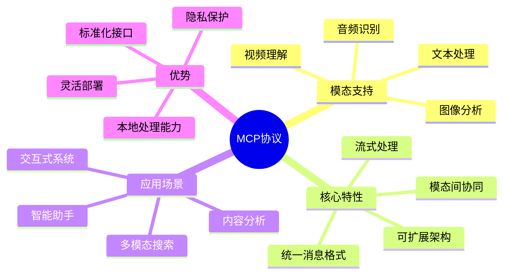
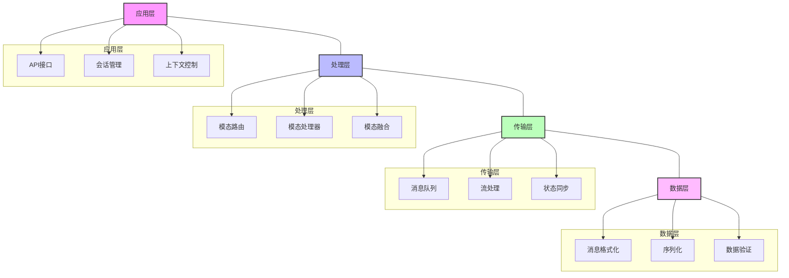
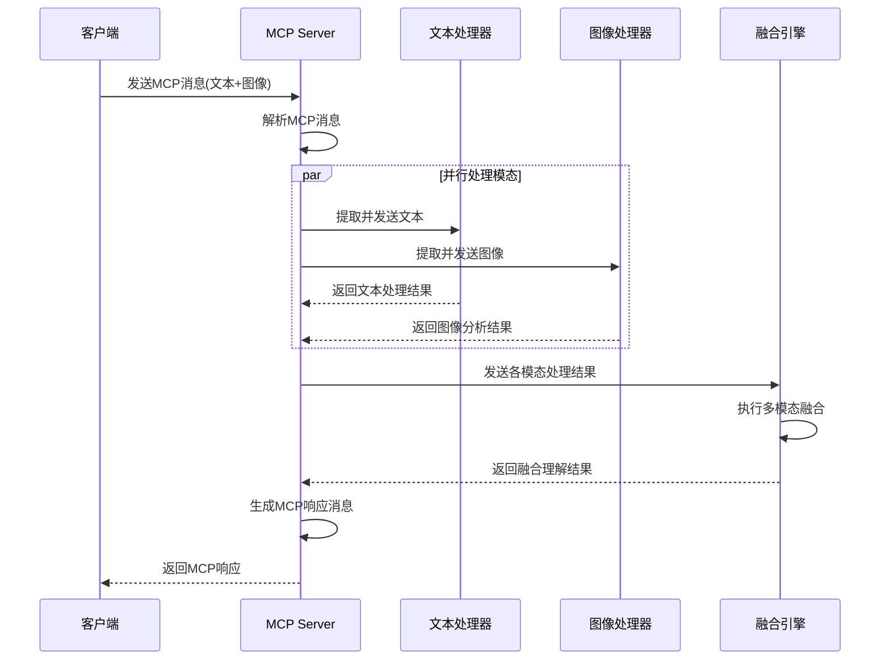
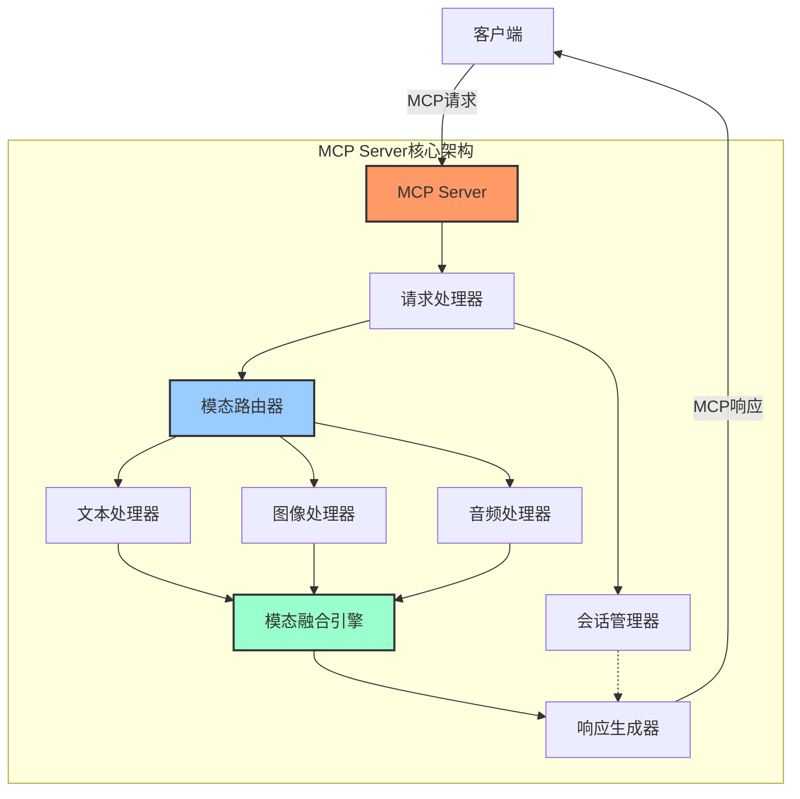
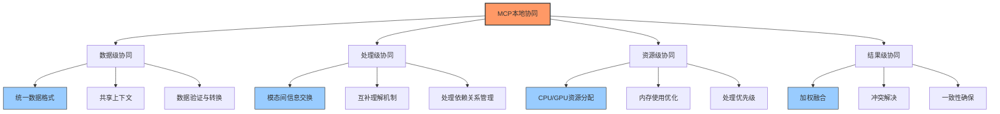
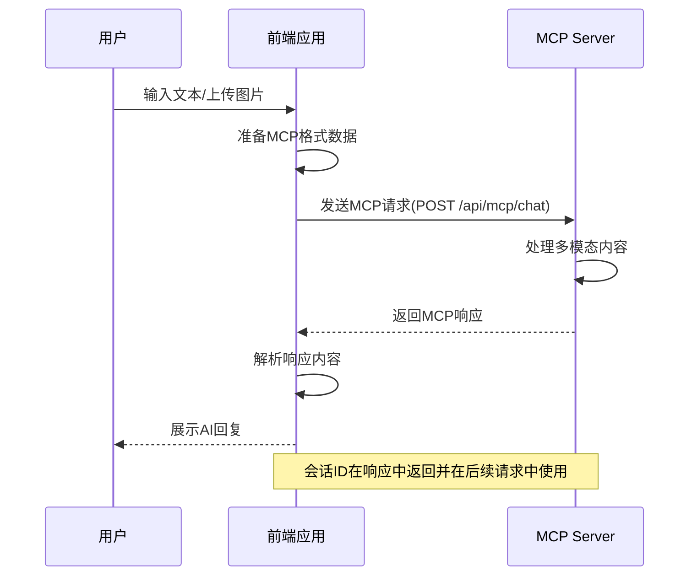

# Spring AI MCP深度解析及MCP Server本地协同

> 随着人工智能技术的飞速发展，多模态交互已成为AI系统的核心竞争力。Spring AI通过MCP(Multi-modal Chat Protocol)协议提供了灵活而强大的多模态处理能力。本文将深入剖析MCP协议的设计原理、架构特性及其本地协同机制，并通过丰富的代码示例、图表展示如何在实际应用中构建高性能的多模态AI系统。

## 一、MCP协议概述

### 1.1 什么是MCP

MCP(Multi-modal Chat Protocol)是Spring AI提供的一种专门用于处理多模态交互的协议规范，旨在统一不同类型数据（文本、图像、音频等）的处理流程，实现模态间的无缝协同。



### 1.2 设计目标与核心价值

MCP协议的设计目标是为多模态AI系统提供统一的通信规范和处理框架，主要解决以下问题：

1. **异构数据处理**：统一处理文本、图像、音频等不同类型的数据
2. **模态融合**：实现不同模态间的信息融合和协同理解
3. **部署灵活性**：支持云端或本地部署，适应不同场景需求
4. **隐私保护**：通过本地部署降低数据泄露风险
5. **高效协同**：优化多模态处理的性能和资源利用

## 二、MCP协议架构与原理

### 2.1 协议层次结构

MCP协议采用分层设计，从底层到高层涵盖数据格式、传输机制、处理流程和应用接口。



### 2.2 MCP消息格式

MCP定义了统一的消息结构，用于封装不同类型的模态数据：

```java
// 导入所需的Java类库
import java.util.List;
// 导入日期处理类
import java.time.Instant;
// 导入Spring框架相关注解
import org.springframework.stereotype.Component;
// 导入Jackson序列化相关注解
import com.fasterxml.jackson.annotation.JsonProperty;

// 定义MCP消息类，表示多模态消息的基本结构
public class MCPMessage {
    // 消息唯一标识符
    private String id;
    // 消息发送者角色，如"user"或"assistant"
    private String role;
    // 消息创建的时间戳
    private long timestamp;
    // 消息内容列表，支持多种模态内容
    private List<MCPContent> content;
    // 消息元数据，包含额外信息
    private MCPMetadata metadata;
    
    // 消息构造函数
    public MCPMessage(String id, String role, List<MCPContent> content) {
        // 设置消息ID
        this.id = id;
        // 设置消息角色
        this.role = role;
        // 设置当前时间戳
        this.timestamp = Instant.now().getEpochSecond();
        // 设置消息内容
        this.content = content;
        // 创建默认元数据
        this.metadata = new MCPMetadata();
    }
    
    // 其他getter和setter方法
}

// 定义消息内容类，表示一种模态的内容
public class MCPContent {
    // 内容类型，如"text"、"image"、"audio"等
    private String type;
    // 内容格式，如文本类型为"plain"，图片可以是"base64"等
    private String format;
    // 实际内容值
    private Object value;
    
    // 构造文本内容的工厂方法
    public static MCPContent createTextContent(String text) {
        // 创建新的MCPContent实例
        MCPContent content = new MCPContent();
        // 设置类型为文本
        content.type = "text";
        // 设置格式为纯文本
        content.format = "plain";
        // 设置文本内容
        content.value = text;
        // 返回创建的内容对象
        return content;
    }
    
    // 构造图像内容的工厂方法
    public static MCPContent createImageContent(String base64Image) {
        // 创建新的MCPContent实例
        MCPContent content = new MCPContent();
        // 设置类型为图像
        content.type = "image";
        // 设置格式为base64编码
        content.format = "base64";
        // 设置图像的base64编码内容
        content.value = base64Image;
        // 返回创建的内容对象
        return content;
    }
    
    // 其他getter和setter方法
}

// 定义元数据类，包含消息的额外信息
public class MCPMetadata {
    // 消息来源，如"web"、"mobile"等
    private String source;
    // 消息语言
    private String language;
    // 处理指令，如特定的模型参数
    private Object instructions;
    
    // 默认构造函数
    public MCPMetadata() {
        // 设置默认来源
        this.source = "api";
        // 设置默认语言为英语
        this.language = "en-US";
    }
    
    // 其他getter和setter方法
}
```

### 2.3 协议工作流程

MCP协议定义了明确的消息处理流程，从接收多模态输入到生成响应的完整链路：



## 三、MCP Server核心架构

### 3.1 整体架构设计

MCP Server采用模块化设计，通过不同组件的协同工作，实现多模态数据的高效处理。



### 3.2 核心组件详解

#### 3.2.1 请求处理器

请求处理器负责接收和解析MCP请求，验证消息格式，并进行必要的预处理。

```java
// 导入必要的Java类
import org.springframework.stereotype.Component;
// 导入Spring Web相关类
import org.springframework.web.bind.annotation.*;
// 导入日志相关类
import org.slf4j.Logger;
import org.slf4j.LoggerFactory;
// 导入验证相关类
import javax.validation.Valid;

// 定义请求处理器组件
@Component
@RestController
@RequestMapping("/api/mcp")
public class MCPRequestProcessor {
    // 创建日志记录器
    private final Logger logger = LoggerFactory.getLogger(MCPRequestProcessor.class);
    
    // 注入模态路由器
    private final ModalityRouter modalityRouter;
    
    // 注入会话管理器
    private final SessionManager sessionManager;
    
    // 构造函数，通过依赖注入获取所需组件
    public MCPRequestProcessor(ModalityRouter modalityRouter, SessionManager sessionManager) {
        // 初始化模态路由器
        this.modalityRouter = modalityRouter;
        // 初始化会话管理器
        this.sessionManager = sessionManager;
        // 记录组件初始化日志
        logger.info("MCPRequestProcessor initialized");
    }
    
    // 处理MCP聊天请求的REST API端点
    @PostMapping("/chat")
    public MCPMessage processChat(@Valid @RequestBody MCPMessage request) {
        // 记录收到的请求日志
        logger.info("Received MCP request: {}", request.getId());
        
        // 验证请求格式
        validateRequest(request);
        
        // 获取或创建会话
        String sessionId = request.getMetadata().getSessionId();
        // 如果会话ID为空，创建新会话
        if (sessionId == null || sessionId.isEmpty()) {
            // 创建新会话并获取ID
            sessionId = sessionManager.createSession();
            // 设置会话ID到请求元数据
            request.getMetadata().setSessionId(sessionId);
        }
        
        // 更新会话状态
        sessionManager.updateSession(sessionId, request);
        
        try {
            // 通过模态路由器处理请求
            MCPMessage response = modalityRouter.route(request);
            // 记录处理完成日志
            logger.info("Processed MCP request: {}", request.getId());
            // 返回响应
            return response;
        } catch (Exception e) {
            // 记录错误日志
            logger.error("Error processing MCP request: {}", e.getMessage(), e);
            // 返回错误响应
            return createErrorResponse(request, e);
        }
    }
    
    // 验证请求的辅助方法
    private void validateRequest(MCPMessage request) {
        // 检查请求ID是否存在
        if (request.getId() == null || request.getId().isEmpty()) {
            // ID为空则抛出异常
            throw new IllegalArgumentException("Request ID cannot be empty");
        }
        
        // 检查角色是否有效
        if (!"user".equals(request.getRole())) {
            // 角色无效则抛出异常
            throw new IllegalArgumentException("Invalid role: " + request.getRole() + ", expected 'user'");
        }
        
        // 检查内容是否为空
        if (request.getContent() == null || request.getContent().isEmpty()) {
            // 内容为空则抛出异常
            throw new IllegalArgumentException("Request content cannot be empty");
        }
    }
    
    // 创建错误响应的辅助方法
    private MCPMessage createErrorResponse(MCPMessage request, Exception e) {
        // 创建错误内容
        List<MCPContent> errorContent = List.of(
            MCPContent.createTextContent("Error processing request: " + e.getMessage())
        );
        
        // 创建错误响应消息
        MCPMessage errorResponse = new MCPMessage(
            // 生成响应ID
            "res_" + request.getId(),
            // 设置角色为assistant
            "assistant",
            // 设置错误内容
            errorContent
        );
        
        // 复制原请求的会话ID到响应中
        errorResponse.getMetadata().setSessionId(
            request.getMetadata().getSessionId()
        );
        
        // 返回错误响应
        return errorResponse;
    }
}
```

#### 3.2.2 模态路由器

模态路由器负责将不同类型的模态内容分发到对应的处理器，是MCP Server的核心调度组件。

```java
// 导入所需的Java类库
import org.springframework.stereotype.Component;
// 导入集合类
import java.util.ArrayList;
import java.util.List;
import java.util.Map;
import java.util.HashMap;
// 导入并发处理相关类
import java.util.concurrent.CompletableFuture;
import java.util.concurrent.ExecutorService;
import java.util.concurrent.Executors;
// 导入日志相关类
import org.slf4j.Logger;
import org.slf4j.LoggerFactory;

// 定义模态路由器组件
@Component
public class ModalityRouter {
    // 创建日志记录器
    private final Logger logger = LoggerFactory.getLogger(ModalityRouter.class);
    
    // 注册不同模态的处理器
    private final Map<String, ModalityProcessor> processors;
    
    // 创建线程池用于并行处理
    private final ExecutorService executorService;
    
    // 注入模态融合引擎
    private final ModalityFusionEngine fusionEngine;
    
    // 构造函数
    public ModalityRouter(TextProcessor textProcessor, 
                         ImageProcessor imageProcessor,
                         AudioProcessor audioProcessor,
                         ModalityFusionEngine fusionEngine) {
        // 初始化处理器映射
        this.processors = new HashMap<>();
        // 注册文本处理器
        processors.put("text", textProcessor);
        // 注册图像处理器
        processors.put("image", imageProcessor);
        // 注册音频处理器
        processors.put("audio", audioProcessor);
        
        // 创建线程池，线程数量为处理器数量的2倍
        this.executorService = Executors.newFixedThreadPool(
            Runtime.getRuntime().availableProcessors() * 2
        );
        
        // 初始化融合引擎
        this.fusionEngine = fusionEngine;
        
        // 记录初始化日志
        logger.info("ModalityRouter initialized with {} processors", processors.size());
    }
    
    // 路由和处理MCP消息的主方法
    public MCPMessage route(MCPMessage request) {
        // 记录开始处理请求的日志
        logger.info("Routing request: {}", request.getId());
        
        // 收集处理结果的列表
        List<CompletableFuture<ProcessingResult>> futures = new ArrayList<>();
        
        // 遍历所有内容项
        for (MCPContent content : request.getContent()) {
            // 获取内容类型
            String modalityType = content.getType();
            // 查找对应的处理器
            ModalityProcessor processor = processors.get(modalityType);
            
            // 检查处理器是否存在
            if (processor == null) {
                // 记录未知模态类型的警告
                logger.warn("Unknown modality type: {}", modalityType);
                // 继续处理下一项
                continue;
            }
            
            // 创建异步任务处理当前内容
            CompletableFuture<ProcessingResult> future = CompletableFuture.supplyAsync(() -> {
                try {
                    // 记录开始处理特定内容的日志
                    logger.debug("Processing {} content", modalityType);
                    // 调用处理器处理内容
                    return processor.process(content, request.getMetadata());
                } catch (Exception e) {
                    // 记录处理错误日志
                    logger.error("Error processing {} content: {}", modalityType, e.getMessage(), e);
                    // 抛出运行时异常
                    throw new RuntimeException("Error processing " + modalityType + " content", e);
                }
            }, executorService);
            
            // 将异步任务添加到列表
            futures.add(future);
        }
        
        try {
            // 等待所有异步任务完成并收集结果
            List<ProcessingResult> results = futures.stream()
                // 等待每个Future完成并获取结果
                .map(CompletableFuture::join)
                // 收集为列表
                .toList();
            
            // 使用融合引擎合并结果
            MCPContent fusedContent = fusionEngine.fuseResults(results, request.getMetadata());
            
            // 构建响应消息
            MCPMessage response = new MCPMessage(
                // 生成响应ID
                "res_" + request.getId(),
                // 设置角色为assistant
                "assistant",
                // 包装融合结果为内容列表
                List.of(fusedContent)
            );
            
            // 复制原请求的会话ID到响应中
            response.getMetadata().setSessionId(
                request.getMetadata().getSessionId()
            );
            
            // 记录路由完成日志
            logger.info("Routing completed for request: {}", request.getId());
            
            // 返回响应
            return response;
        } catch (Exception e) {
            // 记录处理失败日志
            logger.error("Failed to process request: {}", e.getMessage(), e);
            // 抛出运行时异常
            throw new RuntimeException("Failed to process MCP request", e);
        }
    }
    
    // 应用关闭时清理资源
    @PreDestroy
    public void cleanup() {
        // 关闭线程池
        executorService.shutdown();
        // 记录资源清理日志
        logger.info("ModalityRouter resources cleaned up");
    }
}
```

#### 3.2.3 模态处理器接口

模态处理器定义了处理特定类型模态内容的标准接口。

```java
// 定义模态处理器接口
public interface ModalityProcessor {
    // 定义处理方法，接收内容和元数据，返回处理结果
    ProcessingResult process(MCPContent content, MCPMetadata metadata);
}

// 处理结果类，封装处理器的输出
public class ProcessingResult {
    // 处理的模态类型
    private final String modalityType;
    // 处理后的内容
    private final Object result;
    // 处理的置信度得分
    private final double confidence;
    
    // 构造函数
    public ProcessingResult(String modalityType, Object result, double confidence) {
        // 设置模态类型
        this.modalityType = modalityType;
        // 设置处理结果
        this.result = result;
        // 设置置信度
        this.confidence = confidence;
    }
    
    // Getter方法
    public String getModalityType() {
        return modalityType;
    }
    
    public Object getResult() {
        return result;
    }
    
    public double getConfidence() {
        return confidence;
    }
}
```

## 四、本地协同机制详解

### 4.1 本地协同原理

MCP Server的本地协同机制主要通过以下几个层面实现：

1. **数据级协同**：统一数据格式，共享处理上下文
2. **处理级协同**：模态间信息交换，互补理解
3. **资源级协同**：根据硬件资源动态调整处理策略
4. **结果级协同**：融合不同模态处理结果，生成一致理解



### 4.2 多模态融合引擎

融合引擎是本地协同的核心，负责整合各模态处理结果，生成统一的理解。

```java
// 导入所需的Java类库
import org.springframework.stereotype.Component;
// 导入集合类
import java.util.List;
import java.util.Map;
import java.util.HashMap;
// 导入日志相关类
import org.slf4j.Logger;
import org.slf4j.LoggerFactory;
// 导入机器学习相关类(示例)
import org.springframework.ai.fusion.ModelFusion;

// 定义模态融合引擎组件
@Component
public class ModalityFusionEngine {
    // 创建日志记录器
    private final Logger logger = LoggerFactory.getLogger(ModalityFusionEngine.class);
    
    // 可选：注入机器学习融合模型
    private final ModelFusion fusionModel;
    
    // 构造函数
    public ModalityFusionEngine(ModelFusion fusionModel) {
        // 初始化融合模型
        this.fusionModel = fusionModel;
        // 记录初始化日志
        logger.info("ModalityFusionEngine initialized");
    }
    
    // 融合处理结果的方法
    public MCPContent fuseResults(List<ProcessingResult> results, MCPMetadata metadata) {
        // 记录开始融合的日志
        logger.info("Fusing {} modality results", results.size());
        
        // 如果只有一个结果，直接返回
        if (results.size() == 1) {
            // 获取单一结果
            ProcessingResult singleResult = results.get(0);
            // 转换为MCPContent格式返回
            return MCPContent.createTextContent(
                singleResult.getResult().toString()
            );
        }
        
        // 按模态类型分组结果
        Map<String, Object> modalityResults = new HashMap<>();
        // 记录各模态的置信度
        Map<String, Double> confidenceScores = new HashMap<>();
        
        // 遍历所有处理结果
        for (ProcessingResult result : results) {
            // 获取模态类型
            String modalityType = result.getModalityType();
            // 存储结果
            modalityResults.put(modalityType, result.getResult());
            // 存储置信度
            confidenceScores.put(modalityType, result.getConfidence());
        }
        
        // 使用融合模型生成融合结果
        if (fusionModel != null) {
            try {
                // 调用模型执行融合
                String fusedContent = fusionModel.fuse(modalityResults, confidenceScores, metadata);
                // 记录模型融合完成日志
                logger.info("Model-based fusion completed successfully");
                // 返回融合结果
                return MCPContent.createTextContent(fusedContent);
            } catch (Exception e) {
                // 记录模型融合失败日志
                logger.error("Model-based fusion failed, falling back to rule-based fusion: {}", e.getMessage(), e);
                // 出错时降级到规则融合
            }
        }
        
        // 规则融合(备选方案)
        String fusedContent = performRuleBasedFusion(modalityResults, confidenceScores);
        // 记录规则融合完成日志
        logger.info("Rule-based fusion completed");
        // 返回融合结果
        return MCPContent.createTextContent(fusedContent);
    }
    
    // 基于规则的融合逻辑
    private String performRuleBasedFusion(Map<String, Object> results, Map<String, Double> confidences) {
        // 初始化融合结果构建器
        StringBuilder fusedResult = new StringBuilder();
        
        // 处理文本内容(如果存在)
        if (results.containsKey("text")) {
            // 添加文本内容
            fusedResult.append(results.get("text").toString());
        }
        
        // 处理图像内容(如果存在)
        if (results.containsKey("image")) {
            // 如果已经有内容，添加连接词
            if (fusedResult.length() > 0) {
                fusedResult.append("\n\n另外，基于图像分析: ");
            } else {
                // 否则直接添加前缀
                fusedResult.append("基于图像分析: ");
            }
            // 添加图像分析结果
            fusedResult.append(results.get("image").toString());
        }
        
        // 处理音频内容(如果存在)
        if (results.containsKey("audio")) {
            // 如果已经有内容，添加连接词
            if (fusedResult.length() > 0) {
                fusedResult.append("\n\n此外，从音频中检测到: ");
            } else {
                // 否则直接添加前缀
                fusedResult.append("从音频中检测到: ");
            }
            // 添加音频处理结果
            fusedResult.append(results.get("audio").toString());
        }
        
        // 返回融合后的文本
        return fusedResult.toString();
    }
}
```

### 4.3 本地资源管理

MCP Server通过智能资源管理确保在本地环境中高效运行。

```java
// 导入所需的Java类库
import org.springframework.stereotype.Component;
// 导入线程相关类
import java.util.concurrent.Executors;
import java.util.concurrent.ExecutorService;
import java.util.concurrent.ThreadPoolExecutor;
// 导入日志相关类
import org.slf4j.Logger;
import org.slf4j.LoggerFactory;
// 导入资源监控相关类
import java.lang.management.ManagementFactory;
import java.lang.management.MemoryMXBean;
import com.sun.management.OperatingSystemMXBean;

// 定义资源管理器组件
@Component
public class LocalResourceManager {
    // 创建日志记录器
    private final Logger logger = LoggerFactory.getLogger(LocalResourceManager.class);
    
    // 处理器核心数
    private final int availableCores;
    // CPU阈值
    private final double cpuThreshold = 0.8; // 80%
    // 内存阈值
    private final double memoryThreshold = 0.7; // 70%
    
    // 线程池
    private final ThreadPoolExecutor executorService;
    // 操作系统MXBean，用于监控系统资源
    private final OperatingSystemMXBean osMXBean;
    // 内存MXBean，用于监控JVM内存
    private final MemoryMXBean memoryMXBean;
    
    // 构造函数
    public LocalResourceManager() {
        // 获取可用核心数
        this.availableCores = Runtime.getRuntime().availableProcessors();
        // 初始化线程池，核心线程数为可用核心数
        this.executorService = (ThreadPoolExecutor) Executors.newFixedThreadPool(availableCores);
        // 获取操作系统MXBean
        this.osMXBean = (OperatingSystemMXBean) ManagementFactory.getOperatingSystemMXBean();
        // 获取内存MXBean
        this.memoryMXBean = ManagementFactory.getMemoryMXBean();
        
        // 记录初始化信息
        logger.info("LocalResourceManager initialized with {} cores", availableCores);
    }
    
    // 获取当前CPU使用率
    public double getCurrentCpuUsage() {
        // 返回CPU使用率，范围0-1
        return osMXBean.getSystemCpuLoad();
    }
    
    // 获取当前内存使用率
    public double getCurrentMemoryUsage() {
        // 获取已使用的内存
        long usedMemory = memoryMXBean.getHeapMemoryUsage().getUsed();
        // 获取最大内存
        long maxMemory = memoryMXBean.getHeapMemoryUsage().getMax();
        // 计算使用率
        return (double) usedMemory / maxMemory;
    }
    
    // 根据当前资源状态调整处理策略
    public ProcessingStrategy determineProcessingStrategy() {
        // 获取当前CPU使用率
        double cpuUsage = getCurrentCpuUsage();
        // 获取当前内存使用率
        double memoryUsage = getCurrentMemoryUsage();
        
        // 记录当前资源状态
        logger.debug("Current resource status - CPU: {}%, Memory: {}%", 
                   cpuUsage * 100, memoryUsage * 100);
        
        // 如果CPU和内存都低于阈值，使用并行处理
        if (cpuUsage < cpuThreshold && memoryUsage < memoryThreshold) {
            // 返回并行处理策略
            return ProcessingStrategy.PARALLEL;
        } 
        // 如果CPU高但内存低，使用批处理
        else if (cpuUsage >= cpuThreshold && memoryUsage < memoryThreshold) {
            // 返回批处理策略
            return ProcessingStrategy.BATCH;
        } 
        // 如果内存高，使用顺序处理
        else {
            // 返回顺序处理策略
            return ProcessingStrategy.SEQUENTIAL;
        }
    }
    
    // 获取用于任务执行的线程池
    public ExecutorService getExecutorService() {
        return executorService;
    }
    
    // 调整线程池大小
    public void adjustThreadPoolSize(int newSize) {
        // 检查新大小是否在合理范围内
        int size = Math.min(Math.max(1, newSize), availableCores * 2);
        // 设置核心线程数
        executorService.setCorePoolSize(size);
        // 设置最大线程数
        executorService.setMaximumPoolSize(size);
        // 记录线程池调整日志
        logger.info("Thread pool size adjusted to {}", size);
    }
    
    // 处理策略枚举
    public enum ProcessingStrategy {
        // 并行处理 - 最高性能，最高资源消耗
        PARALLEL,
        // 批处理 - 平衡性能和资源消耗
        BATCH,
        // 顺序处理 - 最低资源消耗
        SEQUENTIAL
    }
}
```

## 五、MCP Server应用实践

### 5.1 构建多模态聊天应用

```java
// 导入所需的Java类库
import org.springframework.boot.SpringApplication;
import org.springframework.boot.autoconfigure.SpringBootApplication;
import org.springframework.context.annotation.Bean;
import org.springframework.web.servlet.config.annotation.CorsRegistry;
import org.springframework.web.servlet.config.annotation.WebMvcConfigurer;

// Spring Boot应用主类
@SpringBootApplication
public class MCPServerApplication {
    // 应用程序入口
    public static void main(String[] args) {
        // 启动Spring应用
        SpringApplication.run(MCPServerApplication.class, args);
    }
    
    // 配置跨域请求处理
    @Bean
    public WebMvcConfigurer corsConfigurer() {
        return new WebMvcConfigurer() {
            @Override
            public void addCorsMappings(CorsRegistry registry) {
                // 允许/api/mcp路径下的跨域请求
                registry.addMapping("/api/mcp/**")
                    // 允许所有来源
                    .allowedOrigins("*")
                    // 允许的HTTP方法
                    .allowedMethods("GET", "POST", "PUT", "DELETE")
                    // 允许的请求头
                    .allowedHeaders("*")
                    // 是否允许发送Cookie
                    .allowCredentials(false)
                    // 预检请求缓存时间
                    .maxAge(3600);
            }
        };
    }
}

// 定义Spring Boot配置类
@Configuration
public class MCPServerConfig {
    // 配置文本处理器
    @Bean
    public TextProcessor textProcessor() {
        // 创建并返回文本处理器实例
        return new SimpleTextProcessor();
    }
    
    // 配置图像处理器
    @Bean
    public ImageProcessor imageProcessor() {
        // 创建并返回图像处理器实例
        return new SimpleImageProcessor();
    }
    
    // 配置音频处理器
    @Bean
    public AudioProcessor audioProcessor() {
        // 创建并返回音频处理器实例
        return new SimpleAudioProcessor();
    }
    
    // 配置融合模型
    @Bean
    public ModelFusion fusionModel() {
        // 创建并返回融合模型实例
        return new RuleFusionModel();
    }
    
    // 配置会话管理器
    @Bean
    public SessionManager sessionManager() {
        // 创建会话管理器配置
        SessionManagerConfig config = new SessionManagerConfig();
        // 设置会话超时时间为30分钟
        config.setSessionTimeout(30 * 60 * 1000L);
        // 设置最大会话数
        config.setMaxSessions(1000);
        // 创建并返回会话管理器实例
        return new InMemorySessionManager(config);
    }
}
```

### 5.2 前后端交互流程



### 5.3 性能优化策略

提高MCP Server本地部署性能的主要策略：

1. **资源感知处理**：根据当前系统资源状态动态调整处理策略
2. **并行处理优化**：利用线程池和异步处理提高吞吐量
3. **缓存机制**：缓存常见请求的处理结果
4. **模型量化**：使用量化技术减小模型体积和推理时间
5. **选择性处理**：智能判断哪些模态需要深度处理

```java
// 导入所需的Java类库
import org.springframework.stereotype.Component;
// 导入缓存相关类
import org.springframework.cache.annotation.Cacheable;
import org.springframework.cache.annotat