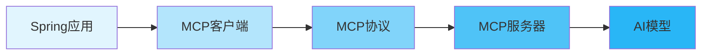
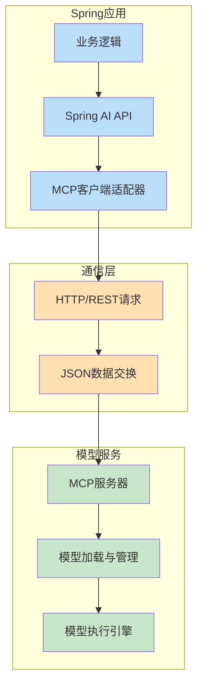
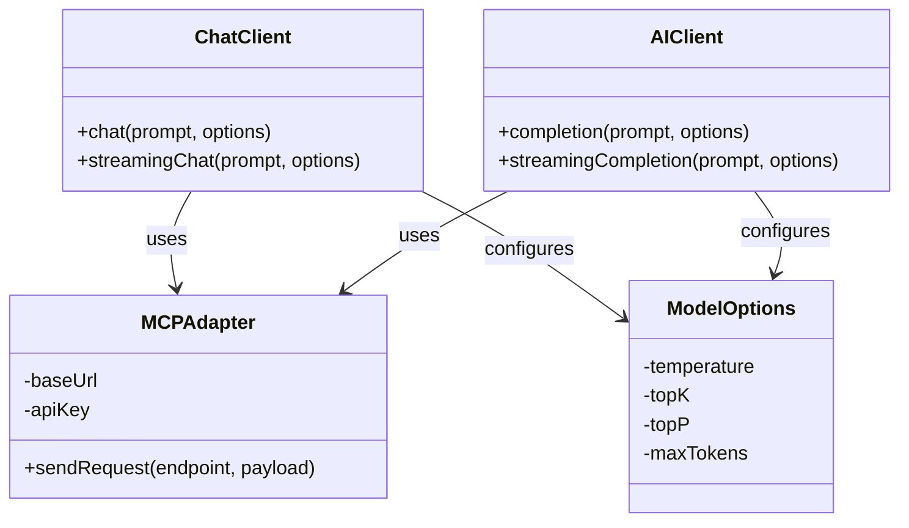
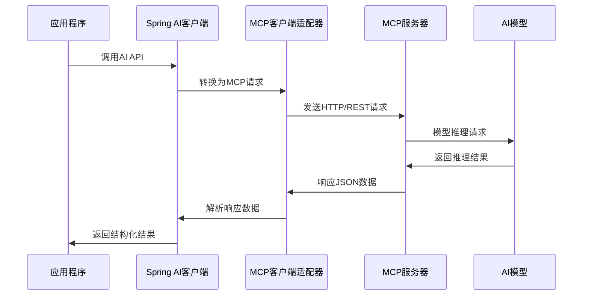
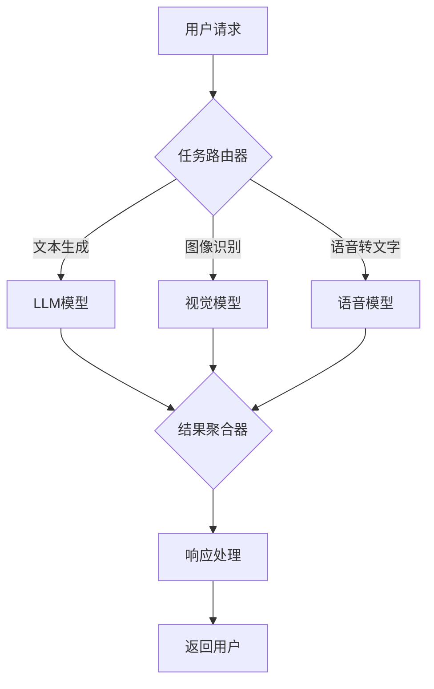

# Spring AI MCP深度解析及MCP Server本地协同方案

## 1. 引言：理解Spring AI与MCP

Spring AI是Spring生态系统中的新成员，旨在简化企业级AI应用开发。在这个框架中，Model Conductor Protocol (MCP)扮演着连接Spring应用与AI模型的关键角色。本文将深入剖析MCP协议的工作原理及如何通过MCP Server实现本地模型协同。

## 2. MCP协议核心概念图解



## 3. MCP架构与工作原理

### 3.1 MCP核心架构

MCP协议设计基于现代API通信标准，采用REST风格，以JSON作为数据交换格式，实现了客户端与AI模型服务器之间的标准化通信。



### 3.2 MCP协议特点

- **统一接口**: 标准化的API接口定义
- **模型无关性**: 支持各类AI模型的统一接入
- **请求响应标准化**: 规范化的请求和响应格式
- **可扩展性**: 支持自定义参数和头信息

## 4. Spring AI中的MCP实现详解

Spring AI提供了完整的MCP客户端实现，通过抽象层将模型调用复杂性隐藏，使开发者可以专注于业务逻辑。

### 4.1 核心组件关系图



### 4.2 MCP通信流程



## 5. MCP Server本地协同实现

### 5.1 为什么选择本地MCP服务器?

- **数据隐私**: 敏感数据无需离开本地环境
- **成本控制**: 减少对云服务的依赖
- **定制化**: 可根据特定需求调整模型行为
- **低延迟**: 消除网络延迟，提升响应速度

### 5.2 本地MCP服务器搭建

#### 5.2.1 基于Docker的MCP服务器实现

```java
// 创建Docker客户端对象
DockerClient dockerClient = DockerClientBuilder.getInstance().build();

// 定义容器端口映射
PortBinding portBinding = PortBinding.builder()
    .hostIp("0.0.0.0")
    .hostPort("8080")
    .build();

// 配置容器端口
HashMap<String, List<PortBinding>> portBindings = new HashMap<>();
portBindings.put("8080/tcp", Arrays.asList(portBinding));

// 创建容器网络设置
NetworkSettings networkSettings = NetworkSettings.builder()
    .ports(portBindings)
    .build();

// 定义容器主机配置
HostConfig hostConfig = HostConfig.builder()
    .portBindings(portBindings)
    .build();

// 构建容器创建请求
CreateContainerRequest containerRequest = CreateContainerRequest.builder()
    .image("spring-ai/mcp-server:latest")
    .hostConfig(hostConfig)
    .networkSettings(networkSettings)
    .env(Arrays.asList("MODEL_PATH=/models/llama-2-7b"))
    .build();

// 创建并启动MCP服务器容器
CreateContainerResponse container = dockerClient.createContainerCmd(containerRequest).exec();
dockerClient.startContainerCmd(container.getId()).exec();
```

#### 5.2.2 MCP Server配置

```java
// 创建MCP服务器配置类
@Configuration
public class MCPServerConfig {

    // 定义MCP服务器连接属性
    @Bean
    public MCPProperties mcpProperties() {
        // 创建MCP属性对象
        MCPProperties properties = new MCPProperties();
        
        // 设置MCP服务器基础URL
        properties.setBaseUrl("http://localhost:8080");
        
        // 设置API密钥(如果需要)
        properties.setApiKey("local-dev-key");
        
        // 设置模型ID
        properties.setModel("llama-2-7b");
        
        // 设置连接超时时间(毫秒)
        properties.setConnectTimeout(5000);
        
        // 设置读取超时时间(毫秒)
        properties.setReadTimeout(30000);
        
        // 返回配置好的属性对象
        return properties;
    }
    
    // 创建MCP客户端Bean
    @Bean
    public MCPClient mcpClient(MCPProperties properties) {
        // 使用properties创建并返回MCP客户端实例
        return new MCPClientImpl(properties);
    }
    
    // 创建聊天客户端Bean
    @Bean
    public ChatClient chatClient(MCPClient mcpClient) {
        // 基于MCP客户端创建聊天客户端
        return new MCPChatClient(mcpClient);
    }
}
```

## 6. Spring AI与MCP集成实践

### 6.1 完整集成示例

```java
// 导入必要的Spring AI和MCP相关包
import org.springframework.ai.chat.ChatClient;
import org.springframework.ai.chat.ChatResponse;
import org.springframework.ai.chat.messages.UserMessage;
import org.springframework.ai.chat.prompt.Prompt;
import org.springframework.ai.mcp.MCPChatClient;
import org.springframework.beans.factory.annotation.Autowired;
import org.springframework.web.bind.annotation.RestController;
import org.springframework.web.bind.annotation.PostMapping;
import org.springframework.web.bind.annotation.RequestBody;

// 创建REST控制器
@RestController
public class AIController {

    // 注入配置好的聊天客户端
    private final ChatClient chatClient;
    
    // 通过构造函数注入依赖
    @Autowired
    public AIController(ChatClient chatClient) {
        this.chatClient = chatClient;
    }
    
    // 定义处理聊天请求的端点
    @PostMapping("/api/chat")
    public ChatResponseDto chat(@RequestBody ChatRequestDto request) {
        // 创建用户消息对象
        UserMessage userMessage = new UserMessage(request.getMessage());
        
        // 构建提示对象
        Prompt prompt = new Prompt(userMessage);
        
        // 设置模型参数选项
        ChatOptions options = ChatOptions.builder()
            .withTemperature(0.7f)  // 设置温度参数
            .withMaxTokens(1000)    // 设置最大令牌数
            .withTopK(40)          // 设置top-k参数
            .withTopP(0.95f)       // 设置top-p参数
            .build();
        
        // 调用AI模型并获取响应
        ChatResponse response = chatClient.chat(prompt, options);
        
        // 将AI响应转换为DTO并返回
        return new ChatResponseDto(
            response.getResult().getOutput().getContent(),
            response.getMetadata()
        );
    }
}

// 请求数据传输对象
class ChatRequestDto {
    private String message;
    
    // getter和setter略
}

// 响应数据传输对象
class ChatResponseDto {
    private String response;
    private Map<String, Object> metadata;
    
    // 构造函数、getter和setter略
}
```

### 6.2 流式响应实现

```java
// 导入流式处理相关包
import org.springframework.ai.chat.StreamingChatClient;
import org.springframework.web.servlet.mvc.method.annotation.SseEmitter;
import org.springframework.ai.chat.messages.Message;
import reactor.core.publisher.Flux;

// 在控制器中添加流式聊天端点
@RestController
public class AIStreamingController {

    // 注入流式聊天客户端
    private final StreamingChatClient streamingChatClient;
    
    // 构造函数注入依赖
    @Autowired
    public AIStreamingController(StreamingChatClient streamingChatClient) {
        this.streamingChatClient = streamingChatClient;
    }
    
    // 定义流式聊天端点
    @GetMapping(value = "/api/chat/stream", produces = MediaType.TEXT_EVENT_STREAM_VALUE)
    public SseEmitter streamChat(@RequestParam String message) {
        // 创建SSE发射器
        SseEmitter emitter = new SseEmitter();
        
        // 创建用户消息
        UserMessage userMessage = new UserMessage(message);
        
        // 构建提示对象
        Prompt prompt = new Prompt(userMessage);
        
        // 设置模型参数
        ChatOptions options = ChatOptions.builder()
            .withTemperature(0.8f)
            .withMaxTokens(2000)
            .build();
        
        // 获取流式响应
        Flux<ChatResponse> responseStream = streamingChatClient.streamingChat(prompt, options);
        
        // 处理流式响应
        responseStream.subscribe(
            // 成功处理每一个片段
            partialResponse -> {
                try {
                    // 发送部分响应
                    String content = partialResponse.getResult().getOutput().getContent();
                    emitter.send(content, MediaType.TEXT_PLAIN);
                } catch (IOException e) {
                    // 处理IO异常
                    emitter.completeWithError(e);
                }
            },
            // 处理错误
            error -> {
                emitter.completeWithError(error);
            },
            // 处理完成
            () -> {
                emitter.complete();
            }
        );
        
        // 返回SSE发射器
        return emitter;
    }
}
```

## 7. 高级MCP功能与优化

### 7.1 多模型协同架构

通过MCP协议可以实现多模型协同工作，不同的模型负责不同的任务，形成模型链。



### 7.2 MCP服务器高可用设计

```java
// 创建MCP服务器集群配置类
@Configuration
public class MCPHighAvailabilityConfig {

    // 定义负载均衡器
    @Bean
    public LoadBalancer mcpLoadBalancer() {
        // 创建轮询策略的负载均衡器
        RoundRobinLoadBalancer balancer = new RoundRobinLoadBalancer();
        
        // 添加多个MCP服务器实例
        balancer.addServer("http://mcp-server-1:8080");
        balancer.addServer("http://mcp-server-2:8080");
        balancer.addServer("http://mcp-server-3:8080");
        
        // 设置健康检查间隔(秒)
        balancer.setHealthCheckInterval(30);
        
        // 返回配置好的负载均衡器
        return balancer;
    }
    
    // 创建具有故障转移功能的MCP客户端
    @Bean
    public MCPClient resilientMcpClient(LoadBalancer loadBalancer) {
        // 创建基础MCP客户端配置
        MCPClientConfig config = new MCPClientConfig();
        
        // 设置连接超时
        config.setConnectTimeout(3000);
        
        // 设置读取超时
        config.setReadTimeout(10000);
        
        // 设置最大重试次数
        config.setMaxRetries(3);
        
        // 创建并返回高可用MCP客户端
        return new ResilientMCPClient(loadBalancer, config);
    }
}
```

### 7.3 模型性能监控与优化

```java
// 创建MCP性能监控切面
@Aspect
@Component
public class MCPPerformanceMonitor {

    // 注入指标注册表
    private final MeterRegistry meterRegistry;
    
    // 构造函数注入依赖
    @Autowired
    public MCPPerformanceMonitor(MeterRegistry meterRegistry) {
        this.meterRegistry = meterRegistry;
    }
    
    // 定义切点，拦截所有MCP客户端方法
    @Around("execution(* org.springframework.ai.mcp.MCPClient.*(..))")
    public Object monitorPerformance(ProceedingJoinPoint joinPoint) throws Throwable {
        // 记录方法名称
        String methodName = joinPoint.getSignature().getName();
        
        // 创建计时器
        Timer.Sample sample = Timer.start(meterRegistry);
        
        try {
            // 执行原始方法
            Object result = joinPoint.proceed();
            
            // 记录成功调用
            sample.stop(Timer.builder("mcp.calls")
                .tag("method", methodName)
                .tag("status", "success")
                .register(meterRegistry));
                
            // 记录token使用量(如果结果包含该信息)
            if (result instanceof ChatResponse) {
                ChatResponse response = (ChatResponse) result;
                if (response.getMetadata().containsKey("usage")) {
                    Map<String, Object> usage = (Map<String, Object>) response.getMetadata().get("usage");
                    
                    // 记录输入tokens
                    meterRegistry.gauge("mcp.tokens.input", 
                        Tags.of("model", response.getMetadata().getOrDefault("model", "unknown").toString()),
                        Integer.parseInt(usage.getOrDefault("promptTokens", 0).toString()));
                        
                    // 记录输出tokens
                    meterRegistry.gauge("mcp.tokens.output",
                        Tags.of("model", response.getMetadata().getOrDefault("model", "unknown").toString()),
                        Integer.parseInt(usage.getOrDefault("completionTokens", 0).toString()));
                }
            }
            
            return result;
        } catch (Throwable t) {
            // 记录失败调用
            sample.stop(Timer.builder("mcp.calls")
                .tag("method", methodName)
                .tag("status", "failure")
                .tag("exception", t.getClass().getSimpleName())
                .register(meterRegistry));
                
            // 抛出原始异常
            throw t;
        }
    }
}
```

## 8. 最佳实践与注意事项

### 8.1 MCP本地部署脑图

```
graph TD
    A[MCP本地部署策略] --> B[硬件准备]
    A --> C[模型选择]
    A --> D[部署方式]
    A --> E[安全措施]
    A --> F[监控与维护]
    
    B --> B1[CPU/GPU需求评估]
    B --> B2[存储空间规划]
    B --> B3[网络带宽要求]
    
    C --> C1[开源模型选择]
    C --> C2[模型量化考量]
    C --> C3[多模型协同]
    
    D --> D1[Docker容器化]
    D --> D2[Kubernetes编排]
    D --> D3[裸机部署]
    
    E --> E1[访问控制]
    E --> E2[数据加密]
    E --> E3[审计日志]
    
    F --> F1[性能指标收集]
    F --> F2[异常报警]
    F --> F3[自动扩缩容]
```

### 8.2 MCP使用建议

1. **隔离环境**: 将MCP服务与业务应用隔离部署
2. **资源规划**: 根据模型大小和并发需求合理分配资源
3. **缓存策略**: 对常见请求结果进行缓存
4. **降级机制**: 设计AI服务不可用时的降级方案
5. **版本管理**: 建立模型版本管理和回滚机制

## 9. 总结与展望

Spring AI的MCP实现为企业级AI应用提供了标准化、可扩展的解决方案。通过本地MCP服务器部署，既保证了数据安全性，又提供了灵活的模型定制能力。随着Spring AI的持续发展，MCP协议也将进一步完善，支持更多AI模型类型，提供更丰富的功能特性。

未来，Spring AI与MCP将朝着以下方向发展:
- 更全面的模型支持
- 更强大的模型训练能力
- 与Spring生态更深度集成
- 更完善的企业级特性

技术发展日新月异，但标准化协议的价值永恒。MCP的出现，为AI应用开发提供了一条可持续发展的道路。

---

> 本文详细介绍了Spring AI中的MCP协议及本地协同实现方案，希望能帮助开发者更好地理解和应用这一技术，构建强大的企业级AI应用。