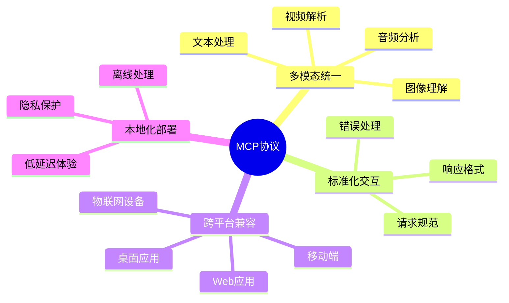
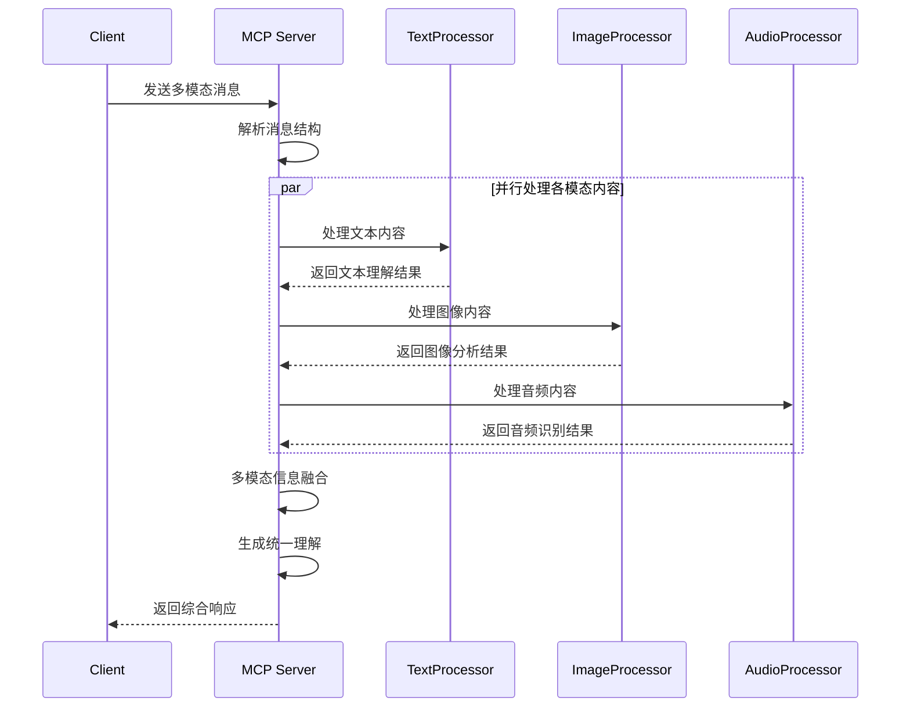
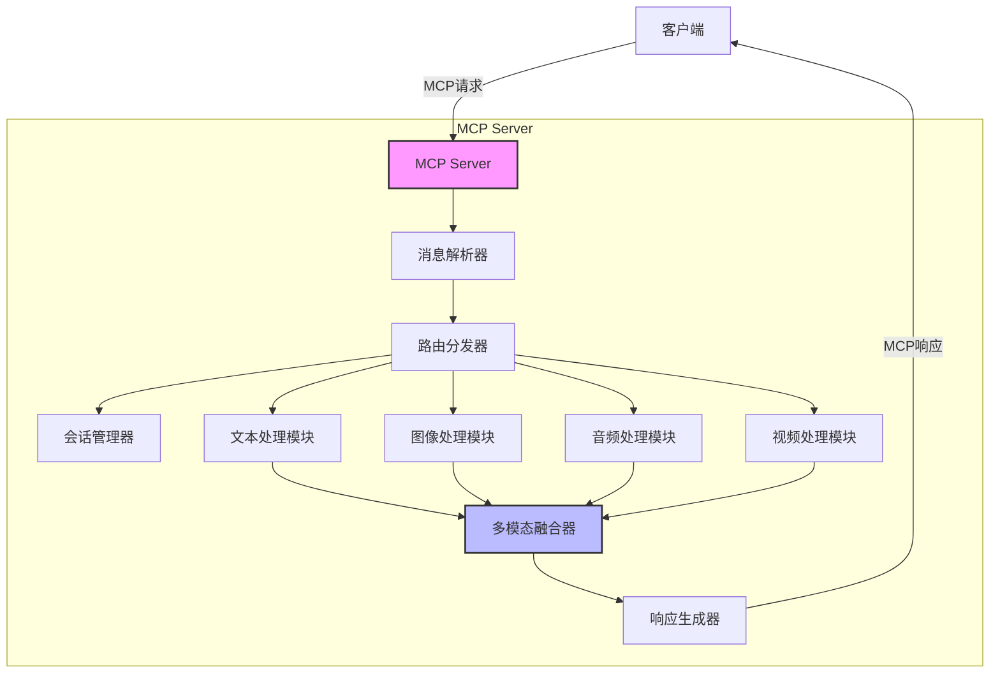
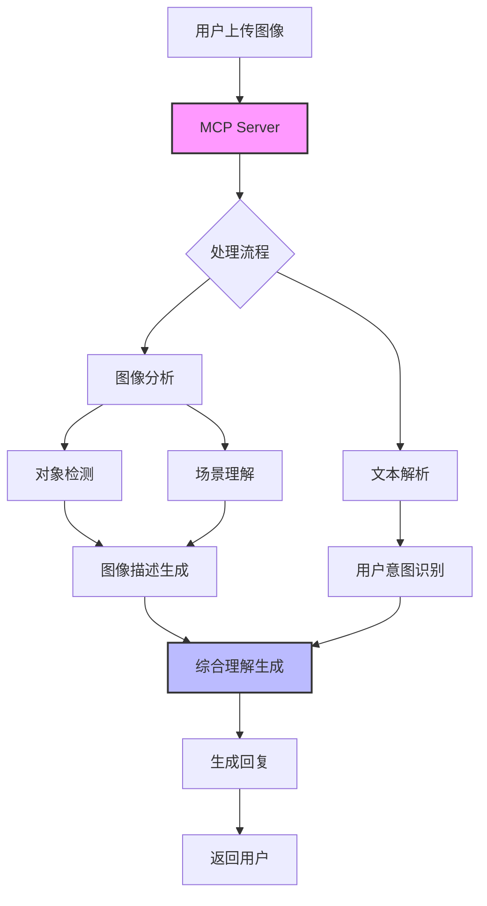
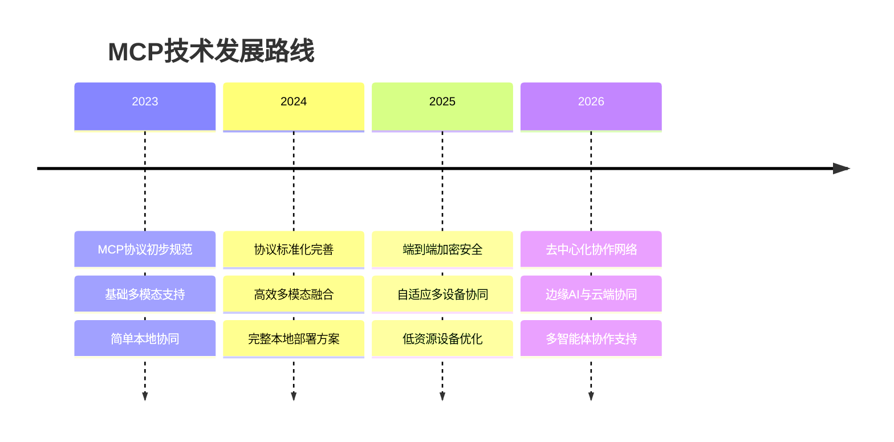

# MCP深度解析及MCP Server本地协同

> 随着大语言模型应用的不断深入，多模态能力已成为AI系统的核心竞争力。本文深入解析Multi-modal Chat Protocol (MCP)协议的设计理念、核心组件与工作原理，并详细阐述如何通过MCP Server在本地环境中实现高效的多模态协同，助力开发者打造更智能、更自然的AI交互体验。

## 一、MCP协议概述

MCP (Multi-modal Chat Protocol) 是一种为多模态AI交互设计的专用协议，旨在规范化不同模态信息（文本、图像、音频、视频等）在AI系统中的传递、处理与响应流程。

### 1.1 MCP协议的核心价值



### 1.2 技术背景与挑战

传统AI交互模型面临的主要挑战：

1. 多模态数据传输与表示不统一
2. 模态间协同理解与融合困难
3. 处理能力受限于云服务，难以本地化
4. 缺乏统一的开发框架，集成成本高

MCP协议通过定义标准化的消息结构、处理流程和服务接口，有效解决了这些问题。

## 二、MCP协议规范详解

### 2.1 消息结构设计

MCP定义了统一的消息结构，包含以下核心字段：

```json
{
  "id": "msg_12345",
  "role": "user",
  "timestamp": 1697853420,
  "content": [
    {
      "type": "text",
      "value": "这张图片中有什么?"
    },
    {
      "type": "image",
      "format": "base64",
      "value": "/9j/4AAQSkZJRgABAQEA..."
    }
  ],
  "metadata": {
    "source": "mobile_app",
    "language": "zh-CN"
  }
}
```

### 2.2 协议流程示意



## 三、MCP Server架构与实现

### 3.1 整体架构

MCP Server采用模块化设计，各组件协同工作，保证多模态数据的高效处理。



### 3.2 核心组件功能

1. **消息解析器**: 负责解析和验证MCP消息格式
2. **路由分发器**: 根据消息内容类型分发给相应处理模块
3. **会话管理器**: 维护对话上下文和状态
4. **多模态处理模块**: 专门处理各类型模态数据
5. **多模态融合器**: 整合各模态处理结果，生成统一理解
6. **响应生成器**: 构建符合MCP规范的响应消息

## 四、MCP Server本地部署实践

### 4.1 环境准备与依赖安装

```python
# 导入必要的Python库
import os 
import json
import base64
import argparse
import numpy as np
import requests
from flask import Flask, request, jsonify
from PIL import Image
from io import BytesIO
import torch

# 设置GPU使用
os.environ["CUDA_VISIBLE_DEVICES"] = "0"  # 如有GPU，设置使用第一块GPU
# 导入MCP相关库
from mcp_server import MCPServer, config
from mcp_server.processors import TextProcessor, ImageProcessor, AudioProcessor
```

### 4.2 MCP Server核心配置

```python
# 创建配置对象，设置服务器基本参数
config = {
    # 设置服务器监听端口
    "host": "0.0.0.0", 
    # 设置服务器端口为8000
    "port": 8000,
    # 设置最大并发连接数
    "max_connections": 100,
    # 设置会话超时时间(秒)
    "session_timeout": 3600,
    # 配置日志级别
    "log_level": "INFO",
    # 设置模型路径
    "models": {
        # 文本模型路径
        "text": "./models/text_model",
        # 图像模型路径
        "image": "./models/image_model",
        # 音频模型路径
        "audio": "./models/audio_model"
    },
    # 设置处理器参数
    "processors": {
        # 文本处理器参数
        "text": {
            # 设置批处理大小
            "batch_size": 32,
            # 设置最大序列长度
            "max_length": 512
        },
        # 图像处理器参数
        "image": {
            # 设置图像预处理尺寸
            "image_size": 224
        }
    }
}
```

### 4.3 MCP Server实现示例

```python
# 创建MCP服务器类
class MCPServerImpl:
    # 初始化函数，设置服务器参数并加载模型
    def __init__(self, config):
        # 存储配置
        self.config = config
        # 初始化Flask应用
        self.app = Flask("MCP-Server")
        # 初始化路由
        self._setup_routes()
        # 加载模型处理器
        self._load_processors()
        # 初始化会话存储
        self.sessions = {}
        # 打印初始化信息
        print("MCP Server initialized with config:", config)

    # 设置API路由
    def _setup_routes(self):
        # 注册主聊天接口
        self.app.route('/api/chat', methods=['POST'])(self.handle_chat)
        # 注册健康检查接口
        self.app.route('/health', methods=['GET'])(self.health_check)
        # 打印路由设置完成信息
        print("Routes setup completed")

    # 加载各模态处理器
    def _load_processors(self):
        # 加载文本处理器
        self.text_processor = TextProcessor(
            model_path=self.config['models']['text'],
            **self.config['processors']['text']
        )
        # 加载图像处理器
        self.image_processor = ImageProcessor(
            model_path=self.config['models']['image'],
            **self.config['processors']['image']
        )
        # 加载音频处理器
        self.audio_processor = AudioProcessor(
            model_path=self.config['models']['audio']
        )
        # 打印处理器加载完成信息
        print("All processors loaded successfully")

    # 处理聊天请求
    def handle_chat(self):
        try:
            # 获取请求数据
            data = request.json
            # 验证请求格式
            if not self._validate_request(data):
                # 返回格式错误响应
                return jsonify({"error": "Invalid request format"}), 400
            
            # 提取会话ID，如果没有则创建新会话
            session_id = data.get("session_id", self._create_session())
            # 更新或获取会话
            session = self._get_session(session_id)
            
            # 处理各模态内容
            results = []
            # 遍历消息内容
            for item in data["content"]:
                # 根据内容类型分发处理
                if item["type"] == "text":
                    # 处理文本内容
                    text_result = self.text_processor.process(item["value"])
                    results.append({"type": "text", "result": text_result})
                elif item["type"] == "image":
                    # 处理图像内容
                    image_data = self._decode_image(item["value"])
                    image_result = self.image_processor.process(image_data)
                    results.append({"type": "image", "result": image_result})
                elif item["type"] == "audio":
                    # 处理音频内容
                    audio_data = base64.b64decode(item["value"])
                    audio_result = self.audio_processor.process(audio_data)
                    results.append({"type": "audio", "result": audio_result})
            
            # 融合多模态结果
            final_response = self._fusion_results(results, session)
            # 更新会话历史
            session["history"].append({"user": data, "ai": final_response})
            
            # 返回结果
            return jsonify({
                "id": self._generate_id(),
                "session_id": session_id,
                "timestamp": self._get_timestamp(),
                "content": final_response
            })
            
        except Exception as e:
            # 记录错误并返回500响应
            print(f"Error processing request: {str(e)}")
            return jsonify({"error": str(e)}), 500

    # 健康检查端点
    def health_check(self):
        # 返回服务器状态信息
        return jsonify({
            "status": "healthy",
            "version": "1.0.0",
            "processors": {
                "text": self.text_processor.is_ready(),
                "image": self.image_processor.is_ready(),
                "audio": self.audio_processor.is_ready()
            }
        })

    # 启动服务器
    def start(self):
        # 打印服务器启动信息
        print(f"Starting MCP Server on {self.config['host']}:{self.config['port']}")
        # 启动Flask应用
        self.app.run(
            host=self.config['host'], 
            port=self.config['port'],
            debug=False
        )

    # 其他辅助方法...
    # 创建新会话
    def _create_session(self):
        # 生成唯一会话ID
        session_id = f"session_{self._generate_id()}"
        # 创建新会话数据
        self.sessions[session_id] = {
            "created_at": self._get_timestamp(),
            "last_active": self._get_timestamp(),
            "history": []
        }
        # 返回新会话ID
        return session_id
```

### 4.4 本地协同策略

MCP Server的本地协同能力主要体现在以下几个方面：

1. **多模态处理的并行化**：同时处理不同模态的数据，提高效率
2. **模态间的信息融合**：根据上下文整合不同模态的理解结果
3. **本地资源调度优化**：根据设备能力动态分配计算资源
4. **增量处理与缓存机制**：避免重复计算，提高响应速度

## 五、协同处理核心实现

### 5.1 多模态融合器实现

```python
# 实现多模态融合处理器
class MultiModalFusionProcessor:
    # 初始化函数
    def __init__(self, fusion_model_path=None):
        # 加载融合模型，如果提供了路径
        self.fusion_model = self._load_fusion_model(fusion_model_path) if fusion_model_path else None
        # 初始化结果缓存
        self.cache = {}
    
    # 加载融合模型
    def _load_fusion_model(self, model_path):
        try:
            # 尝试加载Torch模型
            if os.path.exists(model_path):
                # 返回加载的模型
                return torch.load(model_path)
            else:
                # 如果模型不存在，使用规则融合
                print(f"Model not found at {model_path}, using rule-based fusion")
                return None
        except Exception as e:
            # 处理加载异常
            print(f"Error loading fusion model: {str(e)}")
            return None
    
    # 融合多个模态的处理结果
    def fuse(self, modal_results, context=None):
        # 提取各模态结果
        text_results = [r["result"] for r in modal_results if r["type"] == "text"]
        image_results = [r["result"] for r in modal_results if r["type"] == "image"]
        audio_results = [r["result"] for r in modal_results if r["type"] == "audio"]
        
        # 如果有融合模型，使用模型融合
        if self.fusion_model:
            # 模型融合处理
            return self._model_fusion(text_results, image_results, audio_results, context)
        else:
            # 规则融合处理
            return self._rule_fusion(text_results, image_results, audio_results, context)
    
    # 基于规则的融合策略
    def _rule_fusion(self, text_results, image_results, audio_results, context):
        # 初始化融合结果
        fusion_result = {"response": "", "confidence": 0.0}
        
        # 处理文本结果
        if text_results:
            # 合并所有文本理解
            text_understanding = " ".join(text_results)
            fusion_result["response"] += text_understanding
            fusion_result["confidence"] += 0.4
            
        # 处理图像结果
        if image_results:
            # 合并图像描述
            image_description = "图像显示: " + "; ".join(image_results)
            # 如果已有文本，添加连接词
            if fusion_result["response"]:
                fusion_result["response"] += ". 另外，"
            fusion_result["response"] += image_description
            fusion_result["confidence"] += 0.3
            
        # 处理音频结果
        if audio_results:
            # 合并音频内容
            audio_content = "音频内容: " + "; ".join(audio_results)
            # 添加到响应
            if fusion_result["response"]:
                fusion_result["response"] += ". 此外，"
            fusion_result["response"] += audio_content
            fusion_result["confidence"] += 0.3
        
        # 考虑上下文
        if context and "history" in context and context["history"]:
            # 根据历史调整响应
            last_exchange = context["history"][-1]
            # 提取上一次交流信息
            if "ai" in last_exchange and "user" in last_exchange:
                # 根据上下文调整回复的连贯性
                fusion_result["response"] = self._adjust_for_context(
                    fusion_result["response"], 
                    last_exchange["user"], 
                    last_exchange["ai"]
                )
        
        # 返回最终融合结果
        return fusion_result
    
    # 模型融合方法
    def _model_fusion(self, text_results, image_results, audio_results, context):
        # 准备输入数据
        inputs = {
            "text": text_results,
            "image": image_results,
            "audio": audio_results
        }
        
        # 如果有上下文，添加到输入
        if context and "history" in context:
            # 提取最近的对话历史
            recent_history = context["history"][-3:] if len(context["history"]) > 3 else context["history"]
            inputs["context"] = recent_history
        
        # 生成输入的唯一标识符
        input_hash = self._hash_input(inputs)
        
        # 检查缓存
        if input_hash in self.cache:
            # 返回缓存结果
            return self.cache[input_hash]
        
        # 使用模型进行推理
        with torch.no_grad():
            # 转换输入为模型格式
            model_inputs = self._prepare_model_inputs(inputs)
            # 执行模型推理
            outputs = self.fusion_model(**model_inputs)
            # 处理模型输出
            result = self._process_model_outputs(outputs)
        
        # 更新缓存
        self.cache[input_hash] = result
        # 返回融合结果
        return result
```

### 5.2 本地会话管理实现

```javascript
// 导入所需模块
const fs = require('fs');
const path = require('path');
const crypto = require('crypto');

/**
 * 会话管理器类
 * 负责处理会话创建、获取、更新和清理
 */
class SessionManager {
    // 构造函数，初始化会话管理器
    constructor(options = {}) {
        // 设置会话存储目录，默认为'./sessions'
        this.sessionDir = options.sessionDir || './sessions';
        // 设置会话过期时间，默认1小时
        this.sessionTimeout = options.sessionTimeout || 3600 * 1000;
        // 设置清理间隔，默认10分钟
        this.cleanupInterval = options.cleanupInterval || 600 * 1000;
        // 内存中会话缓存
        this.sessions = new Map();
        
        // 确保会话目录存在
        this._ensureSessionDir();
        // 启动定期清理任务
        this._startCleanupTask();
        
        // 打印初始化信息
        console.log(`Session Manager initialized with timeout: ${this.sessionTimeout}ms`);
    }
    
    // 确保会话存储目录存在
    _ensureSessionDir() {
        // 检查目录是否存在
        if (!fs.existsSync(this.sessionDir)) {
            // 创建目录
            fs.mkdirSync(this.sessionDir, { recursive: true });
            console.log(`Created session directory: ${this.sessionDir}`);
        }
    }
    
    // 生成唯一的会话ID
    _generateSessionId() {
        // 使用随机字节生成会话ID
        return crypto.randomBytes(16).toString('hex');
    }
    
    // 获取会话文件路径
    _getSessionFilePath(sessionId) {
        // 返回完整的文件路径
        return path.join(this.sessionDir, `${sessionId}.json`);
    }
    
    // 创建新会话
    createSession(initialData = {}) {
        // 生成新的会话ID
        const sessionId = this._generateSessionId();
        // 创建会话对象
        const session = {
            id: sessionId,
            // 设置创建时间
            createdAt: Date.now(),
            // 设置最后活跃时间
            lastActive: Date.now(),
            // 设置会话数据
            data: initialData
        };
        
        // 保存会话到内存缓存
        this.sessions.set(sessionId, session);
        // 保存会话到文件系统
        this._saveSessionToFile(session);
        
        // 返回会话ID
        return sessionId;
    }
    
    // 获取会话
    getSession(sessionId) {
        // 首先尝试从内存缓存获取
        if (this.sessions.has(sessionId)) {
            // 获取会话
            const session = this.sessions.get(sessionId);
            // 检查会话是否过期
            if (this._isSessionExpired(session)) {
                // 删除过期会话
                this.deleteSession(sessionId);
                // 返回null表示会话不存在
                return null;
            }
            // 更新最后活跃时间
            session.lastActive = Date.now();
            // 返回会话数据
            return session.data;
        }
        
        // 如果内存中没有，尝试从文件加载
        try {
            // 获取会话文件路径
            const filePath = this._getSessionFilePath(sessionId);
            // 检查文件是否存在
            if (fs.existsSync(filePath)) {
                // 读取会话文件
                const sessionData = JSON.parse(fs.readFileSync(filePath, 'utf8'));
                // 检查会话是否过期
                if (this._isSessionExpired(sessionData)) {
                    // 删除过期会话文件
                    fs.unlinkSync(filePath);
                    // 返回null表示会话不存在
                    return null;
                }
                
                // 更新最后活跃时间
                sessionData.lastActive = Date.now();
                // 更新会话文件
                this._saveSessionToFile(sessionData);
                // 添加到内存缓存
                this.sessions.set(sessionId, sessionData);
                // 返回会话数据
                return sessionData.data;
            }
        } catch (error) {
            // 记录错误
            console.error(`Error loading session ${sessionId}:`, error);
        }
        
        // 会话不存在返回null
        return null;
    }
    
    // 更新会话数据
    updateSession(sessionId, data) {
        // 获取会话
        const session = this.sessions.get(sessionId);
        // 如果会话存在
        if (session) {
            // 更新会话数据
            session.data = { ...session.data, ...data };
            // 更新最后活跃时间
            session.lastActive = Date.now();
            // 保存会话到文件
            this._saveSessionToFile(session);
            // 返回更新后的数据
            return session.data;
        }
        // 会话不存在返回null
        return null;
    }
    
    // 删除会话
    deleteSession(sessionId) {
        // 从内存缓存中移除
        this.sessions.delete(sessionId);
        // 删除会话文件
        try {
            // 获取文件路径
            const filePath = this._getSessionFilePath(sessionId);
            // 检查文件是否存在
            if (fs.existsSync(filePath)) {
                // 删除文件
                fs.unlinkSync(filePath);
            }
        } catch (error) {
            // 记录错误
            console.error(`Error deleting session file for ${sessionId}:`, error);
        }
    }
    
    // 检查会话是否过期
    _isSessionExpired(session) {
        // 计算会话已经闲置的时间
        const idleTime = Date.now() - session.lastActive;
        // 返回是否超过过期时间
        return idleTime > this.sessionTimeout;
    }
    
    // 保存会话到文件
    _saveSessionToFile(session) {
        try {
            // 获取文件路径
            const filePath = this._getSessionFilePath(session.id);
            // 将会话数据写入文件
            fs.writeFileSync(filePath, JSON.stringify(session), 'utf8');
        } catch (error) {
            // 记录错误
            console.error(`Error saving session ${session.id}:`, error);
        }
    }
    
    // 启动定期清理任务
    _startCleanupTask() {
        // 设置定时器
        setInterval(() => {
            // 执行清理任务
            this._cleanupExpiredSessions();
        }, this.cleanupInterval);
    }
    
    // 清理过期会话
    _cleanupExpiredSessions() {
        console.log('Running session cleanup task...');
        
        // 当前时间
        const now = Date.now();
        
        // 清理内存中的过期会话
        for (const [sessionId, session] of this.sessions.entries()) {
            // 计算闲置时间
            const idleTime = now - session.lastActive;
            // 检查是否过期
            if (idleTime > this.sessionTimeout) {
                // 删除过期会话
                this.deleteSession(sessionId);
                console.log(`Cleaned up expired session: ${sessionId}`);
            }
        }
        
        // 清理文件系统中的过期会话
        try {
            // 读取会话目录中的所有文件
            const files = fs.readdirSync(this.sessionDir);
            
            // 遍历所有会话文件
            for (const file of files) {
                // 检查是否是JSON文件
                if (file.endsWith('.json')) {
                    // 获取完整文件路径
                    const filePath = path.join(this.sessionDir, file);
                    // 读取文件内容
                    const sessionData = JSON.parse(fs.readFileSync(filePath, 'utf8'));
                    // 计算闲置时间
                    const idleTime = now - sessionData.lastActive;
                    
                    // 检查是否过期
                    if (idleTime > this.sessionTimeout) {
                        // 删除过期文件
                        fs.unlinkSync(filePath);
                        console.log(`Cleaned up expired session file: ${file}`);
                    }
                }
            }
        } catch (error) {
            // 记录错误
            console.error('Error during file cleanup:', error);
        }
    }
}
```

## 六、MCP本地协同应用案例

### 6.1 交互式图像分析应用



### 6.2 本地多模态助手实现

```python
# 导入必要的库
import gradio as gr
import requests
import json
import base64
from PIL import Image
import io
import numpy as np
import os
import time

# MCP本地助手类
class MCPLocalAssistant:
    # 初始化助手
    def __init__(self, server_url="http://localhost:8000"):
        # 存储服务器URL
        self.server_url = server_url
        # 存储当前会话ID
        self.session_id = None
        # 存储对话历史
        self.history = []
        # 打印初始化信息
        print(f"MCP Local Assistant initialized, connecting to {server_url}")
        
        # 检查服务器连接
        self.check_server()
    
    # 检查服务器状态
    def check_server(self):
        try:
            # 发送健康检查请求
            response = requests.get(f"{self.server_url}/health", timeout=5)
            # 检查响应状态
            if response.status_code == 200:
                # 输出服务器状态
                print("Server connected successfully:", response.json())
                # 返回True表示连接成功
                return True
            else:
                # 输出错误信息
                print(f"Server returned error status: {response.status_code}")
                # 返回False表示连接失败
                return False
        except Exception as e:
            # 处理连接异常
            print(f"Failed to connect to MCP server: {str(e)}")
            # 返回False表示连接失败
            return False
    
    # 发送请求到服务器
    def send_request(self, content):
        # 准备请求数据
        request_data = {
            "id": f"msg_{int(time.time())}",
            "role": "user",
            "timestamp": int(time.time()),
            "content": content
        }
        
        # 如果存在会话ID，添加到请求中
        if self.session_id:
            request_data["session_id"] = self.session_id
        
        try:
            # 发送POST请求到聊天接口
            response = requests.post(
                f"{self.server_url}/api/chat",
                json=request_data,
                timeout=30  # 较长的超时时间，因为处理可能需要时间
            )
            
            # 检查请求是否成功
            if response.status_code == 200:
                # 解析响应JSON
                result = response.json()
                # 保存会话ID
                if "session_id" in result:
                    self.session_id = result["session_id"]
                # 返回响应结果
                return result
            else:
                # 输出错误信息
                print(f"Server error: {response.status_code}, {response.text}")
                # 返回错误信息
                return {"error": f"Server returned {response.status_code}: {response.text}"}
        except Exception as e:
            # 处理请求异常
            print(f"Request error: {str(e)}")
            # 返回错误信息
            return {"error": f"Failed to communicate with server: {str(e)}"}
    
    # 文本聊天处理
    def chat(self, message):
        # 准备内容数组
        content = [{"type": "text", "value": message}]
        # 发送请求到服务器
        response = self.send_request(content)
        
        # 检查是否有错误
        if "error" in response:
            # 返回错误信息
            return f"ERROR: {response['error']}"
        
        # 提取回复内容
        if "content" in response:
            # 提取文本内容
            return response["content"]["response"]
        else:
            # 返回通用错误
            return "Failed to get proper response from server"
    
    # 处理带图像的聊天
    def chat_with_image(self, message, image):
        # 准备内容数组
        content = []
        
        # 如果有文本消息，添加文本内容
        if message and message.strip():
            content.append({"type": "text", "value": message})
        
        # 如果有图像，添加图像内容
        if image is not None:
            # 将图像转换为base64编码
            buffered = io.BytesIO()
            # 保存为JPEG格式
            image.save(buffered, format="JPEG")
            # 获取base64编码
            img_str = base64.b64encode(buffered.getvalue()).decode()
            # 添加图像内容
            content.append({"type": "image", "format": "base64", "value": img_str})
        
        # 如果没有任何内容，返回错误
        if not content:
            return "请提供文本消息或上传图片"
        
        # 发送请求到服务器
        response = self.send_request(content)
        
        # 检查是否有错误
        if "error" in response:
            # 返回错误信息
            return f"ERROR: {response['error']}"
        
        # 提取回复内容
        if "content" in response:
            # 返回响应内容
            return response["content"]["response"]
        else:
            # 返回通用错误
            return "Failed to get proper response from server"

# 创建Gradio界面
def create_ui():
    # 初始化助手实例
    assistant = MCPLocalAssistant()
    
    # 定义纯文本聊天处理函数
    def handle_text_chat(message, history):
        # 调用助手的聊天方法
        response = assistant.chat(message)
        # 返回响应
        return response
    
    # 定义多模态聊天处理函数
    def handle_multimodal_chat(message, image, history):
        # 调用助手的图像聊天方法
        response = assistant.chat_with_image(message, image)
        # 返回响应
        return response
    
    # 创建标题
    title = "MCP 本地多模态助手"
    
    # 创建界面描述
    description = """
    这是一个基于MCP协议的本地多模态助手，支持文本和图像输入。
    您可以输入文本问题，也可以上传图片并提问关于图片的内容。
    所有处理都在本地完成，保护您的隐私。
    """
    
    # 创建Gradio接口
    with gr.Blocks() as demo:
        # 添加标题
        gr.Markdown(f"# {title}")
        # 添加描述
        gr.Markdown(description)
        
        # 创建标签页
        with gr.Tabs():
            # 文本聊天标签页
            with gr.TabItem("文本聊天"):
                # 创建聊天接口
                text_chatbot = gr.ChatInterface(handle_text_chat)
            
            # 图像聊天标签页
            with gr.TabItem("图像聊天"):
                # 创建聊天界面
                with gr.Row():
                    # 图像输入框
                    image_input = gr.Image(type="pil", label="上传图片")
                
                # 创建消息输入和显示区域
                with gr.Row():
                    # 文本输入框
                    msg_input = gr.Textbox(
                        placeholder="输入您的问题...", 
                        label="消息"
                    )
                
                # 创建按钮和输出区域
                with gr.Row():
                    # 提交按钮
                    submit_btn = gr.Button("发送")
                    # 清除按钮
                    clear_btn = gr.Button("清除")
                
                # 响应输出框
                response_output = gr.Textbox(
                    label="助手回复", 
                    lines=10
                )
                
                # 设置按钮点击事件
                submit_btn.click(
                    handle_multimodal_chat,
                    inputs=[msg_input, image_input, None],
                    outputs=response_output
                )
                
                # 设置清除按钮事件
                clear_btn.click(
                    lambda: (None, "", ""),
                    inputs=None,
                    outputs=[image_input, msg_input, response_output]
                )
        
        # 添加服务器状态检查按钮
        with gr.Row():
            # 状态检查按钮
            check_btn = gr.Button("检查服务器状态")
            # 状态显示
            status_output = gr.Textbox(label="服务器状态")
            
            # 设置检查按钮事件
            check_btn.click(
                lambda: "连接正常" if assistant.check_server() else "无法连接到服务器",
                inputs=None,
                outputs=status_output
            )
    
    # 启动界面
    demo.launch(share=False)

# 主函数
if __name__ == "__main__":
    # 创建并启动UI
    create_ui()
```

## 七、MCP技术展望与发展趋势

### 7.1 技术发展路线



### 7.2 未来应用场景

随着MCP技术的发展，未来可能出现以下应用场景：

1. **全本地化AI助手**：无需云服务支持的完全私有化智能助手
2. **多设备协同生态**：手机、电脑、智能家居设备通过MCP协同工作
3. **隐私保护型企业AI**：企业内部部署的保护敏感数据的AI系统
4. **边缘设备赋能**：为资源受限的边缘设备提供分布式AI能力

## 八、总结

MCP协议及其本地服务器实现为AI应用开发提供了一种标准化的多模态交互方案。通过MCP，开发者可以更轻松地构建支持文本、图像、音频等多种模态的智能应用，并能够在本地环境中部署，保护用户隐私的同时提供优秀的性能体验。

本文详细介绍了MCP协议的核心概念、技术架构以及实现方案，并通过丰富的代码示例展示了如何在实际项目中应用这一技术。随着边缘计算和多模态AI技术的发展，MCP的应用场景将更加广泛，为未来智能系统的发展提供有力支持。

---

> 参考资料：
> 1. MCP协议规范文档
> 2. 多模态AI模型与系统设计
> 3. 边缘计算与本地化AI实践
> 4. Flask与Gradio应用开发指南