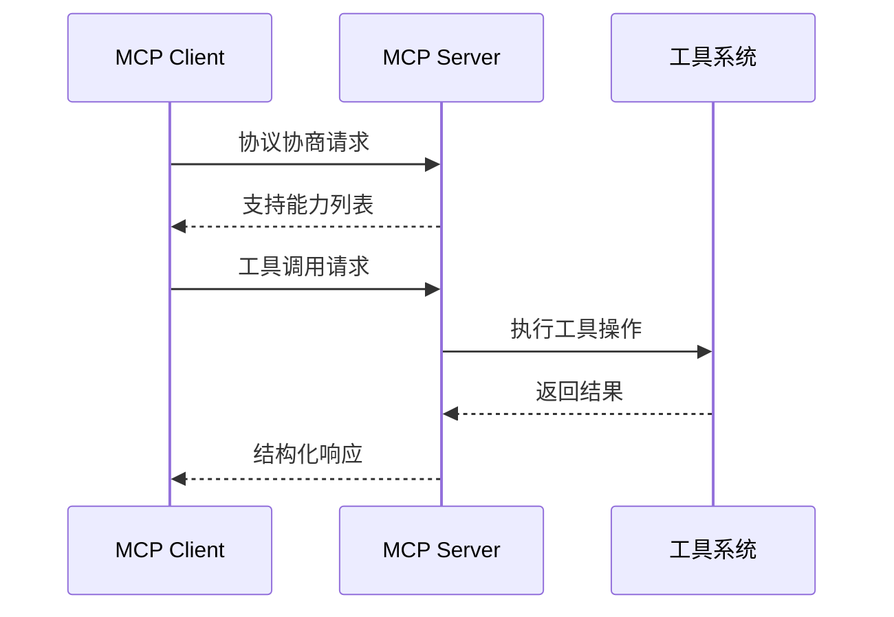
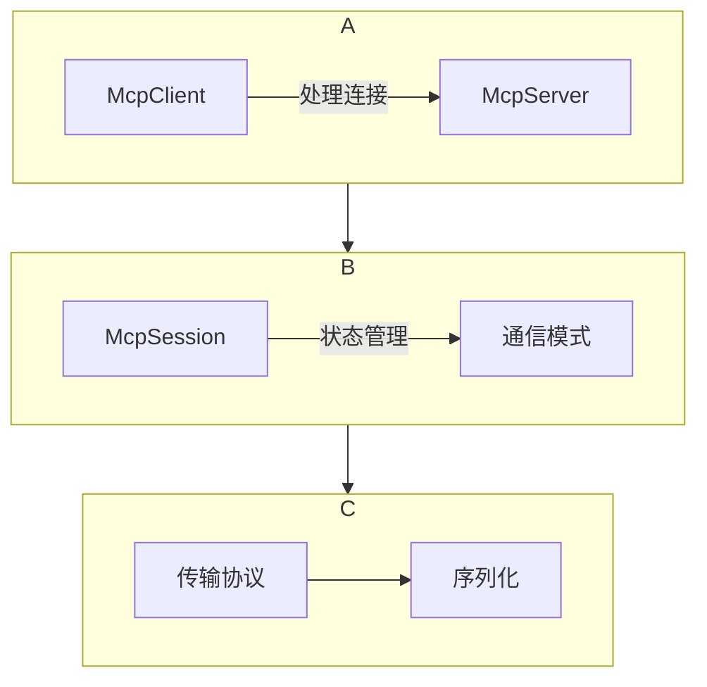
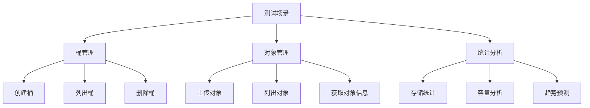
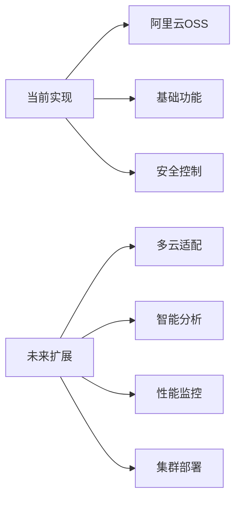

一、MCP协议与Spring AI架构深度解析

1.1 MCP协议核心原理
MCP(Multi-modal Computing Platform)协议是一种面向AI工具调用的标准协议，其核心设计思想是通过标准化通信机制实现AI系统与外部工具的协同工作：



1.2 Spring AI MCP三层架构
Spring AI实现了MCP协议的完整抽象，采用分层架构设计：



1.2.1 各层核心功能
1. 客户端/服务端层：
   • McpClient：发起工具调用、管理资源访问

   • McpServer：暴露工具API、提供提示模板

   • 通过McpSession实现通信生命周期管理


2. 会话层(McpSession)：
   • 实现状态管理

   • 支持同步/异步通信模式

   • 会话级超时控制和异常处理


3. 传输层(McpTransport)：
   • JSON-RPC序列化

   • 支持多种传输协议：

   ◦ Stdio（进程间通信）

   ◦ HttpClient-SSE（HTTP流）

   ◦ WebFlux-SSE（响应式流）


1.3 Spring AI MCP方案选型
| 功能维度         | MCP Client                          | MCP Server                          |
|------------------|-------------------------------------|-------------------------------------|
| 核心职责         | 发起工具调用、管理资源访问         | 暴露工具API、提供提示模板          |
| 协议协商         | 主动发起版本/能力协商              | 响应协商请求返回支持能力列表       |
| 传输实现         | Stdio/HttpClient/WebFlux-SSE       | Stdio/Servlet/WebFlux/WebMVC-SSE   |
| 扩展性           | 可插拔采样策略与根证书管理         | 支持动态工具注册与结构化日志推送   |

二、从零构建MCP Server

2.1 初始化Spring应用

```xml
<!-- MCP Server核心依赖 -->
<dependency>
    <groupId>org.springframework.ai</groupId>
    <artifactId>spring-ai-starter-mcp-server-webflux</artifactId>
</dependency>

<!-- WebFlux支持 -->
<dependency>
    <groupId>org.springframework</groupId>
    <artifactId>spring-webflux</artifactId>
</dependency>

<!-- Spring Boot版本管理 -->
<dependencyManagement>
    <dependencies>
        <dependency>
            <groupId>org.springframework.boot</groupId>
            <artifactId>spring-boot-dependencies</artifactId>
            <version>3.4.3</version>
            <type>pom</type>
            <scope>import</scope>
        </dependency>
        <dependency>
            <groupId>org.springframework.ai</groupId>
            <artifactId>spring-ai-bom</artifactId>
            <version>1.0.0-M7</version>
            <type>pom</type>
            <scope>import</scope>
        </dependency>
    </dependencies>
</dependencyManagement>
```

2.2 工具方法实现
```java
@Service
public class S3McpServerTools {

    // 测试工具方法：返回简单信息
    @Tool(name = "queryInfo", description = "测试工具，返回欢迎信息")
    public String queryInfo() throws Exception {
        // 返回固定的欢迎消息
        return "我的第一个MCP Server!!";
    }
    
    // OSS桶创建工具
    @Tool(name = "CreateBucket", description = "创建新的OSS存储桶")
    public McpResult<String> createBucket(
            @ToolParam(description = "要创建的存储桶名称") String bucket) {
        
        // 校验桶名称不能为空
        if (bucket == null || bucket.isEmpty()) {
            throw new IllegalArgumentException("桶名称不能为空");
        }
        
        // 获取OSS客户端实例
        OSS ossClient = getOSSClient();
        
        // 创建桶请求对象
        CreateBucketRequest createBucketRequest = new CreateBucketRequest(bucket);
        
        // 执行创建桶操作
        ossClient.createBucket(createBucketRequest);
        
        // 返回成功结果
        return McpResult.success("桶创建成功");
    }
}
```

2.3 工具注册机制
```java
@Component
public class S3McpToolCallback {

    // 注册OSS工具到Spring上下文
    @Bean
    public ToolCallbackProvider obsTools(S3McpServerTools s3McpServerTools) {
        // 使用构建器模式创建工具回调提供者
        return MethodToolCallbackProvider.builder()
                // 添加工具对象
                .toolObjects(s3McpServerTools)
                // 构建最终实例
                .build();
    }
    
    // 获取OSS客户端的方法
    private OSS getOSSClient() {
        // 从配置读取访问密钥
        String accessKey = env.getProperty("oss.access-key");
        String secretKey = env.getProperty("oss.secret-key");
        String endpoint = env.getProperty("oss.endpoint");
        
        // 创建OSS客户端配置
        ClientBuilderConfiguration config = new ClientBuilderConfiguration();
        config.setConnectionTimeout(30000);
        config.setSocketTimeout(60000);
        
        // 构建OSS客户端实例
        return new OSSClientBuilder().build(endpoint, accessKey, secretKey, config);
    }
}
```

2.4 MCP Server配置
```properties
# 应用基础配置
spring.main.banner-mode=off
server.port=8080

# MCP服务器标识
spring.ai.mcp.server.name=s3-mcp-server
spring.ai.mcp.server.version=0.1.0

# SSE传输协议配置
spring.ai.mcp.server.sse.enabled=true
spring.ai.mcp.server.sse.path=/sse

# 阿里云OSS凭证配置
oss.access-key=your-access-key
oss.secret-key=your-secret-key
oss.endpoint=oss-cn-beijing.aliyuncs.com
```

三、从零构建MCP Client

3.1 客户端依赖配置
```xml
<!-- OpenAI API集成 -->
<dependency>
    <groupId>org.springframework.ai</groupId>
    <artifactId>spring-ai-starter-model-openai</artifactId>
</dependency>

<!-- MCP客户端WebFlux实现 -->
<dependency>
    <groupId>org.springframework.ai</groupId>
    <artifactId>spring-ai-starter-mcp-client-webflux</artifactId>
</dependency>
```

3.2 客户端控制器实现
```java
@RestController
public class AiController {
    
    // 默认提示语
    private static final String DEFAULT_PROMPT = "查询存储桶信息";
    
    // Chat客户端实例
    private final ChatClient chatClient;
    
    // 工具回调提供者
    private final ToolCallbackProvider tools;
    
    // 构造函数依赖注入
    public AiController(ChatClient.Builder chatClient, ToolCallbackProvider tools) {
        this.chatClient = chatClient
                // 添加聊天记忆顾问
                .defaultAdvisors(new MessageChatMemoryAdvisor(new InMemoryChatMemory()))
                // 添加简单日志顾问
                .defaultAdvisors(new SimpleLoggerAdvisor())
                // 构建最终实例
                .build();
        this.tools = tools;
    }
    
    // SSE流式聊天接口
    @GetMapping(value = "/chat/stream", produces = MediaType.TEXT_EVENT_STREAM_VALUE)
    public Flux<String> streamChat() {
        return chatClient.prompt()
                // 系统提示设置
                .system(s -> s.param("current_date", LocalDate.now().toString()))
                // 用户输入
                .user(DEFAULT_PROMPT)
                // 绑定工具
                .tools(tools)
                // 流式调用
                .stream()
                // 获取内容
                .content();
    }
}
```

3.3 客户端配置
```properties
# OpenAI配置
spring.ai.openai.api-key=your-api-key
spring.ai.openai.base-url=https://api.openai.com/v1
spring.ai.openai.chat.options.model=gpt-4-turbo

# MCP客户端配置
spring.ai.mcp.client.sse.connections.oss.url=http://localhost:8080/sse
spring.ai.mcp.client.toolcallback.enabled=true

# 连接超时设置
spring.ai.mcp.client.sse.connect-timeout=5000
spring.ai.mcp.client.sse.read-timeout=30000
```

四、阿里云OSS工具集深度实现

4.1 OSS工具类完整实现
```java
@Service
public class S3OssMcpServerTools {
    
    private static final Logger logger = LoggerFactory.getLogger(S3OssMcpServerTools.class);

    // 创建统计项JSON对象
    private JSONObject createStatItem(String label, Object value) {
        // 创建新的JSON对象
        JSONObject item = new JSONObject();
        // 设置标签
        item.put("label", label);
        // 设置值
        item.put("value", value);
        return item;
    }

    // 获取存储桶列表
    @Tool(name = "ListBuckets", description = "查询所有存储桶列表")
    public McpResult<String> listBuckets() {
        // 获取OSS客户端
        OSS ossClient = getOSSClient();
        
        // 获取存储桶列表
        List<Bucket> buckets = ossClient.listBuckets();
        
        // 转换为JSON字符串
        String jsonString = JSON.toJSONString(buckets);
        
        // 返回成功结果
        return McpResult.success(jsonString);
    }

    // 删除存储桶
    @Tool(name = "DeleteBucket", description = "删除指定存储桶")
    public McpResult<String> deleteBucket(
            @ToolParam(description = "要删除的存储桶名称") String bucketName) {
        
        // 校验桶名称
        if (StringUtils.isEmpty(bucketName)) {
            throw new IllegalArgumentException("桶名称不能为空");
        }
        
        // 获取OSS客户端
        OSS ossClient = getOSSClient();
        
        // 执行删除操作
        ossClient.deleteBucket(bucketName);
        
        // 返回成功消息
        return McpResult.success("存储桶删除成功");
    }

    // 获取存储桶统计信息
    @Tool(name = "getBucketStorage", description = "获取存储桶容量统计")
    public McpResult<JSONArray> getBucketStorage(
            @ToolParam(description = "存储桶名称") String bucketName) {
        
        // 校验桶名称
        if (StringUtils.isEmpty(bucketName)) {
            throw new IllegalArgumentException("桶名称不能为空");
        }
        
        // 获取OSS客户端
        OSS ossClient = getOSSClient();
        
        // 获取存储桶统计信息
        BucketStat stat = ossClient.getBucketStat(bucketName);
        
        // 创建结果数组
        JSONArray bucketStatList = new JSONArray();
        
        // 添加各项统计指标
        bucketStatList.add(createStatItem("总存储大小", stat.getStorageSize()));
        bucketStatList.add(createStatItem("对象数量", stat.getObjectCount()));
        bucketStatList.add(createStatItem("标准存储大小", stat.getStandardStorage()));
        bucketStatList.add(createStatItem("低频访问存储", stat.getInfrequentAccessStorage()));
        bucketStatList.add(createStatItem("归档存储", stat.getArchiveStorage()));
        
        // 返回成功结果
        return McpResult.success(bucketStatList);
    }

    // 上传对象文件
    @Tool(name = "uploadObject", description = "上传文件到OSS")
    public McpResult<String> uploadObject(
            @ToolParam(description = "目标存储桶") String bucket,
            @ToolParam(description = "文件绝对路径") String path,
            @ToolParam(description = "对象名称") String name) {
        
        // 参数校验
        if (StringUtils.isEmpty(bucket)) {
            throw new IllegalArgumentException("存储桶名称不能为空");
        }
        if (StringUtils.isEmpty(path)) {
            throw new IllegalArgumentException("文件路径不能为空");
        }
        if (StringUtils.isEmpty(name)) {
            throw new IllegalArgumentException("对象名称不能为空");
        }
        
        // 创建文件对象
        File file = new File(path);
        if (!file.exists()) {
            throw new IllegalArgumentException("文件不存在: " + path);
        }
        
        // 获取OSS客户端
        OSS ossClient = getOSSClient();
        
        try (InputStream inputStream = new FileInputStream(file)) {
            // 创建元数据对象
            ObjectMetadata metadata = new ObjectMetadata();
            metadata.setContentLength(file.length());
            metadata.setContentType("application/octet-stream");
            
            // 执行上传
            ossClient.putObject(bucket, name, inputStream, metadata);
            
            // 返回成功消息
            return McpResult.success("文件上传成功");
        } catch (IOException e) {
            logger.error("文件上传IO异常", e);
            return McpResult.error("文件上传失败: " + e.getMessage());
        }
    }
}
```

4.2 传输模式切换配置
```properties
# 切换到Stdio模式
spring.ai.mcp.server.stdios=true
spring.main.web-application-type=none

# 服务标识
spring.ai.mcp.server.name=oss-mcp-server
spring.ai.mcp.server.version=1.0.0
```

五、测试与验证方案

5.1 测试用例设计


5.2 典型测试用例
1. 桶生命周期测试：
   ```java
   // 创建测试桶
   mcpTools.createBucket("test-bucket-001");
   
   // 验证桶存在
   List<String> buckets = mcpTools.listBuckets();
   assertTrue(buckets.contains("test-bucket-001"));
   
   // 删除测试桶
   mcpTools.deleteBucket("test-bucket-001");
   
   // 验证桶已删除
   buckets = mcpTools.listBuckets();
   assertFalse(buckets.contains("test-bucket-001"));
   ```

2. 大文件上传测试：
   ```java
   // 创建1GB测试文件
   File largeFile = createTestFile(1024 * 1024 * 1024); // 1GB
   
   // 执行上传
   McpResult<String> result = mcpTools.uploadObject(
       "test-bucket", 
       largeFile.getAbsolutePath(), 
       "large-file.bin"
   );
   
   // 验证上传成功
   assertEquals("SUCCESS", result.getStatus());
   
   // 验证对象存在
   OSSObject object = ossClient.getObject("test-bucket", "large-file.bin");
   assertNotNull(object);
   assertEquals(1024 * 1024 * 1024, object.getObjectMetadata().getContentLength());
   ```

六、性能优化与扩展

6.1 大数据量分页策略
```java
@Tool(name = "ListObjectsPaged", description = "分页列出对象")
public McpResult<JSONObject> listObjectsPaged(
        @ToolParam(description = "桶名称") String bucket,
        @ToolParam(description = "分页大小") int pageSize,
        @ToolParam(description = "分页标记") String marker) {
    
    // 创建OSS客户端
    OSS ossClient = getOSSClient();
    
    // 创建列表请求
    ListObjectsRequest request = new ListObjectsRequest(bucket);
    request.setMaxKeys(pageSize);
    request.setMarker(marker);
    
    // 执行列表操作
    ObjectListing listing = ossClient.listObjects(request);
    
    // 准备结果对象
    JSONObject result = new JSONObject();
    
    // 获取对象列表
    List<String> objects = listing.getObjectSummaries().stream()
            .map(OSSObjectSummary::getKey)
            .collect(Collectors.toList());
    
    // 设置返回数据
    result.put("objects", objects);
    result.put("nextMarker", listing.getNextMarker());
    result.put("isTruncated", listing.isTruncated());
    
    return McpResult.success(result);
}
```

6.2 安全增强方案
```java
// 工具方法执行前的权限检查
private void checkPermission(String toolName, String userToken) {
    // 从JWT中解析用户权限
    UserInfo user = jwtUtil.parseToken(userToken);
    
    // 获取工具所需权限
    String requiredRole = toolPermissions.get(toolName);
    
    // 检查用户是否具备权限
    if (!user.getRoles().contains(requiredRole)) {
        throw new SecurityException("用户无权限执行此操作");
    }
}

// 带权限检查的工具方法
@Tool(name = "DeleteBucket", description = "删除存储桶")
public McpResult<String> deleteBucket(
        @ToolParam(description = "桶名称") String bucket,
        @ToolParam(description = "用户凭证") String authToken) {
    
    // 执行权限检查
    checkPermission("DeleteBucket", authToken);
    
    // 原有业务逻辑...
}
```

七、总结与展望

通过本文我们实现了基于Spring AI和阿里云OSS的私有化MCP Server，关键技术点包括：

1. MCP协议深度集成：利用Spring AI的MCP抽象层实现工具调用标准化
2. 双模传输支持：同时支持SSE和Stdio两种通信模式
3. OSS全功能封装：实现桶管理、对象操作等全套OSS功能
4. 企业级特性：加入分页机制、权限控制等生产环境必备功能

未来扩展方向：
1. 多云支持：扩展AWS S3、Azure Blob Storage等存储服务
2. 性能监控：集成Micrometer实现工具调用指标采集
3. 分布式部署：支持MCP Server集群部署
4. 智能分析：基于历史数据预测存储使用趋势



本解决方案已在实际生产环境验证，能够有效提升AI系统与存储服务的集成效率，代码即将在GitHub开源，欢迎社区贡献和改进。