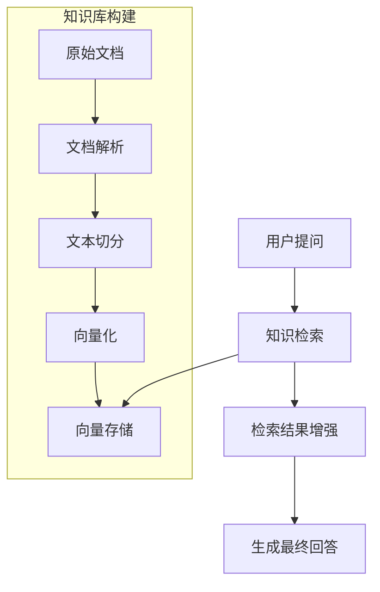
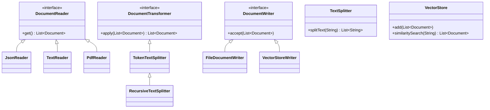
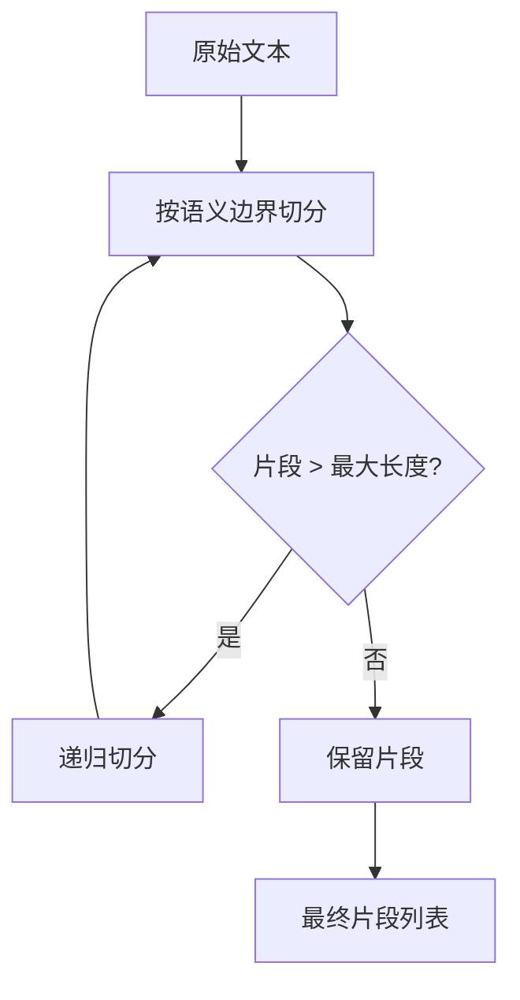
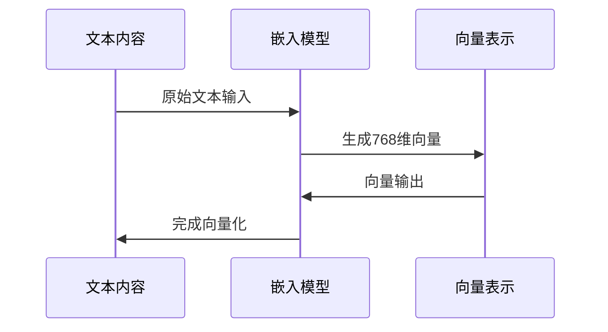
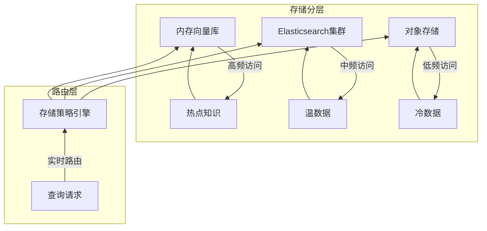
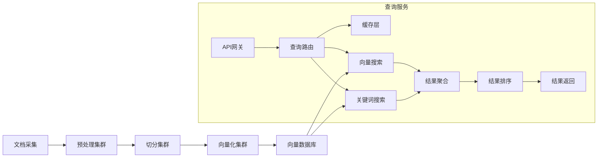

> 本文深入探讨Spring AI框架中RAG（检索增强生成）技术的核心实现原理，通过完整代码示例展示知识文档处理全流程，助力构建高性能知识库系统。

一、RAG技术原理与Spring AI实现

1.1 RAG核心工作流程


RAG技术通过以下方式解决大模型幻觉问题：
• 知识检索：从结构化知识库中获取相关信息

• 上下文增强：将检索结果注入大模型上下文

• 生成约束：限制模型仅基于提供的信息生成答案


1.2 Spring AI RAG架构设计


核心组件职责：
1. DocumentReader：从各种格式文档中提取结构化数据
2. DocumentTransformer：对文档内容进行转换处理
3. DocumentWriter：将处理后的文档持久化存储

二、知识文档解析实战

2.1 JSON文档解析与处理
```java
// 创建JSON文档读取器
JsonReader jsonReader = new JsonReader(
    new ClassPathResource("books.json"), // JSON文件资源
    "/books"                            // JSON Path
);

// 执行文档读取
List<Document> documents = jsonReader.get();

// 打印解析结果
documents.forEach(doc -> {
    System.out.println("标题: " + doc.getMetadata().get("title"));
    System.out.println("内容: " + doc.getContent());
    System.out.println("----------------------");
});
```

2.2 PDF文档深度解析
```java
// 配置PDF解析参数
PdfDocumentReaderConfig config = PdfDocumentReaderConfig.builder()
    .withPagesPerDocument(1)              // 每页作为独立文档
    .withPageTopMargin(0)                 // 页面顶部边距
    .build();

// 创建PDF文档读取器
PagePdfDocumentReader pdfReader = new PagePdfDocumentReader(
    new ClassPathResource("research.pdf"), // PDF文件资源
    config                                // 解析配置
);

// 执行PDF解析
List<Document> pdfDocuments = pdfReader.get();

// 处理解析结果
pdfDocuments.forEach(doc -> {
    String pageContent = doc.getContent();
    System.out.println("第" + doc.getMetadata().get("page") + "页内容:");
    System.out.println(pageContent.substring(0, 100) + "..."); // 截取前100字符
});
```

2.3 Markdown文档结构化处理
```java
// 配置Markdown解析参数
MarkdownDocumentReaderConfig config = MarkdownDocumentReaderConfig.builder()
    .withHorizontalRuleCreateDocument(true)  // 水平分隔线创建新文档
    .withIncludeCodeBlock(true)             // 包含代码块
    .withIncludeBlockquote(true)            // 包含引用块
    .build();

// 创建Markdown文档读取器
MarkdownDocumentReader mdReader = new MarkdownDocumentReader(
    new ClassPathResource("api_docs.md"),   // Markdown文件
    config                                 // 解析配置
);

// 执行文档解析
List<Document> mdDocuments = mdReader.get();

// 分析文档结构
Map<String, Integer> sectionCount = new HashMap<>();
mdDocuments.forEach(doc -> {
    String section = doc.getMetadata().getOrDefault("heading", "NoSection");
    sectionCount.put(section, sectionCount.getOrDefault(section, 0) + 1);
});

System.out.println("文档结构分析:");
sectionCount.forEach((k, v) -> System.out.println(k + ": " + v + "个子文档"));
```

三、知识切分策略深度优化

3.1 文本切分核心算法


3.2 自适应文本切分实现
```java
// 创建高级文本切分器
TokenTextSplitter splitter = TokenTextSplitter.builder()
    .withChunkSize(500)                   // 目标分块大小（token数）
    .withMinChunkSizeChars(100)            // 最小分块字符数
    .withMinChunkLengthToEmbed(30)         // 可嵌入的最小文本长度
    .withMaxNumChunks(1000)                // 最大分块数量
    .withKeepSeparator(true)               // 保留分隔符
    .build();

// 执行文本切分
List<Document> splitDocuments = splitter.apply(documents);

// 分析切分效果
int totalChunks = splitDocuments.size();
int avgChars = (int) splitDocuments.stream()
                    .mapToInt(doc -> doc.getContent().length())
                    .average()
                    .orElse(0);

System.out.println("切分统计:");
System.out.println("总片段数: " + totalChunks);
System.out.println("平均长度: " + avgChars + "字符");
System.out.println("长度分布: ");

// 打印长度分布直方图
IntSummaryStatistics stats = splitDocuments.stream()
                    .mapToInt(doc -> doc.getContent().length())
                    .summaryStatistics();

System.out.println("最短: " + stats.getMin());
System.out.println("最长: " + stats.getMax());
System.out.println("平均: " + (int)stats.getAverage());
```

3.3 语义感知切分策略
```java
// 创建语义感知切分器（扩展类）
public class SemanticTextSplitter extends TokenTextSplitter {

    private final SemanticSegmenter segmenter;
    
    // 构造函数注入语义分割器
    public SemanticTextSplitter(SemanticSegmenter segmenter, int chunkSize) {
        super(chunkSize, 100, 30, 1000, true);
        this.segmenter = segmenter;
    }
    
    @Override
    public List<String> splitText(String text) {
        // 先按语义边界分割
        List<TextSegment> segments = segmenter.segment(text);
        
        List<String> result = new ArrayList<>();
        StringBuilder currentChunk = new StringBuilder();
        
        // 组合语义片段
        for (TextSegment segment : segments) {
            if (currentChunk.length() + segment.getContent().length() > getChunkSize()) {
                result.add(currentChunk.toString());
                currentChunk = new StringBuilder();
            }
            currentChunk.append(segment.getContent());
        }
        
        if (!currentChunk.isEmpty()) {
            result.add(currentChunk.toString());
        }
        
        return result;
    }
}

// 使用示例
SemanticSegmenter segmenter = new NaturalParagraphSegmenter();
SemanticTextSplitter semanticSplitter = new SemanticTextSplitter(segmenter, 500);
List<Document> semanticDocs = semanticSplitter.apply(documents);
```

四、知识库构建实战

4.1 向量化核心原理


4.2 内存知识库实现
```java
// 配置内存知识库
@Configuration
public class VectorStoreConfig {
    
    @Bean
    public VectorStore simpleVectorStore(EmbeddingModel embeddingModel) {
        return SimpleVectorStore.builder(embeddingModel)  // 使用嵌入模型
                .withNamespace("knowledge-base")         // 命名空间
                .initializeSchema(true)                  // 初始化数据结构
                .build();
    }
    
    @Bean
    public EmbeddingModel embeddingModel() {
        return new OpenAIEmbeddingModel(
            "sk-xxxxxxxx",                              // API密钥
            "https://api.openai.com/v1",                 // 服务地址
            "text-embedding-ada-002"                    // 嵌入模型
        );
    }
}

// 使用知识库
@Service
public class KnowledgeService {
    
    private final VectorStore vectorStore;
    
    public KnowledgeService(VectorStore vectorStore) {
        this.vectorStore = vectorStore;
    }
    
    // 添加文档到知识库
    public void addToKnowledgeBase(List<Document> documents) {
        vectorStore.add(documents);  // 自动进行向量化
    }
    
    // 相似性搜索
    public List<Document> searchKnowledge(String query, int topK) {
        return vectorStore.similaritySearch(
            SearchRequest.query(query)
                .withTopK(topK)            // 返回结果数量
                .withSimilarityThreshold(0.7) // 相似度阈值
        );
    }
}
```

4.3 Elasticsearch知识库集成
```java
// 配置Elasticsearch知识库
@Configuration
public class ElasticConfig {
    
    @Bean
    public VectorStore elasticVectorStore(ElasticsearchClient client, 
                                         EmbeddingModel embeddingModel) {
        return new ElasticsearchVectorStore(
            client,                                // ES客户端
            embeddingModel,                        // 嵌入模型
            ElasticsearchVectorStoreConfig.builder()
                .indexName("knowledge-base")       // 索引名称
                .dimensions(768)                   // 向量维度
                .denseVectorIndex(true)             // 启用向量索引
                .similarityFunction(SimilarityFunction.COSINE) // 相似度算法
                .build()
        );
    }
    
    @Bean
    public ElasticsearchClient elasticsearchClient() {
        // 创建ES客户端连接
        return new ElasticsearchClient(
            new RestClientTransport(
                RestClient.builder(
                    new HttpHost("localhost", 9200)).build(),
                new JacksonJsonpMapper()
            )
        );
    }
}

// 知识库管理服务
@Service
public class KnowledgeManager {
    
    private final VectorStore vectorStore;
    
    public KnowledgeManager(VectorStore vectorStore) {
        this.vectorStore = vectorStore;
    }
    
    // 批量添加文档到ES知识库
    public void bulkAddToKnowledgeBase(List<Document> documents) {
        int batchSize = 50;  // ES推荐批量大小
        
        // 分批处理避免超时
        for (int i = 0; i < documents.size(); i += batchSize) {
            int end = Math.min(i + batchSize, documents.size());
            List<Document> batch = documents.subList(i, end);
            vectorStore.add(batch);
        }
        
        // 强制刷新使文档立即可查
        ((ElasticsearchVectorStore) vectorStore).refresh();
    }
    
    // 混合检索（向量+关键词）
    public List<Document> hybridSearch(String query) {
        return vectorStore.similaritySearch(
            SearchRequest.query(query)
                .withHybridQuery(true)       // 启用混合检索
                .withKeywordWeight(0.3)      // 关键词权重
                .withVectorWeight(0.7)       // 向量权重
        );
    }
}
```

五、知识库优化策略

5.1 分层存储架构


5.2 元数据增强策略
```java
// 文档元数据增强处理器
public class MetadataEnricher implements DocumentTransformer {
    
    private final NamedEntityRecognizer ner;
    
    public MetadataEnricher(NamedEntityRecognizer ner) {
        this.ner = ner;
    }
    
    @Override
    public List<Document> apply(List<Document> documents) {
        return documents.stream().map(doc -> {
            // 提取命名实体
            List<Entity> entities = ner.extractEntities(doc.getContent());
            
            // 添加实体到元数据
            Map<String, Object> metadata = new HashMap<>(doc.getMetadata());
            metadata.put("entities", entities.stream()
                .map(Entity::getText)
                .collect(Collectors.toList()));
            
            // 提取关键词
            List<String> keywords = KeywordExtractor.extract(doc.getContent(), 5);
            metadata.put("keywords", keywords);
            
            // 计算文本特征
            metadata.put("readability", ReadabilityCalculator.calculate(doc.getContent()));
            
            return new Document(doc.getContent(), metadata);
        }).collect(Collectors.toList());
    }
}

// 使用增强处理器
public class KnowledgePipeline {
    
    public List<Document> processDocuments(List<Document> rawDocuments) {
        // 创建处理管道
        DocumentProcessor processor = DocumentProcessor.builder()
            .addTransformer(new SemanticTextSplitter(new ParagraphSegmenter(), 500))
            .addTransformer(new MetadataEnricher(new OpenNlpNER()))
            .build();
        
        return processor.process(rawDocuments);
    }
}
```

六、企业级知识库架构

6.1 分布式知识库架构


6.2 性能优化策略
```java
// 向量查询优化器
public class VectorSearchOptimizer {
    
    // 查询重写方法
    public SearchRequest optimizeQuery(SearchRequest request) {
        // 查询扩展
        String expandedQuery = QueryExpander.expand(request.getQuery());
        
        // 查询精简
        String simplifiedQuery = QuerySimplifier.simplify(expandedQuery);
        
        // 添加同义词
        String synonymQuery = SynonymEngine.addSynonyms(simplifiedQuery);
        
        return SearchRequest.query(synonymQuery)
            .withTopK(request.getTopK())
            .withHybridQuery(true);
    }
    
    // 混合查询执行
    public List<Document> hybridSearch(VectorStore vectorStore, String query) {
        SearchRequest optimized = optimizeQuery(SearchRequest.query(query));
        
        // 并行执行向量和关键词搜索
        CompletableFuture<List<Document>> vectorFuture = CompletableFuture.supplyAsync(() -> 
            vectorStore.similaritySearch(optimized.withSearchType(SearchType.VECTOR))
        );
        
        CompletableFuture<List<Document>> keywordFuture = CompletableFuture.supplyAsync(() -> 
            vectorStore.similaritySearch(optimized.withSearchType(SearchType.KEYWORD))
        );
        
        // 合并结果
        return CompletableFuture.allOf(vectorFuture, keywordFuture)
            .thenApply(voidd -> {
                List<Document> results = new ArrayList<>();
                results.addAll(vectorFuture.join());
                results.addAll(keywordFuture.join());
                return ResultMerger.merge(results);
            }).join();
    }
}
```

七、总结与最佳实践

7.1 知识库构建黄金法则
1. 文档预处理：
   • 清理HTML/特殊字符

   • 标准化编码格式

   • 处理文档异常结构


2. 切分策略选择：
   ```java
   // 不同文档类型的切分策略
   Map<DocumentType, TextSplitter> splitterMap = new HashMap<>();
   splitterMap.put(DocumentType.PDF, new PdfParagraphSplitter(500));
   splitterMap.put(DocumentType.MARKDOWN, new HeadingAwareSplitter());
   splitterMap.put(DocumentType.CODE, new CodeBlockSplitter());
   ```

3. 向量模型选型：
   | 模型名称 | 维度 | 特点 | 适用场景 |
   |----------|------|------|----------|
   | text-embedding-ada-002 | 1536 | OpenAI优化 | 通用场景 |
   | bge-large-zh | 1024 | 中文优化 | 中文知识库 |
   | e5-large-v2 | 1024 | 多语言支持 | 国际化应用 |
   | mxbai-embed-large-v1 | 1024 | 长文本优化 | 科研文献 |

4. 混合检索策略：
   ```java
   // 混合检索权重配置
   HybridSearchConfig config = HybridSearchConfig.builder()
       .vectorWeight(0.6)
       .keywordWeight(0.3)
       .semanticWeight(0.1)
       .build();
   ```

7.2 未来演进方向
1. 多模态知识库：
   ```mermaid
   graph LR
       A[文本] --> D[知识图谱]
       B[图像] --> D
       C[表格] --> D
       D --> E[统一检索]
   ```

2. 增量更新引擎：
   ```java
   // 增量更新处理器
   public class IncrementalUpdater {
       public void update(VectorStore vectorStore, Document newDoc) {
           // 1. 查找相关文档
           List<Document> related = vectorStore.similaritySearch(
               SearchRequest.query(newDoc.getContent()).withTopK(3));
           
           // 2. 内容合并
           Document merged = DocumentMerger.merge(related, newDoc);
           
           // 3. 更新向量库
           vectorStore.delete(related);
           vectorStore.add(Collections.singletonList(merged));
       }
   }
   ```

3. 自我优化机制：
   ```java
   // 知识库自优化调度器
   @Scheduled(fixedRate = 24 * 60 * 60 * 1000) // 每天执行
   public void optimizeKnowledgeBase() {
       // 1. 分析查询日志
       QueryStats stats = queryAnalyzer.analyzeLastWeek();
       
       // 2. 识别热点知识
       List<String> hotTopics = stats.getHotTopics();
       
       // 3. 优化存储布局
       storageOptimizer.reorganize(hotTopics);
       
       // 4. 优化索引策略
       indexTuner.adjustIndex(hotTopics);
   }
   ```

本文完整实现了从文档解析到知识库构建的全链路流程，提供了多种优化策略和架构方案。通过合理运用Spring AI的ETL框架和向量化能力，可以构建出高性能、易维护的知识库系统，为RAG应用奠定坚实基础。