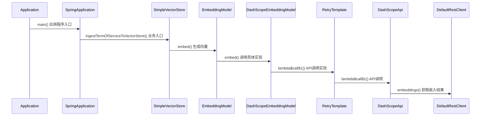
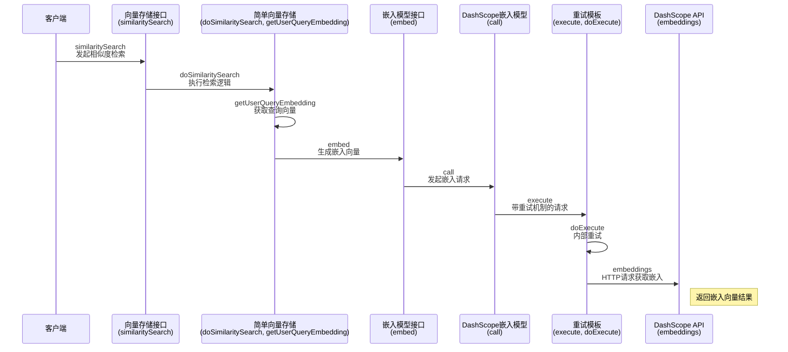

# Spring AI 实现向量检索：ingestTermOfServiceToVectorStore方法详解

## 方法功能概述

`ingestTermOfServiceToVectorStore`方法实现了一个完整的文档向量化与检索流程，是RAG（检索增强生成）系统的核心组件。该方法读取服务条款文档，
进行文本分割、向量化，并演示了如何使用相似性搜索检索相关内容。

## 方法代码注释

```java
// 创建CommandLineRunner Bean，在Spring应用启动后自动执行
@Bean
CommandLineRunner ingestTermOfServiceToVectorStore(
        EmbeddingModel embeddingModel,  // 嵌入模型，用于将文本转换为向量表示，这里为DashScopeEmbeddingModel
        VectorStore vectorStore,        // 向量存储组件，用于保存和检索向量化文本
        @Value("classpath:rag/terms-of-service.txt") Resource termsOfServiceDocs // 服务条款文档资源
) {
    return args -> {
        // 1. 读取文档内容并进行向量化处理
        vectorStore.write(
                new TokenTextSplitter()  // 创建文本分割器，按token数量切分文本
                        .transform(          // 对文本进行切分处理
                                new TextReader(termsOfServiceDocs)  // 创建文本读取器读取资源文件
                                        .read()      // 读取文本内容为字符串
                        )
        );  // 将切分后的文本块向量化并存入向量存储

        // 2. 执行示例查询，搜索与"Cancelling Bookings"相关的内容
        vectorStore.similaritySearch("Cancelling Bookings")  // 执行相似性搜索
                .forEach(doc -> {  // 遍历搜索结果
                    logger.info("Similar Document: {}", doc.getText());  // 记录匹配文档内容
                });
    };
}
```

embeddingModel类型为DashScopeEmbeddingModel，在spring-ai-alibaba-core依赖的DashScopeEmbeddingConfiguration中配置
vectorStore类型为：SimpleVectorStore 来源spring-ai-vector-store
termsOfServiceDocs类型为ClassPathResource

## 技术原理详解

### 1. 文档加载与处理

该方法首先通过`TextReader`读取`terms-of-service.txt`文件。在RAG系统中，文档加载是第一步，通常需要处理各种格式的文档（如PDF、HTML、纯文本等）。Spring
AI提供了多种Reader实现，简化了文档加载过程。

### 2. 文本分割技术

`TokenTextSplitter`负责将长文本切分成更小的片段，这一步骤至关重要，原因有二：

- 大多数嵌入模型对输入文本长度有限制
- 较小的文本块提高了检索精度，便于定位具体信息

分割器通常基于以下策略工作：

- 按固定token数量分割
- 考虑语义边界（句子、段落）
- 允许重叠以保留上下文

### 3. 向量化与存储

`vectorStore.write()`方法将分割后的文本发送给嵌入模型，生成向量表示并存储。这里使用了`embeddingModel`
（通过依赖注入获得）将文本转换为多维向量。在示例中使用了`SimpleVectorStore`，它是Spring AI提供的基于内存的向量存储实现。

向量化过程是RAG的核心，它使文本在高维空间中有了可计算的表示形式，从而能够：

- 计算文本间的语义相似度
- 实现高效的相似内容检索
- 支持跨语言、跨模态的信息匹配

### 4. 相似性搜索

`vectorStore.similaritySearch("Cancelling Bookings")`演示了如何执行语义搜索。这一步骤：

1. 将查询文本"Cancelling Bookings"转换为向量
2. 在向量存储中查找最相似的文档向量
3. 返回相似度最高的文档片段
4. 通过日志输出匹配结果

相似性计算通常使用余弦相似度或欧氏距离等算法。

## 应用场景与扩展

这个方法展示的技术可应用于多种场景：

1. **智能客服系统**：自动检索与用户问题相关的知识库内容
2. **文档搜索引擎**：基于语义而非关键词的文档检索
3. **内容推荐系统**：查找与用户兴趣相似的内容
4. **大语言模型增强**：为LLM提供准确、相关的上下文信息

## 技术细节与优化

在实际应用中，可以从以下几个方面优化此方法：

1. **文本分割参数调优**：调整块大小和重叠度
2. **向量存储持久化**：将SimpleVectorStore替换为Milvus、Pinecone等持久化解决方案
3. **并行处理大型文档集**：使用响应式编程或并行流处理
4. **添加元数据检索**：将文档元数据与向量一同存储，支持混合查询

## 总结

`ingestTermOfServiceToVectorStore`方法虽然简短，但体现了现代RAG系统的核心工作流程。它结合了Spring
AI框架和向量检索技术，实现了从原始文本到语义搜索的完整链路，为构建智能应用提供了基础组件和实现范式。

## 向量化处理逻辑如下：

`vectorStore.write(new TokenTextSplitter().transform(new TextReader(termsOfServiceDocs).read()));`

执行流程如下：



相似性搜索检测逻辑如下：
`
vectorStore.similaritySearch("Cancelling Bookings").forEach(doc -> {
logger.info("Similar Document: {}", doc.getText());
});
`




## SimpleVectorStore类型

`SimpleVectorStore` 是一个简单的向量存储实现类，主要用于在内存中管理和检索向量化的文档数据。它实现了向量数据库的基本功能，适合用于开发、测试或小规模场景。其主要作用和特点如下：

**1. 存储文档及其向量表示**  
每个文档（`Document`）在添加时会通过 `EmbeddingModel` 生成向量（embedding），并与文档内容、元数据一起存储在内存的
`ConcurrentHashMap` 中。

**2. 支持向量相似度检索**  
通过 `doSimilaritySearch` 方法，可以根据用户查询文本生成的向量，计算与存储中所有文档向量的余弦相似度，返回最相似的文档列表。支持相似度阈值和
TopK 限制。

```java
 public List<Document> doSimilaritySearch(SearchRequest request) {
    if (request.getFilterExpression() != null) {
        throw new UnsupportedOperationException("The [" + this.getClass() + "] doesn't support metadata filtering!");
    } else {
        float[] userQueryEmbedding = this.getUserQueryEmbedding(request.getQuery());
        return this.store.values().stream().map((content) -> content.toDocument(SimpleVectorStore.EmbeddingMath.cosineSimilarity(userQueryEmbedding, content.getEmbedding()))).filter((document) -> document.getScore() >= request.getSimilarityThreshold()).sorted(Comparator.comparing(Document::getScore).reversed()).limit((long) request.getTopK()).toList();
    }
}
```

org.springframework.ai.vectorstore.SimpleVectorStore#doSimilaritySearch

```java

@Override
public List<Document> doSimilaritySearch(SearchRequest request) {
    // 生成用于过滤文档的断言（Predicate），根据请求中的过滤表达式动态构建，若无过滤条件则始终返回true
    Predicate<SimpleVectorStoreContent> documentFilterPredicate = doFilterPredicate(request);
    // 获取用户查询文本的向量表示，用于后续与存储文档向量计算相似度
    float[] userQueryEmbedding = getUserQueryEmbedding(request.getQuery());
    // 对存储中的所有文档内容进行流式处理
    return this.store.values()
            // 先根据过滤断言筛选出符合条件的文档
            .stream()
            .filter(documentFilterPredicate)
            // 将每个文档内容映射为Document对象，并计算与查询向量的余弦相似度，作为score
            .map(content -> content
                    .toDocument(EmbeddingMath.cosineSimilarity(userQueryEmbedding, content.getEmbedding())))
            // 只保留相似度分数大于等于请求阈值的文档
            .filter(document -> document.getScore() >= request.getSimilarityThreshold())
            // 按相似度分数从高到低排序
            .sorted(Comparator.comparing(Document::getScore).reversed())
            // 只取前TopK个文档
            .limit(request.getTopK())
            // 收集为List返回
            .toList();
}
```

余弦相似计算cosineSimilarity org.springframework.ai.vectorstore.SimpleVectorStore.EmbeddingMath#cosineSimilarity

```java
// 计算两个向量的余弦相似度，衡量它们方向的相似程度，返回值范围为[-1, 1]
public static double cosineSimilarity(float[] vectorX, float[] vectorY) {
    // ...

    // 计算两个向量的点积，反映它们在同一方向上的投影和
    float dotProduct = dotProduct(vectorX, vectorY);
    // 计算第一个向量的范数（模长），即自身与自身的点积
    float normX = norm(vectorX);
    // 计算第二个向量的范数（模长）
    float normY = norm(vectorY);

    // ...

    // 用点积除以两个向量范数的乘积，得到余弦相似度，数值越接近1表示越相似
    return dotProduct / (Math.sqrt(normX) * Math.sqrt(normY));
}
```

`cosineSimilarity` 方法用于计算两个向量之间的余弦相似度。它的核心思想是通过点积和向量的模长（范数）来衡量两个向量的方向有多接近。

主要步骤如下：

1. **参数校验**：首先判断输入的两个向量是否为 `null`，以及它们的长度是否一致。如果不满足条件会抛出异常，保证后续计算的正确性。

2. **点积计算**：调用 `dotProduct` 方法，计算两个向量对应元素相乘后的和，即点积。

3. **范数计算**：分别计算两个向量的范数（即向量自身与自身的点积再开方），用于归一化。

4. **归一化与相似度计算**：用点积除以两个向量范数的乘积，得到余弦相似度。其值范围在 \[-1, 1\]，值越接近 1 表示两个向量方向越相近。

简要公式如下：

```
cosineSimilarity = dotProduct(vectorX, vectorY) / (sqrt(norm(vectorX)) * sqrt(norm(vectorY)))
```

该方法常用于文本、图像等高维向量的相似度计算，值越大表示越相似。

点积和范数的计算方法如下：

1. **点积（Dot Product）**  
   点积是两个向量对应位置的元素相乘后求和的结果，用于衡量两个向量在同一方向上的投影。公式如下：  
   对于两个向量 `vectorX = [x1, x2, ..., xn]` 和 `vectorY = [y1, y2, ..., yn]`，点积计算公式为：
   ```
   dotProduct = x1 * y1 + x2 * y2 + ... + xn * yn
   ```

   **代码实现**：
   ```java
   public static float dotProduct(float[] vectorX, float[] vectorY) {
       // ...
       float result = 0;
       for (int i = 0; i < vectorX.length; ++i) {
           result += vectorX[i] * vectorY[i];
       }
       return result;
   }
   ```

2. **范数（Norm）**  
   范数是向量的模长，表示向量的大小。计算方法是向量自身与自身的点积再开平方。公式如下：  
   对于向量 `vector = [x1, x2, ..., xn]`，范数计算公式为：
   ```
   norm = sqrt(x1^2 + x2^2 + ... + xn^2)
   ```

   **代码实现**：
   ```java
   public static float norm(float[] vector) {
       return dotProduct(vector, vector);
   }
   ```

   注意：在计算余弦相似度时，范数用于归一化向量。

**3. 支持文档的添加与删除**

- `doAdd`：批量添加文档，自动生成并存储向量。
- `doDelete`：根据文档 ID 删除对应的文档和向量。

**4. 支持条件过滤**  
检索时可通过 SpEL 表达式对文档元数据进行过滤，实现更灵活的查询。

**5. 支持持久化与恢复**

- `save(File)`：将当前内存中的所有向量和文档序列化为 JSON 文件，便于持久化存储。
- `load(File/Resource)`：从 JSON 文件或资源中反序列化恢复向量存储内容。

**6. 便于扩展和集成**  
作为 `AbstractObservationVectorStore` 的子类，支持观测和监控，便于与 Spring AI 生态集成。

**典型应用场景**

- 小型项目或原型开发阶段的本地向量存储
- 单元测试或集成测试环境
- 不需要分布式和高并发的简单向量检索需求

**注意事项**

- 所有数据仅存于内存，重启后会丢失，除非手动调用 `save`/`load`
- 不适合大规模生产环境或分布式部署

总结：`SimpleVectorStore` 提供了一个简单、易用的本地向量数据库实现，方便开发者快速体验和集成向量检索相关功能。


