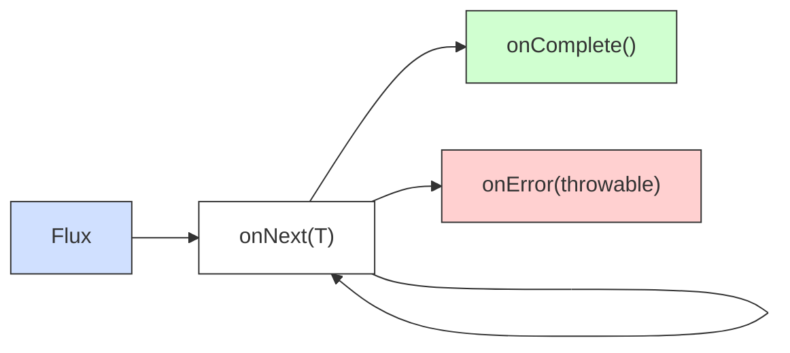
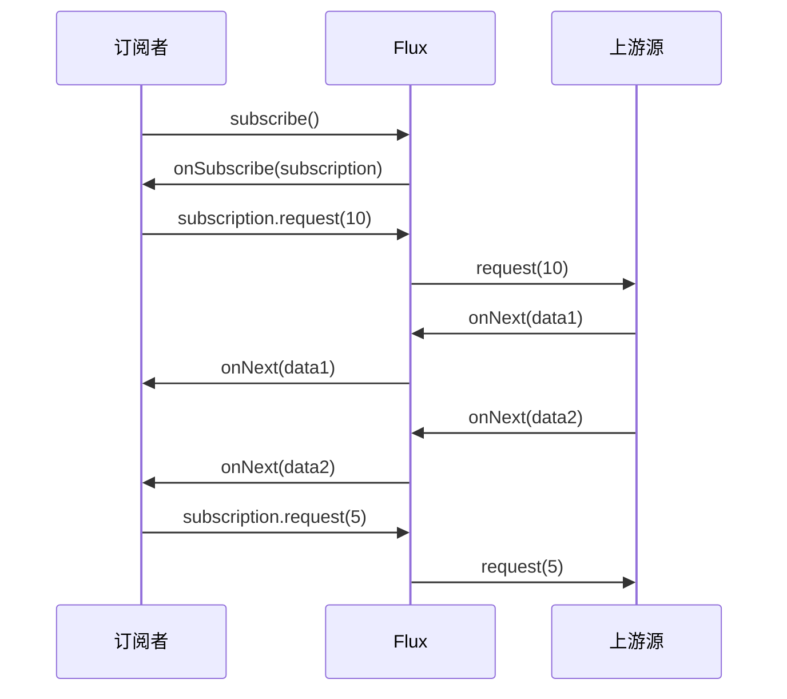
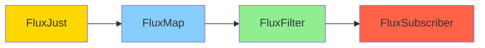
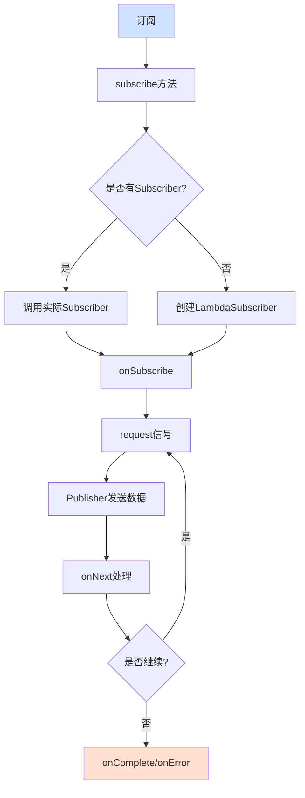
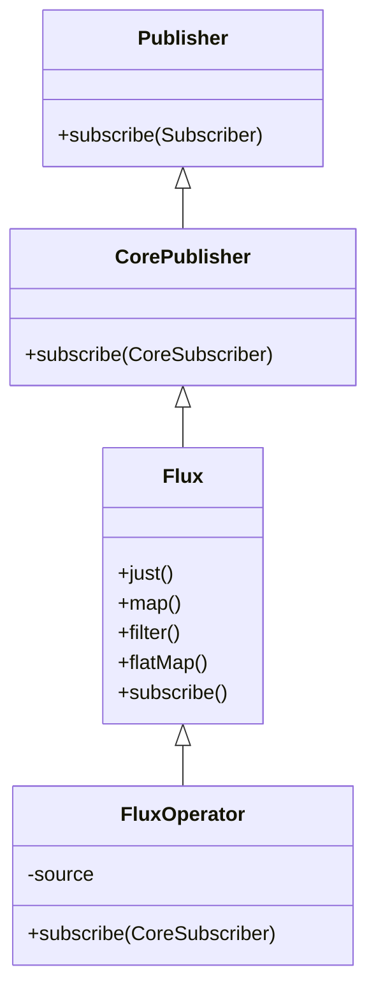
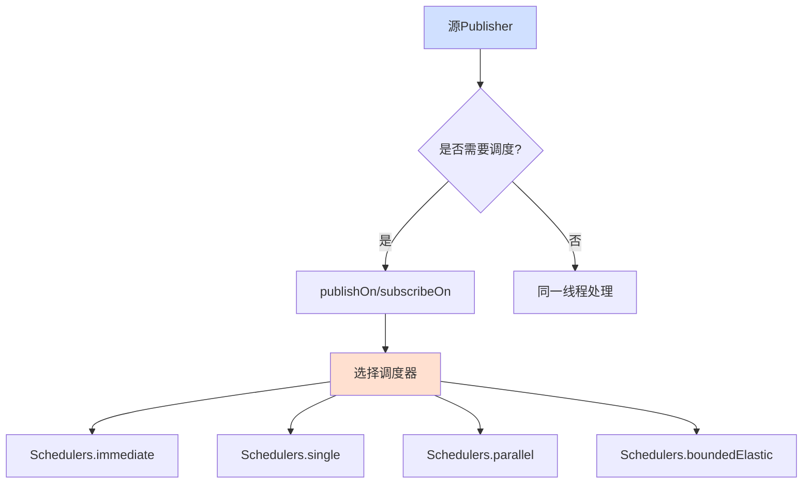

# Spring WebFlux中的Flux全面解析

Flux是Spring响应式编程的核心组件，本文将从使用、原理及源码三个层面全面解析Flux。

## 一、响应式编程基础

### 1.1 什么是Flux

Flux是Reactor库中表示0到N个异步数据序列的发布者(Publisher)：



### 1.2 响应式流规范

Flux遵循响应式流规范(Reactive Streams Specification)，主要接口包括：

| 接口           | 职责              | 核心方法                                             |
|--------------|-----------------|--------------------------------------------------|
| Publisher    | 数据发布者           | subscribe()                                      |
| Subscriber   | 数据订阅者           | onSubscribe(), onNext(), onError(), onComplete() |
| Subscription | 订阅关系            | request(), cancel()                              |
| Processor    | 处理器(同时是发布者和订阅者) | 继承Publisher和Subscriber                           |

## 二、Flux使用方式详解

### 2.1 创建Flux流

```java
// 从固定值创建
Flux<String> flux1 = Flux.just("A", "B", "C");

// 从集合创建
List<String> list = Arrays.asList("X", "Y", "Z");
Flux<String> flux2 = Flux.fromIterable(list);

// 使用区间
Flux<Integer> flux3 = Flux.range(1, 5);

// 空Flux
Flux<String> empty = Flux.empty();

// 错误Flux
Flux<String> error = Flux.error(new RuntimeException("发生错误"));

// 使用generate逐个生成
Flux<String> generated = Flux.generate(
        () -> 0, // 初始状态
        (state, sink) -> {
            sink.next("值" + state);
            if (state == 10) sink.complete();
            return state + 1;
        }
);

// 使用create以编程方式发出
Flux<String> created = Flux.create(sink -> {
    sink.next("消息1");
    sink.next("消息2");
    sink.complete();
});
```

### 2.2 Flux操作符分类

#### 转换操作符

| 操作符     | 功能      | 使用场景         |
|---------|---------|--------------|
| map     | 一对一转换   | 对每个元素应用函数    |
| flatMap | 一对多异步转换 | 一个元素映射到多个元素  |
| handle  | 灵活处理元素  | 需要根据条件过滤和转换时 |

#### 过滤操作符

| 操作符       | 功能        | 使用场景    |
|-----------|-----------|---------|
| filter    | 条件过滤      | 按条件选择元素 |
| take/skip | 获取/跳过特定数量 | 分页或限制数量 |
| distinct  | 去重        | 排除重复元素  |

#### 组合操作符

| 操作符        | 功能        | 使用场景     |
|------------|-----------|----------|
| mergeWith  | 合并多个流(无序) | 并行处理多个流  |
| concatWith | 按顺序连接流    | 保证流处理顺序  |
| zip        | 组合多个流的元素  | 需要配对处理元素 |

#### 上下文操作符

| 操作符             | 功能       | 使用场景        |
|-----------------|----------|-------------|
| contextWrite    | 添加上下文信息  | 传递元数据如用户信息  |
| deferContextual | 基于上下文创建流 | 根据上下文动态决定内容 |

### 2.3 deferContextual详解

`deferContextual`是Flux的强大特性，允许基于上下文动态创建流：

```java
public void test() {
    Flux<String> messages = Flux.deferContextual(ctx -> {
        String user = ctx.getOrDefault("user", "游客");
        String role = ctx.getOrDefault("role", "anonymous");

        if ("admin".equals(role)) {
            return Flux.just("管理员" + user + "，您好", "您有全部权限");
        } else {
            return Flux.just("用户" + user + "，您好", "您有有限权限");
        }
    });

// 使用不同上下文订阅
    messages.contextWrite(Context.of("user", "张三", "role", "admin"))
            .subscribe(msg -> System.out.println("收到: " + msg));

    messages.contextWrite(Context.of("user", "李四", "role", "user"))
            .subscribe(msg -> System.out.
                    println("收到: " + msg));
}
```

## 三、Flux原理设计

### 3.1 背压机制

背压是响应式流的核心机制，使下游能控制上游生产速率：



背压策略：

| 策略     | 描述       | 适用场景        |
|--------|----------|-------------|
| BUFFER | 缓存多余元素   | 上游数据突发但总体可控 |
| DROP   | 丢弃多余元素   | 只关心最新数据     |
| ERROR  | 发出错误信号   | 拒绝超过容量的处理   |
| LATEST | 保留最新元素   | 只需最新状态      |
| IGNORE | 忽略背压(危险) | 小数据量，内存充足   |

### 3.2 操作符组合原理

操作符组合采用装饰者模式，每个操作符返回一个新的Flux实例：



### 3.3 订阅处理流程



## 四、Flux源码分析

### 4.1 Flux核心结构



### 4.2 操作符实现原理

以`map`操作符为例分析：

```java
public final <V> Flux<V> map(Function<? super T, ? extends V> mapper) {
    if (this instanceof Fuseable) {
        return onAssembly(new FluxMapFuseable<>(this, mapper));
    }
    return onAssembly(new FluxMap<>(this, mapper));
}
```

`FluxMap`是个包装器，持有源Flux并实现处理逻辑：

```java
final class FluxMap<T, R> extends FluxOperator<T, R> {
    final Function<? super T, ? extends R> mapper;

    // 当有订阅发生时
    @Override
    public void subscribe(CoreSubscriber<? super R> actual) {
        source.subscribe(new MapSubscriber<>(actual, mapper));
    }

    // 内部订阅者实现
    static final class MapSubscriber<T, R> implements InnerOperator<T, R> {
        // 实现onNext等方法，对每个元素应用mapper函数
        @Override
        public void onNext(T t) {
            R mapped;
            try {
                mapped = mapper.apply(t);
            } catch (Throwable e) {
                onError(e);
                return;
            }
            actual.onNext(mapped);
        }
    }
}
```

### 4.3 装配阶段与订阅阶段

Flux操作遵循两阶段处理：

1. **装配阶段**：构建操作符链
   ```java
   Flux<Integer> flux = Flux.range(1, 10)
       .map(i -> i * 2)
       .filter(i -> i > 5);
   ```

2. **订阅阶段**：触发实际数据流

```java
 public void teset() {
    flux.subscribe(
            value -> System.out.println(value),
            error -> error.printStackTrace(),
            () -> System.out.println("完成")
    );
}
   ```

### 4.4 调度器与线程模型



- **publishOn**: 影响后续操作符的执行线程
- **subscribeOn**: 影响订阅信号的传递线程，通常影响源Publisher

## 五、高级Flux应用

### 5.1 错误处理

```java
Flux<String> flux = Flux.just("A", "B")
        .concatWith(Flux.error(new RuntimeException("发生错误")))
        .concatWith(Flux.just("C", "D"))
        .onErrorResume(e -> {
            System.err.println("处理错误: " + e.getMessage());
            return Flux.just("替代值");
        })
        .doOnError(e -> System.err.println("记录错误: " + e.getMessage()))
        .retry(3);
```

错误处理策略对比：

| 操作符             | 行为            | 使用场景         |
|-----------------|---------------|--------------|
| onErrorReturn   | 提供默认值         | 简单错误恢复       |
| onErrorResume   | 提供备选Publisher | 复杂错误恢复       |
| onErrorContinue | 跳过错误元素继续      | 部分数据异常但不影响整体 |
| retry           | 重新订阅源         | 临时错误可能自动恢复   |

### 5.2 热流与冷流

| 类型 | 特点            | 示例                          |
|----|---------------|-----------------------------|
| 冷流 | 每个订阅者获取完整历史数据 | Flux.range()                |
| 热流 | 订阅者只获取订阅后的数据  | Flux.push()、ConnectableFlux |

转换冷流为热流：

```java
public void test() {
// 创建共享的热流
    ConnectableFlux<Integer> hotFlux = Flux.range(1, 10)
            .delayElements(Duration.ofMillis(100))
            .publish();

// 启动热流数据生成
    hotFlux.connect();

// 延迟订阅，只能收到订阅后的数据
    Thread.sleep(500);
    hotFlux.subscribe(i -> System.out.

            println("订阅者1: " + i));

    Thread.sleep(200);
    hotFlux.subscribe(i -> System.out.println("订阅者2: " + i));
}
```

### 5.3 性能优化与调试

```java
Flux<Integer> flux = Flux.range(1, 1000)
        .checkpoint("来源处")
        .map(i -> i * 2)
        .checkpoint("映射后")
        .filter(i -> i % 3 == 0)
        .checkpoint("过滤后", true) // 启用堆栈跟踪
        .doOnNext(i -> System.out.println("处理: " + i))
        .metrics() // 添加指标监控
        .log();    // 启用日志
```

### 5.4 Hooks全局钩子

```java
// 全局操作符错误处理
Hooks.onOperatorError((error, obj) ->{
        log.

error("操作符错误: {}, 值: {}",error.getMessage(),obj);
        return new

CustomException("自定义错误",error);
});

// 每个操作符添加跟踪
        Hooks.

onOperatorDebug();

// 清理钩子
Hooks.

resetOnOperatorError();
```

## 六、实战应用案例

### 6.1 WebFlux响应式REST API

```java

@RestController
@RequestMapping("/api/products")
public class ProductController {
    private final ProductRepository repository;

    @GetMapping
    public Flux<Product> getAllProducts() {
        return repository.findAll()
                .delayElements(Duration.ofMillis(50)) // 模拟延迟
                .doOnNext(p -> log.info("获取产品: {}", p.getName()));
    }

    @GetMapping("/search")
    public Flux<Product> search(@RequestParam String keyword) {
        return repository.findAll()
                .filter(p -> p.getName().contains(keyword))
                .sort(Comparator.comparing(Product::getPrice));
    }

    @PostMapping
    public Mono<Product> createProduct(@RequestBody Product product) {
        return repository.save(product)
                .doOnSuccess(p -> log.info("创建产品成功: {}", p.getId()));
    }
}
```

### 6.2 数据库异步访问

```java
public class ReactiveProductService {
    private final ReactiveMongoRepository<Product, String> repository;

    public Flux<ProductDto> getTopProducts() {
        return repository.findAll()
                .filter(p -> p.isActive())
                .sort(Comparator.comparing(Product::getSales).reversed())
                .take(10)
                .flatMap(this::enrichProduct)
                .timeout(Duration.ofSeconds(3));
    }

    private Mono<ProductDto> enrichProduct(Product product) {
        return Mono.zip(
                categoryService.getCategory(product.getCategoryId()),
                reviewService.getAverageRating(product.getId())
        ).map(tuple -> {
            ProductDto dto = new ProductDto(product);
            dto.setCategoryName(tuple.getT1().getName());
            dto.setRating(tuple.getT2());
            return dto;
        });
    }
}
```

## 七、总结与最佳实践

### 优势与限制

| 优势       | 限制          |
|----------|-------------|
| 高吞吐量     | 学习曲线陡峭      |
| 非阻塞式     | 调试复杂性       |
| 背压支持     | 异常栈跟踪难度大    |
| 功能丰富的操作符 | 不适合CPU密集型计算 |

### 最佳实践

1. **合理使用调度器**：针对I/O操作使用`boundedElastic`，计算操作使用`parallel`
2. **避免阻塞操作**：永远不在响应式流中使用阻塞API，用响应式替代
3. **错误处理**：总是为流添加错误处理，避免未处理异常导致序列终止
4. **避免过度使用操作符**：链式调用虽然优雅，但过长的链条难以维护
5. **命名装配点**：使用`checkpoint`标记关键流处理节点，方便调试
6. **热流注意事项**：处理热流时要注意订阅时机和资源释放

以上就是对Spring WebFlux中Flux的全面解析，从使用到原理再到源码，希望能帮助你更好地理解和应用响应式编程。