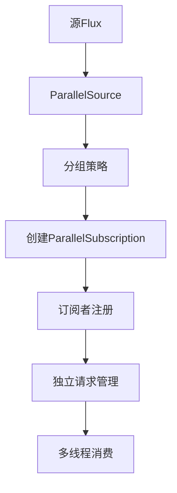

# 深入理解Reactor并行流：Flux.parallel & Flowable.parallel

## 一、核心作用与并行机制

`Flux.parallel()`和`Flowable.parallel()`是Reactor实现数据流并行处理的核心API，其本质是通过**分组订阅**和**独立调度**将串行数据流转换为多个并行子流。关键特性如下：

### 1. 并行度管理

- **默认值设定**：并行度默认等于CPU核心数（`Runtime.getRuntime().availableProcessors()`）
- **动态分组**：源数据根据订阅者数量均分到多个子组（如并行度4，数据会被分成4个分区）
- **元素分发**：通过`RoundRobinPartitioner`实现轮询或范围分区策略

### 2. 独立订阅通道

每个并行子流拥有独立的：

- 订阅生命周期
- 请求计数器
- 错误处理机制
- 背压管理单元

### 3. 消费调度增强

需配合`publishOn()`实现真正的并行消费：

```java
Flux.range(1, 100)
    .parallel()          // 创建并行流
    .runOn(Schedulers.parallel()) // 指定调度器
    .map(i -> heavyCalc(i)) // 并行执行
    .sequential()        // 合并结果
    .subscribe();
```

## 二、原理深度解析

### 1. 并行处理流程



### 2. 关键类协作

```java
// 核心类结构
public abstract class ParallelFlux<T> {
    private final int parallelism;
    private final ParallelGroup group;
    
    public abstract void subscribe(ParallelSubscriber<? super T>[] subscribers);
}

// 分组管理器
class ParallelGroup {
    private final AtomicLongArray requested;
    private final int parallelism;
    
    public void request(long n, int index) {
        requested.addAndGet(index, n);
    }
}
```

### 3. 请求协调机制

- **AtomicLongArray**：记录每个子组的请求数量（索引对应子组ID）
- **背压传播**：当任一子组请求量不足时，整体流暂停生产
- **水印策略**：通过`watermark`变量实现批量请求传递

## 三、源码核心解读

### 1. parallel()方法实现

```java
public final ParallelFlux<T> parallel() {
    int parallelism = this.parallelism != Integer.MIN_VALUE 
        ? this.parallelism 
        : Runtime.getRuntime().availableProcessors();
    return new ParallelFluxArray<>(this, parallelism);
}
```

- **动态并行度**：优先使用用户设置的并行度，否则使用CPU核心数
- **数据结构**：使用`ParallelFluxArray`存储原始数据

### 2. 订阅协调过程

```java
public void subscribe(ParallelSubscriber<? super T>[] subscribers) {
    int n = subscribers.length;
    ParallelSubscription[] subs = new ParallelSubscription[n];
    
    for (int i = 0; i < n; i++) {
        subs[i] = new ParallelSubscription(this, i);
        subscribers[i].onSubscribe(subs[i]);
    }
    
    for (ParallelSubscription sub : subs) {
        sub.request(Long.MAX_VALUE); // 初始请求
    }
}
```

- **订阅数组**：为每个子组创建独立订阅
- **批量请求**：初始请求最大值触发数据生产

### 3. 数据分发逻辑

```java
public void onNext(T t) {
    int idx = index.getAndIncrement() % parallelism;
    subscribers[idx].onNext(t);
}
```

- **轮询分发**：通过原子计数器实现循环分组
- **线程安全**：使用`AtomicInteger`保证并发安全

## 四、性能优化实践

### 1. 并行度调优公式

```java
int parallelism = Math.min(
    Runtime.getRuntime().availableProcessors() * 2, 
    totalDataSize / 10000
);
```

### 2. 调度器选择策略

| 场景        | 推荐Scheduler         |
| ----------- | --------------------- |
| CPU密集计算 | Schedulers.parallel() |
| I/O密集操作 | Schedulers.elastic()  |
| 混合型任务  | 自定义混合线程池      |

### 3. 背压优化方案

```java
parallelFlux
    .onBackpressureBuffer(1024) // 设置缓冲区
    .subscribeOn(Schedulers.boundedElastic()) // 限制线程数
    .publishOn(Schedulers.parallel()); // 消费调度
```

## 五、典型问题排查

### 1. 数据倾斜问题

```java
// 症状：部分子组处理完成，其他子组仍在运行
// 原因：数据分布不均
// 解决：自定义分区策略
parallelFlux.groupBy(i -> i % 4).flatMap(group -> group.parallel());
```

### 2. 内存溢出风险

```java
// 症状：高并发时出现OOM
// 原因：未限制缓冲区大小
// 解决：设置合理缓冲区
.parallel(4).runOn(Schedulers.parallel(), 1024);
```

### 3. 线程泄漏场景

```java
parallelFlux.subscribe(); // 缺少调度器
// 解决：必须配合subscribeOn/publishOn
```

## 六、设计模式启示

1. **分治模式**：通过分组实现数据并行处理
2. **策略模式**：支持自定义分组策略（RoundRobinPartitioner）
3. **观察者模式**：每个子组独立维护订阅关系

------

## 总结

`Flux.parallel()`通过**分组订阅**和**独立调度**机制，实现了真正的并行数据处理能力。正确使用时需注意：

- 合理设置并行度（CPU核心数×2）
- 优先使用弹性调度器处理I/O密集型