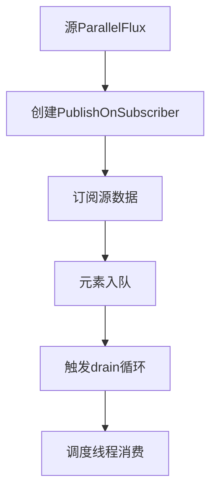

# 深入解析ParallelFlux.runOn的调度实现机制

## 一、核心作用与调度模型

`ParallelFlux.runOn(Scheduler)`是Reactor中实现**并行流线程调度**的核心API，其本质是为每个下游订阅者分配独立的调度器，确保元素在指定线程池中执行。关键特性如下：

### 1. 多订阅者隔离机制

```java
ParallelFlux.range(1, 10)
    .runOn(Schedulers.parallel()) // 每个订阅者独立调度
    .subscribe(subscriber1);      // 线程池A
    .subscribe(subscriber2);      // 线程池B
```

- **独立调度**：每个订阅者拥有独立的执行线程
- **订阅唯一性**：原始`subscribe()`动作仅触发一次（与`subscribeOn`不同）

### 2. 并行消费保障

通过`PublishOnSubscriber`实现线程切换：

```java
public void onNext(T t) {
    queue.offer(t); // 元素先入队
    drain();        // 触发调度消费
}

void drain() {
    while (queue.poll() != null) {
        subscriber.onNext(item); // 调度线程执行
    }
}
```

- **无锁队列**：基于`ConcurrentLinkedQueue`实现高效元素传递
- **批量处理**：通过`request(n)`实现批量拉取提升吞吐量

## 二、原理深度解析

### 1. 关键类协作

```java
// 核心类结构
public final class ParallelFluxRunOn<T> 
    extends ParallelFlux<T> 
    implements Fuseable {

    private final ParallelFlux<T> source;
    private final Scheduler scheduler;
    
    public void subscribe(CoreSubscriber<? super T>[] subscribers) {
        for (int i = 0; i < subscribers.length; i++) {
            subscribers[i] = new PublishOnSubscriber<>(subscribers[i], scheduler);
        }
        source.subscribe(subscribers);
    }
}
```

### 2. 调度实现流程



### 3. 线程切换细节

- **Fuseable优化**：通过`requestFusion`实现零拷贝（仅限同步源）
- **错误传播**：使用`AtomicReference`确保错误快速传播
- **取消支持**：通过`Subscription.cancel()`终止调度

## 三、源码核心解读

### 1. runOn方法实现

```java
public final ParallelFlux<T> runOn(Scheduler scheduler) {
    if (this instanceof Fuseable) {
        return new ParallelFluxRunOnFuseable<>(this, scheduler);
    }
    return new ParallelFluxRunOn<>(this, scheduler);
}

// 核心包装逻辑
class ParallelFluxRunOn<T> extends ParallelFlux<T> {
    public void subscribe(CoreSubscriber<? super T>[] subscribers) {
        for (int i = 0; i < subscribers.length; i++) {
            subscribers[i] = new PublishOnSubscriber<>(subscribers[i], scheduler);
        }
        source.subscribe(subscribers);
    }
}
```

- **动态包装**：为每个订阅者创建独立的`PublishOnSubscriber`
- **调度器传递**：通过构造函数注入目标调度器

### 2. 元素分发逻辑

```java
public void onNext(T t) {
    if (queue.offer(t)) {
        if (get() == 0 && compareAndSet(0, 1)) {
            scheduler.schedule(this::drainLoop);
        }
    }
}

void drainLoop() {
    while (!cancelled) {
        if (queue.poll() != null) {
            actual.onNext(item);
        } else {
            break;
        }
    }
}
```

- **背压感知**：通过`request(n)`控制生产速度
- **循环调度**：通过`drainLoop`实现批量处理

## 四、性能优化实践

### 1. 调度器选择策略

| 场景        | 推荐Scheduler         |
| ----------- | --------------------- |
| CPU密集计算 | Schedulers.parallel() |
| I/O密集操作 | Schedulers.elastic()  |
| 定时任务    | Schedulers.timer()    |

### 2. 并行度调优公式

```java
int parallelism = Math.min(
    Runtime.getRuntime().availableProcessors() * 2, 
    totalDataSize / 1000
);
```

### 3. 背压优化方案

```java
parallelFlux
    .onBackpressureBuffer(1024) // 设置缓冲区
    .runOn(Schedulers.parallel(), 1024) // 限制队列大小
    .subscribe();
```

## 五、典型问题排查

### 1. 线程泄漏场景

```java
parallelFlux.runOn(Schedulers.newSingle("leak")); // 缺少订阅终止
// 解决：确保所有调度任务有终止条件
```

### 2. 数据倾斜问题

```java
// 症状：部分线程处理时间过长
// 解决：自定义分组策略
parallelFlux.groupBy(i -> i % 4).flatMap(group -> group.runOn(Schedulers.parallel()));
```

### 3. 内存溢出风险

```java
// 症状：高并发时出现OOM
// 解决：限制队列容量
.parallel(4).runOn(Schedulers.parallel(), 1024);
```

## 六、设计模式启示

1. **责任链模式**：通过`PublishOnSubscriber`链式处理调度
2. **策略模式**：调度器作为可插拔策略
3. **观察者模式**：`ParallelSourceInner`作为中间订阅者

------

## 总结

`ParallelFlux.runOn`通过**独立调度器分配**和**队列驱动消费**机制，实现了真正的并行数据处理能力。正确使用时需注意：

- 合理设置并行度（CPU核心数×2）
- 优先使用弹性调度器处理I/O密集型任务
- 结合`groups()`方法进行结果