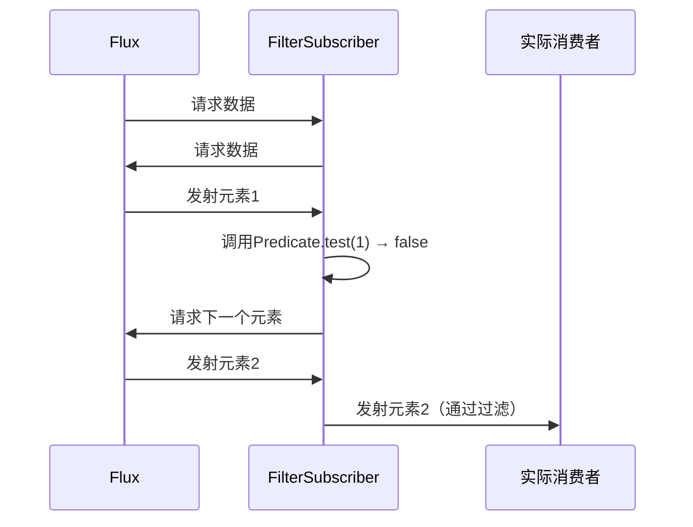

## 一、章节核心内容总结

本章围绕Reactor中的`filter`操作符展开，通过图示（图4-1）和代码示例展示了其核心行为：**对数据流中的元素进行条件过滤**。核心要点如下：

1. **行为模式**：源（Source）发射的每个元素需通过`Predicate`条件判断，符合条件的元素被保留并传递给下游订阅者。
2. **代码示例**：过滤1-10中的偶数，通过`Flux.range(1,10).filter(i->i%2==0)`实现。
3. 关键角色：
   - **元素（Element）**：数据流的基本单位（如数字1-10）
   - **源（Source）**：数据的发射源头（如Flux.range）
   - **Predicate**：定义过滤条件的函数式接口
   - **FILTER操作**：对元素进行条件筛选的操作符

## 二、filter操作原理深度解析

### 1. 响应式流规范中的角色定位

在Reactor实现中，`filter`操作符遵循**响应式流规范**（Reactive Streams），其本质是**中间操作符**，需实现以下接口：

- **Subscriber**：接收上游数据并处理
- **Subscription**：管理数据流订阅关系

### 2. 数据流处理流程




```mermaid
sequenceDiagram
    participant Source as Flux
    participant Filter as FilterSubscriber
    participant Subscriber as 实际消费者

    Source->>Filter: 请求数据
    Filter->>Source: 请求数据
    Source->>Filter: 发射元素1
    Filter->>Filter: 调用Predicate.test(1) → false
    Filter->>Source: 请求下一个元素
    Source->>Filter: 发射元素2
    Filter->>Subscriber: 发射元素2（通过过滤）
    ...
```

### 3. 关键机制

- **惰性求值**：仅当订阅发生时才会触发过滤逻辑
- **背压支持**：通过Subscription协调上下游的生产消费速率
- **短路行为**：一旦`Predicate`返回false，立即停止处理当前元素

## 三、源码解读（Reactor 3.x）

### 1. filter操作符实现入口

```java
// FluxFilter.java
public final class FluxFilter<T> extends FluxOperator<T, T> {
    public FluxFilter(Flux<? extends T> source, Predicate<? super T> predicate) {
        super(source);
        this.predicate = Objects.requireNonNull(predicate, "predicate");
    }

    @Override
    public void subscribe(Subscriber<? super T> subscriber) {
        source.subscribe(new FilterSubscriber<>(subscriber, predicate));
    }
}
```

### 2. 关键类FilterSubscriber

```java
private static final class FilterSubscriber<T> extends Operators.SubscriberSubscriber<T> {
    private final Predicate<? super T> predicate;

    FilterSubscriber(Subscriber<? super T> actual, Predicate<? super T> predicate) {
        super(actual);
        this.predicate = predicate;
    }

    @Override
    public void onNext(T t) {
        if (predicate.test(t)) { // 核心过滤逻辑
            actual.onNext(t);
        }
    }
}
```

### 3. 关键流程解析

1. **订阅链建立**：`FluxFilter.subscribe()`将原始订阅者包装成`FilterSubscriber`
2. **数据传递**：上游元素通过`onNext()`传递给`FilterSubscriber`
3. **条件过滤**：`Predicate.test()`决定元素是否继续向下传递
4. **异常处理**：若`Predicate`抛出异常，会通过`onError()`终止数据流

## 四、与其他过滤机制的对比

| 特性       | Reactor filter      | Servlet Filter    |
| ---------- | ------------------- | ----------------- |
| 作用域     | 数据流处理          | HTTP请求响应拦截  |
| 执行时机   | 订阅时触发          | 请求到达时触发    |
| 异步支持   | 天然支持            | 需结合异步Servlet |
| 条件表达式 | Predicate函数式接口 | 基于请求/响应对象 |

## 五、最佳实践与性能优化

1. **避免复杂计算**：将耗时逻辑放在过滤后处理
2. **组合操作符**：`filter().map()`比单独使用更高效
3. **条件短路优化**：确保Predicate实现快速失败
4. **内存管理**：避免过滤条件产生中间集合

## 六、总结

`filter`操作符是构建响应式数据管道的核心工具，其通过**函数式条件判断**实现高效的数据过滤。在Reactor中，通过`FilterSubscriber`实现订阅链的拦截与条件过滤，完美适配响应式流规范。理解其原理和源码实现，有助于在复杂场景中优化数据处理逻辑，提升系统吞吐量。