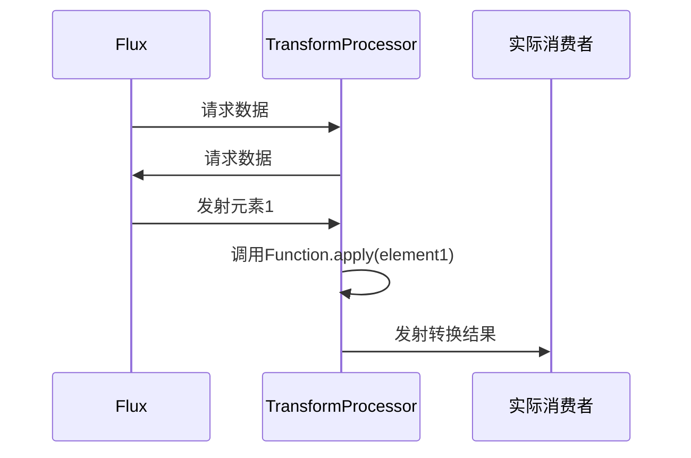

## 一、章节核心内容总结

本章聚焦Reactor核心操作符**`transform`**，通过图示（图4-3）和案例对比（如v=1时仅取首元素），揭示其**数据流转换**的本质。核心要点如下：

1. **行为模式**：将上游`Flux`整体转换为下游`Flux`，支持自定义逻辑（如过滤、映射、组合）
2. 关键特性：
   - **中间操作符**：不直接订阅源，而是返回新`Flux`供下游订阅
   - **统一接口**：基于`java.util.function.Function<T, Publisher<U>>`实现
   - **短路能力**：内部逻辑可提前终止数据流（如示例中的首元素截断）
3. 对比RxJava：
   - 参数类型：Reactor使用`Function`，RxJava需实现`Transformer`
   - 实现复杂度：Reactor更简洁（无需中间类封装）
   - 返回类型：统一为`Publisher`，增强泛型兼容性

## 二、transform操作原理深度解析

### 1. 响应式流规范中的角色

- **双向订阅协议**：需实现`Subscriber`与`Subscription`接口
- **状态管理**：需维护上游订阅状态与下游请求计数

### 2. 数据流处理流程




```mermaid
sequenceDiagram
    participant Source as Flux
    participant Transform as TransformProcessor
    participant Subscriber as 实际消费者

    Source->>Transform: 请求数据
    Transform->>Source: 请求数据
    Source->>Transform: 发射元素1
    Transform->>Transform: 调用Function.apply(element1)
    Transform->>Subscriber: 发射转换结果
    ...
```

### 3. 关键机制

- **动态转换**：每次订阅都会创建新的转换逻辑实例
- **背压传递**：自动将下游请求量传递给上游
- **错误处理**：转换逻辑中抛出异常会触发`onError`

## 三、源码解读（Reactor 3.x）

### 1. transform操作符入口

```java
// Flux.java
public final <R> Flux<R> transform(Function<? super Flux<T>, ? extends Publisher<? extends R>> transformer) {
    return onAssembly(new FluxTransform<>(this, transformer));
}
```

### 2. 核心实现类FluxTransform

```java
private static final class FluxTransform<T, R> extends FluxOperator<T, R> {
    private final Function<? super Flux<T>, ? extends Publisher<? extends R>> transformer;

    FluxTransform(Flux<T> source, Function<? super Flux<T>, ? extends Publisher<? extends R>> transformer) {
        super(source);
        this.transformer = transformer;
    }

    @Override
    public void subscribe(Subscriber<? super R> subscriber) {
        Publisher<? extends R> publisher = transformer.apply(source);
        publisher.subscribe(subscriber);
    }
}
```

### 3. 关键流程解析

1. **订阅链建立**：`Flux.transform()`创建`FluxTransform`实例
2. **动态转换**：调用`transformer.apply()`生成下游`Publisher`
3. **订阅传递**：下游`Subscriber`直接订阅转换后的`Publisher`
4. **背压处理**：自动继承下游的请求信号（通过`Subscription`传递）

## 四、与RxJava的对比分析

| 特性       | Reactor transform         | RxJava compose                    |
| ---------- | ------------------------- | --------------------------------- |
| 参数类型   | Function<Flux, Publisher> | Transformer<Upstream, Downstream> |
| 返回类型   | 统一Publisher             | 需指定具体类型                    |
| 实现复杂度 | 仅需Lambda表达式          | 需实现接口                        |
| 资源释放   | 自动管理                  | 需手动处理                        |

## 五、最佳实践与性能优化

### 1. 典型应用场景

```java
// 数据脱敏转换
Flux.just("123-45-6789")
    .transform(data -> data.map(s -> s.replaceAll("-", "")));

// 流程控制
Flux.range(1, 10)
    .transform(f -> f.take(5).map(i -> i * 2));
```

### 2. 性能优化要点

- **避免阻塞操作**：确保转换逻辑是非阻塞的
- **复用转换逻辑**：通过`Function`组合减少重复代码
- **背压适配**：转换后的`Publisher`需支持背压

### 3. 常见陷阱

```java
// 错误案例：转换逻辑产生副作用
Flux.range(1, 10)
    .transform(f -> {
        System.out.println("转换执行"); // 每次订阅都会执行
        return f;
    });
```

## 六、总结

`transform`操作符通过**函数式编程范式**，实现了数据流的声明式转换。其核心优势在于：

1. **高度解耦**：转换逻辑与数据源分离
2. **灵活组合**：支持多级转换链式调用
3. **规范兼容**：完美适配响应式流规范

通过`FluxTransform`的源码分析可见，Reactor通过**函数式接口+动态代理**模式，将转换逻辑封装为独立的`Publisher`，既保证了性能又提升了代码可维护性。掌握其原理，可有效提升响应式编程的抽象能力。