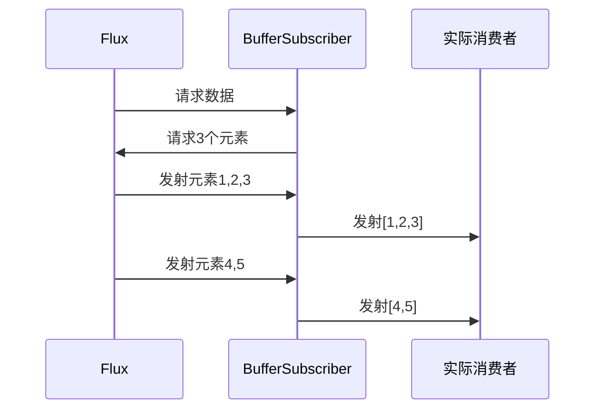
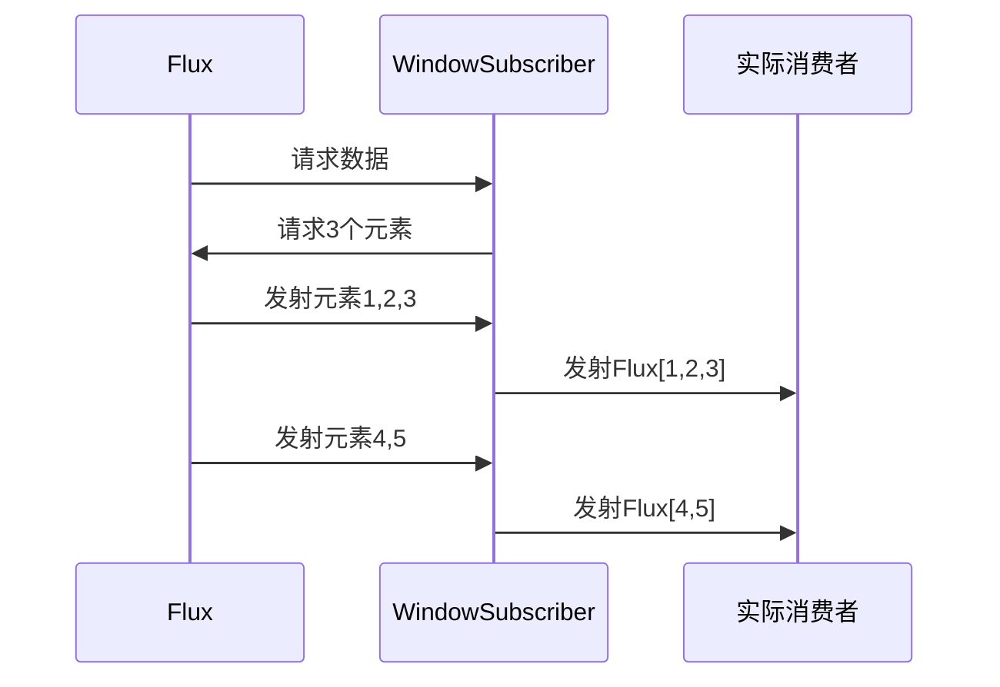
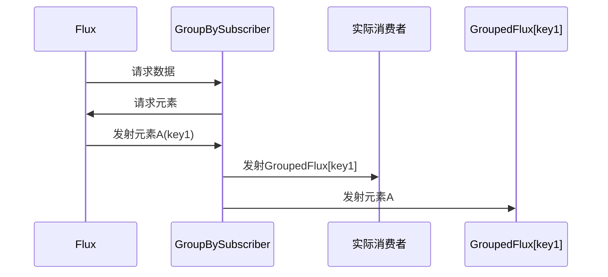

本章系统讲解Reactor中三大批处理操作符：**`buffer`**、**`window`**和**`groupBy`**，通过示例对比（如`buffer(3)` vs `window(3)`）揭示其核心差异。核心要点如下：

| 特性             | `buffer`               | `window`         | `groupBy`                 |
| ---------------- | ---------------------- | ---------------- | ------------------------- |
| **返回类型**     | `Flux<List<T>>`        | `Flux<Flux<T>>`  | `Flux<GroupedFlux<K, T>>` |
| **数据结构**     | 列表（List）           | 子Flux流         | 分组容器（GroupedFlux）   |
| **元素保留策略** | 丢弃旧元素（窗口满后） | 保留所有历史窗口 | 按key动态分组             |
| **典型场景**     | 批量写入数据库         | 滑动窗口统计     | 按用户ID分组处理          |

## 二、批处理操作原理深度解析

### 1. 响应式流规范中的角色

- **动态资源管理**：需实现`Subscription`动态调整数据流速率
- **边界触发机制**：通过`request(n)`信号控制窗口/分组的生成节奏
- **错误传播规则**：任一分组内发生错误会终止整个数据流

### 2. 数据流处理流程对比

#### Buffer操作：




#### Window操作：




#### GroupBy操作：




### 3. 关键机制

- 窗口触发策略：
  - `buffer`：基于数量/时间触发
  - `window`：基于数量/时间或子Flux完成事件
- 分组策略：
  - `groupBy`：通过`Function<? super T, ? extends K>`生成分组键
  - 支持动态分组（键值可随元素变化）

## 三、源码解读（Reactor 3.x）

### 1. Buffer操作实现

```java
// FluxBuffer.java
public final class FluxBuffer<T> extends FluxOperator<T, List<T>> {
    public FluxBuffer(Flux<? extends T> source, int bufferSize) {
        super(source);
        this.bufferSize = bufferSize;
    }

    @Override
    public void subscribe(Subscriber<? super List<T>> subscriber) {
        source.subscribe(new BufferSubscriber<>(subscriber, bufferSize));
    }
}

// BufferSubscriber关键逻辑
void drain() {
    if (buffer.size() >= bufferSize) {
        List<T> emitted = buffer;
        buffer = new ArrayList<>();
        actual.onNext(emitted);
    }
}
```

### 2. Window操作实现

```java
// FluxWindow.java
public final class FluxWindow<T> extends FluxOperator<T, Flux<T>> {
    public FluxWindow(Flux<? extends T> source, int windowSize) {
        super(source);
        this.windowSize = windowSize;
    }

    @Override
    public void subscribe(Subscriber<? super Flux<T>> subscriber) {
        source.subscribe(new WindowSubscriber<>(subscriber, windowSize));
    }
}

// WindowSubscriber关键逻辑
void windowComplete() {
    Flux<T> window = Flux.from(buffer);
    actual.onNext(window);
    buffer = new ArrayList<>();
}
```

### 3. GroupBy操作实现

```java
// FluxGroupBy.java
public final class FluxGroupBy<T, K> extends Flux<GroupedFlux<K, T>> {
    public FluxGroupBy(Flux<? extends T> source, Function<? super T, ? extends K> keySelector) {
        super(source);
        this.keySelector = keySelector;
    }

    @Override
    public void subscribe(Subscriber<? super GroupedFlux<K, T>> subscriber) {
        source.subscribe(new GroupBySubscriber<>(subscriber, keySelector));
    }
}

// GroupBySubscriber关键逻辑
void onNext(T t) {
    K key = keySelector.apply(t);
    GroupedFlux<K, T> group = groups.get(key);
    if (group == null) {
        group = new GroupedFlux<>(key);
        groups.put(key, group);
        subscriber.onNext(group);
    }
    group.onNext(t);
}
```

## 四、与Java 8 Stream的对比分析

| 特性         | Reactor Buffer/Window | Java 8 Stream Collect |
| ------------ | --------------------- | --------------------- |
| **执行模型** | 异步推模式            | 同步拉模式            |
| **背压支持** | 天然支持              | 需手动实现            |
| **资源释放** | 自动管理              | 需调用close()         |
| **动态调整** | 支持窗口动态调整      | 静态收集策略          |

## 五、最佳实践与性能优化

### 1. 典型应用场景

```java
// 实时日志分组统计
Flux<LogEvent> logs = ...
logs.groupBy(LogEvent::getUserId)
    .flatMap(group -> group.count())
    .subscribe(count -> System.out.println("User activity: " + count));

//
```