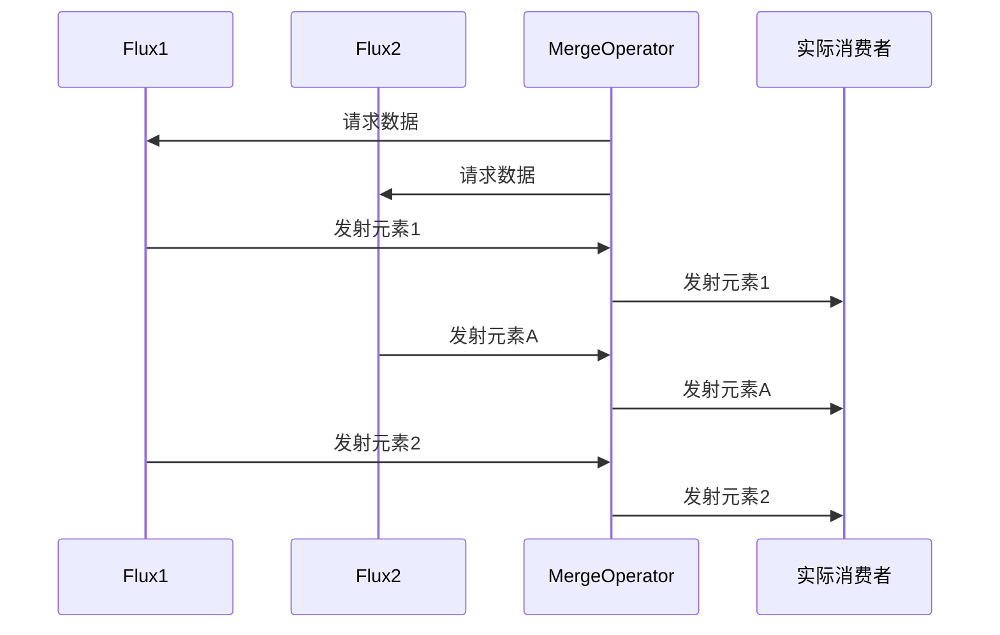
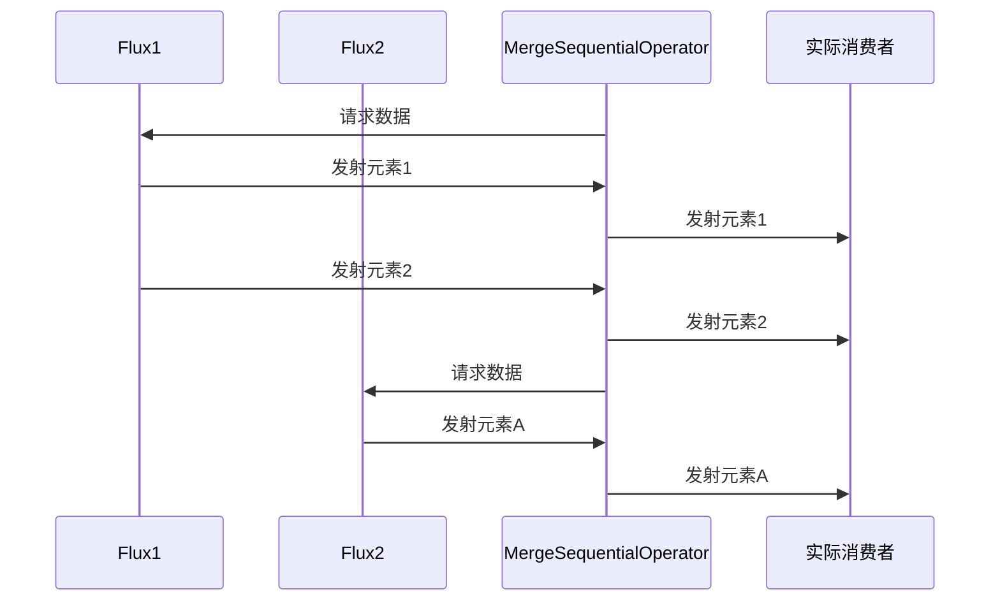

本章系统对比Reactor中两大多源合并操作符**`merge`**与**`mergeSequential`**，通过图示（图4-13/4-14）和代码示例揭示其核心差异。核心要点如下：

| 特性         | `merge`                          | `mergeSequential`                |
| ------------ | -------------------------------- | -------------------------------- |
| **合并策略** | 按元素实际产生顺序动态合并       | 按源订阅顺序以源为单位依次合并   |
| **并发执行** | 支持多源并行发射元素             | 严格按顺序逐个处理源             |
| **背压处理** | 依赖下游请求信号动态分配         | 按源顺序依次传递背压             |
| **典型场景** | 实时数据流聚合（如多传感器数据） | 任务流水线处理（如顺序执行任务） |

## 二、原理深度解析

### 1. 响应式流规范中的角色

- **动态调度器**：需实现`Subscription`接口动态协调多源数据流
- **边界触发机制**：通过`request(n)`信号控制元素发射节奏
- **错误传播规则**：任一源发生错误会立即终止整个合并流

### 2. 数据流处理流程对比

#### Merge操作：




#### MergeSequential操作：




### 3. 关键机制

- **合并队列**：`mergeSequential`内部维护**源级队列**保证顺序
- **订阅管理**：`merge`动态创建子订阅，`mergeSequential`按序订阅
- **背压传递**：`merge`按元素粒度传递，`mergeSequential`按源粒度传递

## 三、源码解读（Reactor 3.x）

### 1. Merge操作实现

```java
// Flux.java
public static <T> Flux<T> merge(Publisher<? extends Publisher<? extends T>> sources) {
    return merge(sources, Queues.SMALL_BUFFER_SIZE, Integer.MAX_VALUE);
}

// MergeSubscriber关键逻辑
void onNext(Publisher<? extends T> publisher) {
    if (isCancelled()) return;
    if (queue.offer(publisher)) {
        if (wip.getAndIncrement() == 0) {
            drain();
        }
    }
}

void drain() {
    while (wip.get() > 0) {
        if (queue.isEmpty()) break;
        Publisher<? extends T> p = queue.poll();
        subscribeChild(p);
    }
}
```

### 2. MergeSequential实现

```java
// Flux.java
public static <T> Flux<T> mergeSequential(Publisher<? extends Publisher<? extends T>> sources) {
    return mergeSequential(sources, Queues.SMALL_BUFFER_SIZE, 1);
}

// MergeSequentialSubscriber关键逻辑
void onNext(Publisher<? extends T> publisher) {
    if (isCancelled()) return;
    sources.offer(publisher);
    if (wip.getAndIncrement() == 0) {
        drain();
    }
}

void drain() {
    while (wip.get() > 0) {
        if (currentSource == null) {
            currentSource = sources.poll();
            if (currentSource == null) break;
            currentSubscription = Operators.subscribe(currentSource, this);
        }
        if (currentSubscription != null) {
            currentSubscription.request(1);
        }
    }
}
```

### 3. 关键流程解析

1. 

   Merge操作

   

   ：

   - 动态维护优先级队列
   - 采用竞争订阅模式
   - 元素发射遵循"先到先服务"原则

2. 

   MergeSequential操作

   

   ：

   - 严格按源队列顺序处理
   - 每个源完成后再处理下一个
   - 内部使用串行订阅模式

## 四、与RxJava对比分析

| 特性           | Reactor merge      | RxJava merge        |
| -------------- | ------------------ | ------------------- |
| **并发控制**   | 支持动态并发度调整 | 需通过参数指定      |
| **错误处理**   | 默认快速失败       | 支持错误收集模式    |
| **资源释放**   | 自动管理订阅关系   | 需手动调用dispose() |
| **调度器支持** | 内置调度器集成     | 需显式指定Scheduler |

## 五、最佳实践与性能优化

### 1. 典型应用场景

```java
// 实时日志聚合（merge）
Flux.merge(
    logService.getSystem
```