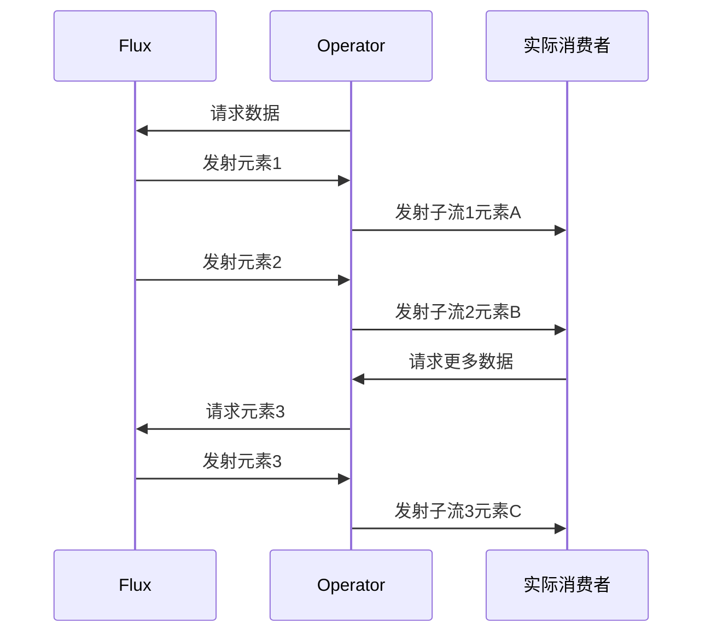
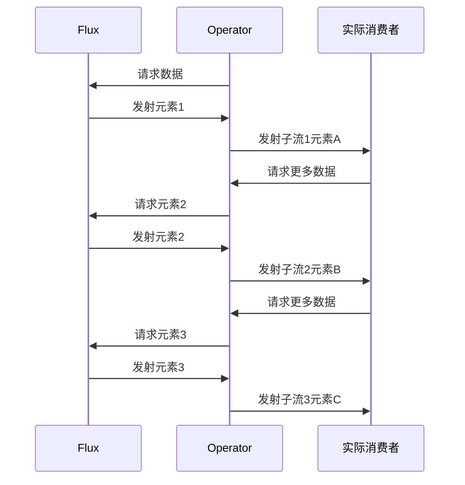

## flatMap

本章系统对比Reactor中两大子流合并操作符**`flatMap`**与**`flatMapSequential`**，。核心要点如下：

| 特性         | `flatMap`                          | `flatMapSequential`          |
| ------------ | ---------------------------------- | ---------------------------- |
| **合并策略** | 并行合并子流，无序执行             | 顺序合并子流，按源顺序执行   |
| **并发控制** | 默认无限制并发（实际受限于调度器） | 严格按顺序逐个子流处理       |
| **背压处理** | 子流独立传递背压信号               | 按整体背压需求传递           |
| **典型场景** | 并行数据聚合（如多API并发请求）    | 顺序数据处理（如流水线任务） |

------

## 二、原理深度解析

### 1. 响应式流规范中的角色

- **动态订阅管理**：需实现`Subscription`接口协调子流订阅
- **边界触发机制**：通过`request(n)`信号控制子流元素发射节奏
- **错误传播规则**：任一子流发生错误会立即终止整个合并流

### 2. 数据流处理流程对比

#### FlatMap操作：




#### FlatMapSequential操作：




### 3. 关键机制

- **订阅调度**：`flatMap`使用`Schedulers.parallel()`默认并发执行
- **缓冲策略**：`flatMapSequential`内部采用`concatMap`实现顺序保证
- **背压传递**：`flatMap`按子流粒度传递，`flatMapSequential`按整体粒度传递

------

## 三、源码解读（Reactor 3.x）

### 1. FlatMap操作实现

```java
// Flux.java
public final <R> Flux<R> flatMap(
    Function<? super T, ? extends Publisher<? extends R>> mapper,
    int concurrency,
    int prefetch) {
    return onAssembly(new FluxFlatMap<>(this, mapper, concurrency, prefetch, false));
}

// FluxFlatMap关键逻辑
void onNext(T t) {
    if (isCancelled()) return;
    Publisher<? extends R> p = mapper.apply(t);
    if (p != null) {
        subscribeChild(p);
    }
}

void subscribeChild(Publisher<? extends R> p) {
    childSubscription = Operators.subscribe(p, this);
}
```

### 2. FlatMapSequential实现

```java
// Flux.java
public final <R> Flux<R> flatMapSequential(
    Function<? super T, ? extends Publisher<? extends R>> mapper,
    int concurrency) {
    return flatMap(mapper, concurrency, 1);
}

// 实际使用concatMap实现顺序合并
public final <R> Flux<R> concatMap(
    Function<? super T, ? extends Publisher<? extends R>> mapper) {
    return concatMap(mapper, Queues.XS_BUFFER_SIZE);
}
```

### 3. 关键流程解析

1.  flatMap操作 ：
- 动态创建子订阅
- 并发执行子流
- 元素发射无序

2. flatMapSequential操作：
- 串行订阅子流
- 等待前序子流完成
- 严格按源顺序发射

------

## 四、与RxJava对比分析

| 特性           | Reactor flatMap   | RxJava flatMap       |
| -------------- | ----------------- | -------------------- |
| **默认并发度** | Integer.MAX_VALUE | 128                  |
| **错误处理**   | 默认快速失败      | 支持错误收集模式     |
| **资源释放**   | 自动管理订阅关系  | 需手动调用dispose()  |
| **调度器支持** | 内置调度器集成    | 需显式指定Schedulers |

------

## 五、最佳实践与性能优化

### 1. 典型应用场景

```java
// 并行数据聚合（flatMap）
Flux.range(1, 3)
    .flatMap(i -> fetchDataAsync(i), 4)
    .subscribe(System.out::println);

// 顺序数据处理（flatMapSequential）
Flux.range(1, 3)
    .flatMapSequential(i -> fetchDataSequentially(i))
    .subscribe(System.out::println);
```

### 2. 性能优化要点

- **合理设置并发度**：`flatMap(producer, 10)`限制并行数
- **预缓存子流数据**：对慢速子流使用`.cache()`避免重复计算
- **背压策略匹配**