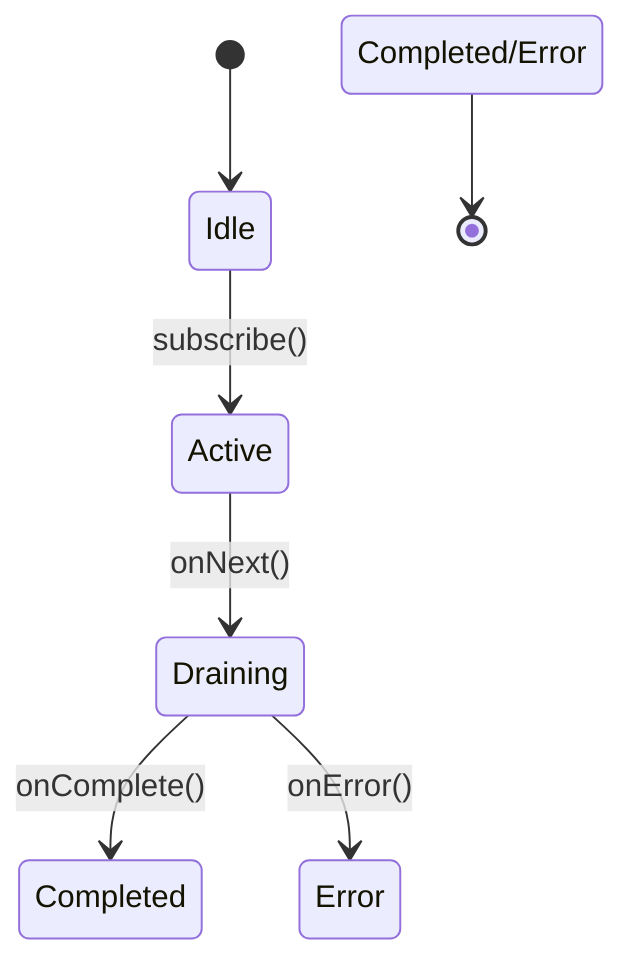

# UnicastProcessor深度解析：单订阅者处理器的工作原理与实践

------

## 一、核心概念与设计目标

### 核心特性：

1. **单订阅者保障**：严格限制只能存在一个订阅者，防止多订阅导致的背压失效
2. **自定义背压队列**：内置可配置大小的队列实现（默认无界队列）
3. **多线程安全**：支持多生产者线程并发推送数据
4. **完成状态传播**：任一生产者完成时自动触发下游完成信号

### 典型应用场景：

```java
// 书籍示例：多线程数据收集器
UnicastProcessor<Integer> processor = UnicastProcessor.create();
Flux.from(processor)
    .subscribe(System.out::println);

// 生产者线程1
new Thread(() -> {
    for (int i = 0; i < 10; i++) {
        processor.onNext(i);
    }
    processor.onComplete();
}).start();

// 生产者线程2
new Thread(() -> {
    processor.onNext(100);
    processor.onComplete();
}).start();
```

------

## 二、原理机制详解

### 关键设计思想

采用**生产者-消费者模型**实现数据流控制：

1. **生产端**：通过原子变量维护订阅者数量
2. **消费端**：使用定制化队列实现背压缓冲
3. **状态同步**：借助序列化Sink保证线程安全

### 状态流转图



------

## 三、源码深度解析（Reactor 3.x实现）

### 核心类结构

```java
public final class UnicastProcessor<T> 
    extends Processor<T, T> 
    implements Fuseable.QueueSubscription<T> {
    
    private final Queue<T> queue; // 底层背压队列
    private final AtomicLong requested = new AtomicLong(); // 请求计数器
    private final AtomicReference<Subscription> subscription = new AtomicReference<>();
    private final AtomicBoolean done = new AtomicBoolean(); // 完成状态标记
}
```

### 关键方法解读

#### 1. 订阅控制逻辑

```java
public void subscribe(Subscriber<? super T> s) {
    if (subscription.compareAndSet(null, s)) {
        s.onSubscribe(new SerializedSink<>(this));
    } else {
        EmptySubscription.error(s, new IllegalStateException("Only one subscriber allowed"));
    }
}
```

- 使用CAS操作保证单订阅者
- 通过SerializedSink实现线程安全的数据提交

#### 2. 数据下发机制

```java
public void onNext(T t) {
    if (done.get()) {
        Operators.onNextDropped(t);
        return;
    }
    if (queue.offer(t)) {
        drain();
    } else {
        Operators.onNextDropped(t);
    }
}
```

- 无界队列模式下直接入队
- 有界队列满时触发onNextDropped

#### 3. 序列化Sink实现

```java
static final class SerializedSink<T> implements Sink<T> {
    private final UnicastProcessor<T> parent;
    private final Queue<T> queue = Queues.<T>unbounded().get();

    @Override
    public void next(T t) {
        queue.offer(t);
        parent.drain();
    }
    
    // 错误/完成信号同步处理
    @Override
    public void error(Throwable t) {
        parent.error(t);
    }
    
    @Override
    public void complete() {
        parent.complete();
    }
}
```

- 通过内部队列实现线程安全的数据缓冲
- drain()方法触发实际的数据下发

------

## 四、性能对比与适用场景

| 特性       | UnicastProcessor | DirectProcessor | SynchronousSink |
| ---------- | ---------------- | --------------- | --------------- |
| 订阅者数量 | 严格限制1个      | 无限制          | 无限制          |
| 背压支持   | 完整支持         | 无背压          | 手动信号控制    |
| 内存占用   | O(N)（队列大小） | O(1)            | O(1)            |
| 典型场景   | 多线程数据聚合   | 简单数据转发    | 精确背压控制    |

------

## 五、实战示例

### 场景：多线程日志聚合

```java
UnicastProcessor<LogEvent> processor = UnicastProcessor.create();
Flux.from(processor)
    .bufferTimeout(100, Duration.ofSeconds(5))
    .subscribe(batch -> {
        logService.batchSave(batch);
    });

// 生产者线程池
ExecutorService executor = Executors.newFixedThreadPool(4);
for (int i = 0; i < 4; i++) {
    executor.submit(() -> {
        for (int j = 0; j < 100; j++) {
            processor.onNext(new LogEvent("Thread-" + Thread.currentThread().getId(), j));
        }
        processor.onComplete();
    });
}
```

------

## 六、最佳实践建议

1. **严格单订阅约束**：确保只存在一个下游订阅者
2. **合理配置队列大小**：根据下游处理能力设置队列容量
3. **及时处理完成信号**：避免内存泄漏
4. **避免嵌套使用**：防止背压信号传递失效

------

## 七、与DirectProcessor的对比

| 特性       | UnicastProcessor    | DirectProcessor        |
| ---------- | ------------------- | ---------------------- |
| 订阅者数量 | 1个                 | 多个                   |
| 背压实现   | 基于队列的回压      | 无背压                 |
| 内存风险   | 队列溢出可能导致OOM | 无缓冲，但可能压垮下游 |