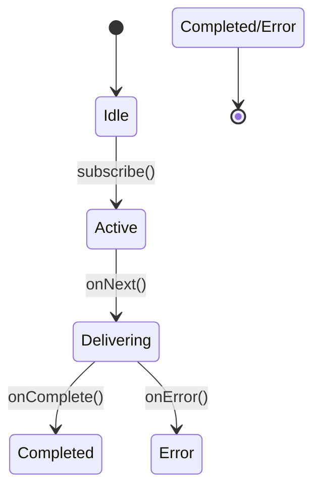

# DirectProcessor深度解析：无背压处理器的工作原理与实践

------

## 一、核心概念与设计目标

### 核心特性：

1. **多生产者支持**：允许多个线程同时调用`onNext()`发送数据
2. **无背压机制**：内部不提供数据缓存，依赖下游主动请求
3. **动态订阅管理**：支持0到N个订阅者动态订阅/退订
4. **终止状态传播**：任一生产者完成时自动触发下游终止信号

### 典型应用场景：

```java
// 书籍示例：简单事件广播
DirectProcessor<String> broadcaster = DirectProcessor.create();
broadcaster.subscribe(System.out::println); // 订阅者1
broadcaster.onNext("Event-1"); // 输出Event-1

// 新增订阅者
broadcaster.subscribe(System.out::println); // 订阅者2
broadcaster.onNext("Event-2"); // 同时输出Event-2两次
```

------

## 二、原理机制详解

### 关键设计思想

采用**生产者-消费者直连模型**实现零缓冲数据传递：

1. **生产端**：直接推送数据到订阅者
2. **消费端**：订阅者主动拉取数据
3. **状态管理**：通过原子变量维护订阅者列表和终止状态

### 状态流转图




------

## 三、源码深度解析（Reactor 3.x实现）

### 核心类结构

```java
public final class DirectProcessor<T> 
    extends Processor<T, T> 
    implements Fuseable.ScalarCallable<T> {
    
    private final AtomicReference<Subscribers<T>> subscribers = new AtomicReference<>(Subscribers.EMPTY);
    private static final Subscriber<?> TERMINATED = new Subscriber[0];
    
    // 关键方法实现
    public void onNext(T t) {
        for (Subscriber<? super T> s : subscribers.get()) {
            s.onNext(t);
        }
    }
    
    public void onComplete() {
        for (Subscriber<? super T> s : subscribers.getAndSet(TERMINATED)) {
            s.onComplete();
        }
    }
}
```

### 关键机制解读

#### 1. 订阅管理

```java
public void subscribe(Subscriber<? super T> s) {
    Subscribers<T> current = subscribers.get();
    if (current == TERMINATED) {
        Operators.error(s, new IllegalStateException("Processor already terminated"));
        return;
    }
    current.add(s);
    if (current == subscribers.get()) {
        s.onSubscribe(new DirectSubscription(s, this));
    }
}
```

- 使用原子引用保证线程安全的订阅者管理
- 通过`DirectSubscription`实现请求计数

#### 2. 数据分发

```java
public void onNext(T t) {
    for (Subscriber<? super T> s : subscribers.get()) {
        s.onNext(t);
    }
}
```

- 直接遍历当前活跃订阅者列表
- 无缓冲导致数据即时传递

#### 3. 终止状态传播

```java
public void onComplete() {
    for (Subscriber<? super T> s : subscribers.getAndSet(TERMINATED)) {
        s.onComplete();
    }
}
```

- `getAndSet`实现原子性状态切换
- 确保所有活跃订阅者收到终止信号

------

## 四、性能对比与适用场景

| 特性       | DirectProcessor | UnicastProcessor | SynchronousSink |
| ---------- | --------------- | ---------------- | --------------- |
| 订阅者数量 | 0到N个          | 严格限制1个      | 无限制          |
| 背压支持   | 无              | 完整支持         | 手动信号控制    |
| 内存占用   | O(1)            | O(N)（队列大小） | O(1)            |
| 典型场景   | 简单事件广播    | 多线程数据聚合   | 精确背压控制    |

------

## 五、实战示例

### 场景：多线程状态广播

```java
DirectProcessor<Status> statusProcessor = DirectProcessor.create();
statusProcessor.subscribe(System.out::println); // 订阅者1

// 生产者线程1
new Thread(() -> {
    statusProcessor.onNext(Status.RUNNING);
    statusProcessor.onComplete();
}).start();

// 生产者线程2
new Thread(() -> {
    statusProcessor.onNext(Status.COMPLETED);
}).start();
```

**输出结果**：

```
RUNNING
COMPLETED
```

------

## 六、最佳实践建议

1. **严格使用场景**：仅适用于已知下游处理能力的场景
2. **及时完成信号**：确保生产者及时调用`onComplete()`释放资源
3. **避免嵌套使用**：防止背压信号传递失效
4. **监控订阅者数量**：通过`subscribers.get()`检查活跃订阅者

------

## 七、与UnicastProcessor的对比

| 特性         | DirectProcessor | UnicastProcessor    |
| ------------ | --------------- | ------------------- |
| 订阅者数量   | 多个            | 严格限制1个         |
| 背压实现     | 无              | 基于队列的回压      |
| 内存风险     | 无缓冲          | 队列溢出可能导致OOM |
| 典型使用模式 | 简单事件总线    | 多线程数据聚合      |

------

## 总结

DirectProcessor通过**零缓冲直连机制**实现了高效的多生产者数据广播，但其无背压特性需要使用者严格保证下游处理能力。在实时事件广播、简单状态同步等场景中具有显著性能优势，但在需要精确流量控制的场景中应选择支持背压的操作符。使用时需注意及时发送完成信号和监控订阅者状态，以确保系统健壮性。