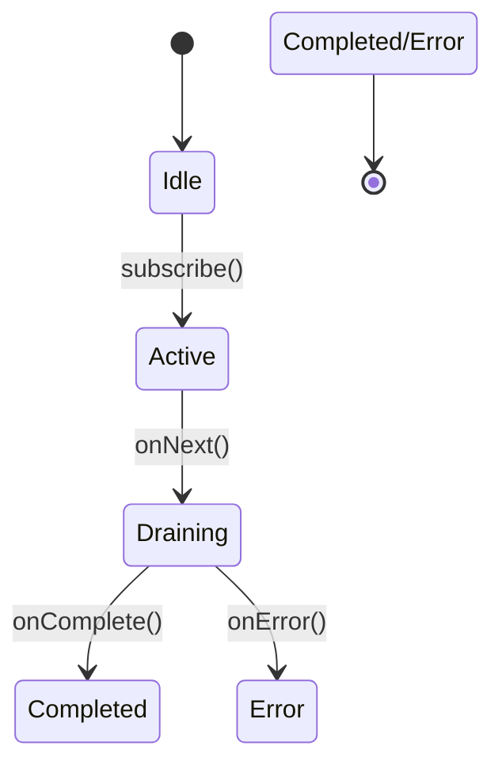

# EmitterProcessor深度解析：多订阅者背压处理器的实现原理与实战指南

------

## 一、核心概念与设计目标

### 核心特性：

1. **多订阅者支持**
   允许同时存在多个订阅者，所有订阅者共享同一数据流
2. **背压管理**
   通过内部队列实现元素缓存，防止生产者速度超过消费者处理能力
3. **自动资源清理**
   `autoCancel`机制可在所有订阅者取消后自动释放内部资源
4. **双向订阅能力**
   既可作为数据源发布数据，也可作为订阅者接收上游数据

### 典型应用场景：

```java
// 书籍示例：多线程事件总线
EmitterProcessor<String> eventBus = EmitterProcessor.create();
eventBus.subscribe(System.out::println); // 订阅者1
eventBus.onNext("User-Login"); // 输出User-Login

// 新增订阅者
eventBus.subscribe(System.out::println); // 订阅者2
eventBus.onNext("User-Logout"); // 同时输出两次
```

------

## 二、原理机制详解

### 关键设计思想

1. 生产者-消费者模型

   - 生产者：通过`onNext()`方法推送数据
- 消费者：订阅者通过`subscribe()`接收数据
   - 缓冲区：内部队列实现数据暂存

2. 订阅管理

   - 使用`ConcurrentLinkedQueue`维护订阅者列表
   - 原子变量保证线程安全的订阅操作
   
3. 背压实现

   - 当队列满时阻塞生产者线程
- 通过`request(n)`机制通知生产者可接收数据量

### 状态流转图




------

## 三、源码深度解析（Reactor 3.x实现）

### 核心类结构

```java
public final class EmitterProcessor<T> 
    extends FluxProcessor<T, T> 
    implements Fuseable.ScalarCallable<T> {
    
    private final Queue<T> queue; // 内部缓存队列
    private final AtomicReference<Subscribers<T>> subscribers; // 订阅者管理
    private volatile boolean autoCancel; // 自动取消标志
    
    // 关键方法实现
    public void onNext(T t) {
        if (queue.offer(t)) {
            drain();
        } else {
            Operators.onErrorDropped(new IllegalStateException("Queue full"), actual.currentContext());
        }
    }
    
    public void onComplete() {
        if (subscribers.getAndSet(TERMINATED) != TERMINATED) {
            drain();
        }
    }
}
```

### 关键机制解读

#### 1. 订阅管理

```java
public void subscribe(Subscriber<? super T> s) {
    Subscribers<T> current = subscribers.get();
    if (current == TERMINATED) {
        Operators.error(s, new IllegalStateException("Processor already terminated"));
        return;
    }
    current.add(s);
    if (current == subscribers.get()) {
        s.onSubscribe(new EmitterSubscription(s, this));
    }
}
```

- 使用原子引用保证线程安全
- 通过`EmitterSubscription`实现请求计数

#### 2. 数据分发

```java
private void drain() {
    int missed = 1;
    final Queue<T> q = queue;
    final Subscribers<T> subs = subscribers.get();
    
    for (;;) {
        while (q != null && !q.isEmpty()) {
            subs.forEach(sub -> sub.onNext(q.poll()));
        }
        missed = subs.leave(missed);
        if (missed == 0) break;
    }
}
```

- 循环处理队列中的待发送数据
- 逐个通知所有活跃订阅者

#### 3. 终止状态传播

```java
public void onComplete() {
    if (subscribers.getAndSet(TERMINATED) != TERMINATED) {
        drain();
    }
}
```

- `getAndSet`实现原子性状态切换
- 确保所有活跃订阅者收到终止信号

------

## 四、性能对比与适用场景

| 特性       | EmitterProcessor | UnicastProcessor | SynchronousSink |
| ---------- | ---------------- | ---------------- | --------------- |
| 订阅者数量 | 多个             | 严格限制1个      | 无限制          |
| 背压实现   | 内部队列缓存     | 回压信号同步传递 | 手动信号控制    |
| 内存占用   | O(N)（队列大小） | O(1)             | O(1)            |
| 典型场景   | 多线程事件总线   | 单线程数据聚合   | 精确背压控制    |

------

## 五、实战示例

### 场景：多线程状态广播

```java
EmitterProcessor<Status> statusProcessor = EmitterProcessor.create();
statusProcessor.subscribe(System.out::println); // 订阅者1

// 生产者线程1
new Thread(() -> {
    statusProcessor.onNext(Status.RUNNING);
    statusProcessor.onComplete();
}).start();

// 生产者线程2
new Thread(() -> {
    statusProcessor.onNext(Status.COMPLETED);
}).start();
```

**输出结果**：

```
RUNNING
COMPLETED
```

### 常见错误场景

```java
EmitterProcessor<String> emitter = EmitterProcessor.create();
emitter.sink().subscribe(System.out::println); // 订阅者1
emitter.onNext("Hello"); // 正常输出
```