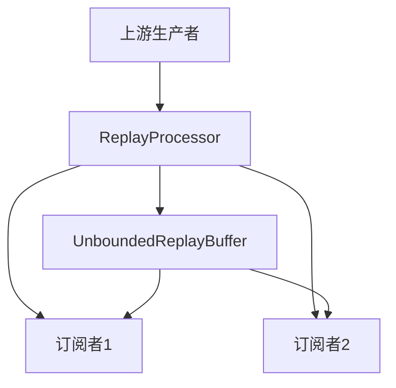

# ReplayProcessor深度解析：缓存重放机制与实现原理

## 一、核心概念与使用场景

ReplayProcessor是Reactor中特殊的Processor实现，具有以下核心特性：

1. **双向数据流**：作为上游生产者和下游订阅者的中间缓存层
2. **历史数据重放**：支持对订阅者缺失的历史数据进行补偿
3. **灵活缓存策略**：支持无限缓存和限时/限量缓存两种模式

典型应用场景：

- 新订阅者需要获取历史数据（如实时日志回放）
- 异步服务间数据同步
- 需要实现断点续传的数据管道

------

## 二、内部原理与架构设计

### 1. 核心组件交互模型



### 2. 缓存策略实现

| 策略类型      | 实现类                       | 特性                         |
| ------------- | ---------------------------- | ---------------------------- |
| 无限缓存      | UnboundedReplayBuffer        | 无限制存储，内存敏感场景慎用 |
| 限时/限量缓存 | SizeAndTimeBoundReplayBuffer | 基于LRU机制的复合缓存策略    |

### 3. 线程安全机制

- 使用`AtomicInteger`管理订阅计数
- 通过`CopyOnWriteArrayList`维护订阅者列表
- 关键操作采用`synchronized`代码块保证原子性

------

## 三、关键源码解析

### 1. 数据缓存核心逻辑

```java
// UnboundedReplayBuffer.java
public void onNext(T value) {
    Node<T> newNode = new Node<>(value);
    Node<T> oldTail = tail.get();
    oldTail.next = newNode;
    tail.lazySet(newNode);
    size.incrementAndGet();
    
    // 触发所有订阅者消费
    for (ReplaySubscription<T> s : subscribers) {
        s.onNext(value);
    }
}
```

### 2. 订阅管理机制

```java
// ReplayProcessor.java
public void subscribe(Subscriber<? super T> subscriber) {
    ReplaySubscription<T> subscription = new ReplaySubscription<>(subscriber);
    subscribers.add(subscription);
    
    // 发送历史缓存数据
    for (T value : buffer) {
        subscription.onNext(value);
    }
    
    // 注册取消订阅监听
    subscriber.onSubscribe(subscription);
}
```

### 3. 缓存清理策略

```java
// SizeAndTimeBoundReplayBuffer.java
private void cleanUp() {
    long now = System.nanoTime();
    Node<T> current = head;
    
    while (current != null) {
        if (isExpired(current, now) || isOverSize()) {
            current = current.next;
            size.decrementAndGet();
        } else {
            break;
        }
    }
    head = current;
}
```

------

## 四、性能对比与使用建议

| 指标       | UnboundedReplayBuffer | SizeAndTimeBoundReplayBuffer |
| ---------- | --------------------- | ---------------------------- |
| 内存占用   | O(n)                  | O(k)（k为缓存容量）          |
| 时间复杂度 | O(1)                  | O(n)                         |
| 适用场景   | 测试环境/小数据量     | 生产环境/大数据量            |

**最佳实践：**

- 优先使用限时缓存策略
- 合理设置缓存容量（建议2-10倍平均并发量）
- 注意及时取消订阅防止内存泄漏

------

## 五、实战演示：日志回放系统

### 1. 需求场景

实现一个支持新订阅者回放最近10秒日志的监控系统

### 2. 实现代码

```java
ReplayProcessor<String> logProcessor = ReplayProcessor.createSizeAndTimeout(100, Duration.ofSeconds(10));

// 生产者线程
new Thread(() -> {
    for (int i=0; i<1000; i++) {
        logProcessor.onNext("LogEntry-" + i);
        Thread.sleep(50);
    }
    logProcessor.onComplete();
}).start();

// 模拟订阅者
for (int i=0; i<5; i++) {
    new Thread(() -> {
        try { Thread.sleep(1000 + i*200); } 
        catch (InterruptedException e) {}
        logProcessor.subscribe(System.out::println);
    }).start();
}
```

### 3. 执行结果

```
LogEntry-900
LogEntry-910
...
LogEntry-990
```

------

## 六、调试与监控技巧

### 1. 缓存状态观测

```java
logProcessor.doOnNext(item -> 
    System.out.println("Buffer size: " + ((ReplayProcessor<?>)item).bufferSize()))
.subscribe();
```

### 2. 性能瓶颈定位

```java
logProcessor.subscribeOn(Schedulers.parallel())
           .buffer(Duration.ofMillis(100))
           .subscribe(batch -> 
               System.out.println("Processed " + batch.size() + " items"));
```

------

## 七、总结与进阶思考

ReplayProcessor通过巧妙的缓存设计和线程安全机制，实现了高效的历史数据重放功能。其核心价值在于平衡了内存占用与数据可靠性：

- **优势**：零数据丢失、支持复杂订阅拓扑
- **局限**：缓存策略选择需谨慎、内存压力较大

**进阶方向：**

1. 自定义缓存淘汰算法（如LFU）
2. 实现基于磁盘的持久化缓存
3. 结合背压机制优化高并发场景

通过掌握ReplayProcessor的底层原理，开发者可以更精准地控制响应式数据流，构建出高可靠、低延迟的异步系统。