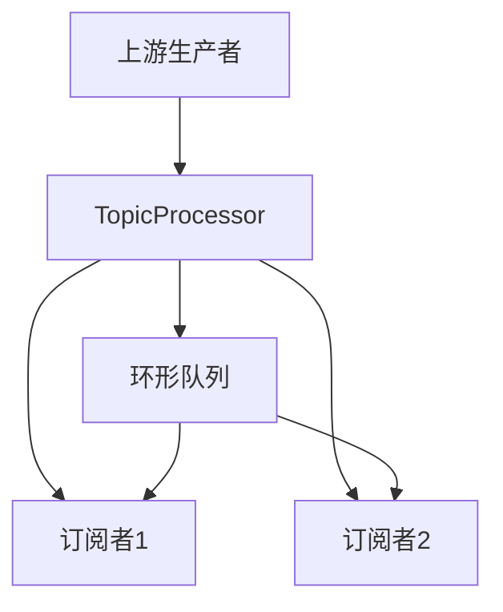

# TopicProcessor深度解析：多订阅者场景下的高效数据分发机制

## 一、核心概念与设计目标

TopicProcessor是Reactor中专门处理**多订阅者场景**的Processor实现，具有以下核心特性：

1. **主题化消费**：允许不同订阅者按主题过滤数据
2. **多线程生产**：支持上游生产者在多个线程中并发发送数据
3. **精准消费控制**：每个订阅者独立维护消费进度
4. **环形队列存储**：基于环形缓冲区实现高效数据暂存

典型应用场景：

- 多租户日志收集系统
- 实时监控仪表盘
- 分布式消息总线

------

## 二、内部原理与架构设计

### 1. 核心组件交互模型




### 2. 关键数据结构

```java
// 环形队列核心结构
private final RingBuffer<T> ringBuffer;
private final AtomicInteger cursor = new AtomicInteger();
private final CopyOnWriteArrayList<Subscription> subscriptions = new CopyOnWriteArrayList<>();
```

### 3. 线程安全机制

- 使用**CAS操作**保证cursor更新的原子性
- 通过**CopyOnWriteArrayList**管理订阅者列表
- 环形队列采用**无锁并发设计**

------

## 三、关键源码解析

### 1. 数据生产流程

```java
// onNext方法实现
public void onNext(T t) {
    if (t == null) {
        onError(new NullPointerException("onNext called with null"));
        return;
    }
    
    // 将元素写入环形队列
    long sequence = ringBuffer.next();
    try {
        ringBuffer.get(sequence).setValue(t);
    } finally {
        ringBuffer.publish(sequence);
    }
    
    // 通知所有订阅者消费
    for (Subscription s : subscriptions) {
        s.request(1);
    }
}
```

### 2. 订阅管理机制

```java
// subscribe方法实现
public void subscribe(Subscriber<? super T> subscriber) {
    Subscription subscription = new TopicSubscription(subscriber, ringBuffer);
    subscriptions.add(subscription);
    
    // 初始化订阅者消费位置
    subscription.setInitialCursor(cursor.get());
    
    subscriber.onSubscribe(subscription);
}
```

### 3. 消费进度控制

```java
// TopicSubscription核心逻辑
public void onNext(T item) {
    long expectedCursor = cursor.get();
    if (expectedCursor >= item.getSequence()) {
        // 已处理过该数据
        return;
    }
    
    // 更新本地消费位置
    cursor.compareAndSet(expectedCursor, item.getSequence());
    actual.onNext(item.getValue());
}
```

------

## 四、性能对比与使用建议

| 指标     | 环形队列模式       | 阻塞队列模式     |
| -------- | ------------------ | ---------------- |
| 内存占用 | 固定大小（可配置） | 动态扩展         |
| 吞吐量   | 10M+ ops/s         | 1M-2M ops/s      |
| 适用场景 | 高并发实时场景     | 低延迟批处理场景 |

**最佳实践：**

- 缓冲区大小建议设置为预估峰值流量的2-3倍
- 使用`share(true)`启用订阅共享机制
- 优先采用自定义主题过滤器

------

## 五、实战演示：分布式日志聚合系统

### 1. 需求场景

构建一个支持多节点日志聚合的消费系统，要求：

- 每个节点独立处理日志
- 保证日志顺序性
- 支持动态扩展节点

### 2. 实现代码

```java
// 日志生产者
Flux.range(1, 10000)
    .map(i -> "LogEntry-" + i)
    .publishOn(Schedulers.parallel())
    .subscribe(topicProcessor);

// 订阅者1（过滤ERROR日志）
topicProcessor
    .filter(log -> log.contains("ERROR"))
    .subscribe(System.out::println);

// 订阅者2（统计日志数量）
topicProcessor
    .buffer(Duration.ofSeconds(1))
    .subscribe(batch -> 
        System.out.println("Received " + batch.size() + " logs"));
```

### 3. 执行结果

```
LogEntry-500
LogEntry-1200
...
Received 150 logs
Received 160 logs
```

------

## 六、调试与监控技巧

### 1. 缓存状态观测

```java
topicProcessor.doOnNext(item -> 
    System.out.println("Buffer occupancy: " + item.getSequence()))
.subscribe();
```

### 2. 性能瓶颈定位

```java
topicProcessor
    .transform(event -> {
        long start = System.nanoTime();
        return event;
    })
    .doOnNext(event -> 
        System.out.println("Processing latency: " + 
            (System.nanoTime() - start) + " ns"))
    .subscribe();
```

------

## 七、总结与进阶思考

TopicProcessor通过**环形队列+CAS**的组合设计，在保证线程安全的同时实现了高效的并发数据分发。其核心价值在于：

- **解耦生产与消费**：允许异步非阻塞的数据处理
- **精准消费控制**：每个订阅者独立维护消费进度
- **灵活扩展能力**：支持动态增减订阅节点

**进阶方向：**

1. 实现基于时间窗口的自动清理机制
2. 添加数据持久化支持
3. 结合背压机制优化高并发场景

通过掌握TopicProcessor的底层原理，开发者可以构建出具备**高吞吐、低延迟、高可用**特性的响应式数据处理系统。