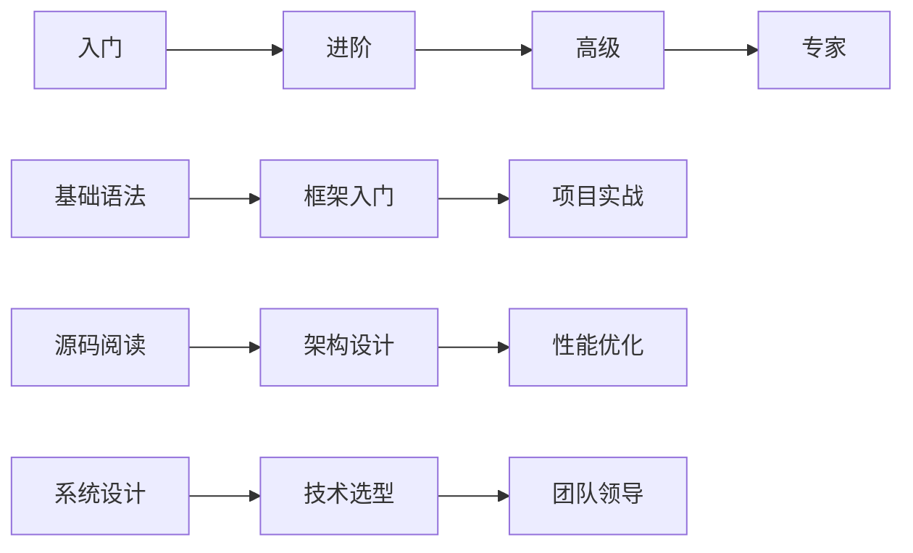

# 学习路径导航系统

## 🎯 新手入门路径
**目标用户**: 0-2年经验的开发者
**学习目标**: 建立扎实的技术基础

### 第一阶段：基础建设
- [Java基础复习](/zh/chapter_jdk/) - 夯实语言基础
- [Spring入门](/zh/chapter_springboot/1-sample.md) - 框架入门
- [MySQL基础](/zh/chapter_mysql/1-transaction-concept.md) - 数据库基础

### 第二阶段：框架进阶
- [SpringBoot深入](/zh/chapter_springboot/3-run.md) - 启动原理
- [MySQL事务](/zh/chapter_mysql/7-transaction.md) - 事务机制
- [Redis实践](/zh/chapter_post/clickhouse.md) - 缓存应用

### 第三阶段：实战项目
- [项目构建指南](/zh/learning_paths/project-guide.md)
- [最佳实践](/zh/learning_paths/best-practices.md)
- [代码review checklist](/zh/learning_paths/code-review.md)

---

## 🔥 中级提升路径
**目标用户**: 2-5年经验的开发者
**学习目标**: 深入理解原理，提升架构思维

### 核心技能树
- **框架源码** → [Dubbo源码解析](/zh/chapter_dubbo/) → [Spring源码](/zh/chapter_springboot/)
- **中间件** → [Kafka原理](/zh/chapter_kafka/) → [ElasticJob分析](/zh/chapter_elasticjob/)
- **数据库** → [MySQL内核](/zh/chapter_mysql/) → [分布式事务](/zh/chapter_mysql/10-distransaction.md)

### 项目实战
- [微服务架构设计](/zh/architecture/microservices.md)
- [分布式系统实践](/zh/architecture/distributed.md)
- [性能优化案例](/zh/architecture/performance.md)

---

## 🏆 高级架构师路径
**目标用户**: 5年以上经验的高级工程师
**学习目标**: 成为技术专家和架构师

### 深度专题
- **云原生** → [Kubernetes源码](/zh/chapter_kubernetes/) → [Service Mesh](/zh/chapter_post/prometheus.md)
- **AI工程化** → [Spring AI](/zh/chapter_spring_ai/) → [AI系统架构](/zh/chapter_ai/)
- **系统设计** → [DDD实践](/zh/chapter_ddd/) → [架构模式](/zh/architecture/patterns.md)

### 领导力培养
- [技术团队管理](/zh/leadership/team-management.md)
- [技术决策框架](/zh/leadership/decision-framework.md)
- [开源项目贡献](/zh/contribute/open-source.md)

---

## 📈 学习进度追踪

### 个人成长仪表板

### 技能认证体系
- 🥉 **Bronze**: 完成基础路径，掌握核心技能
- 🥈 **Silver**: 深入源码分析，具备架构思维
- 🥇 **Gold**: 系统设计专家，技术领导者
- 💎 **Diamond**: 行业专家，社区贡献者

---

## 🎓 学习资源推荐

### 必读系列
1. **Spring生态深度解析** - 从入门到源码
2. **分布式系统实战** - 理论到实践
3. **云原生技术栈** - 容器到Kubernetes
4. **AI工程化实践** - 算法到应用

### 实战项目
- [电商系统架构](/zh/projects/ecommerce.md)
- [金融风控平台](/zh/projects/risk-control.md)
- [智能客服系统](/zh/projects/ai-service.md)

---

## 🤝 社区互动

### 参与方式
- **技术讨论**: 在文章下方评论交流
- **问题求助**: 发布到社区问答区
- **经验分享**: 投稿技术文章
- **代码贡献**: 参与开源项目

### 激励机制
- **积分系统**: 阅读、评论、分享获得积分
- **等级晋升**: 根据贡献度提升社区等级
- **专家认证**: 成为某领域的认证专家
- **内容变现**: 优质内容获得收益分成
