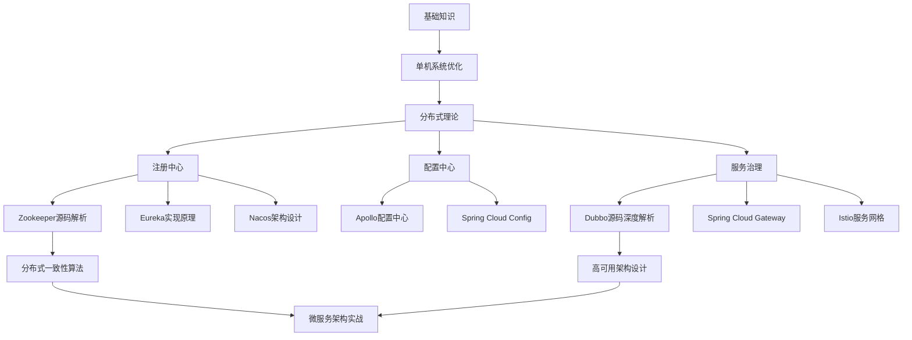
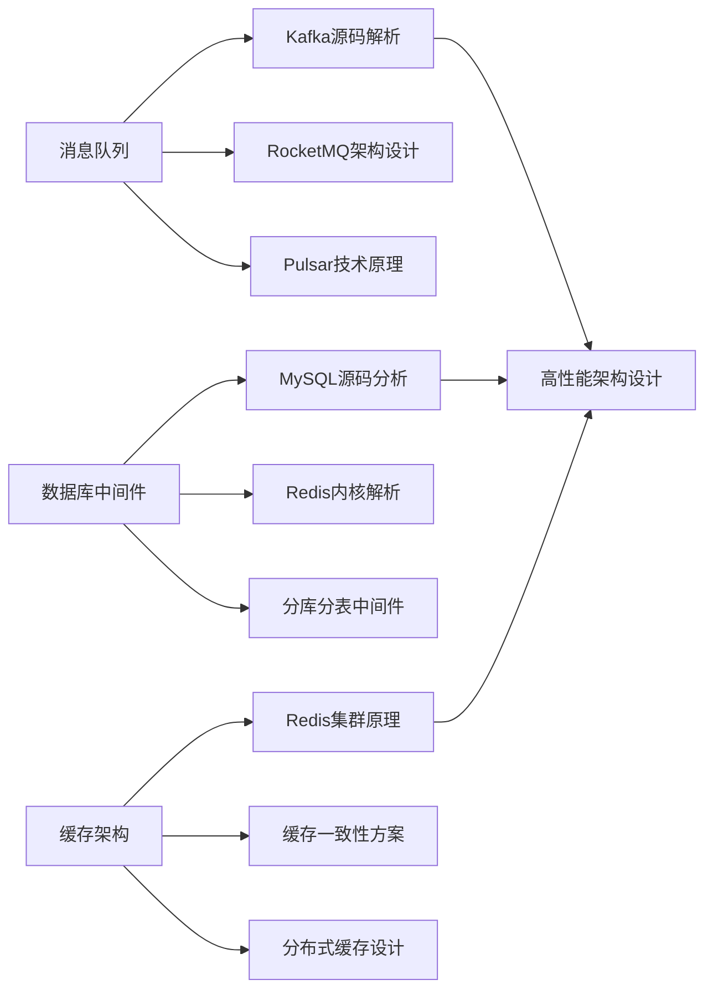
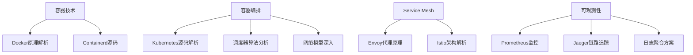

# 技术知识地图与学习路径设计

## 核心技术栈知识地图

### 分布式系统架构师路径


### 中间件专家路径


### 云原生技术路径


## 内容分级体系

### Level 1: 入门理解 (Understanding)
- **目标**：理解核心概念和基本原理
- **内容形式**：概念图解、简化架构图、基础示例
- **时间投入**：2-4小时
- **验证方式**：概念问答、基础配置

### Level 2: 原理掌握 (Mastering)
- **目标**：深入理解实现原理和设计思想
- **内容形式**：详细流程图、关键算法分析、设计模式应用
- **时间投入**：8-12小时
- **验证方式**：原理解释、架构设计题

### Level 3: 源码精通 (Expert)
- **目标**：能够阅读和修改源码，解决复杂问题
- **内容形式**：逐行源码解析、性能优化点、扩展开发
- **时间投入**：20-40小时
- **验证方式**：源码问题排查、性能调优实战

### Level 4: 架构创新 (Innovation)
- **目标**：能够设计新的解决方案，贡献开源社区
- **内容形式**：架构设计案例、技术选型分析、创新实践
- **时间投入**：持续学习
- **验证方式**：架构方案设计、开源贡献

## 个性化学习路径推荐系统

### 用户画像分析
```javascript
// 学习路径推荐算法
const learningPathRecommendation = {
    // 基于用户技术背景
    analyzeUserBackground: (userProfile) => {
        const { experience, techStack, goals } = userProfile;
        return {
            currentLevel: calculateLevel(experience, techStack),
            recommendedPath: generatePath(goals),
            prerequisiteGaps: findGaps(techStack)
        };
    },
    
    // 动态调整学习内容
    adaptiveLearning: (userProgress, performanceData) => {
        if (performanceData.comprehensionRate < 0.7) {
            return 'recommendBasicContent';
        } else if (performanceData.practiceScore > 0.9) {
            return 'suggestAdvancedTopic';
        }
        return 'maintainCurrentPace';
    }
};
```

## 互动式学习元素

### 1. 可执行代码环境
```html
<!-- 集成在线代码编辑器 -->
<div class="code-playground">
    <div class="code-editor">
        <textarea id="source-code">
// 尝试修改 Dubbo 的负载均衡算法
public class CustomLoadBalance implements LoadBalance {
    @Override
    public <T> Invoker<T> select(List<Invoker<T>> invokers, 
                                URL url, Invocation invocation) {
        // 在这里实现你的负载均衡策略
        return invokers.get(0);
    }
}
        </textarea>
    </div>
    <div class="execution-result">
        <button onclick="executeCode()">运行代码</button>
        <div id="output"></div>
    </div>
    <div class="explanation">
        <h4>💡 实验指导</h4>
        <p>尝试实现基于响应时间的负载均衡算法，观察不同策略的效果</p>
    </div>
</div>
```

### 2. 交互式架构图
```html
<!-- 可点击的架构组件 -->
<div class="interactive-architecture">
    <svg class="arch-diagram">
        <g class="component" data-component="registry">
            <rect class="clickable-component"/>
            <text>注册中心</text>
        </g>
        <g class="component" data-component="consumer">
            <rect class="clickable-component"/>
            <text>服务消费者</text>
        </g>
    </svg>
    
    <div class="component-detail" id="component-detail">
        <!-- 动态显示组件详细信息 -->
    </div>
</div>
```

### 3. 源码追踪工具
```html
<!-- 源码调用链可视化 -->
<div class="source-trace">
    <div class="call-stack">
        <div class="stack-frame active" data-file="DubboProtocol.java" data-line="156">
            <span class="method">refer()</span>
            <span class="file">DubboProtocol.java:156</span>
        </div>
        <div class="stack-frame" data-file="AbstractProtocol.java" data-line="89">
            <span class="method">createInvoker()</span>
            <span class="file">AbstractProtocol.java:89</span>
        </div>
    </div>
    
    <div class="source-viewer">
        <!-- 高亮显示当前执行的代码行 -->
    </div>
</div>
```
