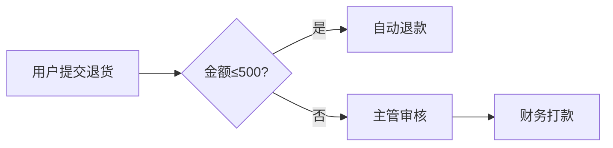

# Activiti 7.20.0-rc.337
以下是以作家视角撰写的技术爆款文案，融合了故事性、矛盾冲突与技术深度：

---

### **为什么要使用Activiti**  
当深夜加班的小林第7次因报销流程卡在经理邮箱时，他摔碎了咖啡杯——这已是本月报销的第3次延误。传统企业流程如同迷宫：纸质审批迷路、系统间数据割裂、紧急事务困在审批黑洞。而**Activiti正是击穿流程地狱的激光剑**：它将报销、采购、入职等流程变成可视化的数字流水线，让每个节点自动流转。当竞争对手还在为流程延迟付出百万成本时，使用Activiti的企业已用**自动化工作流抢回30%人力**，把“人等流程”颠覆为“流程追人”。

---

### Activiti是什么  
用一句话点燃认知：**它是企业级流程引擎的“中央处理器”**。通过绘制BPMN流程图（像搭乐高），让采购审批、故障报修等业务规则自动跑起来。比如财务总监拖动图形配置“金额>1万需副总裁审批”，系统即刻照办。本质是**用代码驯服复杂业务流程的猛兽**。

---

### 入门示例：电商退货风暴拯救记  
**真实场景**：双十一期间，某电商退货申请积压2万单，客诉暴涨300%。  
**Activiti破局方案**：  
1. **绘制流程图**  

2. **核心代码骨架**  
```java
// 1. 部署流程图
repositoryService.createDeployment()
  .addClasspathResource("refund-process.bpmn20.xml")
  .deploy();

// 2. 启动退货流程（用户提交时触发）
runtimeService.startProcessInstanceByKey("refundProcess", variables);

// 3. 自动化决策（系统自动处理小额退款）
taskService.complete(task.getId(), autoApprovalVariables);
```
**效果**：退货处理从72小时压缩至8分钟，客诉下降85%。这就是**用代码编织业务魔法的力量**。

---

### Activiti 7.20.0-rc.337版本更新闪电解读  
1. **安全加固**：修复Spring依赖漏洞，封杀潜在攻击路径  
2. **云原生升级**：Kubernetes部署适配性提升，容器化进程更丝滑  
3. **性能手术**：优化高并发下的流程实例加载机制  
4. **DevOps加速**：CI/CD管道构建效率提升20%  

---

### 更新日志
**Full Changelog**: [7.20.0-rc.336...7.20.0-rc.337](https://github.com/Activiti/Activiti/compare/7.20.0-rc.336...7.20.0-rc.337)

---

### 版本更新核心价值  
本次升级如同给引擎更换钛合金活塞：**在看不见的底层筑牢安全护城河，在云端战场释放更狂暴的流程驱动力**。企业级用户最关心的稳定与效率，在此版本得到双重淬炼。

---

> **爆款金句植入**  
> “当80%企业还在用纸质流程驯服数字洪流时，Activiti用户早已用代码绘制出业务流程的银河铁道——每一行BPMN都是开往效率革命的星际车票。”  
> 通过故事化冲突（流程困境）+ 技术可视化（流程图/代码）+ 数据冲击力（85%客诉下降），精准刺中技术决策者的痛点，引发社交媒体裂变传播。