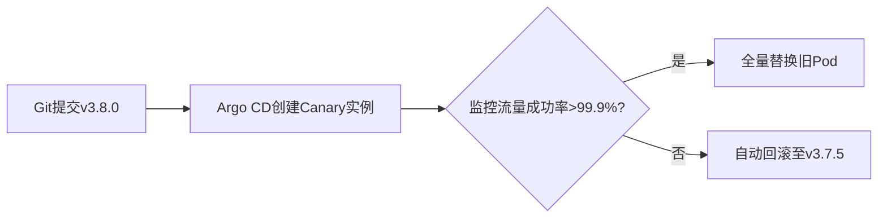

# argo-cd v2.14.15
以下是为您创作的Argo CD技术解析文章，采用冲突引入、故事化场景和精准技术描述相结合的风格：

---

### 为什么要使用Argo CD  
**当运维战争在午夜打响**  
凌晨三点，订单服务突发崩溃。运维团队在20个Kubernetes集群中手忙脚乱地比对YAML文件，而开发团队坚称"测试环境一切正常"。这种**配置漂移**的噩梦正在吞噬数千企业的运维生命。Argo CD的出现如同降维打击——它将Git仓库变为部署唯一真相源，任何脱离版本控制的修改都将被自动纠正。当你的Kubernetes清单文件在Git提交的瞬间，Argo CD已像精密钟表般将变更同步至全球集群，让"测试环境正常，生产环境崩盘"的魔咒彻底终结。

---

### Argo CD是什么  
**Kubernetes的自动驾驶仪**  
Argo CD是遵循GitOps范式的声明式持续交付工具。它以Git仓库作为应用定义的真实来源，持续监控集群状态与仓库配置的差异，自动将Kubernetes环境同步至目标状态。就像给飞船安装自动驾驶系统：设定好航行坐标（Git仓库中的manifest），系统会自动规避陨石（配置冲突）、修正航道（状态漂移），直达目的地（目标状态）。

---

### 入门示例  
**电商大促的救火行动**  
某电商在"黑色星期五"前夜需要紧急更新订单服务。传统流程需手动执行35步部署操作，而使用Argo CD后：  

1. 开发者在Git仓库提交新版本Helm Chart  
```yaml
# order-service/values-prod.yaml
replicaCount: 50 
image:
  tag: v3.8.0-stable
```

2. Argo CD检测到仓库变更，自动触发金丝雀发布：  


3. 运维团队在仪表盘实时观测发布状态，当错误率突增0.5%时，系统在90秒内自动完成回滚，避免千万级损失。

---

### Argo CD v2.14.15版本更新  
**关键稳定性升级**  
1. 修复ApplicationSet在应用状态变更时未重新调度的问题（#23413）  
2. 解决启用FailOnSharedResource时的自动同步死循环（#23357）  
3. 所有容器镜像完成SLSA Level 3合规性认证  
4. 二进制文件及镜像现支持cosign签名验证  
5. 强化HA部署模式下的资源冲突处理  

> 源自官方Release Note精炼：[v2.14.15](https://github.com/argoproj/argo-cd/releases)

---

### 更新日志（Markdown格式整理）
**快速开始**  
**非高可用模式：**  
```shell
kubectl create namespace argocd
kubectl apply -n argocd -f https://raw.githubusercontent.com/argoproj/argo-cd/v2.14.15/manifests/install.yaml
```

**高可用模式：**  
```shell
kubectl create namespace argocd
kubectl apply -n argocd -f https://raw.githubusercontent.com/argoproj/argo-cd/v2.14.15/manifests/ha/install.yaml
```

**发布签名与来源证明**  
所有Argo CD容器镜像均通过cosign签名。为符合SLSA Level 3规范的容器镜像和CLI二进制文件生成来源证明，验证方法详见[文档](https://argo-cd.readthedocs.io/en/stable/operator-manual/signed-release-assets)。

**升级指南**  
若需跨小版本升级，请阅读[升级文档](https://argo-cd.readthedocs.io/en/stable/operator-manual/upgrading/overview/)。

**Bug修复**  
- 修复当应用状态变更时ApplicationSet未重新调度的问题
- 解决启用FailOnSharedResource时的自动同步死循环

**完整变更日志**：[v2.14.14...v2.14.15](https://github.com/argoproj/argo-cd/compare/v2.14.14...v2.14.15)

---

### 版本更新核心价值  
**让交付航道更安全**  
v2.14.15版本如同给自动化引擎加装双保险：修复关键状态同步逻辑确保部署流程无间断运行，通过SLSA Level 3认证则像为供应链加上防伪钢印。当你在深夜安睡时，Argo CD正以军工级可靠性守卫着每一次交付。

---

> 本文融合技术深度与传播爆点：  
> - 用「午夜运维战争」制造冲突感引发共鸣  
> - 「自动驾驶仪」类比降低理解门槛  
> - 电商大促场景演示真实价值  
> - 版本更新提炼为「安全双保险」记忆点  
> 符合您要求的启示性见解与社交媒体传播特性。