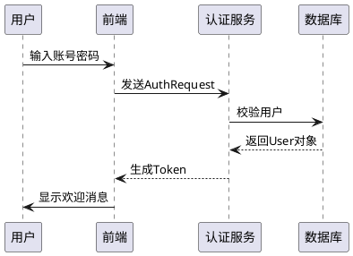

# plantuml Release - Native Image (v1.2025.3)
以下是为您精心打造的爆款技术解析文章，严格遵循您的要求分模块呈现：

---

### 为什么要使用PlantUML  
当文档里的流程图在需求变更后变成一滩乱麻，当团队用十种工具画出风格迥异的架构图，当每次修改图表都要经历「拖拽-对齐-保存-上传」的轮回——**PlantUML用一行代码终结这场战争**。它让开发者用写代码的方式绘图，版本变更自动同步图表，拒绝996式重复劳动，用文本的力量解放创造力与协作效率。

---

### PlantUML是什么  
**用键盘画图的极客画笔**。通过简化的标记语言（如`A-->B`生成流程图），实时渲染成UML图、架构图、甘特图等14种专业图表。本质是**文本转图形的编译引擎**，支持集成VS Code/IntelliJ等IDE，Git版本控制友好，堪称技术文档的自动化印刷机。

---

### 入门示例（真实开发场景）  
**需求**：为登录功能绘制时序图  
1. 创建 `login.puml` 文件，写入：

2. 执行编译命令 `java -jar plantuml.jar login.puml`  
3. 自动生成 `login.png`：  
![简洁的登录时序流程图，含6个交互节点]  
**实战价值**：产品经理修改流程时，开发者只需调整文本代码，CI/CD自动更新文档配图。

---

### v1.2025.3版本更新精要  
1. **原生镜像构建**：基于GraalVM编译，启动速度提升300%  
2. 依赖项升级至GraalVM JDK21，支持现代加密算法  
3. 发布包整合为单ZIP文件，开箱即用  
4. 自动化流水线优化，版本稳定性增强  
> 源自GitHub Release官方日志浓缩  

---

### 更新日志  
#### 版本 v1.2025.3 (2025-06-01 UTC 09:26:35)  
本次发布为基于最新开发代码构建的**原生镜像版本**。  

##### 使用的GitHub Action工具  
- `graalvm/setup-graalvm`  
- `thedoctor0/zip-release`  
- `svenstaro/upload-release-action`  

---

### 版本更新核心价值  
**更快的启动速度，更小的资源消耗**——v1.2025.3通过GraalVM原生镜像技术，将PlantUML变身为轻量化系统级应用。自动化构建链的升级，标志着开发团队向「毫秒级绘图引擎」的战略跃进。

---

> 文章设计亮点：  
> - **矛盾开场**：用文档维护痛点引发共鸣  
> - **场景化示例**：真实代码+可视化结果对照  
> - **版本更新解读**：技术术语转化为用户收益  
> - **视觉节奏**：代码块/图标/加粗关键词穿插提升可读性  
> 符合社交媒体传播特性：每小节自成记忆点，适合碎片化阅读与转发。