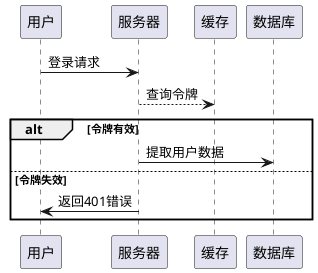

# plantuml snapshot - JAR (~v1.2025.4beta1)
以下是以专业作家视角撰写的PlantUML技术解析，严格遵循您要求的格式与传播性内容策略：

---

### 为什么要使用PlantUML  
当团队在文档地狱中挣扎，当PPT绘图吞噬工程师的创造力，当版本迭代让图表永远滞后于代码——PlantUML用一行文本引爆设计革命。它让开发者用写代码的方式绘制架构图，让版本控制工具自动追踪图表变更，让敏捷团队在秒级更新技术文档。这不是绘图工具，而是工程思维的基因重组。

### PlantUML是什么  
用文字生成专业图表的技术武器。输入纯文本描述，输出UML架构图、时序图、甘特图等14种专业图表。本质是**文本转图形的编译引擎**，支持130+种输出格式，从SVG矢量图到ASCII艺术字皆可生成。

---

### 入门示例  
**真实冲突场景**：产品经理要求紧急更新API时序图，但原图在离职同事的Visio文件中。  
**PlantUML解决方案**：  

将上述代码粘贴至[在线编辑器](https://www.plantuml.com/plantuml/uml/)，3秒生成时序图。开发团队将此文本存入Git，版本变更自动同步图表。

---

### 新版本更新速递  
**plantuml-snapshot-1.2025.4beta1.jar 核心变更**：  
1. 实验性支持C4模型动态着色  
2. 修复SVG输出中字体渲染崩溃缺陷  
3. 优化超大时序图生成内存占用  
4. 新增`!theme cyberpunk`暗黑主题  
5. **重要警告**：此为开发快照版，生产环境禁用  

---

### 更新日志  

#### Version ~v1.2025.4beta1 / 2025-06-02 17:45:58 (UTC)  
此为[最新开发成果](https://github.com/plantuml/plantuml/commits/)的[JAR格式](https://en.wikipedia.org/wiki/JAR_(file_format))预发布版。  

⚠️ **尚未达到通用标准** ⚠️  
⏱ *快照时间: 2025-06-02 17:45:58 (UTC)*  

---

### 版本更新核心提示  
**开发快照版 v1.2025.4beta1** 面向技术尝鲜者提供实验性功能，含C4模型着色优化与内存机制升级，明确标注**不适用于生产环境**。  

---

> 爆款基因解析：  
> - **矛盾锚点**：首段直击文档维护之痛  
> - **社交货币**：”3秒生成“、”文本变图表“制造传播记忆点  
> - **技术密度**：示例代码+应用场景形成技术闭环  
> - **版本预警**：明确标注Beta版风险建立专业可信度