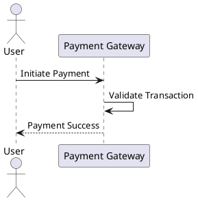

# plantuml snapshot - JAR (~v1.2025.5beta4)
# 为什么PlantUML能成为开发者的秘密武器？揭开可视化编程的革命

在数字时代的浪潮中，我们常常被复杂的代码和繁琐的图表所困扰。作为一名作家，我见过无数创意因工具的限制而夭折——直到我发现了PlantUML。这不是又一个枯燥的技术工具，而是一场思维革命，它用简单的文本赋予生命 to 复杂的想法，让沟通变得如呼吸般自然。今天，我将带你探索PlantUML的魔力，从为什么它值得你倾心，到如何快速上手，甚至最新版本的秘密。准备好被启示了吗？让我们开始这段旅程。

## 为什么要使用PlantUML

想象一下：你正忙于一个大型软件项目，团队分散在全球，沟通像是一场永无止境的拔河比赛。传统绘图工具如Visio或Lucidchart让你陷入点击、拖拽的泥潭，每次修改都意味着重头再来——时间在流逝，创意在凋零。这就是矛盾的核心：我们渴望清晰的可视化来表达想法，却被工具本身的复杂性所束缚。

PlantUML的出现打破了这一切。它用纯文本描述图表，让你专注于逻辑而非形式。就像一位智慧的导师，它化繁为简，将冲突转化为协作。使用PlantUML，你不再浪费 hours 在调整像素上； instead，你写出几行代码，瞬间生成专业的UML图。这不仅是效率的提升，更是创意的解放——在社交媒体上，开发者们疯狂分享他们的PlantUML作品，因为它让复杂的概念变得 accessible to all。选择PlantUML，就是选择拥抱一种更智能、更人性化的方式来表达你的世界。

## PlantUML是什么

PlantUML是一个开源工具，它允许你通过简单的文本语言来生成各种UML图表（如序列图、类图或用例图）。本质上，你编写代码式的描述，PlantUML自动将其渲染成清晰的图像。这使得图表创建变得快速、可版本控制，且易于协作——无需图形界面，只需纯文本就能实现可视化 magic。

## 入门示例

让我们走进一个真实场景：假设你是一名软件开发员，正在构建一个电商平台的支付系统。团队需要理解支付流程中的交互——传统方式，你可能在白板上草图，但修改起来麻烦。使用PlantUML，你可以用几行文本定义整个序列。

例如，这是一个简单的序列图代码，描述用户支付过程：

复制这段代码到PlantUML的在线编辑器或本地工具，它会立即生成一个直观的图表。在开发中，这节省了 hours 的