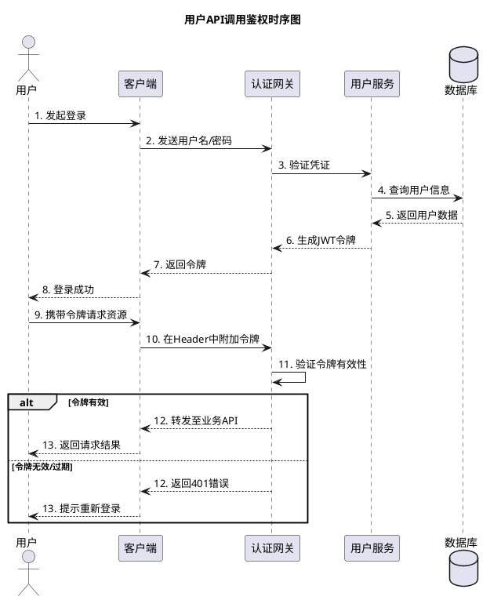

# plantuml snapshot - Native Image (~v1.2025.11beta4)
## 为什么要使用 PlantUML

在团队协作的战场上，你是否曾因一张模糊不清的架构图而陷入无休止的争论？是否曾花费数小时调整流程图框线，只为了让它们看起来对齐？传统绘图工具正在偷走你的时间，将创造力囚禁在琐碎的拖拽操作中。

PlantUML 正是这场沉默反抗的答案。它代表了一种理念的转变：**代码即文档，文档即代码**。当你用简洁的文本描述一个复杂系统时，你不仅在绘图，更是在构建一个可版本控制、可协作、永不模糊的“单一事实来源”。矛盾的核心在于：我们追求直观的视觉表达，却受制于笨重的图形界面。PlantUML 用程序员最熟悉的武器——纯文本，化解了这一矛盾，让思想的传递快如闪电，且精准无误。

## PlantULM 是什么

PlantUML 是一个开源工具，让你能够使用简单直观的文本语言来快速绘制各类图表。你可以把它理解为“绘图界的 Markdown”。只需编写类似 `A -> B: 请求` 的代码，它便能自动生成对应的流程图、时序图、架构图等。它从文本生成图像，让图表可以像代码一样被编写、管理和版本控制。

## 入门示例

**真实场景**：假设你是一名后端开发者，需要向团队成员澄清一个新 API 的鉴权流程。与其费力在绘图软件中手动制作，不如编写 PlantUML 脚本。

**开发示例**：以下是一个描述上述流程的时序图代码：

将这段代码保存为 `.puml` 文件，通过 PlantUML 编辑器、命令行工具或集成插件（如 VS Code 扩展）运行，即可立即生成一张清晰的时序图。这种方式便于在代码评审中直接展示逻辑，也方便随时修改和迭代。

## PlantUML Snapshot - Native Image (~v1.2025.11beta4) 版本更新了什么

本次更新主要是基于 GraalVM Native Image 技术构建的预发布版本。核心变更是将 PlantUML 提前编译为本地原生可执行文件，旨在**显著提升启动速度和降低运行时内存开销**。它集成了截至快照时刻（2025年11月17日）的最新开发内容，但**此版本不稳定，尚未经过全面测试，明确不适用于生产环境**，仅供开发者和早期采用者体验新技术路径。

## 更新日志

### Version ~v1.2025.11beta4 of the 2025-11-17 at 19:30:31 (UTC)

这是一个基于 [GraalVM Native Image](https://www.graalvm.org/latest/reference-manual/native-image/) 技术的预发布版本，包含了来自 [最新开发分支](https://github.com/plantuml/plantuml/commits/) 的代码。

⚠️ **请注意，该版本尚未达到通用使用的稳定标准，请勿用于生产环境。** ⚠️

⏱ *快照生成于 2025年11月17日 19:30:31 (UTC)。*

## 总结

概括来说，这是一份 PlantUML 基于 GraalVM 原生镜像技术的早期测试版发布通告。它着重强调该版本以追求性能优化为目标，但稳定性不足，目前仅适用于技术预览与测试目的。